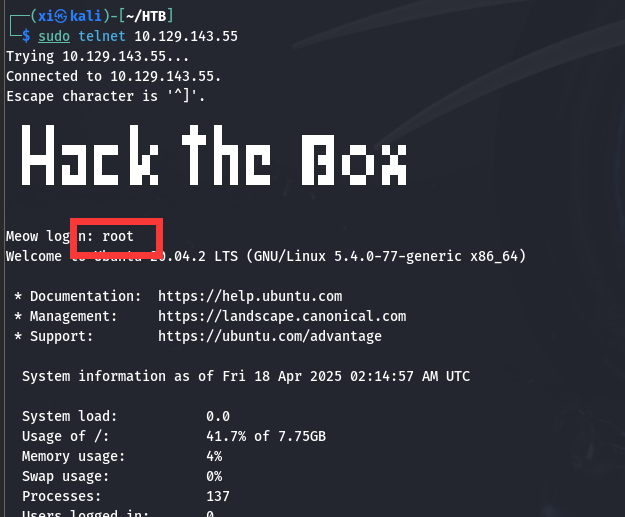
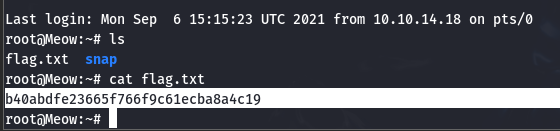

HTB APT - CTF
===

### HTB 快速开始

通过一个 **Starting Point** 快速上手熟悉 HTB 相关配置。首先在[官网]()注册一个账户, 然后选择下载 openvpn 的方式连接, 拷贝openvpn 文件到 kali 并用 `sudo openvpn` 来连接, 完成后生成靶机:

然后回答一系列问题, 答案分别是 `virtual machine`, `terminal`, `openvpn`, `ping`, `nmap`, `telnet`, `root`。

之后再 kali 上用 telnet 登录靶机:

flag 就在当前文件夹:

