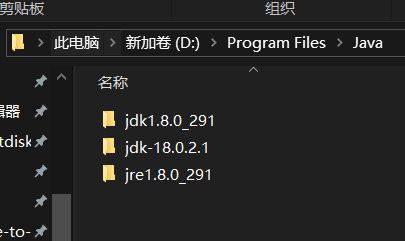

 BP 安装
===

### 1 版本隔离

Java 本身支持单机安装多个版本, 但是需要手动切换命令行版本, 或者安装 Java 版本隔离工具(JEnv), 以下是手动切换的方案:

首先安装两个不同的版本, 这里以 Java 8 和 Java 18 为例, 安装在同一目录 `D:\Program Files\Java\j` 下后如图所示:



>   值得一提的是, JDK 和 JRE 分别是开发工具和运行环境的意思, 在 Java 9 以后, JRE 的功能整合到了 JDK 中, 因此不再需要单独安装 JRE。

在系统变量中新建 `JAVA_HOME8 = D:\Program Files\Java\jdk1.8.0_291` , `JAVA18_HOME = D:\Program Files\Java\jdk-18.0.2.1 ` 。

之后就可以手动切换版本了。也可以创建一个 bat 文件方便一键切换：

-   java-version-switch.bat:
```batch
@echo off
chcp 65001 > nul
setlocal enabledelayedexpansion

:: 检查管理员权限
net session >nul 2>&1
if %errorLevel% neq 0 (
    echo 请以管理员身份运行此脚本！
    echo 正在请求管理员权限...
    timeout /t 1 >nul
    powershell -Command "Start-Process cmd -ArgumentList '/c %~dpnx0' -Verb RunAs"
    exit /b
)

:: 显示当前Java版本
echo.
echo 当前Java版本:
java -version 2>&1 | findstr /i "version"
echo.

:: 用户输入选择版本
set /p choice="请输入要切换的版本 (8/18): "

:: 设置JAVA_HOME路径
if "%choice%"=="8" (
    set "JAVA_HOME=D:\Program Files\Java\jdk1.8.0_291"
) else if "%choice%"=="18" (
    set "JAVA_HOME=D:\Program Files\Java\jdk-18.0.2.1"
) else (
    echo 输入无效，请输入 8 或 java18
    pause
    exit /b
)

:: 永久设置JAVA_HOME
setx JAVA_HOME "%JAVA_HOME%" /m

:: 更新PATH变量（移除旧Java路径，添加新路径）
set "NEW_PATH="
for %%p in ("%PATH:;=";"%") do (
    set "path_segment=%%~p"
    if "!path_segment!" neq "D:\Program Files\Java\jdk1.8.0_291\bin" (
    if "!path_segment!" neq "D:\Program Files\Java\jdk-18.0.2.1\bin" (
    if "!path_segment!" neq "D:\Program Files\Java\jre1.8.0_291\bin" (
        set "NEW_PATH=!NEW_PATH!;!path_segment!"
    )))
)

:: 添加新Java路径到最前面
set "NEW_PATH=%JAVA_HOME%\bin;!NEW_PATH:~1!"

:: 永久设置PATH
setx PATH "!NEW_PATH!" /m

echo.
echo 已切换至 Java %choice% 环境，请重新打开命令提示符生效！
echo 验证命令: java -version
pause
```

把上方的 Java 路径改为实际安装路径即可, 运行完毕后可以使用 ` java -verison` 来验证版本

### 2 Burpsuite 安装并启动 (Windows)

Burpsuite Pro 需要付费, 这里利用[注册机](https://github.com/search?q=BurpLoaderKeygen%20&type=repositories)即可, 这个资源在 Github 上开源。

将 Burpsuite Pro 和Keygen 放到同一目录下, 按照 Keygen 上的步骤安装即可, 如果显示无法识别 License, 就用 Keygen 中的指令启动 Burpsuite 即可。

之后每次使用 Burpsuite 都需要使用 Keygen 启动, 可以使用一个批处理文件:

```batch
@echo off
java -noverify -Xbootclasspath/p:burp-loader-keygen-2020_2.jar -jar burpsuite_pro_v2020.2.jar
exit
```


