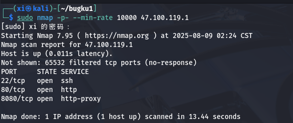

[bugku] 渗透测试区 write up 1
===

> 开始之前说句题外话, 这个bugku 靶场的 web 区的题目质量真的很低, 希望渗透测试区能高点;

# 渗透测试 1: 

描述: 甲公司邀请你对他们公司进行网络安全测试，但是甲公司只给了一个官网链接你能打到他们内网吗？

## 基本信息收集

### 端口扫描

### 目录爆破

扫出很多信息, 只展示这点, 实际上剩下的也没用上就打穿了;

### 网站访问

先试 80 端口:

打开源码就能看到第一个 flag 和提示下一环:

## 管理登录

刚才 nmap 已经扫出了一个可疑的登录位置 `/admin`, 访问之后重定向到了登录界面。

接下来尝试用不同的密码组合登录, 首先尝试 `1:1`, 发现回显居然是 "账号错误", 也就是说对于不存在的管理员账户还有单独的回显; 接下来用 `admin:1` 的组合, 返回 "密码错误", 现在可以确定账号就是 admin 了:

### 弱密码字典爆破

在抓个包看一眼, 没有验证码, 没有校验, 直接上字典爆破, 得到组合 `admin:admin`:

登录成功, 继续收集信息;

发现第二个flag:

### 文件上传漏洞

接下来继续收集信息, 发现可以配置上传文件类型, 配置允许 php, 并允许在线执行:

直接传不行, 可能是被 WAF 拦了, 试试允许 htaccess 类型后缀文件, 然后再传 JPG 的方法, 发现上传的文件前面会添加时间戳+哈希, 这种方式不可行; 再试试直接双写后缀 (phphpp), 结果直接上传成功了:

找到下一个 flag, 提示提权并连接数据库;

