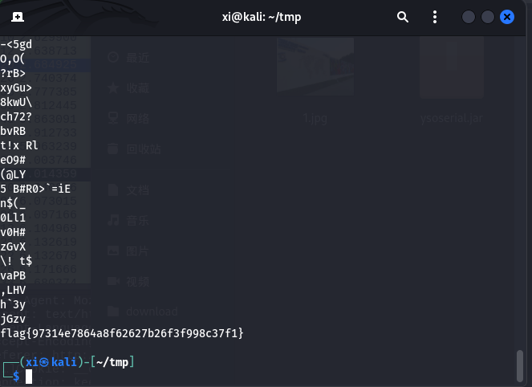
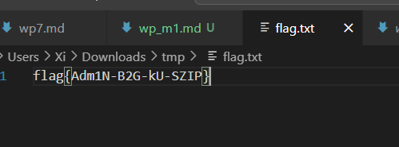

[buuctf] misc区 write up 1
===

## 二维码

### 题解

打开是一个二维码, 扫码是一串文本: secret is here

用 binwalk 扫出一个加密的压缩数据:


用 `dd` 指令把其中的压缩数据提取出来:

```bash
dd if=QR_code.png bs=1 skip=471 of=4number.zip
```

> 15 字节是压缩前的原始大小; 

参数:
-  `if` input file, 输入文件;
-  `of` output file, 输出文件;
-  `bs1` block size, 每次读取 1 字节, 默认是 500 字节;
-  `skip` 跳过块量, 这里是 471 个块 (块由 `bs` 决定大小);
-  `count` 只复制一定数量的块出来;
-  `seek` 在输出文件中跳过若干个块再写, 一般用于追加;
-  `iflag=skip_bytes,count_bytes` 明确告诉 `dd` `skip` 和 `count` 单位是字节, 而不是 `block`。可以和 `bs` 配合使用。

或者也可以用 `foremost`:

```bash
foremost QR_code.png
```

提取出来之后显示需要密码, 根据名字, 可能是四位数字, 爆破一下:

```bash
fcrackzip [options] file.zip
```

`fcrack` 指令:

- `-b`: 表示 brute-force (暴力破解) 模式;
- `-D`: 表示 字典模式;
- `-c [charset]`: 表示使用指定的字符集:
  - `a`: 小写字母 `a~z`;
  - `A`: 大写字母 `A~Z`;
  - `1`: 数字 `0~9`;
  - `!`: 特殊符号(` `, `@` 等);
  - 可以组合多个;
- `-l min-max` 指定密码长度范围, 如 `-l 4-8` 表示 4~8 位密码;
- `-u`: 验证破解的密码是否能解开 zip 中的文件, 防止误报;


找到密码; 


关键工具: binwalk, foremost, fcrackzip, unzip;

## 大白

### 题解

打开文件, 是一个显示不完全的 png :


拖进 winhex:


文件头部信息按顺序排列如下:

- `89 50 4E 47 0D 0A 1A 0A`: PNG 图像文件头;
- `00 00 00 0D`: 长度为 13 字节;
- `49 48 44 52`: 类型为 "IHDR";
- `00 00 02 A7`: 宽度: `02 A7` = 679 像素;
- `00 00 01 00`: 高度: `01 00` = 256 像素;

就刚刚的结果来看应该是高度有问题, 把高度改高一点看看, 将宽高改为一致后另存并打开:


拿到 flag;

## Wireshark

### 题解

题目是一个 pcap 文件, 用 wireshark 打开:


题目提示, 管理员的密码是答案, 那么找一下包, 找到登录 `login.php` 的包:


`ffb7567a1d4f4abdffdb54e022f8facd` 即是 flag;

## 乌镇峰会种图

### 题解

用 `zsteg` 和 `binwalk` 暂时没扫出可用信息, 直接用 `strings` 扫出 flag:



说明这个 flag 是附在图片信息的末尾。

## 文件中的秘密

### 题解

打开文件, 是一个 jpeg 图片:


用 `stegsolve` 或者直接用 `winhex` 打开可以看到一串 flag:


## 被嗅探的流量

### 题解

题目是一个 wireshark 文件:

> 题目描述:  某黑客潜入到某公司内网通过嗅探抓取了一段文件传输的数据，该数据也被该公司截获，你能帮该公司分析他抓取的到底是什么文件的数据吗？


将 POST 上传的图片导出为字节流: `11`


```bash
strings 11.png
```

拿到 flag;


## zip伪加密

### zip 伪加密

什么是 zip 伪加密? 一句话概括就是仅仅修改了 "标志位" 让计算机误以为其加密, 实际上这个压缩包是没有加密的, 也没有密码;

#### zip 文件头结构简述

ZIP 文件由多个区块组成, 一般来说有:

1. Local File Header - 局部文件头
2. File Data - 压缩数据头
3. Data Descriptor - (可选) 数据描述
4. Central Directory File Header - 中央目录文件头
5. End of Central Directory Record - 压缩文件结尾部分

#### 文件头分析

以这个文件为例:


| 偏移 | 长度 | 字段                         | 含义                              |
| ---- | ---- | ---------------------------- | --------------------------------- |
| 0x00 | 4B   | **0x04 03 4B 50**               | Local File Header 签名, 常见文件头            |
| 0x14 | 2B   | Version needed               | 解压所需版本                      |
| 0x06 | 2B   | **General Purpose Bit Flag** | 标志位, 加密差异在此, 最低位为加密标识,`0x0000` 为未加密, `0x0001` 为加密 |
| 0x08 | 2B   | Compression method           | 压缩方式 (`0` =无压缩，`8`=Deflate)   |
| 0x0A | 2B   | File last mod time           | 文件修改时间                      |
| 0x0C | 2B   | File last mod date           | 文件修改日期                      |
| 0x0E | 4B   | CRC-32                       | 校验                              |
| 0x12 | 4B   | Compressed size              | 压缩大小                          |
| 0x16 | 4B   | Uncompressed size            | 原始大小                          |
| 0x1A | 2B   | File name length             | 文件名长度                        |
| 0x1C | 2B   | Extra field length           | 附加字段长度                      |
| 0x1E | nB   | File name                    | 文件名                            |
| …    | nB   | Extra field                  | 附加数据                          |
| …    | ?    | File Data                    | 压缩数据                          |

#### 伪加密和真加密的区别

主要在于是否有加密头;

### 题解

用 winhex 打开后将标志位 `0x0900` 改为 `0x0800`, 注意要将头部和文件中部 (Central Directory File Header) 中的标志位也同样改掉;




得到 `flag{Adm1N-B2G-kU-SZIP}`

## LSB

### 题解

`zsteg` 是专门检测 png (无损图片隐写) 的工具

```bash
zsteg flag11.png
```


看起来是个图片, 用 `stegsolve` 打开:

检查 RGB 三通道最低位, 是个图片, 保存然后扫这个二维码得到 flag;


> flag{1sb_i4_s0_Ea4y} 