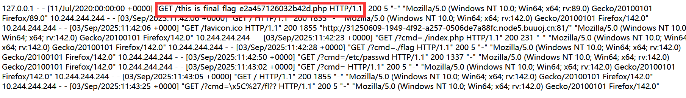

[buuctf] web区 write up 8
===

## [2022DASCTF MAY 出题人挑战赛] Power Cookie

### 题解

点登录, 然后抓包, 可以看见服务器返回了一个 cookie:


所以传 cookie: admin=1 过去, 直接显示了 flag;

## [2021DASCTF 实战精英夏令营暨 DASCTF July X CBCTF 4th]cat flag

### 代码审计

开门见源码:

```php
<?php

if (isset($_GET['cmd'])) {
    $cmd = $_GET['cmd'];
    if (!preg_match('/flag/i',$cmd))
    {
        $cmd = escapeshellarg($cmd);
        system('cat ' . $cmd);
    }
} else {
    highlight_file(__FILE__);
}
?>
```

这里应该是 `escapeshellarg()` 逃逸;

### 过滤函数逃逸

#### 原函数

> [谈escapeshellarg绕过与参数注入漏洞](https://www.leavesongs.com/PENETRATION/escapeshellarg-and-parameter-injection.html)

- `escapeshellarg()`

这个函数本身的作用是: **给字符串增加一个单引号并且在任何单引号前面添加一个 `\`**; 注意这个函数只能保证传入参数在进入 shell 时能被正确执行, 不能在 WAF 中确保安全;

- `escapeshellcmd()`

这个函数的作用是: 以下字符之前插入 `\`: ``&#;`|*?~<>^()[]{}$\、\x0A`` 和 `\xFF`;

注入时, 这个 `escapeshellcmd()` 可以拿来做 bypass, 先用不可见字符, 来绕过 `preg_match()` 正则匹配, 之后如果期间执行了一次 `escapeshellcmd()` 函数, 那么不可见字符将会被消除;

#### 典型注入

```php
$a = escapeshellarg('Hello\'');
system(echo $a);

// 执行结果是: Hello',
// 因为转义后 $a 为 'Hello'\''' 
// (\' => '\''')
// shell 中执行 echo 'Hello'\''' 结果为 Hello'
```

#### 注入点 1

> 值得一提的是, 这个注入本身利用的是指令本身对参数选项的支持, 而不是 PHP 本身的问题, 因此在 Java, Python 等语言中同样可以运用;

> 例如 python 中:
> 
> ```python
> import subprocess
>
> query = 'id'
> r = subprocess.run(['git', 'grep', '-i', '--line-number', query, 'master'], cwd='/tmp/vulhub')
> ```

> 那么只要令 query = `–open-files-in-pager=id` 就完成了注入;

注入的本质是寻找参数值和参数选项的点, 特别是还有等号的, 例如: `–open-files-in-pager=id`;

~不过本题没有用上~

#### 注入点 2

**前提: 未强制 ASCII 编码**

编码不统一导致超过 ASCII 编码上限的字符(`%7F` 以上)可以组合 `preg_match()` 函数来绕过正则匹配:

例如过滤 `/flag/i` :

```
fl%81ag
```

### 查看日志文件

根据提示, 管理员曾经看过flag, 访问:

```
?cmd=/var/log/nginx/access.log
```



然后试试 cmd = `/this_is_final_fla%80g_e2a457126032b42d.php`, 没有结果, 想到日志里的 `GET /` 应该是指的网站根目录, 那这里把 `/` 去掉试试:

查看源代码:


