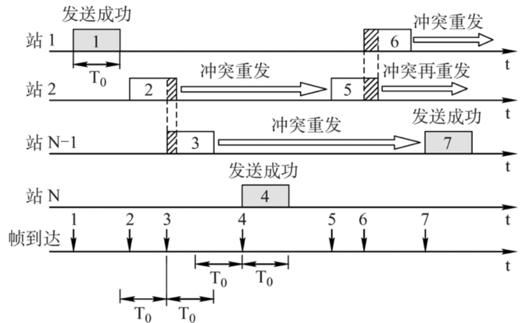
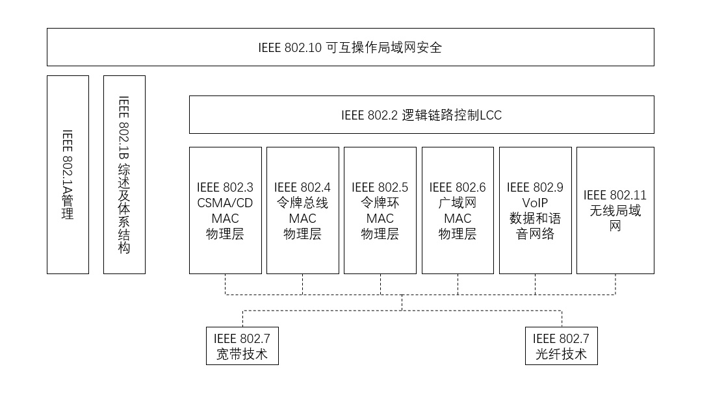
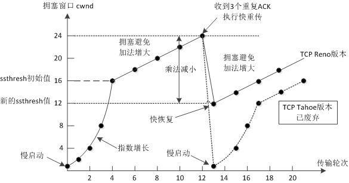

八股笔记 - 计算机网络
===

> 写在前面: 这篇笔记主要是为软考准备的, 很多都是大学接触过的东西, 不过不用就会忘, 记下来方便回忆和进一步理解;

## 物理链路层

### 监听策略

监听策略 (Carrier Sensing) 指的是节点在发送数据前**监听信道是否空闲**, 以避免或减少冲突。它是竞争型信道访问控制 (如 CSMA) 方法的核心思想;

#### 物理基础

首先需要理解的是, 为什么需要有监听策略? 如果某信道上的多个节点**同时发送信号**, 那么大家都将接收不到正确的数据, 更具体地来说, 可以从物理层信号叠加与接收机原理来解释:

- 信号在物理信道上的本质: 电磁波叠加

    在任何有线或无线信道中, 发送的帧 (Frame) 最终都会调制成电磁波或电信号, 这些信号在物理层是**连续**的波形 (analog waveform);

    当多个发射端同时在同一信道上发射时, 信号会在介质中**线性叠加**:

    $$
    s(t)=s_1(t)+s_2(t)+...
    $$

    除非帧的波形满足特定编码规律、**两两正交**, 否则叠加后无法无损分离;

- 特殊情况: **码分复用 (CDMA)**

    若多个将要叠加的波形 (以两个为例) $s_1(t)$ 和 $s_2(t)$ 满足正交性:

    $$
    \int s_1(t) \cdot s_2(t) \, dt = 0 \\ 
    r(t)=s_1(t)+s_2(t)
    $$

    那么接收端就可以用**投影法**将二者分离:

    $$
    \int r(t) \cdot s_1(t)dt =  \int (s_1(t)+s_2(t)) \cdot s_1(t)dt = \int {s_1}^2(t)dt \\
    \int r(t) \cdot s_2(t)dt =  \int (s_1(t)+s_2(t)) \cdot s_2(t)dt = \int {s_2}^2(t)dt
    $$

    码分复用是**唯一**严格意义上允许多个用户在**同一时间**、**同一频率**上同时发送数据而仍可被区分解码的多址技术。


回到监听策略上, 这个策略主要是为了让多个用户共享一个信道时尽量减少冲突、提高吞吐。

#### 主要策略总结

|协议|机制概要|是否监听|是否检测冲突|是否避免冲突|常见场景|
|:----------|:---------------------|:-------|:----------------|:-----------|:-----------------|
|**ALOHA**|想发就发, 出事重传|❌|❌|❌|卫星通信、早期无线|
|**CSMA**|发前先听信道是否空闲|✅|❌|⚙️部分避免|有线局域网早期|
|**CSMA/CD**|边发边听, 冲突立停|✅|✅|⚙️检测后停止|有线以太网（Hub）|
|**CSMA/CA**|发前听, 随机退避再发|✅|❌（无线检测不了）|✅|Wi-Fi无线局域网|

#### ALOHA

ALOHA 分为纯 ALOHA 与时隙 ALOHA, 两者都不监听, 区别进在于两种策略对发包时机是否有初步的规范: 时隙 ALOHA 将时间分为离散的时间片, 用户必须在时间片开始时才能发出数据, 这样就减少了数据冲突的可能性;

> 纯 ALOHA 协议的信道利用率不超过 18.4%, 时隙 ALOHA 协议利用率不超过 38.6%, 大约提高了一倍;

纯 ALOHA:


时隙 ALOHA:


#### CSMA

> [CSDN: 单工, 半双工, 全双工](https://blog.csdn.net/iningwei/article/details/100134783)
> 简单来说, 单工: 仅单向传输; 半双工: 宏观可双向, 微观仅单向传输; 全双工: 完全支持双向传输;

载波监听多路访问/冲突检测, 争用型介质访问控制协议。

CSMA 一共有 3 种策略:

- 1-坚持 CSMA: 发送前先监听信道, 忙则等待, 持续监听直到信道空闲; 空闲时发送;
- 非坚持CSMA: 发送前先监听信道, 忙则等待, 放弃监听, 直到随机一段时间后再次监听, 空闲则发送;
- p-坚持CSMA: 发送前先监听信道, 忙则等待, 坚持监听到下个时隙; 如果信道空闲, 有 p 的概率发送数据, (1-p) 的概率继续等待;

#### CSMA/CD

CSMA 只能保证发出的**瞬间**信道内没有其他帧, 然而**帧传输存在延迟**, 这段时间仍然可能发生冲突, 此时 CSMA 会将剩下的帧发送完, 这样就会浪费时间和带宽, 因此出现了**带有冲突检测**的 CSMA 协议: CSMA/CD;

CSMA/CD 中网络结点将会**边发送, 边监听**, 一旦发现有冲突将会**立刻停止发送**。此时所有人都不发送了, 进入**争用时隙**, 各个冲突节点等待一段时间后重新监听, 发现空闲信道则再发送信息;

> 显然每个节点的尝试发送时刻是异步的;

CSMA/CD 的工作周期符合: 传输周期、争用周期、空闲周期交替出现的规律。

#### CSMA/CA

由于无线局域网的特殊性, 出现了带有**冲突避免**的载波多路访问协议 CSMA/CA 。

> 无线网络中, 信号不再在有线介质上传播, 而是暴露在空气中; 这导致信号将会以放射形/圆形的方式向外扩散, 这会引起**暴露站问题**和**隐蔽站问题**;

CSMA/CA协议, 要求每个发送站点在发送帧数据之前, 先监听信道, **空闲则发送**, 但是发送完一帧后, 必须**等待一个短时间间隔**, 这个间隔称为**帧间间隔**, 检查接受站点是否发**回帧确认**。若没有确认, 则认为发送失败, 重发该帧。

### IEEE 802 系列协议



IEEE 802.3 以太网规范定义了 CSMA/CD 标准的媒体访问控制 (MAC) 子层和物理层规范;

- 802.3z: 千兆以太网, 仅适用半双工模式;
- 802.3ae: 万兆以太网, 仅支持光纤传输;
- 千兆、万兆最小帧长为512字节

## 网络层

###  IPv4 地址

#### 常见地址

IPv4 地址一共 32 位, 应试层面来说需要知道并且知道这些:

- A 类地址:
  - `1.0.0.0` - `126.255.255.255` (主机位 24 + 子网 8)
  - 私有地址: `10.x.x.x`;
  - 保留的本地回环地址: `127.0.0.1`, 注意这个地址 (或者整个 `127.0.0.1/8` 网段) 是不经过任何物理或者逻辑网络设备 (不出网, 包括路由器, 交换机, 网卡等), 而直接被操作系统的内核协议栈处理并转发的; 可以理解为参与了**应用层和传输层**, 仅**逻辑参与**了网络层, 不参与数据链路层, 和物理层的传输;

- B 类地址:
  - `128.0.0.0` - `191.255.255.255` (主机位 16 + 子网 16)
  - 私有地址: `172.16.0.0` - `172.31.255.255`;
  - 保留地址: `169.254.x.x`, 这个地址是自动获取 IP 地址时, 如果没有找到 DHCP 服务器, 就会从保留地址中取一个;

- C 类地址:
  - `192.0.0.0` - `223.255.255.255` (主机位 8 + 子网 16)
  - 私有地址: `192.168.x.x`;

- D 类地址:
  - `224.0.0.0` - `239.255.255.255`, 特殊组播地址, 不区分主机位和子网, 其中
  - `224.0.0.1` 代表所有主机与路由器;
  - `224.0.0.2` 代表所有的组播路由器;
  - ...

- E 类地址:
  - `240.0.0.0` - `247.255.255.255`, 保留地址;

#### 其他预留地址

一些其他的特殊含义地址:
  - `255.255.255.255` (全 1), 只可作为目标地址, 表示**有限广播**; 不走路由器, 只在本地子网生效;
  - **直接广播**地址, 网络字段保留, 主机字段全 1 的地址, 例如: `192.168.1.0/24` 的直接广播是 `192.168.1.255`, 只可作为目标地址, 根据路由器设置可能会走路由; 表示**指定网络**的所有主机;
  - 主机位全 0 的地址, 表示网络地址;

#### 子网掩码

网络位全 1, 主机位全 0 的地址就是子网掩码。子网掩码可以确认任意地址的网络地址, 只需要将其 IP 地址和子网掩码**按位与**即可; 例如:

```
IP 地址: 192.168.1.42   → 11000000.10101000.00000001.00101010
子网掩码: 255.255.255.0 → 11111111.11111111.11111111.00000000
按位与:
  11000000.10101000.00000001.00101010
& 11111111.11111111.11111111.00000000
  -----------------------------------
  11000000.10101000.00000001.00000000 → 192.168.1.0/24
```

已知子网掩码能根据主机位的位数 $n$ 轻松计算出网络内的最大主机数 $N$:

$$N=2^n-2$$

减去的这两个是全 0 (网络地址) 和全 1 (广播地址);

也可以根据子网掩码确定可划分的子网数量, 首先确定 A/B/C 类网络, 默认这三类网络中前 8/16/24 位是固定为全 1 的; 之后每 $n$ 位可以表示的子网数量为 $2^n$ 个 (特别地, 至少需要留 $m, m>1$位给主机位, 因为还需要预留一位给网络地址和广播地址);

### 常用协议

#### ICMP

ICMP 报文封装在 **IP 数据报中 (不是独立的数据帧)**, 用于检测**网络连通性** / 路由故障诊断 / 网络异常报告; 

最常用的是 Ping (连通性), 此外也可以利用 ICMP 来测网络错误, 常见返回问题: 

- 目标不可达 (Destination Unreachable), 可能因为端口关闭等;
- 超时过期: 一般是因为 TTL 过期, 此时数据包会被丢弃;
- Redirect: 提示更新到更优路由;

#### ARP

> IP 在网络层, 但是工作在数据链路层;

ARP 协议用于寻找子网中其他主机的 MAC 地址, 由于 IP 数据包必须封装成以太网帧才能在**物理层**正常传输, 也就是需要知道 MAC 地址; 

所以 ARP 的工作过程就是源主机拿着目标 IP 去**挨个敲门 (广播)**, 直到目标主机自行响应并发回, 被源主机接收后存入缓存;

ARP 协议本身没有认证机制, 是可被攻击的:

- ARP 风暴: 将大量的 ARP 请求的源地址改为某攻击目标, 这样会导致短期内大量的 ARP 应答涌入目标主机达到 DOS 的目的;
- ARP 欺骗: 与 ARP 风暴相反, 欺骗攻击是修改应答, 使得错误的 `IP → MAC` 映射被存入目标主机的缓存, 造成地址劫持;

### NAT

网络地址转换, 用于将私有地址转换为公网地址, 实现访问公网; 

#### 工作原理

NAT 需要一台有公网 IP 的路由器; 这台路由器内部需要维护一个 **NAT 表**, 当内网主机访问外网时会经过这个路由器, 路由器将**修改内网主机的 IP 地址**为路由器 IP, 并且在 NAT 表中记录前后的**端口地址映射**;

> 例如: `[10.0.0.2:43210] ` - ` [203.0.113.5:55000]`

当外网服务器发回时, 目的地址将会是该 NAT 表刚刚记录的外网地址 + 端口; 此时路由器将目的地址改为表中的内网地址并在内网中发出;

从这个例子中也能看出 NAT 是动态维护的。

<br>

那么如果外网主机先行尝试访问内网主机呢? 此时如果发往了路由公网 IP 的某端口, 显然由于 NAT 表中还没有建立对应的映射, 路由器并不知道要转发给谁, 这也反映了 NAT 的一大工作特点: 单向性, **入网受限, 出网可行**;

> 通过设置一定的静态 NAT 表条目可以解决这个问题; 或者也可以通过 Nginx 反向代理这样的应用解决, 需要指出的是 Nginx 工作在应用层 (应用层代理);

### 路由协议

> **[CSDN: RIP, OSPF 和 BGP](https://blog.csdn.net/Jungle_hello/article/details/51438886)**

关键点:
- RIP:
  - 根据距离矢量;
  - 更新规则: $D(X,Y)=min[D(X,Z)+D(Z,Y)]$
  - 最大条数 15, 超过认为不可达, 适用小型网络;

- OSPF:
  - 基于链路状态:
  - 更新规则: 迪杰斯特拉 (广度优先搜索, BFS) 更新;

- BGP:
  - 边界网关, 基于距离矢量;
  - 每条路由带有路径属性;
  - 用于自治系统 (AS) 之间的路由;

## 传输层

传输层主要需要理解两大协议: TCP 和 UDP

### TCP

#### 原理简述

TCP 协议会建立**逻辑**上的安全连接, 在传输时具有**三次握手, 四次挥手**的特点;

实现这一点的原理是 TCP 的每一帧都有超时重传机制, 也就是必须要收到来自目标主机的确认帧后, 才会认为对方已收到数据帧, 否则会重传;

#### 拥塞控制

TCP 需要重点解决的问题就是拥塞:



如图所示, 主要流程:

- 初始有两个参数: 门限值 `ssthresh` 预设好; 拥塞窗口  `cwnd = 1`

- 慢启动: 每次 `cwnd` 翻倍, (指数增长), 直到某一轮 `cwnd >- ssthresh` 触发拥塞避免;

- 拥塞避免: 每次 `cwnd` 改为 `+1`, (缓慢递增);

- 快重传: 发送方只要连续收到**三个重复确认**就应当立即重传对方尚未收到的报文段;
  >  快重传算法首先要求接收方每收到一个**失序**的报文段就**立即发出重复确认**, 为的是使发送方及早的知道有报文段没有到达对方而不要等到自己发送数据时才捎带确认;

- 快恢复: 收到**三个重复确认**后 `cwnd /= 2`, 并令 `ssthresh = cwnd`, 然后进入拥塞避免算法;
  > 注意, 如果是网络超时引起的重传, 则会重新进入慢启动, `ssthresh = cwnd / 2` 然后 `cwnd = 1` 

### UDP

UDP 是不维护连接状态的, 不保证送达也不会重传, UDP 报文的安全性一般会需要其他层 (应用层) 保证;

常见 UDP 的应用: DNS 服务;

