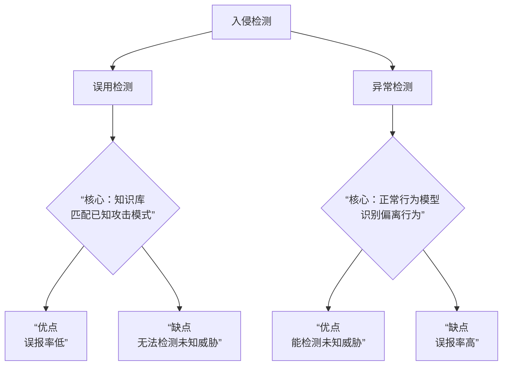

## 加密算法

ECC 160 = RSA 1024
我国 SSLVPN 加密算法: ECC 256, SM9, RSA 1024

## 入侵检测系统

### 误用检测

#### 定义概述

1. 基于条件概率的误用检测

  将入侵视作时间序列, 计算时间序列和已知攻击模式的匹配度, 得出是攻击的概率;

2. 基于状态迁移的误用检测:
  
  利用状态迁移图判断;

3. 基于键盘监控的误用检测:

  抓取键盘使用情况, 和已知攻击模式库进行匹配;

4. 基于规则的误用检测

  用规则描述入侵行为, 进行规则上的匹配;

### 异常检测系统

#### 定义概述

1. 基于统计的异常检测:

  量化提取正常行为的特征, 进行分类对比, 将偏离正常特征的行为检测为异常;

2. 基于模式预测的异常检测;

  通过 LSTM 这样的时间序列机器学习, 总结一个时间上的预测模型, 将事件行为与归纳结果偏离的行为检测为异常;

3. 基于文本分类的异常检测:
  
  利用 K 聚类算法, 认为正常文本会自然形成簇, 将与任何聚类偏离较大的噪点检测为异常;

4. 根据贝叶斯推理的异常检测:
  
  根据已知资料总结预测 (后验), 将当前事件的先验异常概率计算得出, 并将超过阈值的行为检测为异常;

## KerberOS 服务

三个关键服务器 AS -> TGS -> Web 应用服务器

用户需要顺序访问这三个服务器,  形象的记忆, 是**登记->申请->使用**的过程;

AS: 提供用户凭证 + TGS 秘钥

TGS: 会话凭证

Web 应用: 实际服务

服务器之间的信任是链式的, 最终可以追溯到 AS (当然不需要每次都追溯), 通常情况下是信任上一级服务器的, 所以也可以实现单点快速登录;

## 自主访问控制

### 行 / 列

基于行: 每个主体会附带哪些客体能访问, *例如张三: 文件1, 文件2*

> 例如: 能力表, 口令, 前缀表

基于列: 相反, 每个客体附带哪些主体有权访问: 如 *保密文件: 项目经理, 董事长*

> 例如: 保护位, 访问控制表; 想象一下 linux 里 755 这样的结构

这种概念的提出可以想象一张表, 纵轴是角色(主体), 横轴是资源(访问对象, 客体)

## 端口:

### 端口划分

0 ~ 1023 是熟知端口, 由 ANA 统一管理;
1024 ~ 49151 是注册端口, 客户端注册时随机选择;
49152 ~ 65535 是动态/专用端口, 提供给应用程序;

