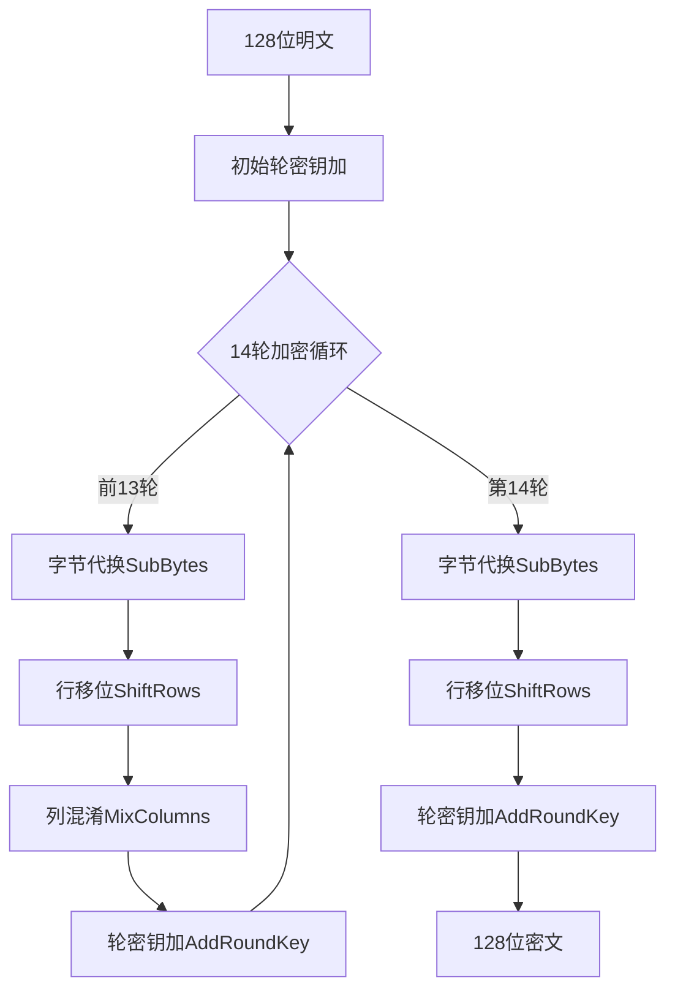
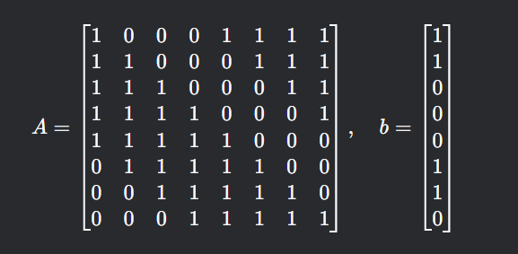

Crypto 1 - AES-256 
===

## AES

AES 属于**对称加密**, 这是一种通信双方**使用相同秘钥进行加密和解密的算法**。以下以 `AES-256` 为例展开:

### 理论准备

-   有限域 $GF(2^8)$:
    以下所有 AES 运算都在**伽罗华域** ($GF(2^8)$) 中进行。

-   多项式表示: 
    把所有字节都视为一个多项式来表示。

>   例如字节 `0xB3` = `10110011` = $x^7+x^5+x^4+x+1$ 。

-   不可约多项式: 
    约定 $m(x)=x^8+x^4+x^3+x+1$ 为不可约多项式, 将所有结果都对这个结果**取模**即可。


### 加密流程

#### 总流程

加密总流程如下(以 `AES-256` 为例):




参数:
|参数名|AES-256|AES-128|
|----|----|----|
|密钥长度|256位|128位|
|分组长度|128位|64位|
|加密轮数|14轮|10轮|
|轮秘钥个数|15个|11个|

#### 轮秘钥计算

首先随机生成一个 **256 位的随机大数作为主密钥**。 

>   随机生成一般有两种: 电脑投骰子(密码学上安全的随机数生成器 `CSPRNG`; 或者用户自己投骰子 (根据用户的输入, 加盐值并多次哈希保证不可预测))

主密钥将被均分成 8 个长度相等的 32 位字, 每个字 4 字节。15 个轮秘钥一共占 60 个字节。剩下的 52 个字节的轮秘钥需要按照规则生成:

-   设 $W[i]$ 为第 $i$ 个轮秘钥, $Rcon$ 是一组预定义的固定值: [01,02,04	,08,10,20,40,80,1B,36];
-   递归生成轮秘钥:
    当 $i\ \bmod\ 8=0$: 
    $$W[i]=W[i-8]\oplus SubWord(RotWord(W[i-1]) \oplus Rcon[i])$$
    当 $i\ \bmod\ 4=0$:
    $$W[i]= W[i-8]\oplus SubWord(W[i-1])$$
    除此之外: 
    $$W[i]= W[i-8]\oplus W[i-1]$$
    其中关键函数: $RotWord$：循环左移1字节, 如 `[a,b,c,d]` → `[b,c,d,a]`; $SubWord$：对每个字节应用S盒替换

#### 轮秘钥加 (AddRoundKey)

无论处于第几轮，轮密钥加的数学操作均为: 将当前128位的状态矩阵 (State)与对应轮的轮密钥 (RoundKey) 按字节异或 (XOR):

$$State[i,j]=State[i,j] \oplus RoundKey_r[i,j],\ (0≤i,j<4,1≤r≤14)$$

其中：$r$ 表示当前轮次 ( `AES-256` 共 14 轮), $RoundKey_r$是第 $r$ 
轮的轮密钥（128位，4×4字节矩阵）

#### 字节代换 (SubBytes)

对任意字节 $a$, 做变换:

-   求 $a\ \bmod\ m(x)$ 的乘法逆元 $a^{-1}$;
-   仿射变换: $y = Ax^{-1}+b\ \bmod 2$;
   
其中 A , b 是给定的。



这一过程等价于将目标字节放入 **S 盒**进行变换。 AES 的 S 盒由 NIST 在 `FIPS-197` 标准中明确定义，所有合规实现必须使用完全相同的 S 盒。在实际过程中可以直接通过**查表**的方式来代替实时计算, 极大的降低了时间开销。

S 盒的另一大作用是防止差分/线性攻击。字节代换通过非线性变换破坏输入与输出的线性关系，使得无法用简单的数学公式逼近加密过程。如果自定义 S 盒, 可能引入未知漏洞, 破坏算法安全性。

#### 行移位 (ShiftRows)

对 4 × 4 字节矩阵的每行进行循环左移: (下标从 0 开始) 第 0 行不位移; 第 1 行左移 1 字节; 第 2 行左移 2 字节; 第 3 行左移 3 字节。

#### 列混淆 (MixColumns)

将每列以 $GF(2^8)$ 上多项式的形式与固定多项式 $c(x)=03x^3+01x^2+01x+02$ 相乘, 再模 $x^4+1$。

### 安全性分析

-   轮密钥加使得秘钥和密文深度绑定
-   行移位和列混淆显著提高了行 + 列间关联性, 防止局部分析和差分攻击的简化破解。
-   字节代换通过 S 盒对每个字节进行非线性替换，打破输入与输出的线性关系。有效防止了线性密码分析。
-   S盒的构造包含有限域求逆和仿射变换，确保输出与输入无简单数学关系。且实际使用中直接查表（如 `S[0x53]` = `0xED`），避免实时计算的性能损耗。

AES 通过**分层混淆扩散**、**非线性 S 盒与密钥混合**的协同作用，构建了一个既高效又安全的加密引擎。每一组件都针对特定攻击设计，缺失任意一环都会大幅降低安全性。其核心思想是：通过**数学上的复杂性**，换取**工程上的简洁性与鲁棒性**。这种平衡使得 AES 历经二十年验证，仍是无可争议的对称加密标准。

## 现代加密体系下的对称加密

对 AES 这种对称加密, 需要双方共享密钥, 这时秘钥的传输就成为了问题。如果为了传输秘钥而使用了相同的机制运输, 则会进入一个无限的嵌套循环。

而非对称加密的公钥可完全公开，私钥永不外传。这两种加密的特征形成一种特殊的架构:

```
[ 传输阶段 ]                  [ 通信阶段 ]
RSA公钥加密                AES加密数据
┌────────────────┐              ┌────────────┐
│ 生成随机AES密钥 │ → RSA加密 →  │ 加密后的密钥 │
└────────────────┘              └────────────┘
       ↓                          ↓
       ├─────────传输───────────→┤
       │                         │
       ↓                         ↓
RSA私钥解密                AES解密数据
```

