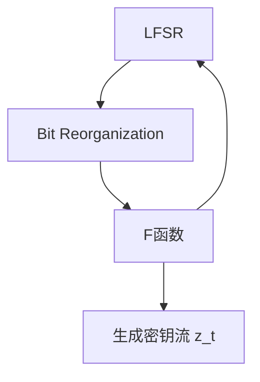

Crypto 3 - 现代密码学基础
===

## 密码学基础

### 针对加密算法的攻击

首先来回顾一下密码学中常见的攻击手段:

1. 从已掌握信息的角度, 分为:

- **已知密文攻击 (Ciphertext-only, COA)**: 最弱的攻击, 攻击者只有密文;
- **已知明文攻击 (Known-plaintext attack, KPA)**: 攻击者拥有部分密文和与之对应的明文对;
- **选择明文攻击 (Chosen-plaintext attack, CPA)**: 攻击者可以任意选择明文, 然后获得对应的密文对;
- **选择密文攻击 (Chosen-ciphertxt attack, CCA)**: 攻击者可以任意选择密文, 然后获得对应的明文对;


2. 从攻击手段来看, 大致有:

- 统计分析攻击: 利用明文 (或语言) **固有的统计特性** (字母/字母对/词频、重复模式、重合指数等) 从密文中推断密钥或明文。属于密码分析经典方法, 常用于对抗简单**替换/置换**类密码或当加密未能完全掩盖明文统计特征时。
  
> 例如考虑 **字典/凯撒** 密码, 对一段英文原文进行加密得到的密文, 由于英语的语言特性,  元音字母会大量出现且字母 **e** 会高频率出现在单词结尾, 通过字母频率、双字母频率、重合指数破译。 在现代密码学中, 对于少部分格式保持的加密或者未压缩明文, 仍然能通过统计分析推断字段值;

- **数学/代数分析攻击**: 主要是针对现代公钥与现代分组密码, 数学攻击通常利用 **"算法内部的确定性结构或参数弱点"**, 把问题化为数论/代数/格/方程求解问题;

> 例如, Hastad 的广播攻击 (针对 RSA)

成熟可用的加密算法或协议必须在**已知攻击模型**下被设计/分析/实测以抵抗**主要**攻击 (穷举/统计/代数/选择明文/选择密文/侧信道等), 并且在工程层面实现恰当、可替换 (crypto agility) 。

### 密码学安全目标

通常用以下几类明确定义的安全目标来衡量:

#### 信息论安全

在理论上对任何计算能力无条件安全, (但代价极高, 通常不可行); 如 OTP;

#### 计算安全性

这类安全是**在已知算法与计算能力下不可行地破解**;

计算安全性通常基于困难问题: 例如 AES 的抗穷举性基于密钥足够长, RSA 因式分解的数学困难;

#### 实现层与部署安全

抗侧信道、随机数质量、正确的密钥管理、避免常见坑等;

> 注意, 即使算法在数学上安全, 错误的实现 (例如经典的弱随机数, 可预测随机数, 秘钥泄露等) 仍然会使系统被攻破;

---

## 分组密码

分组密码又称为秘密钥密码或对称密码。使用分组密码对明文加密时，首先对明文分组，每组长度相同，然后对每组明文分组，每组长度相同，然后对每组明文分别加密的到等长的密文。

---

### DES

DES分组长度为64比特，使用56比特秘钥对64比特的明文进行16轮加密，得到64比特的密文串。其中，**秘钥为64比特，实际使用56比特，另外8位用作奇偶校验。**

> 更具体来说, 实际上 64 bit 是被切割为了 8 组, 每组有 7 位数据位和 1 位校验位, 至于为什么是 7 + 1 的组合, 主要是历史兼容性; DES 被设计的时代通信硬件通常按 8 bit 处理; **校验码不参与加密, 仅用于保证传输无误 (一般默认是奇校验)**;

#### 加密过程

DES 采用对偶算法, 也就是:

$$
f=f^{-1}
$$

1. 预处理: 初始置换 $IP$


$$
M \xlongequal{IP} (L_0,R_0)
$$


- $M$ 为初始明文;

2. 16 轮加密

$$
L_i = R_{i-1}  \\
R_i = L_{i-1} \bigoplus f(R_{i-1},K_i)  \\
i=1, 2, ... , 16  \\
$$

- 其中 $L_i, R_i$ 分别是第 $i$ 轮加密的左半部分和右半部分; $K_i$ 为第 $i$ 轮使用的子密钥, 由主密钥通过置换和循环位移生成;

3. 逆置换 $IP^{-1}$

$$
(R_{16},L_{16}) \xlongequal{IP^{-1}} C
$$

- $C$ 为最终密文;

#### 秘钥计算

##### 去除校验位 + 置换选择 1

64 位秘钥分为 8 组, 然后去掉末尾 (奇偶校验), 剩余的部分 56 位做重排, 然后分为左右两部分 $(C_0,D_0)$; 显然各为 28 位;

##### 循环左移 (Left Shifts)

每一轮秘钥 $(C_i,D_i)$ 生成都由上一轮的秘钥**循环**左移获得:

$$
(C_i,D_i) = (LeftShift(C_{i-1}​), LeftShift(D_{i-1})) 
$$

当 $i$ 为 $1, 2, 9, 16$ 时, 位移两位, 其余为 1 位;

##### 置换选择2

将 $(C_i,D_i)$ 拼接为 56 位, 然后按照 PC-2 表选择其中 48 位, 也就是按 **指定表重新排列**, 这 48 位就是第 $i$ 轮使用的 子密钥 $K_i$:

$$K_i = PC_2(C_i,D_i)$$

- 注意, PC2 (Permutation Choice 2) 是一张**固定表**

---

#### DES 安全性

- **秘钥长度问题**: DES 密钥长度仅有 **64 位**, 理论需要穷举 72,057,594,037,927,936 次, 在现代计算机的 GPU 集群中可以在几分钟内完成穷举, 因此 DES 已经被认为在计算上不安全;
- **弱密钥和半弱密钥**: 当秘钥为某些特殊值时, 会导致子密钥满足某些数学性质:
  - **弱密钥**: 非常少见 (例如 `0x0101010101010101`), 会导致所有子密钥全部相等 (Feistel 结构坍缩):

$$E_K(E_K(M)) = M$$

  - **半弱密钥**: 用一个密钥加密, 再用另一个秘钥解密, 会得到原文; 也就是说, 加密的时候, 前半段加密过程, 正好会被后半段加密过程给 "反向加密" 掉; 

$$E_{K_A}(E_{K_B}(M)) = M$$

  > 经典半弱密钥: `0x01FE01FE01FE01FE` - `0xFE01FE01FE01FE01`


### 3DES

经典 DES 存在秘钥位数不足, 已经可被穷举计算的问题, 3DES 继承了 DES 的思想 (**核心算法结构不变**, 但是执行多次, 并扩宽长度) 并扩展了其规模:

3DES 实际是 **重复执行三次 DES** 的加解密操作。

- 模式一: **双密钥 3DES**

$$C = E_{K_1}(D_{K_2}(E_{K_1}(M)))$$

  第一次加密用 $K_1$, 第二次解密用 $K_2$, 第三次加密用 $K_1$; 总秘钥长度为 $K_1$ 与 $K_2$ 相加, 即 128 位, 去掉奇偶校验位 (2*8*(7-1) = 112) 为 **112 位**;

> 当 $E_{K_1}=E_{K_2}$时, $E_{K_1}(D_{K_1}(E_{K_1}(M))) = M$, 此时退化到普通 DES, 满足历史兼容性;

- 模式二:   三秘钥 3DES

$$C = E_{K_1}(D_{K_2}(E_{K_3}(M)))$$

  同理, 三次秘钥均不同, 则为三秘钥; 更安全, 但显然计算开销也更大;

这两种 3DES 可以抵御现代穷举计算攻击。

---

### AES

AES 整体是基于一定数域上的模运算, 数学原理和安全性等在上一篇密码学博客中有写: [手撕 AES-256](https://r4x.top/2025/05/23/crypto2/)

---

### 安全性总结

分组密码本质上就是相对固定的 **分组-模式运算-置换-查表-重组** 流程; 很显然, 这些操作都是为了增加熵值, 而其中最主要的熵增部分就是**查表** (或者说, **字节代换**), 这个流程结合其他的分组, 置换等, 会使得熵值指数级增长, 从而保证对差分分析和线性分析有高度抗性;

因此, 字节代换用的这张表, 也就是 **S盒** 的设计非常重要; 首先, 它是一个非线性的多对一映射, 引入了 **非线性和混淆**

接下来是 **P盒 (置换)** 和 **E盒 (扩展)**:

- E 盒扩展人为制造重复的比特位输入, 保证不同的 S 盒输入间有重叠, 制造**跨位相关性**; (一对多的映射)
- P 置换将 S 盒的 32 位输出**打乱**, 实现扩散 (Diffusion), 属于一对一映射; 

在这几个步骤的加持下, 即使只改动一位的明文或秘钥, 密文也平均有一半的变化, 这就是雪崩效应;

### 可用性总结

由于分组密码加密和解密使用同一组秘钥, 其数学过程满足 **Feistel 结构**, 也就是**对称可用**; 加密与解密几乎完全对称, 任意非线性函数都可以嵌入, 仍能可逆, 这种结构让分组密码在已知秘钥进行明文/密文求解, 但求解秘钥就在计算上不可行;

## 序列密码

序列密码又称为**流密码**, 序列码是**明文流和秘钥流**按顺序**逐比特**进行**异或运算**, 序列密码中的关键是保持通信双方精确同步。

$$
C_i = P_i \bigoplus K_i
P_i = C_i \bigoplus K_i
$$

其中 $C_i, P_i, K_i$ 分别为密文, 明文和秘钥流的第 i 位; 由于异或操作的特性, 所有的流密码在加密和解密上都是**完全对称**的;

> 一轮序列/流密码**绝对不能重用**, 考虑以下情景:
>
>  $$C_1 = P_1 \bigoplus K$$
>  $$C_2 = P_2 \bigoplus K$$
>
> 那么攻击者一旦拿到两个密文, 直接异或, 就可以得到明文: 
> $$ C_1 \bigoplus C_2 = (P_1 \bigoplus K) \bigoplus (P_2 \bigoplus K) = P_1 \bigoplus P_2 $$

由于流密码的加密解密过程及其简单, 因此其**速度极快**;

### 现代序列密码流程

考虑 Alice 和 Bob 正在进行加密会话, 双方先分发**相同的流秘钥 (主密钥)**, 然后每次传输时将随机数 (明文, 包含在被签名部分中防止篡改) + 明文 **一同发送给对方**。

流秘钥需要定期更新 (Rekey), 且过程中的随机数和流秘钥需要保持唯一性;

> 如果流密码长期复用, 那么可能通过统计分析找出密钥流模式 (即使已经有随机数参与): 因此秘钥更新仍然是必要的; 现代协议会使用 Session Key 定期刷新, 这与 TLS 的机制和思想是相同的;

---

### 线性反馈移位寄存器 - LFSR

线性反馈移位寄存器是流密码中常见的**伪随机序列发生器**, 用于生成**流密钥** (而非随机数); 

> 通过线性反馈函数, 不断移位产生一个**看似随机但实际上可预测**的二进制序列。

#### 核心思想

假设寄存器长度为 $n$, 每次输出寄存器的末位, 下一步的最高位由之前若干位经过 **异或(XOR, $\bigoplus$)** 获得;

#### 数学原理

LFSR 的数学本质是**有限状态机 (Finite State Machine)**, 所有运算发生在有限域 $GF(2)$:

设寄存器状态为:

$$
S_t = [S_1, S_2, ... S_t-n+1]
$$

定义一个反馈多项式:

$$
f(x) = 1 + c_1x + c_2x^2 + ... + c_nx^n
$$

其中 $c_i \in {0,1}$, 更新规则 (反馈函数):

$$
s_{t+1} = (c_1s_{t+n-1} \bigoplus c_2s_{t+n-2} \bigoplus ... \bigoplus c_ns_{t})
$$

#### 形象理解 (白痴级别)

这是我能想到的最简单, 形象, 白痴的理解! 

我们可以把整个 LFSR 算法得出的结果视为一个长度为 (假设) $t$, 假(设 $n = 4$) 的**由 0 和 1 组成的有限数列**,初始状态:

```
0, 0, 1, 1
```

由反馈函数 (或者状态转移方程) 算得 $t$ 个时刻后的序列:

> 假设反馈方程为 $$s_{t+4}=s_t \bigoplus s_{t+1}$$

```
t = 2
0, 0, 1, 1, 0, 1
```

要知道此时的寄存器状态, 等于将一个长度为 $n, (n=4)$ 的滑块从左往右移动了 $t, t=2$ 位, 也即是:

```
t = 2
0, 0, [1, 1, 0, 1]
```

被框柱的部分就是 $t=2$ 时刻的寄存器完整状态;

#### 安全性

LFSR 显然并不 "安全", 其输出**看似随机, 实则在数学上完全线性可预测**; 也就是说, 只要攻击者截获足够的输出位, 例如 $2n$ 个, 那么就可以建立一个线性方程组, 直接解出反馈多项式和初始状态, 直接预测整个 LFSR 序列;

因此 LFSR 本身的设计并非为了安全, 而是为了:

- 高速低成本的产生 "伪随机序列";
- 提供**周期性良好, 均匀分布** 的比特流;
- 在序列密码中作为基础安全 (线性, 结合一些非线性的组件提高安全性)

现代加密通常使用 LFSR + 多个其他**非线性组合函数**如 S 盒代换来提高安全性, 这个思想在分组密码中也被**广泛运用**;

---

### RC4

RC4 是一种基于置换的流密码, 用 256 元素的数组 `S[0, 1, ..., 255]` 来维护状态

#### 数学原理

RC4 的数学原理是**动态置换状态机 (permutation-based FSM)**:

$$
S_{t+1} = \pi_i (S_t)
$$

其中$\pi_i$是一个由密钥和当前状态决定的置换映射。

- 密钥调度算法 KSA:

  用密钥初始化状态表 ($S$):

  ```
  for i = 0..255:
    S[i] = i
  j = 0
  for i = 0..255:
      j = (j + S[i] + K[i mod keylen]) mod 256
      swap(S[i], S[j])
  ```

  这一步能够**打乱或者置换**初始的序列

- 伪随机生成算法 PRGA:
  
  ```
  i = j = 0
  while True:
      i = (i + 1) mod 256
      j = (j + S[i]) mod 256
      swap(S[i], S[j])
      t = (S[i] + S[j]) mod 256
      output S[t]
  ```
  每执行一次循环就产生一个字节的密钥流;

#### 安全性问题

RC4 的状态长度 256, 状态空间理论可达 256! , 并且在软件和硬件上都可以快速运行, 看起来不能被穷举攻破;

但是 RC4 存在一些严重的数学问题:

- 密钥初期输出存在偏差 (前几百字节强相关);
- 输出字节的分布不均匀 (具有一些**统计特征**, 可能被分析);
- **相同密钥重用会泄露明文差分**;
- 被攻击者收集足够多加密数据后, 可通过 **Fluhrer-Mantin-Shamir, FMS** 攻破还原密钥 (根本原因);

所以现代 TLS 明确禁止使用 RC4。

#### 形象理解

在刚才的 LFSR 滑块模型基础上, RC4 就是将简单的滑块平移替换为乱序洗牌的滑块, 每次随机交换两张牌, 再根据结果抽一张输出。

---

### ZUC - 祖冲之算法

ZUC 是一种面向流密码安全通信的现代流密码算法, 由中国提出并作为 3GPP LTE (4G 通信) 的标准加密算法使用。

#### 算法结构



(1) LFSR - 线性骨架
规模为 16 个寄存器单元, 每个寄存器 31 bit, 更新公式, 相对于传统 LFSR 具有更复杂的空间状态和抗线性分析性:

$$
s_{t+16} = \left( 2^{15} s_{t+15} + 2^{17} s_{t+13} + 2^{21} s_{t+10} + 2^{20} s_{t+4} + (1+2^8) s_t \right) \mod (2^{31}-1)
$$

(2) 位重组 - 局部置换 + 拼接

从 LFSR 的若干单元中抽取特定位, 组成 4 个 32-bit:

```
X0 = 高16位(s15) || 低16位(s14)
X1 = 低16位(s11) || 高16位(s9)
X2 = 高16位(s7)  || 低16位(s5)
X3 = 低16位(s2)  || 高16位(s0)
```

这一步起到**局部置换 + 拼接**的作用;

(3) F 函数 - 非线性变换

F 函数承担了**非线性混淆**的角色, 与 AES 的 SubBytes 相似, 实现上有区别:


之后 ZUC 会进行 L1/L2 线性散列变换, 这一步类似于 AES 中的列混合;

```
W  = (X0 ⊕ R1) + R2   (mod 2^32)
W1 = R1 + X1
W2 = R2 ⊕ X2
R1 = S(L1(W1[15:0] || W2[31:16]))
R2 = S(L2(W2[15:0] || W1[31:16]))
```

> 长话短说:AES 是字节级非线性 + 列扩散, ZUC 是字节级非线性 + 字扩散;

(4) 初始化 - 核心安全保证机制

初始化的目的: 不直接输出秘钥流, 尽可能屏蔽 LFSR 中的线性特征; 降低不同秘钥/IV 可能导致输出不均, 从而被统计分析的可能性; 

因此, 初始化主要做三件事:

- 不直接输出秘钥流;
- 经过 32 轮"加优" (Warm-up);
- 每一轮都将 F 函数输出反作用于 LFSR 内部;

```
for i in range(32):
    W = F(X0, X1, X2, X3)
    LFSR_feedback = (W >> 1) ⊕ s_t  (伪代码)
    LFSR 更新
```

> F 函数的输出会向 LFSR 做反馈;

这种**反向注入**或者**反馈调节**会稀释初始状态的偏差, 并使得 LFSR 的结果趋于均匀。

> 这一步的数学原理比较复杂, 从结果来看, 其结果的比特序列趋近于独立同分布 (i.i.d.), 已经没有明显偏差;

可以这么直观地理解: 

> 原始的 LFSR 状态像是一堆按规律排列的沙子,
> F 函数相当于 "搅拌器", 
> 初始化阶段就是 "搅拌 32 次",
> 使沙子均匀分布后再开始 "取样输出"。

#### 总结

ZUC 属于通信中的工程级安全设计, ZUC 算法的特点: **在硬件上高效实现、流特征均匀、密钥恢复攻击困难、周期超长。** 目前 ZUC 仍然非常安全。

---

### 哈希函数

哈希函数已经是老朋友了, 简单来说, 哈希函数构造了一个**多对一映射**: 哈希函数将无限的输入转化为了 (定长) 有限的输出, 根据这一个特征, 哈希函数用于数据完整性、数字签名、消息认证等。

$$
x=h(m)
$$

哈希函数是一个单向函数, 主要需要满足单向性和**抗碰撞性**(不能简单的由输出找到一个可能的输入);

#### 针对哈希函数的攻击

(1) 穷举碰撞, 例如生日攻击, 产生足够多的明文攻击计算哈希值直到找到碰撞点, MD5 是常见的攻击对象;

(2) 利用散列函数的代数结构进行分析攻击: 中间相遇攻击、修正分组攻击和差分分析攻击等。

(3) 还有一些辅助攻击手段, 例如**彩虹表**攻击, 需要指出的是, 彩虹表不是简单的空间换时间, 而是一种折中的优化手段。简单的理解其作用, 就是在已知哈希算法和少量明文的信息 (长度, 字符集如是否仅含小写字母和数字) 的情况下快速从密文恢复出**可能的明文**;

> 重要参考: [知乎: 什么是彩虹表?](https://www.zhihu.com/question/19790488); [腾讯云: 深入浅出理解彩虹表](https://cloud.tencent.com/developer/article/1903492)

#### MD5 与 SHA-1算法

- MD5算法

  消息分组长度为**512**比特, 生成**128**比特的摘要。

- SHA-1 算法

  的输入是长度小于2^64-1比特的任何消息, 输出**160**比特

美国国家安全局与国家标准合作, 提出数字安全标准 DDS 及其算法标准 DSA 。DDS 数字签名标准的核心是数字签名算法 DSA, 该算法中杂凑函数采用SHA-1。

需要指出的是 MD5 和 SHA-1 的抗碰撞性已经不足, 现在应用更广泛的是 SHA-256, MD5 通常只用作文件校验等非常简单无需担心碰撞的场景。

#### SM3 算法

SM3 算法是国家密码管理局半步的安全密码杂凑算法, 把长度为len($ 1 < len < 2^64$)比特的消息经过填充和迭代压缩, 生成长度为**256**比特的消息摘要。

可用于数字签名和验证, HMAC的生成与认证, 以及随机数的生成。

### 4. HMAC

消息验证的关键, 是消息摘要函数, 通常搭配非对称加密作为消息认证机制出现。

---

### 非对称加密 (公钥-私钥加密)

在之前的 RSA 专题博客中已经写过, 这里不再赘述;

> [RSA 详解](https://r4x.top/2025/05/21/crypto1/)

---

## 现代加密三大体系对比

|类别|工作方式|优点|缺点|常见应用|
|----|----|----|----|----|
|**分组密码 (Block Cipher)**|将明文分成固定长度的分组（如 AES 128-bit），每组使用相同或轮秘钥加密。|✅ 高安全性<br>✅ 抗统计攻击<br>✅ 可硬件加速|⚠️ 处理延迟高（块为单位）<br>⚠️对流数据需模式/填充| AES、DES、SM4，磁盘/数据库加密、VPN|
|**流密码 (Stream Cipher)**| 明文按位/字节与伪随机密钥流异或加密。密钥流通常由 LFSR、ChaCha20 等生成 | ✅ 高速、低延迟<br>✅ 可边加密边传输（实时流）<br>✅ 实现简单|⚠️ 密钥流必须唯一，重用会泄露<br>⚠️ 通常需要安全随机数生成器 | RC4（已淘汰）、ChaCha20、LTE/5G 数据流加密|
|**非对称加密 (Public Key / Private Key)**|使用公钥加密，私钥解密（或签名验证）；无需共享私钥|✅ 便于秘钥分发<br>✅ 支持数字签名/认证<br>✅ 可以和对称加密混合使用|⚠️ 运算慢，效率低<br>⚠️ 适合加密小数据或传输对称秘钥| RSA、ECC、Diffie-Hellman、TLS 密钥协商|

## 秘钥分发与传输

痛点: 对称秘钥在通信双方间必须共享 → 传输过程中可能被窃听或篡改;

解决方式:
- 公私钥机制: 用对方公钥加密对称秘钥, 只有对方私钥能解密;

> 例如, 通信中使用分组密码来加密消息, 提高效率, 而传递或更新分组密码的主密钥时, 使用非对称加密如 RSA 来传递;

- 密钥协商协议 (Diffie-Hellman / ECDH): 双方共同计算共享秘钥, 避免了明文传输。这个思想在区块链中被沿用, 也就是后来的安全多方计算;

- 数字签名/证书验证: 防止中间人篡改;


