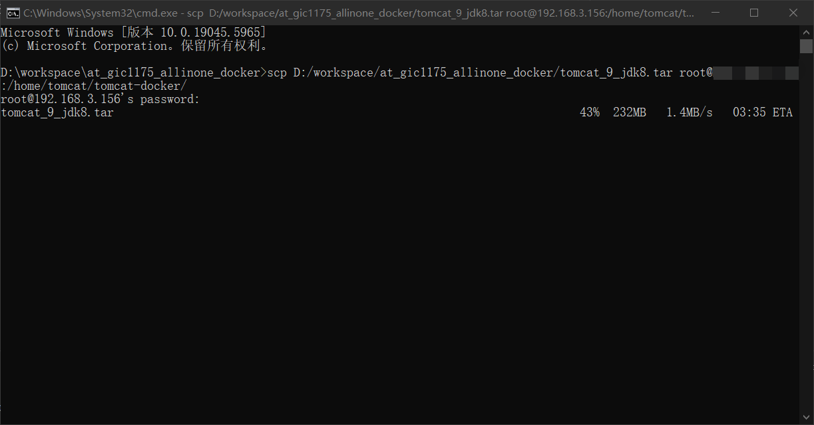
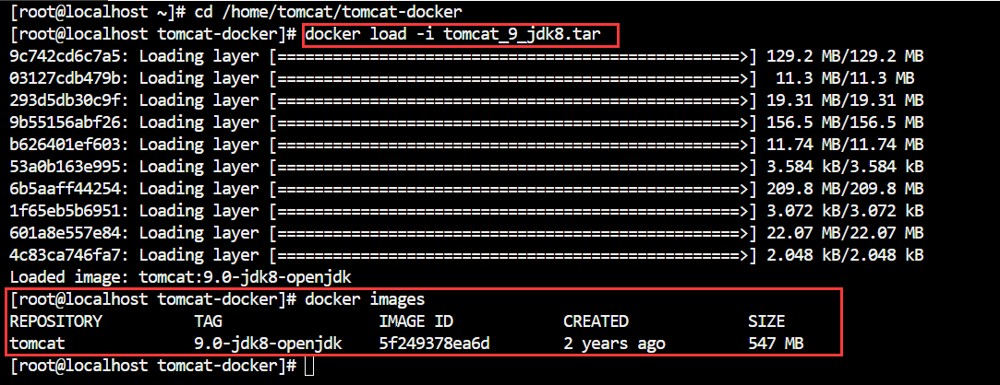
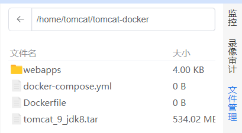
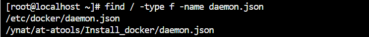
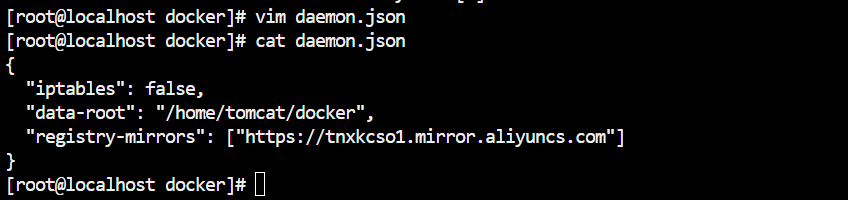
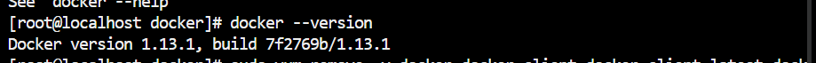
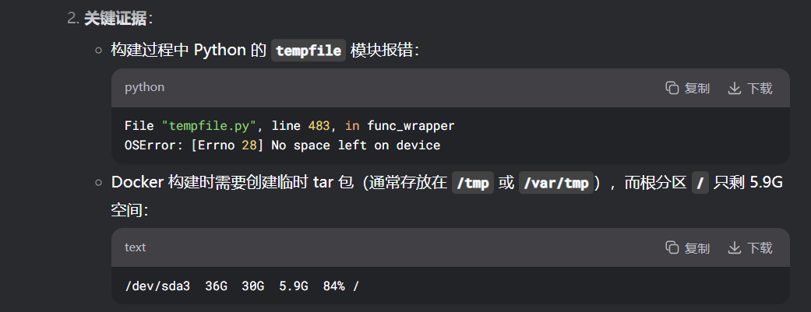
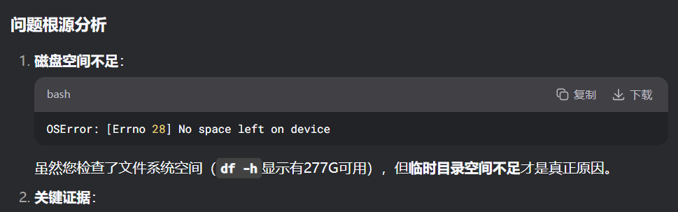

docker 3: 服务迁移
===

记录以下将已有 `apache-tomcat` 服务迁移到 docker 中踩的坑。

### 需求

将一个已有的可正常运行的 `apache-tomcat` 中的服务部署到 docker 环境中。

### 文件准备

目录结构如下:

```
tomcat-docker/
├── docker-compose.yml
├── Dockerfile
├── webapps/       # 挂载目录
│   ├── ROOT/      
│   └── ROOT_BPMUpload/
```

#### Dockerfile

编写一个简单的 `Dockerfile`:

```dockerfile
# 9.0.78
FROM tomcat:9.0-jdk8-openjdk

LABEL maintainer="gic_1175_p4r4x"

# 时区
RUN ln -sf /usr/share/zoneinfo/Asia/Shanghai /etc/localtime && echo "Asia/Shanghai" > /etc/timezone

# 清空默认webapps并挂载
RUN rm -rf /usr/local/tomcat/webapps/*
VOLUME ["/usr/local/tomcat/webapps/ROOT", "/usr/local/tomcat/webapps/ROOT_BPMUpload"]

# 暴露HTTP服务端口和远程调试端口
EXPOSE 8002
EXPOSE 8000

# 使用JPDA远程调试 + 前台运行模式启动Tomcat（适合容器）
CMD ["sh", "-c", "CATALINA_OPTS='-javaagent:/usr/local/tomcat/webapps/ROOT/WEB-INF/classes/static/atools-agent.jar=decryptProjectPathPrefix=/usr/local/tomcat/webapps/ROOT/WEB-INF/lib/at.core.encrypt-23.07.21.jar' catalina.sh jpda run"]
```

-   为什么要设置时区?
    -   因为该 Tomcat 应用需要连接远程数据库, 添加时区设置避免 Oracle 报错。

-   为什么使用 `VOLUME` :
    -   `ROOT` 和 `ROOT_BPMUpload` 是要长期调试更新的内容, 直接挂载方便变动文件。

-   为什么入口是 `catalina.sh` 而不是 `startup.sh` :
    -   因为 `startup.sh` 本身就是对 `catalina.sh` 的调用, 另外使用 JPDA 远程调试更符合容器需求。

-   tomcat 镜像:
    -   直接使用 `tomcat:9.0-jdk8-openjdk`, docker 会自动从官方镜像库里找。

#### 离线安装镜像

如果无法访问到互联网, 那么就需要事先在本地装好镜像。docker 在安装镜像时会优先拉取本地的镜像, 如果没有, 才会尝试拉取官方的同名镜像。

在可以用 `ssh` 连接到目标机的时候, 可以使用 `scp` 的方法来完成文件拷贝:

```bash
scp [文件路径] [账户@地址:目标路径]
```



然后再目标机中直接安装并验证这个镜像:

``` bash
docker load -i tomcat_9_jdk8.tar

# 验证
docker images
```



#### docker-compose

```yml
version: "3.3"

services:
  gic_1175:
    build:
      context: .
      dockerfile: Dockerfile
    hostname: gic_1175
    container_name: gic_1175
    mac_address: 02:02:02:ac:ac:ac
    ports:
      # 端口映射:宿主机:容器
      - "8002:8080"   # 服务
      - "8000:8000"   # 调试
    volumes:
      # 挂载: 目录挂载: 宿主机路径 -> 容器内路径
      - ./webapps/ROOT:/usr/local/tomcat/webapps/ROOT
      - ./webapps/ROOT_BPMUpload:/usr/local/tomcat/webapps/ROOT_BPMUpload
    environment:
      JPDA_ADDRESS: 8000
      JPDA_TRANSPORT: dt_socket
    networks:
      my_network:
        ipv4_address: 172.28.1.100  # 指定固定IP地址

# 定义自定义网络
networks:
  my_network:
    driver: bridge
    ipam:
      driver: default
      config:
        - subnet: "172.28.0.0/16"
```

参数说明:
    - `version:3.3`: 广泛支持的版本;
    - `ports: A:B`: 将容器的端口 A 映射到宿主机上的端口 B;
    - 自定义网络: 保持静态 ip;

把文件拷贝到服务器上, 用宝塔终端连上去能看见(直接用终端 `ls -liah` 也行)



### 迁移 docker

本来到这里已经可以直接进行构建了, 但是非常不幸, 由于**年久失修(?)**, 目标机的 docker 工作目录所在磁盘已经没有空间了, 必须要进行文件迁移。由于目标机在生产环境中, 不能随便重启, 这里有两种方案:

首先要用 `systemctl stop docker` 来关闭服务并备份好文件。

#### 方案 1: 直接改变挂载磁盘(备选)

这个方案需要更改挂载的磁盘( 例如, `sdb` ), 最好是格式化之后的空磁盘。先使用 `mount` 指令暂时将 docker 目录挂载到 `sdb` 。然后查询这个新磁盘 `sdb` 的 uuid, 并编辑 `fstab` 让挂载永久生效

#### 方案 2: 更换 docker 的工作目录

docker 的工作配置默认存放在 `/etc/docker/daemon.json` 中, 修改这个文件就可以完成迁移。

如果没有也可以用 `find` 来找:

```bash
find / -type f -name daemon.json 
```



找到两个, 看看哪个对的:



找到要改的那个:

```bash
vim /etc/docker/daemon.json
```

添加 `data-root` 项并验证:


用 `cp -avfp` 拷贝文件到新目录, 然后尝试重启服务:

```bash
systemctl start docker
```

### 重启 docker 服务

结果失败了, 这里查了一下原因, 是 `data-root` 没有被识别为正确的配置项。

#### 升级 docker 服务

搜了一下原因, 可能是 docker 版本过旧了:



果然是太旧了, 这里卸载并重新安装了 docker:

```bash
# 1. 卸载旧版 Docker
sudo yum remove -y docker docker-client docker-client-latest docker-common docker-latest docker-latest-logrotate docker-logrotate docker-engine

# 2. 安装依赖
sudo yum install -y yum-utils device-mapper-persistent-data lvm2

# 3. 添加官方仓库
sudo yum-config-manager --add-repo https://download.docker.com/linux/centos/docker-ce.repo

# 4. 安装新版 Docker
sudo yum install -y docker-ce docker-ce-cli containerd.io

# 5. 启动并设置开机启动
sudo systemctl start docker
sudo systemctl enable docker

# 6. 验证版本
docker version
```

#### 临时缓存溢出

再次重启, 依然失败, 抛出错误: `OSError: [Error 28]No space left on device`。 然而使用 `df -h` 命令显示, docker 工作目录还有 200G 可用空间。

考虑可能是临时文件的问题, 问了下 deepseek 确认:





可以临时将构建缓存目录切换到空间更大的位置,构建完成后再恢复。这种临时方案既安全又有效。
```bash
# 1.创建临时构建缓存目录(在空间充足的/home/tomcat 分区)
sudo mkdir -p /home/tomcat/docker-tmp 
sudo chmod 777 /home/tomcat/docker-tmp # 确保有写入权限

# 2.设置临时环境变量(仅当前终端会话有效)
export TMPDIR= /home/ tomcat/docker- tmp

# 3.执行构建命令
docker-compose up --build -d

# 4.构建完成后恢复默认设置(可选)
# 因为关闭当前终端也会自动失效
unset TMPDIR 
```

### 构建容器

确认无误后, 重启 docker 服务, 并开始构建容器。

以下常用的命令: 

- 容器和镜像:

验证容器:
```bash
# 所有容器
docker ps -a
# 所有镜像
docker images

# 删除容器
docker rm <container_id> 
docker rm <container_name>
# 删除镜像
docker rmi <images_id>
```

- docker 服务:

```bash
sudo systemctl status docker
sudo systemctl stop docker
sudo systemctl start docker
```
