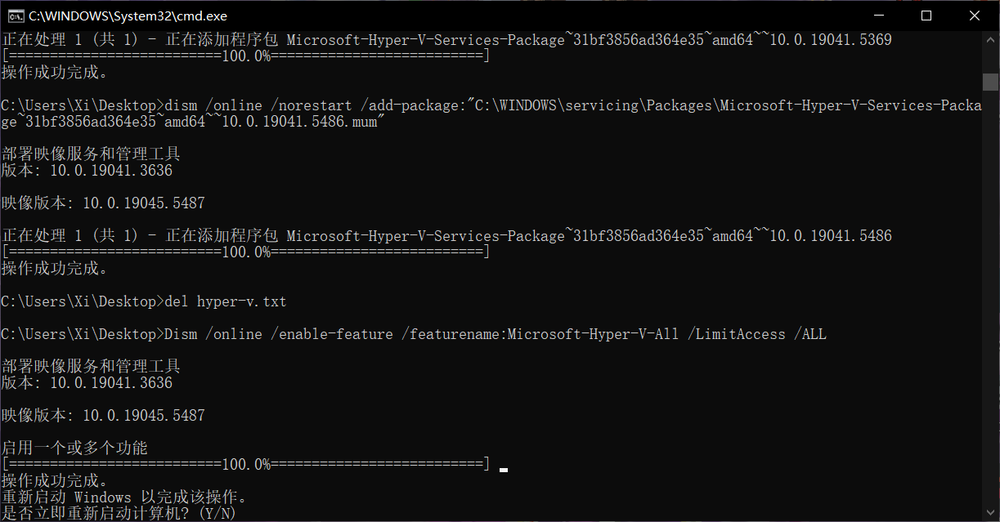
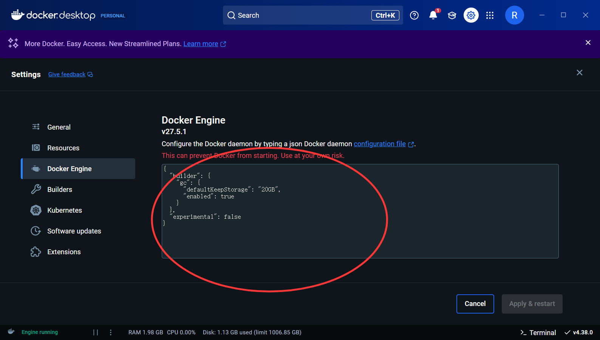
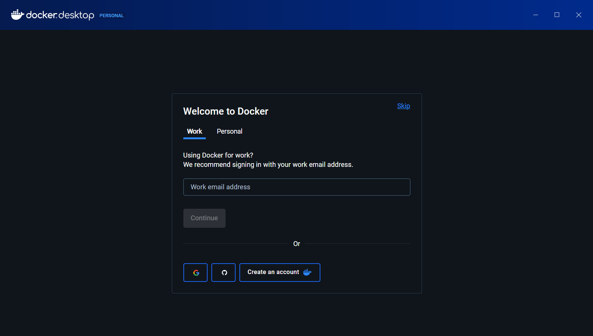

## DOCKER部署踩坑

### 1 环境部署

#### 1.1 虚拟化

在 Windows 系统上使用 Docker, 需要使用虚拟机中的 Linux 系统, 或者使用 `WSL` (Windows Subsystem for Linux)，这是微软官方开发的适用于 Linux 的 Windows 子系统，可让开发人员直接在 Windows 上按原样运行 GNU/Linux 环境，且不会产生传统虚拟机或双启动设置开销。

首先要启用虚拟化, 在 `任务管理器界面-性能-CPU` 可以查看CPU虚拟化是否启用。

#### 1.2 启用Hyper-V服务

打开控制面板，进入windows程序和功能，勾选虚拟化平台跟`适用于windows的linux子系统`。Windows 家庭版默认未安装 Hyper-V, 则需要添加以下 bat 文件并运行, 之后重启电脑即可。

```batch
pushd "%~dp0"
dir /b %SystemRoot%\servicing\Packages\*Hyper-V*.mum >hyper-v.txt
for /f %%i in ('findstr /i . hyper-v.txt 2^>nul') do dism /online /norestart /add-package:"%SystemRoot%\servicing\Packages\%%i"
del hyper-v.txt
Dism /online /enable-feature /featurename:Microsoft-Hyper-V -All /LimitAccess /ALL
pause
```


#### 1.3 安装 WSL

以***管理员身份**打开 Powershell, 安装 WSL 和虚拟机功能:

```powershell
dism.exe /online /enable-feature /featurename:Microsoft-Windows-Subsystem-Linux /all /norestart
dism.exe /online /enable-feature /featurename:VirtualMachinePlatform /all /norestart
```

安装完毕后, 输入 `wsl --help` 查看是否安装成功。wsl 版本有1和2，这里必须设置为2才能支持docker。

```cmd
wsl --set-default-version 2
```


#### 1.4 安装 Docker Desktop

在[官网](https://www.docker.com/)直接下载Docker Desktop并安装, 登录账户。

>  Docker Desktop 默认安装在 C 盘, 自定义安装见 3.1

此时拉取镜像容易超时失败, 设置一个镜像源就可以解决: 在Docker Desktop的设置中找到 `Docker Engine`, 添加以下镜像源:



```json
  "registry-mirrors": [
    "https://hub-mirror.c.163.com",
    "https://docker.mirrors.ustc.edu.cn",
    "https://registry.docker-cn.com",
    "https://reg-mirror.qiniu.com"
  ]
```
添加完毕后保存并重启即可。

#### 1.5 汉化包 (可选)

在Docker安装目录（Windows下默认为C:\Program Files\Docker\Docker\frontend\resources，Macos下默认为/Applications/Docker.app/Contents/MacOS/Docker Desktop.app/Contents/Resources）找到app.asar文件并将其备份，防止出现意外。然后下载 Github 中对应版本的[汉化包](https://github.com/asxez/DockerDesktop-CN), 再将下载的asar文件改名为app.asar后替换原文件即可。

### 2 测试连接

在宿主机中打开SQL server, 添加一个项目测试数据库。

在Docker中测试连接到宿主机, 注意, 默认地址为 `127.0.0.1`, 但容器中的 127.0.0.1 指向的是容器本身，而不是宿主机。正确的做法先找到宿主机的 ip 地址:

```cmd
以太网适配器 蓝牙网络连接:

   媒体状态  . . . . . . . . . . . . : 媒体已断开连接
   连接特定的 DNS 后缀 . . . . . . . :

以太网适配器 vEthernet (WSL):

   连接特定的 DNS 后缀 . . . . . . . :
   本地链接 IPv6 地址. . . . . . . . : fe80::38ac:d9ee:a5bd:6ad0%59
   IPv4 地址 . . . . . . . . . . . . : 172.25.64.1
   子网掩码  . . . . . . . . . . . . : 255.255.240.0
   默认网关. . . . . . . . . . . . . :

```

将 `WSL`下的 IP 地址填入即可连接。

### 3 Docker 磁盘迁移

wsl 和 Docker Desktop 都是默认直接装在了 C 盘, 为了防止后续文件把 C 盘塞满, 最好迁移到其他盘中。
 
在安装包路径下, 使用如下命令安装到 D 盘中:

```cmd
#通过hyper-v, D:\Docker\docker为路径
"Docker_Desktop_Installer.exe" install --quiet --accept-license --backend=hyper-v --installation-dir=D:\Docker\docker --hyper-v-default-data-root=D:\Docker\docker

#通过WSL2:
"Docker_Desktop_Installer.exe" install --backend=wsl-2 --installation-dir=D:\Docker\docker --wsl-default-data-root=D:\Docker\wsl --accept-license
```

安装完毕后能正常打开 welcome 界面则说明安装成功了




