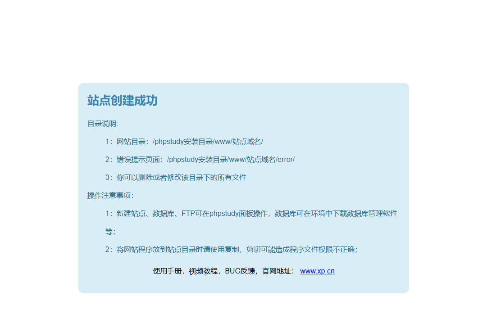
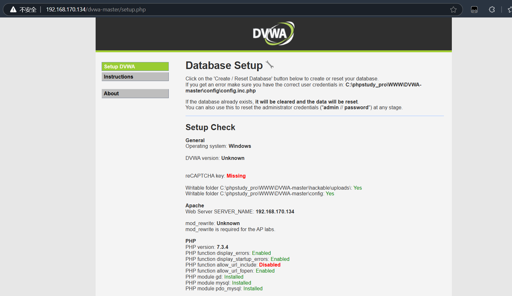

DVWA 1, SQL注入
===

### 1 安装 DVWA 靶场到虚拟机

用 phpStudy 和 Win10 虚拟机部署一个网站, 这里不再赘述。在 cmd 中输入 `ipconfig` 可以查看当前虚拟机的 IP 地址, 用浏览器输入对应 ip 地址, 出现如下结果说明网站部署成功



DVWA 现已开源, 从 github [下载](https://github.com/digininja/DVWA)到网站根目录并解压即可。初次打开会报错, 按照提示将 `config` 文件重命名为 `config.php`并完成配置(主要是数据库配置):

```php
# 数据库名, 用户名和密码与网站数据库保持一致
$_DVWA = array();
$_DVWA[ 'db_server' ]   = getenv('DB_SERVER') ?: '127.0.0.1';
$_DVWA[ 'db_database' ] = getenv('DB_DATABASE') ?: 'dvwa';
$_DVWA[ 'db_user' ]     = getenv('DB_USER') ?: 'root';
$_DVWA[ 'db_password' ] = getenv('DB_PASSWORD') ?: '123456';
$_DVWA[ 'db_port']      = getenv('DB_PORT') ?: '3306';
```

, 然后再访问: `http://(localhost或者你的ip地址)/dvwa-master` , 结果如图:



, 拉到最下方, 点击 `Create/Reset Database` 后会自动跳转到登录界面。输入默认登录名 `admin` , 密码为 `password` 即可登录。DVWA 可以演练 XSS, CSRF, SQL注入, SQL盲注等经典 web 攻击, 在左下方配置 DVWA security 中可以设置网站的不同安全等级。

### 2 SQL 注入: Low

>   SQL注入的原理是攻击者通过在输入栏、表单或者其他数据提交的地方，插入恶意的SQL语句，当这些语句被网站的后端SQL数据库解析执行时，就会产生非预期的行为。

