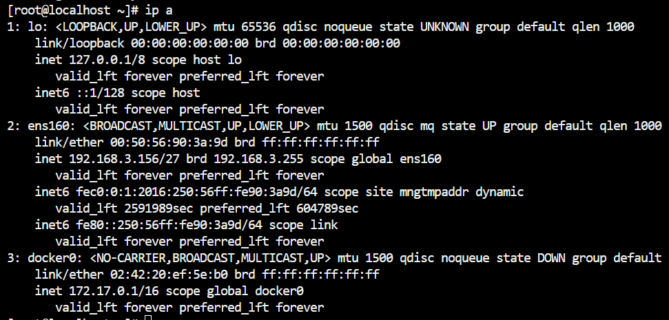
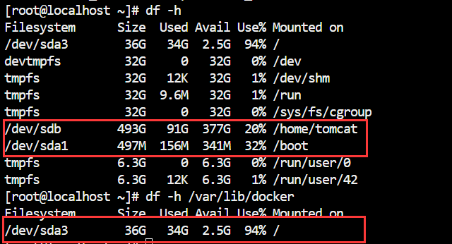
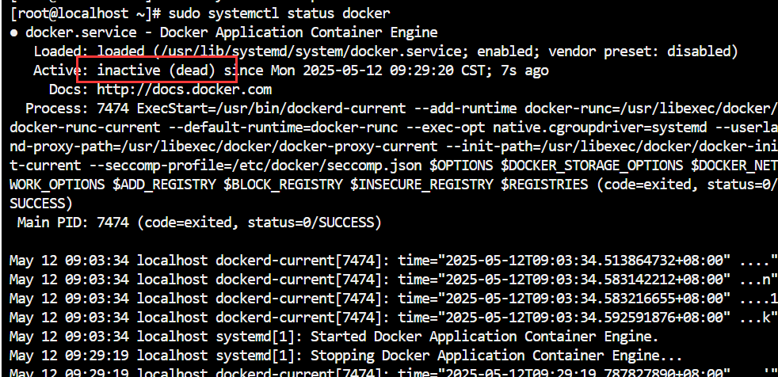

文件系统 - Linux
===

>   起因是要在一台机器上拉取几个 docker 镜像, 但是目标机器的 `var/lib/docker` 目录已经没有空间, 继续操作需要修改 docker 的默认目录, 或者调整安装脚本, 都有点麻烦, 所以想到了第三个办法, 直接把有足够空间的另一个盘挂载到工作目录, 把原有文件迁移一遍(物理),借这个机会进一步了解一下 Linux 的文件系统。

### 步骤

#### 查看环境

先用 ssh 连接上, 确认一下 ip 地址和空间, 用 `df -h <path>` 可以查看给定文件夹上挂载的物理盘, 留空则为列出所有分配:





可以看到 `var/lib/docker` 目录已经没有空间, 而 `/home/tomcat` 仍有大量空间, 考虑把 sdb 挂载到 `/var/lib/docker` 下。

#### 备份数据

首先停用 docker, 并确认:

```bash
sudo systemctl stop docker
sudo systemctl status docker
```



在 sdb 的挂载点（`/home/tomcat`）创建备份目录:

```bash
sudo mkdir -p /home/tomcat/docker_backup
sudo cp -a /var/lib/docker/* /home/tomcat/docker_backup/
```


### 原理