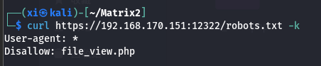
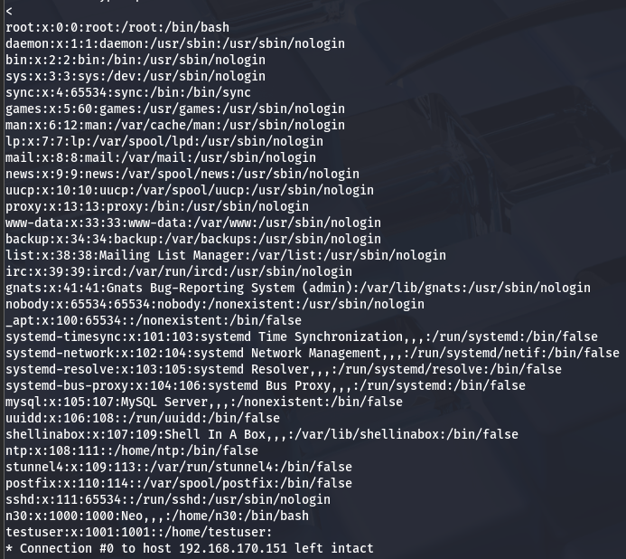
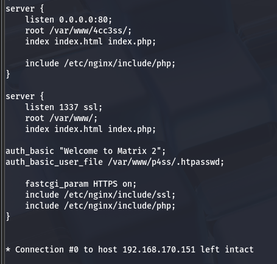
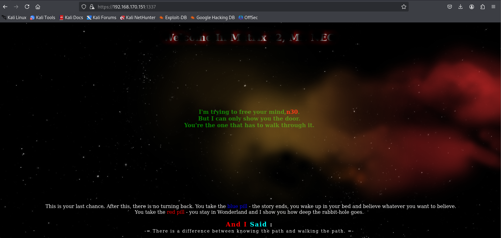
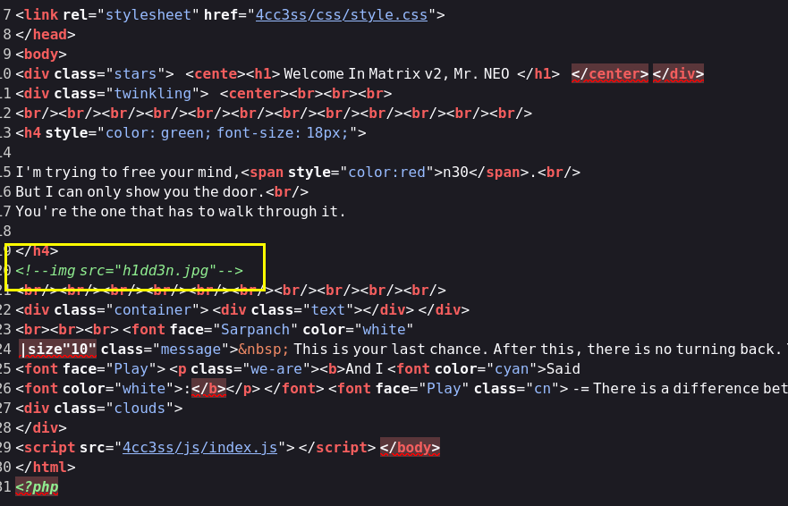
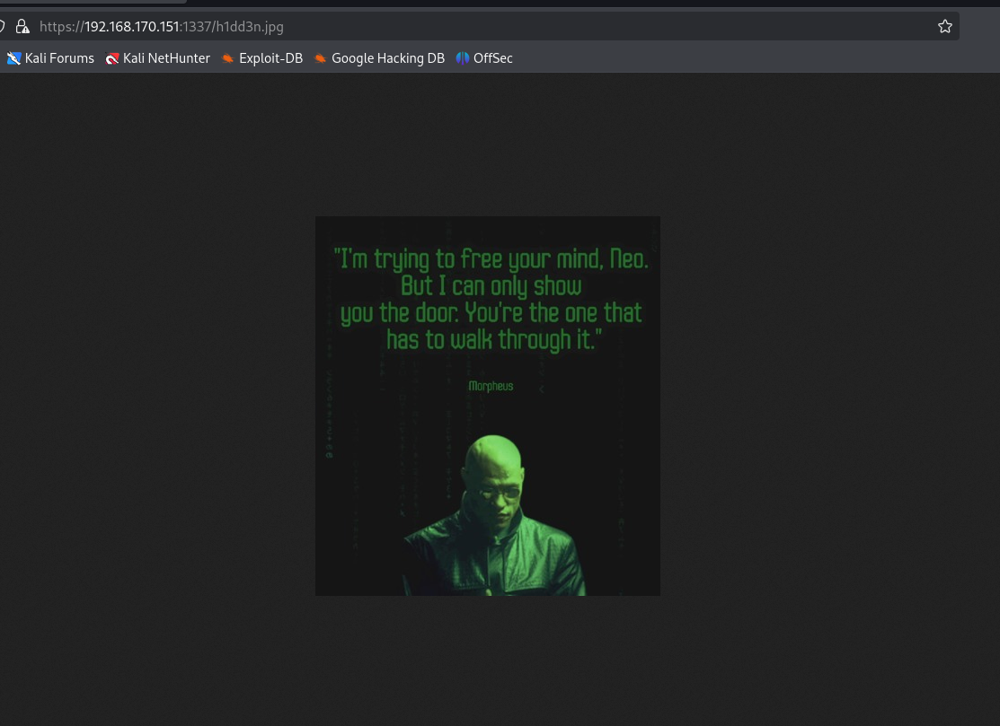

Matrix 2 - CTF
===

> Vulnhub 下载: [Matrix: 2](https://www.vulnhub.com/entry/matrix-2,279/)

### Nmap 扫描

#### 主机发现


#### 端口扫描


### 信息收集

#### 代码审计

先访问这个网站:


查看网页源码:


这里有个 `index.js`, 点进去看看内容:


这段内容比较可疑, 提到了本地的 1337 端口, 刚刚 nmap 正好也扫描到了这个端口。

> 除了 80 端口以外, 其他的端口服务为 `ssl/http`, 也就是 `https`, 需要留意。

---

用 `https` 协议访问 1337 端口, 弹出一个登录界面, 可能是网站管理界面的登录页面? 用刚刚源码中的信息排列组合一下, 提示错误, 先搁置。


---

查看 12320 端口, 是一个 web 上的 ssh 服务的登录界面。结合刚刚 nmap 扫描出的结果, 这里的服务是 **Shell In ABox**：通过浏览器提供 SSH 终端访问的开源工具。


继续排列组合一下已知可能的密码, 提示错误, 也只能先搁置。

---

查看 12321 端口, 显示 `PR_CONNECT_RESET_ERROR`。

---

查看 12322 端口, 展示的 web 页面和 80 端口看上去是一样的, 不过这个几面启用了 ssl 服务。


#### 目录爆破

```bash
sudo gobuster dir -u http://192.168.170.151 --wordlist=/usr/share/dirbuster/wordlists/directory-list-2.3-medium.txt -x html,php,txt,env,js,matrix 
```

先扫一遍 80 端口:


---

再扫相似的 12322 端口:

```bash
sudo gobuster dir -u https://192.168.170.151:12322 --wordlist=/usr/share/dirbuster/wordlists/directory-list-2.3-medium.txt -x html,php,txt,env,matrix -k
```


返回提示: Gobuster 无法判断哪些路径是*真正存在*的，因为它向一个随机路径 (`/079b7be5-e8ef-483c-adc9-40c679624acf`) 请求时, 目标服务器却返回了 `200 OK`, 这意味着服务器对所有路径都返回 `200` (即使路径根本不存在), 并且长度为 2985, 没有返回 `404`, Gobuster 没法区分 "存在" 和 "不存在" 的目录。

使用 `--exclude-length 2985` 来过滤长度为 2985 的响应。

```bash
sudo gobuster dir -u https://192.168.170.151:12322 --wordlist=/usr/share/dirbuster/wordlists/directory-list-2.3-medium.txt -x html,php,txt,env,matrix -k --exclude-length 2985
```


扫出一个 `robot.txt`:




> `wget` 用 `--no-check-certificate` 来忽略证书问题;

### 本地文件包含利用(LFS)

查看刚刚得到的文件:


结合这个名字和提示, 很可能是文件包含漏洞, 尝试一下 payload: `../../../../../../../etc/passwd`:

```bash
curl -v -X POST -d "file=../../../../../../../etc/passwd" https://192.168.170.151:12322/file_view.php -k
```

> `-v`: 显示详细输出; `-X POST`: 使用 POST 传参; `-d "param=value"`: 指定参数和值。



常见的本地文件包含漏洞(LFS)枚举:

|路径|说明|
|----|----|
|`/etc/passwd`|用户信息|
|`/etc/shadow`|密码哈希(需要提权)|
|`/etc/group`|用户组信息|
|`/etc/hostname`|主机名识别|
|`/etc/resolv.conf`|DNS 配置|
|`/proc/version`|内核版本信息|
|`/proc/self/environ`|当前进程环境环境变量|
|`.env`|环境变量, 可能包含 JWT 秘钥等|


---


---

针对 Nginx 服务的枚举:

| 路径 | 说明 |
| ---- | ---- |
|`/etc/nginx/nginx.conf`|主配置文件|
|`/etc/nginx/sites-enabled/default`|默认站点位置|
|`/var/log/nginx/access.log`|注入恶意代码到 User-agent|

枚举发现 `nginx.conf` 中有如下信息, 顺藤摸瓜:


可以下载一个 ngnix 包看看这个文件夹构造, 下一步尝试这个文件: `/etc/nginx/sites-enabled/default`:



查看这个 "userfile":


### 登录密码破解:

显然 `auth_basic_user_file` 就和 shadow 文件类似, 存放的是用户密码, 其中的 `..:..$..$..` 格式非常像 **用户名:哈希方式+盐值+哈希值** 的组合。


>   `$apr1$` 为基于 apache 的哈希算法, 易被攻破, 常见的被攻破哈希还有 MD5 (`$1$`), SHA-1(sha-1); 

使用 john 来碰撞破解:

```bash
sudo john --wordlist=/usr/share/wordlists/rockyou.txt ----format=md5crypt hash.txt
```


### 1337 端口登录

用这个口令(`Tr1n17y` / `admin`)登录 1337 端口:



查看源代码, 发现有一个隐藏的图片:





### 隐写发现

看看有没有隐写: 先用 binwalk。


虽然 binwalk 没有显示存在隐写, 但是就这张图的名字和描述来看, 存在信息隐藏的可能性非常大。

> ~顺带一提, 这里的 neo 应该和前面网页源码中的 n30 是一样的, 指的就是黑客帝国 (Matrix) 主角的名字, 且 passwd 文件中也显示有一个账户名就叫 n30, 看来作者真的非常喜欢这部电影..~

用 stegsolve 扫出隐藏信息: `P4$$w0rd`。

进入刚刚的 shell in box 服务页面 (12320 端口), 输入 `n30` / `P4$$w0rd`:


### Linux 提权


简单查看一下环境, 发现 `sudo -l` 不可用。接下来着手提权:

查看历史记录, 发现有一条非常可疑的指令:


试试这条指令:


直接拿到了 ROOT 权限, 下一步就可以取得 flag。


不得不说靶机作者是黑客帝国的狂热粉丝 ~(汗)~