MyFileSystem_3 - CTF
===

## 基本信息收集

### 主机发现

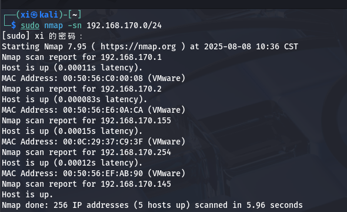

### 端口扫描

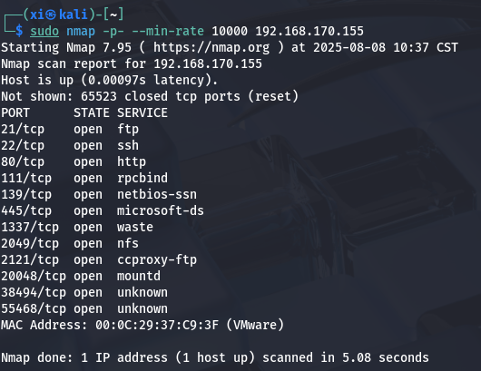

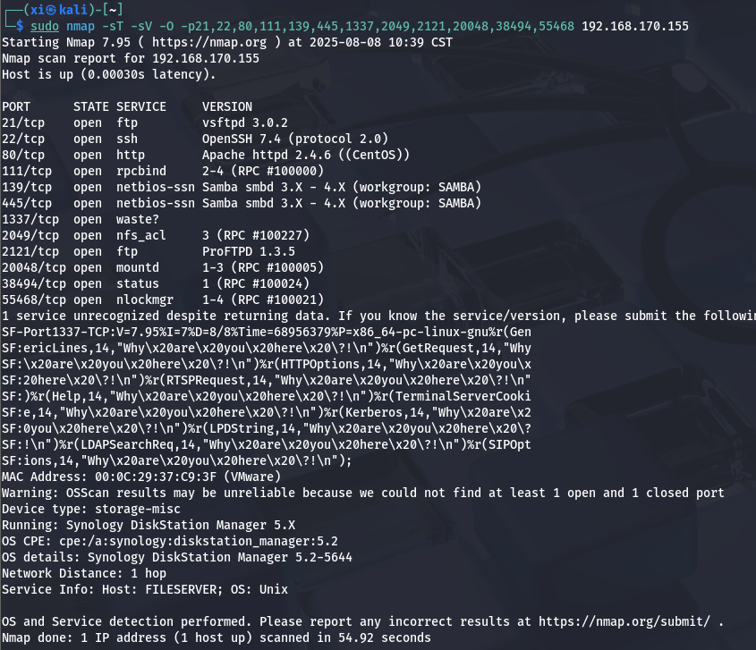

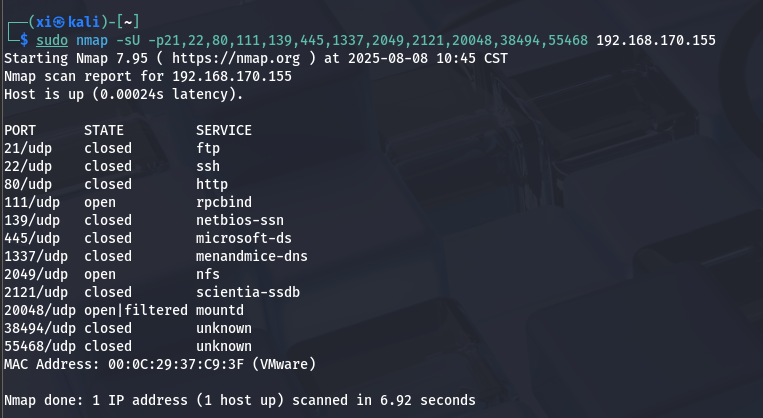

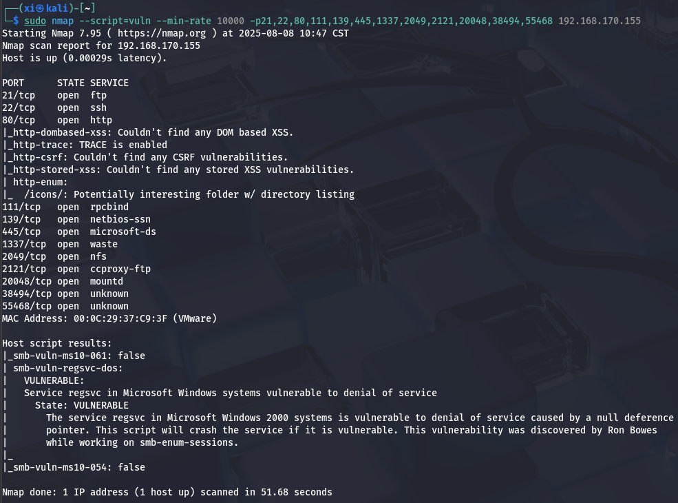

### 网站访问

打开是一个很简陋的说明页面, 源码页面也没有什么信息;

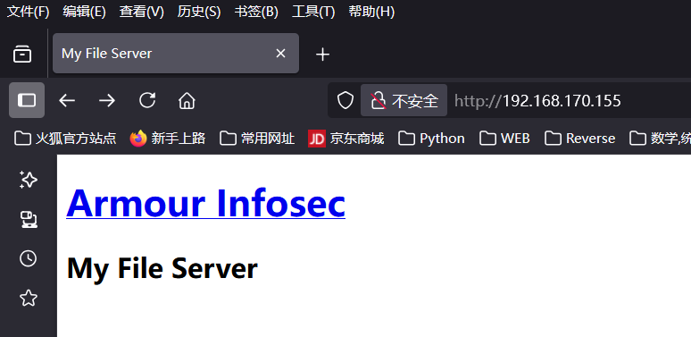

### 目录爆破

爆破一下目录试试:

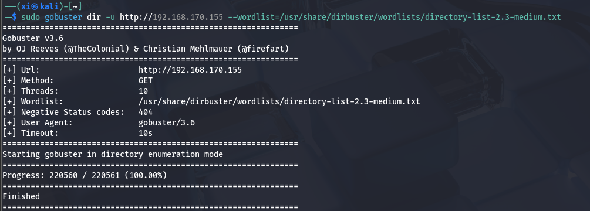

没什么结果, 换 dirsearch 再试试:

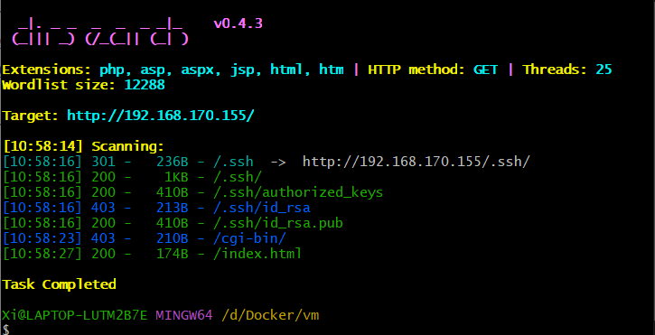

扫出一个放 `.ssh` 秘钥的目录:

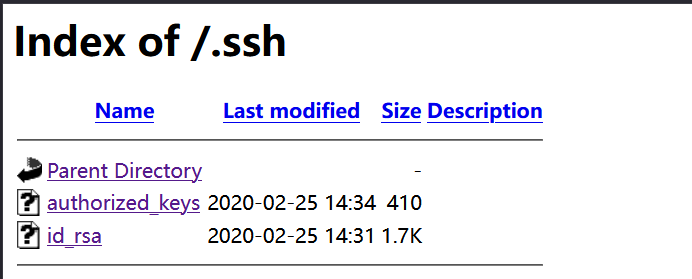

## 秘钥登录原理

ssh 服务有两种登录方式, 第一种是用密码登录, 第二种则是使用秘钥文件登录:

```bash
# 1. 密码登录
ssh user@ip -p 22

# 2. 秘钥登录
ssh -i /path/to/private_key user@ip -p 22
```

一般来说会用 `ssh-keygen` 来生成密钥对, 例如 `id_rsa` (私钥) 和 `id_rsa.pub` (公钥); 然后将 `id_ras.pub` 添加到服务器的 `authorized_keys` 中;

刚刚的界面中, `authorized_keys` 表示支持的公钥列表, 也就是支持列表中公钥的对应私钥来登录;

也就是说, 如果能想办法读出 `id_rsa`, 或者上传本地的公钥去覆盖这个 `authorized_keys`, 基本上就拿下这个服务器了。

## NFS 匿名登录

匿名登录是 NFS 常见的攻击面, 用户名尝试 `Anonymous`, 密码为空, 直接登录了:

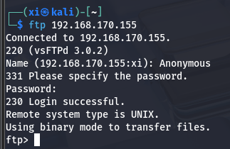

能下到一大堆日志文件, 审计一会, 暂时没发现马上能用到的信息。

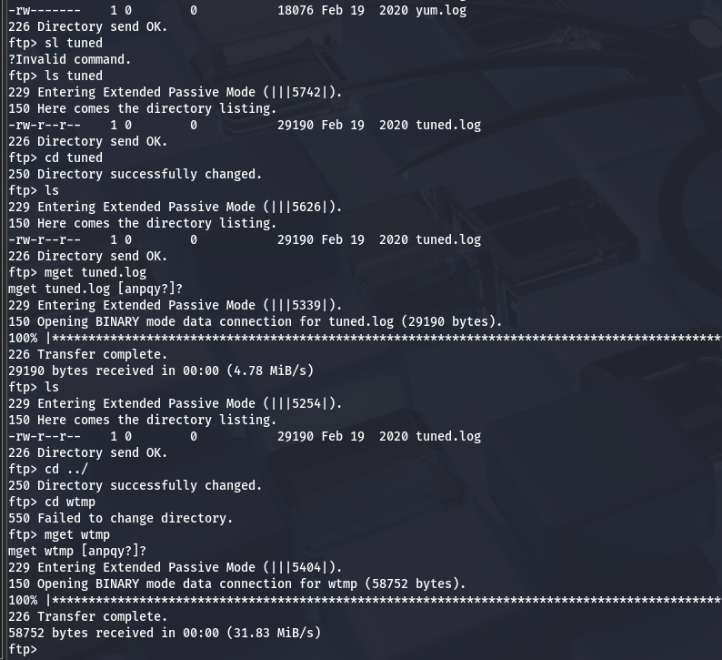

## SMB 匿名登录

### 匿名探测

第一步探测一下能不能匿名登录:

```bash
smb -L 192.168.170.155
```

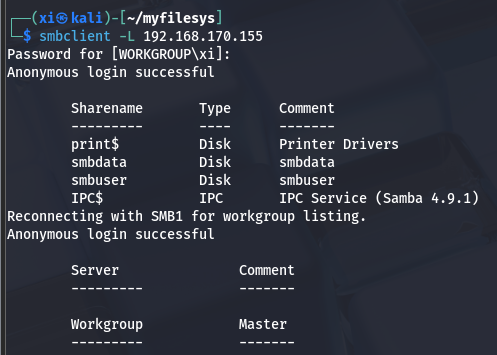

### 敏感文件泄露

找到地址之后登录到 `/smbdata`

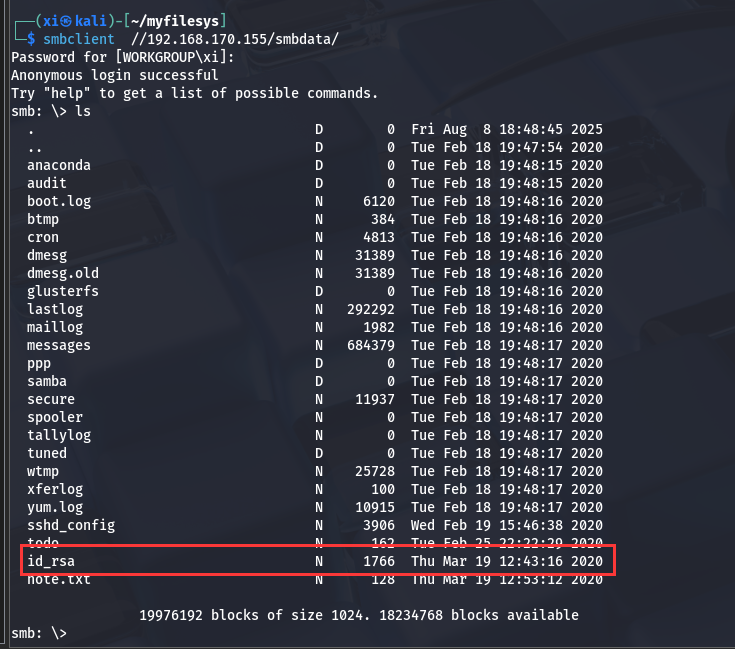

发现 `id_rsa` 在里面, 尝试下载;

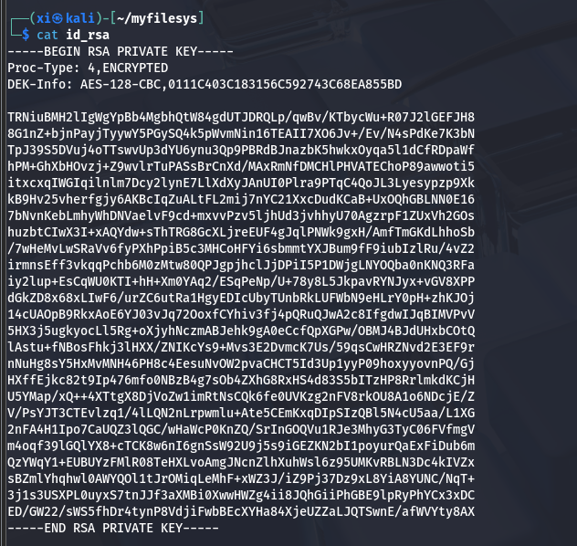

